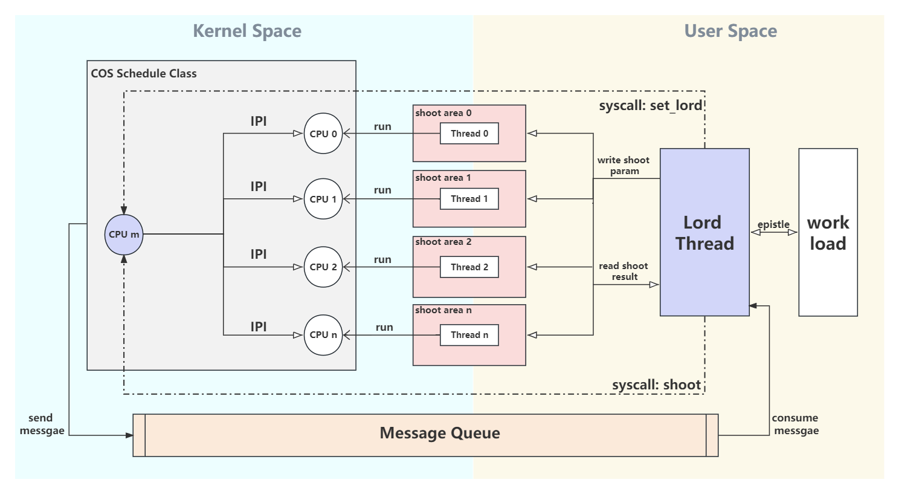
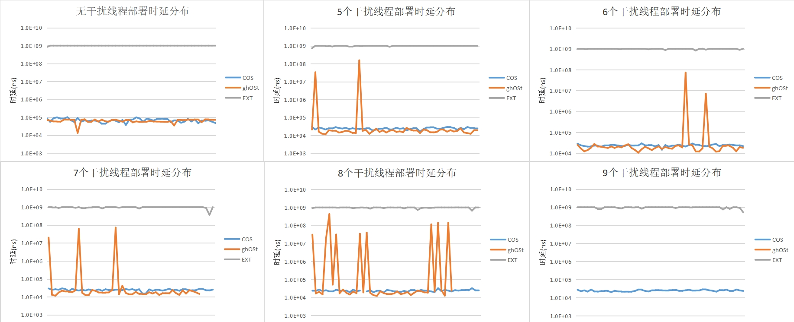
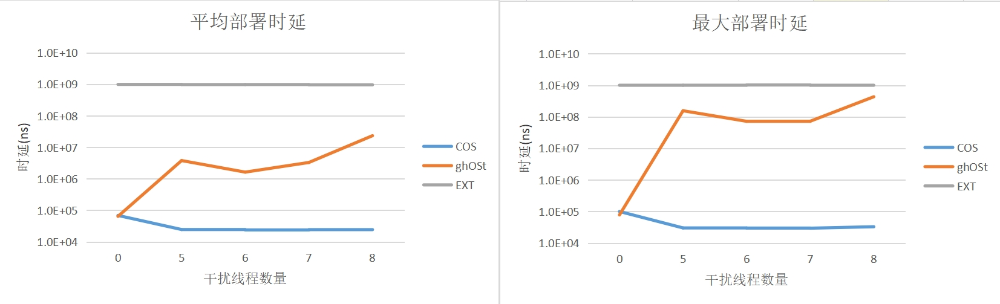
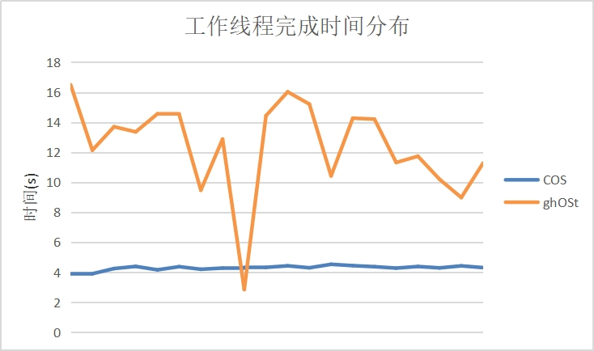
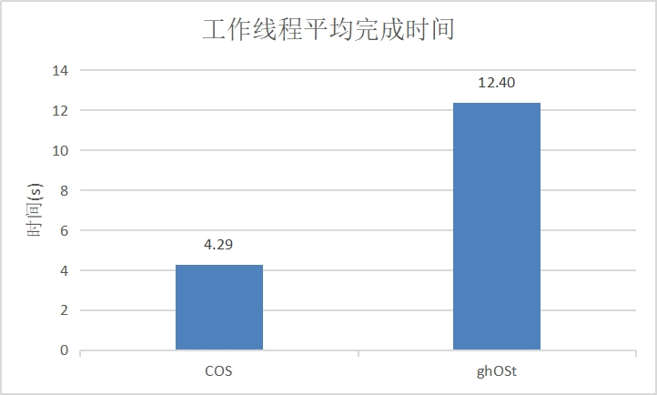
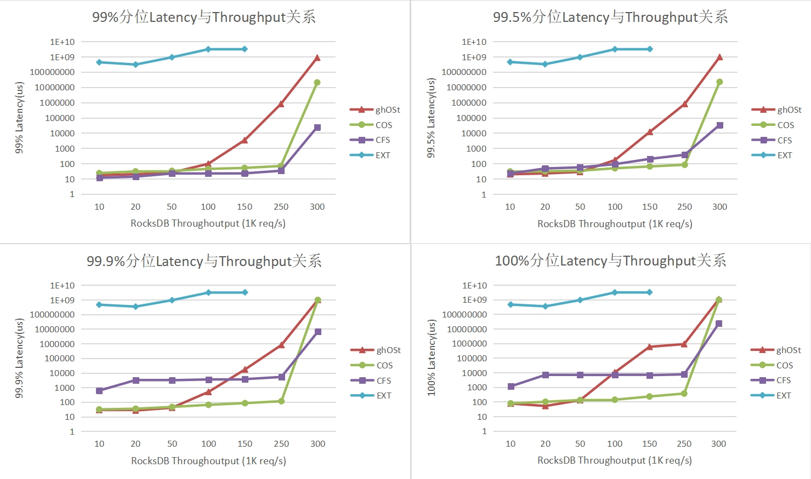

# COS

## 队伍介绍

我们队伍名称为COS，来自哈尔滨工业大学（深圳），基本情况如下：

|赛题|<a href=https://github.com/oscomp/proj134-CFS-based-userspace-scheduler>proj134-CFS-based-userspace-scheduler</a>|
|-|-|
|小组成员|段子豪、黄雯萱、谢岸峰|
|指导老师|夏文、李诗逸、仇洁婷|
|校外指导|吴云、贾浩（字节跳动）|

## 文档

* **[决赛项目文档](doc/决赛项目文档.pdf)**
* **[演示PPT](doc/2023COS决赛答辩.pptx)**
* **[演示视频](https://pan.baidu.com/s/1QJdYM_LAyrB1bswgEuO41g?pwd=hcos)**

* **[环境配置教程](doc/environment.md)**
* **[性能测试教程](doc/run_test.md)**
* **[开发时间节点](record/Dev-Timeline/)**
* **[学习调研记录](record/Dev-Docs/)**
* **[性能测试数据](exp_result/)**
* **[参考文献](references)**

## 项目简介

### 背景介绍

线程调度是操作系统最核心的功能。Linux支持多种调度实现，通过支持多种调度类（scheduling classes）来实现多种调度策略。值得注意的是，Linux的设计初衷是尽可能地兼容多种使用场景，不会针对特定场景进行优化。

为了优化特定应用程序的性能，如果Linux内核中现有的调度策略不能满足当前负载需要，程序员可以选择创建一个全新的内核调度类，以针对特定负载场景进行优化。然而，对Linux内核进行修改会有如下缺点：

+ Linux内核开发的复杂性

+ 不具备通用性，在其他负载场景性能远远差于CFS调度器

+ 部署时间长

+ 大规模重新部署内核调度策略极易出错

以上的缺陷使得许多开发人员更倾向于使用现有的通用调度策略CFS。

用户态调度框架则是一种很合理的解决方案，用户态调度框架就是将`原来线程调度的权限从内核暴露出来给用户态用户态`。调度框架分为内核实现和用户实现：内核通过为用户态提供接口（系统调用，eBPF钩子），将策略决策委托给用户空间；用户则通过内核提供的接口在用户态搭建部署自己的调度策略。开发难度、通用性、部署时间、稳定性等方面均远胜于直接修改Linux内核。

### 成果概述

**EXT是我们初赛成果，COS是我们决赛成果。**

#### EXT

EXT在内核中新增一个调度类，就类似常用的CFS调度类。该调度类定义了一系列最终由用户在用户态实现的eBPF钩子，并且将其挂载到Linux内核调度策略起作用的关键节点，从而达到用户态调度策略动态注入的效果。初赛阶段我们基于Meta的EXT内核开发了一个用户态调度框架。

#### COS ———— 快速、灵活、抗干扰的用户态调度框架

我们决赛决定从零开发一个新的用户态调度框架COS。

COS在内核中新增一个调度类，类似常用的CFS调度类。这个调度类向用户态提供一组系统调用来供用户态定义任意调度策略，同时负责执行用户态传入的调度策略。

COS由以下五大部分组成

+ 内核态：COS调度类

+ 用户态：Lord线程

+ 内核态到用户态信息传递：消息队列

+ 用户态到内核态消息传递：shoot系统

+ cgroup兼容

同时COS解决了EXT上面一系列痛点，通过以下几种手段实现高性能

+ 内核用户态高性能异步通信：共享内存

+ Shoot Area减少内核用户态内存拷贝

+ 基于IPI的级调度时延

+ 调度类优先级动态提升

最终，我们实现了一版高性能的用户态调度框架COS。

## 完成情况

**决赛**我们从零开发COS用户态调度框架，完成情况如下

|             | 目标内容| 完成情况                           |
| ----------- | ------ | ------------------------------ |
| 基本目标 | 给出详细的设计文档| 已完成|
| 基本目标 | 实现 task delegation 机制 | 已完成，初赛EXT时延在**100ms-1s**；决赛COS通过shoot与中断将线程以**10 - 100us**的时延调度到目标CPU上并且运行，提升**10000倍**| 
| 基本目标 | 实现 preemption 机制 | 已完成，初赛EXT抢占机制通过插队实现，时延较高；决赛COS通过IPI中断与消息队列支持对线程快速抢占与抢占消息传递| 
| 基本目标 | 对 fairness 的考虑 | 已完成，初赛EXT优先级低于CFS，只具备公平性，性能差；决赛COS调度类优先级自适应变化，兼顾公平与性能|
| 特征 | 兼容cgroup| 初赛EXT未完成；决赛已完成，通过COS提供的四个系统调用对cgroup进行控制，限制COS线程CPU使用率|
| 基本目标 | 给出性能测试报告| 已完成，初赛较为简陋；决赛COS对task delegation时延和cgroup均进行了相关测试|
| 扩展题 | 挖掘实际应用的场景| 初赛未完成；决赛已完成，选取IO密集型场景RocksDB，测试吞吐量与时延|
| 扩展题 | 针对该场景设计实现调度策略并注入到内核达到优化| 初赛未完成；决赛已完成，决赛对COS、CFS、EXT在RocksDB场景，测试吞吐量与时延关系，COS尾延迟平均为CFS的**1.23%**|
| 额外目标 | 与ghOSt进行对比| 初赛未完成；决赛已完成，COS的task delegation时延为ghOSt的**0.1%**，IO密集型场景rocksdbCOS尾延迟平均为ghOSt的**2.26%**，并且支持cgroup|
|             |完成度 100% | |

## 性能测试

### task delegation

测试对象：COS、EXT、ghOSt

测试负载：分别在有0、5、6、7、8、9个CFS干扰线程6种情况，测试task delegation时延值50次

#### 时延

#### 平均时延与最大时延和干扰线程数关系

### cgroup兼容

测试对象：COS、ghOSt（为了比较处COS支持cgroup而COS不支持）

测试负载：运行代码评测程序，评测程序由一个服务器工作线程和40个远端传入的待评测程序组成。COS将40个远端传入的待评测程序放入cgroup，限制CPU使用率600%。

#### 完成时间

#### 平均完成时间

### IO密集型场景rocksdb

测试对象：COS、ghOSt、EXT、CFS

测试负载：rocksdb，测试吞吐量从10k到250k（qps）的99%、99.5%、99.9%和100%分位时延（尾时延）

## 代码仓库

本项目由多个代码仓库组成，托管在 GitHub 上。各仓库地址如下，供参考：

| 仓库                           | 仓库地址                                                   |
| ------------------------------ | ----------------------------------------------------------------- | 
| 本项目主仓库                   | https://github.com/shootfirst/2023_OS_COMP_COS.git                       |
| COS kernel             | https://github.com/shootfirst/cos_kernel                               |
| COS userspace               | https://github.com/shootfirst/cos_userspace                     |

## 未来展望

+ 申请专利

+ 发表论文（ATC）

