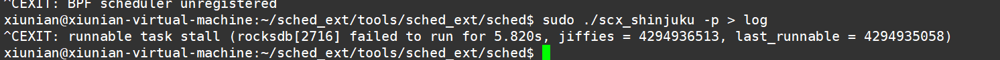
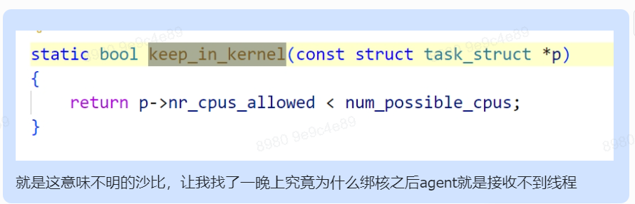
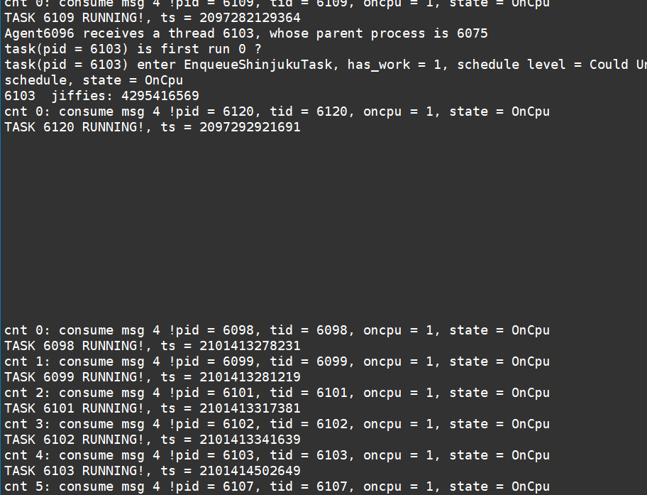
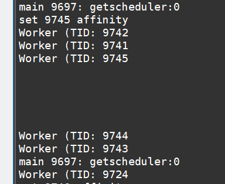
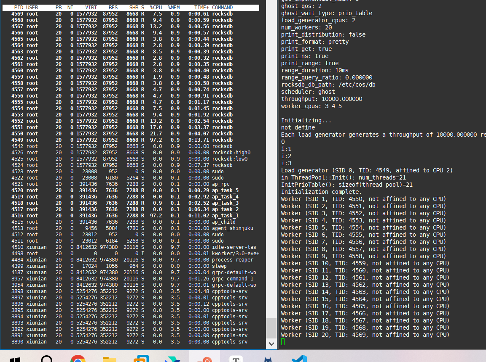
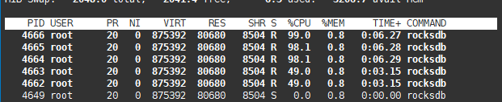

### 方案

讨论出的EXT-Shinjuku的优化方案：

1. 实现无敌系统调用，用户直接调用该接口从而实现快速抢占，而不再像目前这样折中为集中抢占
2. 参照ghOSt的几个事件来对EXT内核已有事件进行细化
3. 吞吐量


### debug流程

Shinjuku调度算法与RocksDB负载要求对线程运行状态的自由灵活控制，因而很有可能在用户意图下造成线程饥饿。为了将此与EXT内核自带的watch dog机制（若线程饥饿5s以上，则杀死BPF Scheduler）兼容，我们需要对代码实现做一定的修改。


我的想法是，

一个task一开始变为runnable状态，通过enqueue更新了watch dog并进入到scheduler中。然后它成功被派发到cpu上运行。之后，它被抢占停止运行。然后又在update shm时，通过dispatch重新进入runqueue，但是没有更新watch dog，因而watch dog中仍然保留着它最一开始的那个时间。。。

所以咱其实应该在enqueue的时候更新watch dog才对。


上面的想法是错误的，因为事实上线程在enqueue的时候就会被加入到watch list了，与线程是否在cpu rq中无关。

大概是这个样子：

线程变为runnable，则进入该cpu对应的watch list。然后线程进入scheduler掌管。线程在running或者是dequeue就会重置watch dog。

而watch dog fn会轮询watch dog list，计算当前时间-线程时间。如果超出范围就会寄。

也就是说我们之所以触发看门狗是因为，我们的worker线程变为runnable，之后一直待在watch list中，runnable at也不会被更新，从而就寄了。

为了解决这个问题，可以有两个方案，一个就是让worker线程从watch list出来，也即想办法触发dequeue事件（比如执行pause、yield之类的）；另一个方案就是在bpf程序处进行对worker线程runnable at参数的实时更新。我决定晚上先简单试试前者，前者不行该后者，后者不行再仔细研究前者，


2716一开始has_work = 0，因而一直没有被dispatch，所以会触发runqueue

那我是不是应该第一次worker被调度时才设置其调度类为EXT。。。emmm




我发现Linux内核现在引入的调度类实现也是很巧妙的：

```c
DEFINE_SCHED_CLASS(ext) = {
	.enqueue_task		= enqueue_task_scx,
	.dequeue_task		= dequeue_task_scx,
	.yield_task		= yield_task_scx,
	.yield_to_task		= yield_to_task_scx,

	.check_preempt_curr	= check_preempt_curr_scx,

	.pick_next_task		= pick_next_task_scx,

	.put_prev_task		= put_prev_task_scx,
	.set_next_task          = set_next_task_scx,
	...
};
```

你可以在ext.c文件中通过这个DEFINE_SCHED_CLASS宏来定义一个调度类ext，然后在ext.c文件中实现这些hook事件就行。这个设计思想不得不说帅的一片

所以说，其实所谓的用户态调度框架就是做了个外包再外包的工作。内核本来就将调度类的实现通过DEFINE_SCHED_CLASS宏外包给开发者，我们现在做的就是再外包给更上层的开发者。

EXT和ghOSt给出了两种实现方案，EXT使用的是ebpf注入从而在内核中调用由用户态实现的函数，达到这个外包再外包的内核也即回调事件；ghOSt则感觉跟这个回调事件关系较少了，它使用了更加解耦的方式。


也就是说路径是这样的：

一个task变为runnable→触发DEFINE_SCHED_CLASS中的enqueue_task事件→enqueue_task事件调用do_enqueue_task→do_enqueue_task中触发bpf程序的enqueue事件


 /* 还记得刚刚段哥是这么说的：

 切换调度类的时候会调用原调度类的switch from和现调度类的switch to。COS调度类的switch to为空实现，因而，理论上切换到COS调度类之后，该task就应该不会跑起来了。实际上，task会运行一段时间然后再停止运行，然后才是再也跑不起来，因为task还是运行状态嘞。

 这样的道理也能解决了咱这边的困惑。我一直在想为啥一开始明明在priotable中标记了线程为idle状态，但是线程在被设置为ext调度类之后还是在运行，就是因为这个问题。线程会先继续运行一段时间，然后再enqueue到ext scheduler中，才能获取idle状态，才能管理。

所以，我觉得可以修改CosThread的实现，设置调度类为EXT之后，就pause一下。但我这样改了之后还是会idle emmm真的搞不懂

 

目前的情况是：

一方面，shinjuku agent如果为cfs调度，频率很正常；

如果为ext调度+原bpf程序，就显得一卡一卡；

如果为EXT调度+现bpf程序，就感觉稍微好点了，但是会触发watch dog。

另一方面是，如果rocksdb这边启用了绑核，那么shinjuku agent那边甚至连worker的enqueue都接收不到了

 但是shinjuku agent如果启用绑核就没问题

 总之，晚上：

1. 可以先研究下为啥set完affinity之后触发不了enqueue事件，写个小程序测试和研究一哈。

   

2. 研究下为啥我那样改会触发watch dog。。。

   我感觉是因为我的集中型调度太慢了，包括这并不是真正的集中型，这个cpu也是会被别的线程占用的。

3. 研究下为啥worker线程还是会自己先跑了。。。

 */


等下写个简单的小程序再测试下，就不用rocksdb那么复杂了

小程序里面大概这么写：set下affinity，然后跑下shinjuku agent试试。


```c
[ 2492.980608] 4973: enqueue
[ 2492.980612] open watch dog. p:4973, last_run:4295515113, jiff:4295515113
[ 2492.980614] 4973: do enqueue
[ 2493.004090] 4973: dispatch a thread p:4973
...
[ 2493.010758] 4973: dispatch a thread p:4973


[ 2519.552080] 5001: enqueue
[ 2519.552086] open watch dog. p:5001, last_run:4295521756, jiff:4295521756
[ 2519.552088] 5001: do enqueue
[ 2519.552340] 5002: enqueue
[ 2519.552343] open watch dog. p:5002, last_run:4295521756, jiff:4295521756
[ 2519.552345] 5002: do enqueue
[ 2519.552615] 5003: enqueue
[ 2519.552617] open watch dog. p:5003, last_run:4295521756, jiff:4295521756
[ 2519.552619] 5003: do enqueue
[ 2519.556202] 5000: enqueue
[ 2519.556205] open watch dog. p:5000, last_run:4295521757, jiff:4295521757
[ 2519.556207] 5000: do enqueue
此处这几个线程调用do enqueue之后，没有打印call enqueue，也没有打印local或者global，
说明是进入到了local_norefill分支
也即之前这个task被调用了 move_task_to_local_dsq 函数设置了sticky cpu。
也即之前对这个task调用了 consume_dispatch_q 或者 dispatch_to_local_dsq
或者task初始化就有sticky cpu？
也即这几次enqueue都是在move_task_to_local_dsq中enqueue的？

调用树：
pick_next_task_scx/put_prev_task_scx - balance_scx - balance_one - consume_dispatch_q
userland_dispatch - scx_bpf_consume - consume_dispatch_q
userland_dispatch - scx_bpf_consume - flush_dispatch_buf - finish_dispatch - dispatch_to_local_dsq
所以说，只有两种情况。要么是内核的 pick_next_task_scx/put_prev_task_scx 被触发，
要么是在 userland_dispatch 手动调用了scx_bpf_consume。
然而如果是后者的话，task必须被放进 SCX_DSQ_GLOBAL 中。而SCX_DSQ_GLOBAL只会在bpf程序中被塞，
而task没有call enqueue，显然还没有进入bpf端
因而，就只能是第一种情况了，也即是通过 pick_next_task_scx/put_prev_task_scx 进入的。
估摸着上面的agent进程也是这种情况，故而调用了很多次dispatch。
那么，我们就来看看是通过哪个进入的吧。

[ 2520.556419] 5000: wake up, cpu = 1, task_cpu(p) = 1
[ 2520.556434] 5000: enqueue
[ 2520.556435] open watch dog. p:5000, last_run:4295522007, jiff:4295522007
距离上一次open watch dog正好过去了1s！
[ 2520.556439] 5000: do enqueue
[ 2520.556451] 5000: call enqueue
然后agent那边确实receive到了，但是此时5000还是被标记为了idle状态

[ 2520.556500] 4973: dispatch a thread p:4973
...
[ 2520.556558] 4973: dispatch a thread p:4973

[ 2520.564851] ------------[ cut here ]------------
[ 2520.564851] ------------[ cut here ]------------
[ 2520.564855] field width 129746528 too large
[ 2520.564856] field width 160441760 too large
[ 2520.564855] 5003: select cpu 0, p->cpumask = 
[ 2520.564859] 5003: into unlikely. cpu = 0
[ 2520.564861] 5003: out unlikely. cpu = 2
[ 2520.564861] 5003: wake up, cpu = 2, task_cpu(p) = 4
[ 2520.564864] 5003: after set, task cpu = 2
[ 2520.564885] WARNING: CPU: 2 PID: 0 at lib/vsprintf.c:2705 set_field_width+0x66/0xa0
[ 2520.564891] Modules linked in: bnep btusb binfmt_misc vmwgfx btrtl btbcm btintel btmtk nls_iso8859_1 bluetooth snd_ens1371 snd_ac97_codec ac97_bus
[ 2520.564874] WARNING: CPU: 5 PID: 0 at lib/vsprintf.c:2705 set_field_width+0x66/0xa0
[ 2520.564915]  snd_pcm gameport
[ 2520.564917] Modules linked in:
[ 2520.564977] CPU: 5 PID: 0 Comm: swapper/5 Tainted: G             L     6.4.0-rc3+ #5
[ 2520.564977] CPU: 2 PID: 0 Comm: swapper/2 Tainted: G             L     6.4.0-rc3+ #5
[ 2520.564980] Hardware name: VMware, Inc. VMware Virtual Platform/440BX Desktop Reference Platform, BIOS 6.00 11/12/2020
[ 2520.564980] Hardware name: VMware, Inc. VMware Virtual Platform/440BX Desktop Reference Platform, BIOS 6.00 11/12/2020
[ 2520.565146] ---[ end trace 0000000000000000 ]---
[ 2520.565146] ---[ end trace 0000000000000000 ]---
[ 2520.564850] 5002: select cpu 0, p->cpumask = 
[ 2520.564850] 5001: select cpu 0, p->cpumask = 
[ 2520.565150] 5002: into unlikely. cpu = 0
[ 2520.565150] 5001: into unlikely. cpu = 0
[ 2520.565152] 5001: out unlikely. cpu = 2
[ 2520.565152] 5002: out unlikely. cpu = 2
[ 2520.565153] 5002: wake up, cpu = 2, task_cpu(p) = 5
[ 2520.565153] 5001: wake up, cpu = 2, task_cpu(p) = 2
[ 2520.565155] 5002: after set, task cpu = 2
[ 2520.565156] 5001: enqueue
[ 2520.565157] open watch dog. p:5001, last_run:4295522009, jiff:4295522009
[ 2520.565159] 5001: do enqueue
[ 2520.565164] 5001: call enqueue
[ 2520.565170] 5003: enqueue
[ 2520.565171] open watch dog. p:5003, last_run:4295522009, jiff:4295522009
[ 2520.565172] 5003: do enqueue
[ 2520.565240] 5003: call enqueue
[ 2520.565242] 5002: enqueue
[ 2520.565243] open watch dog. p:5002, last_run:4295522009, jiff:4295522009
[ 2520.565244] 5002: do enqueue
[ 2520.565246] 5002: call enqueue

一直到这里，就对应着agent那边enqueue全部task

[ 2520.565684] 4973: dispatch a thread p:4973
...
[ 2520.565724] 4973: dispatch a thread p:4973


在这里卡住了，接下来就似了
不对，我觉得卡住很正常啊，因为右边rocksdb的load generator一直没有开始？？？


[ 2526.351744] 4973: enqueue
[ 2526.351749] open watch dog. p:4973, last_run:4295523456, jiff:4295523456
[ 2526.351751] 4973: do enqueue
[ 2526.351757] 5000: enqueue
[ 2526.351758] open watch dog. p:5000, last_run:4295522009, jiff:4295523456
[ 2526.351759] 5000: do enqueue
[ 2526.351759] 4974: dispatch a thread p:5000
[ 2526.351760] 5000: call enqueue
[ 2526.351761] 5001: enqueue
[ 2526.351762] open watch dog. p:5001, last_run:4295522009, jiff:4295523456
[ 2526.351763] 5001: do enqueue
[ 2526.351763] 4974: dispatch a thread p:5001
[ 2526.351764] 5001: call enqueue
[ 2526.351765] 5002: enqueue
[ 2526.351765] open watch dog. p:5002, last_run:4295522009, jiff:4295523456
[ 2526.351766] 5002: do enqueue
[ 2526.351767] 4974: dispatch a thread p:5002
[ 2526.351767] 5002: call enqueue
[ 2526.351768] 5003: enqueue
[ 2526.351769] open watch dog. p:5003, last_run:4295522009, jiff:4295523456
[ 2526.351769] 5003: do enqueue
[ 2526.351770] 4974: dispatch a thread p:5003
[ 2526.351771] 5003: call enqueue
[ 2526.351808] 4973: do enqueue
[ 2526.351813] 4973: local
[ 2526.351977] 4973: do enqueue
[ 2526.351982] 4973: local
[ 2526.351983] 5002: enqueue
[ 2526.351998] open watch dog. p:5002, last_run:4295522009, jiff:4295523456
[ 2526.351999] 5002: do enqueue
[ 2526.352016] 5003: enqueue
[ 2526.352020] open watch dog. p:5003, last_run:4295522009, jiff:4295523456
[ 2526.352024] 5003: do enqueue
[ 2526.352042] 4973: do enqueue
[ 2526.352045] 4973: local
[ 2526.352071] 5001: do enqueue
[ 2526.352075] 5001: local
[ 2526.352100] 5003: do enqueue
[ 2526.352103] 5003: local
[ 2526.352125] 4973: do enqueue
[ 2526.352128] 4973: local
[ 2526.352697] 5002: select cpu 0, p->cpumask = 
[ 2526.352700] 5002: into unlikely. cpu = 0
[ 2526.352702] 5002: out unlikely. cpu = 2
[ 2526.352703] 5002: wake up, cpu = 2, task_cpu(p) = 6
[ 2526.352704] 5002: after set, task cpu = 2
[ 2526.352708] 5002: enqueue
[ 2526.352708] open watch dog. p:5002, last_run:4295523456, jiff:4295523456
[ 2526.352710] 5002: do enqueue
[ 2526.352710] 5001: dispatch a thread p:5002
[ 2526.352712] 5002: call enqueue
[ 2526.352715] 4973: do enqueue
[ 2526.352719] 4973: local
[ 2526.352777] 5002: enqueue
[ 2526.352779] open watch dog. p:5002, last_run:4295523456, jiff:4295523456
[ 2526.352780] 5002: do enqueue
    
[ 2526.352958] 4973: do enqueue
[ 2526.352961] 4973: local
[ 2526.352970] 5001: do enqueue
[ 2526.352972] 5001: local
... 一堆包括agent和worker在内的线程进行doenqueue local的循环
[ 2526.424457] 4973: local
    
[ 2526.455923] sched_ext: BPF scheduler "userland" errored, disabling
[ 2526.455933] sched_ext: runnable task stall (rocksdb[5000] failed to run for 5.788s, jiffies = 4295523456, last_runnable = 4295522009)
[ 2526.455935]    scx_watchdog_workfn+0x174/0x220
[ 2526.455944]    process_one_work+0x21c/0x440
[ 2526.455948]    worker_thread+0x50/0x3f0
[ 2526.455950]    kthread+0xf4/0x130
[ 2526.455952]    ret_from_fork+0x29/0x50
[ 2530.182439] traps: rocksdb[4980] trap divide error ip:55c4760ced31 sp:7ffde7484640 error:0 in rocksdb[55c4760cc000+19000]
[ 2613.258816] hrtimer: interrupt took 12011611 ns

```


对于last ran，我们用一个标记表示userland是否需要更新这个last ran。是的话就在running中塞消息并且重置runtime。


目前是这样的，还是被watch dog杀死，但本次杀死的现象跟以前不一样。

以前是开润5s被弄死，现在是，开始润一小会。然后突然卡住，卡5s，然后再被杀死。

难道是bpf那边卡住了？不懂




现在的话有两个问题现象。

开润，rocksdb的main进程会诡异地卡住：



main才初始化完部分worker后，就会卡住，连带着bpf那边一起卡住。然后过了5s，bpf agent死亡，main就继续了。

而如果我们把bpf agent杀死，卡住的main也能继续运行。

现象上来看，可以看出应该是bpf agent的问题。但是main进程的调度类并不是EXT啊，这究竟是为什么。。。。

我试试打印断点看看具体是卡在哪了吧。


调试

```shell
$ gdb program
(gdb) run arg1 arg2
```


目前的问题就是，


9069是agent进程。我发现在卡住的那段时间里，会一直出现在put_prev_task_scx中。


这下问题总算找出来了，是共享内存的问题。

目前的现象是这样，不用共享内存的话就很完美（虽然性能垃圾）用的话就会卡在某一时刻


```
      if (worker_works[tid]->requests.size() != 0)  continue;
      // if (worker_works[tid]->num_requests.load(std::memory_order_relaxed) != 0) continue;
      worker_works[tid]->requests.clear();


    // if (num_requests == 0) {
    if (work->requests.size() == 0) {
      Pause();
      continue;
    }
```


Worker：原子读num_requests→读work->requests.size()→原子存num_requests

Loadge：原子读num_requests→写work->requests.size()→原子存num_requests

这样做会导致一些请求被漏掉，吞吐量寄。但是为啥会卡住？


Worker：原子读num_requests→读work->requests.size()→原子存num_requests

Loadge：读work->requests.size()→写work->requests.size()→原子存num_requests

这样做可能会导致load generator在写size的时候（这会花费很长时间）worker一直搁那while死循环，不掺杂一点睡意，从而导致bpf寄。


1. 修改dequeue的bug
2. 修改preempted方式：USDT探针/uprobe，定时器函数
3. 移植我们修改的rocksdb到ghOSt，统一变量


我现在要做的是研究为啥那个b mark IDLE会失效

我曹，我明白 了

是因为runnable调完之后，那个task会被直接dispatch

enqueue调完之后就不会dispatch了


总结下目前的进度，还是版本回退到那个错误了。不过现在的我感觉经验丰富了不少，至少已经知道是共享内存的问题了。所以我明天要做的就是写个简单的test还原下测试场景，从而排查bug。


我觉得可能的原因：

1. 其余worker一直绑核处于运行状态，导致其他worker无法获取cpu

   则会有如下几个问题：

   1. 为什么那些一直运行的worker在7s途中不会被抢占？

      打印下unschedule相关的debug信息看看。

      或者是不是因为共享内存更新迭代过快从而导致状态转移紊乱，无法被抢占？

      118392  154054 144605

      差不多0.1ms会loop一次

      

      打印下agent和rocksdb的时间戳看看

   2. 如果是这样的话，为啥agent那边也没有任何输出？


我觉得我懂了。

是这样的，我们在pick next task的前面直接return了，导致当runqueue为空时，就不会处理delayed unschedule，也不会进行抢占，从而导致一个worker巨特喵的一直在work。

但是我有一个问题就是，这时候别的worker在干毛？我觉得大概率是被标记为idle一直在等待，但是不知道为什么generator一直没再标为runnable，真不懂

我的解决方法就是一开始别return了，直接跳到后面unschedule那边去抢占。但是这样就违背了ghost那边的shinjuku理念：仅在需要抢占时抢占。哎，搞不懂：(


还很经常性有一个情况，就是30个线程全部死了，bpf也死了。。。

我发现他dispatch之后，就一直在这样横跳：

```
18754 case c, from OnCpu to OnCpu
18754, from OnCpu to OnCpu
```

问题来了：

1. 它是不是被其他线程抢占了？导致收不到preempted信息？但是它为啥不会自己触发enqueue呢？还是说dispatch失败了？

2. 为啥一直在case c和b轮转，但是不会被unschedule？

   是因为这时候cs上的pid没有它

   为啥没有它呢？？？

   我看到很诡异的一点就是它没收到TASK_RUNNING。是因为cpu全部被占满了？？？？

   

```c
4. After ``ops.dispatch()`` returns, if there are tasks in the local DSQ,
   the CPU runs the first one. If empty, the following steps are taken:

   * Try to consume the global DSQ. If successful, run the task.

   * If ``ops.dispatch()`` has dispatched any tasks, retry #3.

   * If the previous task is an SCX task and still runnable, keep executing
     it (see ``SCX_OPS_ENQ_LAST``).666666

   * Go idle.
```

也就是说，事实上是因为local dsq为空了，所以才会一直不间歇执行那个东西。

那么接下来问题就是那些task为啥不会enqueue了。

所以我应该研究的是为啥不enqueue，以及到running之前的路径。

正统的调度流程：

```c
[ 3370.427310] 12310: call enqueue
[ 3370.427474] 12310: finish dispatch.
[ 3370.427476] 12310: dispatch to local 7.
[ 3370.427477] 12310: dispatch enqueue in finish_dispatch
[ 3370.439203] 12310: task get into running.
```

好像有几次看到了，都是在enqueue的时候是has work=0，然后收着，然后就开始死了

但理论上这样是正常的，因为应该会要在update shm里面call enqueue才对。但是究竟为什么没有。。。。

是因为load generator被干碎了吗？毕竟我尝试加了打印语句，它直接就死了

但也不应该啊，因为priotable也有锁的作用的，不信之后cfs验证下，所以那个12310都可以跑了为什么别的不行。。。又为什么加了打印语句直接全部干碎了。。。

难道是触发了内核什么防御负载吗


目前的log，12310是那个一直运行的线程，12314是那个死了的线程


[ebpf:基于 uprobe 的自定义例程](https://zhuanlan.zhihu.com/p/467647354)

以及看来我们EXT用的是libbpf-bootstrap

[Kprobe & Uprobe - Linux Tracing](http://yoc.docs.t-head.cn/linuxbook/Chapter4/tracing.html#uprobe)

[Uprobe-tracer: Uprobe-based Event Tracing](https://www.kernel.org/doc/html/latest/trace/uprobetracer.html)


```c
 *    The central CPU is the only one making scheduling decisions. All other
 *    CPUs kick the central CPU when they run out of tasks to run.
```

```c
 *    Periodic switching is enforced by a periodic timer checking all CPUs and
 *    preempting them as necessary. Unfortunately, BPF timer currently doesn't
 *    have a way to pin to a specific CPU, so the periodic timer isn't pinned to
 *    the central CPU.
周期性切换由定时器实施，定时器检查所有CPU并根据需要进行抢占。不幸的是，BPF定时器目前没有固定在特定CPU上的方法，因此周期性定时器没有固定在中央CPU上。
```

```
K线程无条件地排队到匹配的本地 dsq 的头部，并使用 SCX_DSQ_PREEMPT 进行调度。这确保 K线程始终优先于用户线程，这对于确保前进进展是必要的，例如周期性定时器可能在 ksoftirqd 上运行，如果 ksoftirqd 被用户线程饿死，可能没有其他东西可以撤离该用户线程。
 *    SCX_KICK_PREEMPT is used to trigger scheduling and CPUs to move to the
 *    next tasks.
```

```
这个调度器的设计目标是最大化利用各种 SCX 机制（指特定的处理器硬件扩展和指令）。
一个更实际的实现可能会【将调度循环放在中央 CPU 的 dispatch() 路径之外】，
以减少对核心调度路径的干扰，
并添加某种形式的优先级机制，以更好地控制任务的调度顺序和优先级。
```

```
Not yet. While tasks are run with an infinite slice (SCX_SLICE_INF), they're
preempted every 20ms in a timer callback. The scheduler also puts the core
schedling logic inside of the central / scheduling CPU's ops.dispatch() path,
and does not yet have any kind of priority mechanism.
```

所以是这样的，central是具体在dispatch中，如果为central cpu则遍历所有cpu派发任务，不是则kick centralcpu让它派发任务；然后使用一个定时函数，固定时间抢占一次。

具体到我们shinjuku的抢占实现中，我们可以设置定时函数的触发时间间隔为time slice/2。每次遍历所有（就设置为16个吧）cpu，看其任务是否需要抢占。


在kick cpu中，注意到这段注释：

```c
	/*
	 * Actual kicking is bounced to kick_cpus_irq_workfn() to avoid nesting
	 * rq locks. We can probably be smarter and avoid bouncing if called
	 * from ops which don't hold a rq lock.
	 * TODO: maybe a optimistic option here?
	 */
```


目前是这样，可能发生一种情况：

读线程先抢到锁，但是由于队列空，所以等待；

写线程等待锁，无法塞入队列，因此队列一直空，造成死锁。





