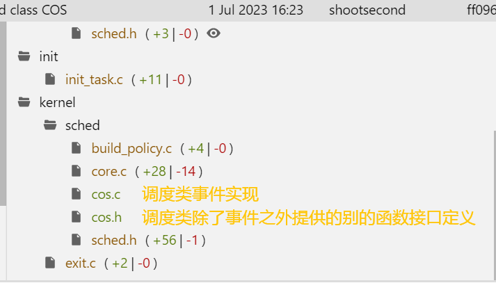

### 第1/2次commit

最主要是增加了调度类必备的一些文件/定义，在core.c中主要增加的是对set scheduler的跟踪。

值得注意的是，**set scheduler完成之后会把task dequeue或者put prev task，调用的是其prev调度类的对应事件！**并且在设置完调度类后，会调用新调度类的enqueue、set_next方法，**还原**原来的queued或者running状态。

```c
	// hwx: notice here!!! a task being set scheduler should dequeue or put_prev
	queued = task_on_rq_queued(p);
	running = task_current(rq, p);
	
	if (queued) {
		dequeue_task(rq, p, queue_flags);
	}
	if (running) {
		put_prev_task(rq, p);
	}
		
	// hwx: begin to change sched class here!
	prev_class = p->sched_class;

	if (!(attr->sched_flags & SCHED_FLAG_KEEP_PARAMS)) {
		__setscheduler_params(p, attr);
		__setscheduler_prio(p, newprio);
	}
	__setscheduler_uclamp(p, attr);

	if (queued) {
		/*
		 * We enqueue to tail when the priority of a task is
		 * increased (user space view).
		 */
		if (oldprio < p->prio)
			queue_flags |= ENQUEUE_HEAD;
		enqueue_task(rq, p, queue_flags);
	}
	if (running) {
		set_next_task(rq, p);
	}
```

不过也可以窥见改变优先级的原理，那b是直接入队头的。而且我看了下，具体是不是入队头好像还是各调度类决定的，比如CFS就没有理这b。


以及稍微了解了下文件树：

include/linux/sched/cos.h:    定义cos的entity

```c
/*
 * Dispatch queue (dsq) is a simple FIFO which is used to buffer between the
 * scheduler core and the COS scheduler. See the documentation for more details.
 */
```

include/linux/sched.h:    task_struct

include/uapi/linux/sched.h:    调度类号



sched.h中是**rq**定义，目前就只有一个对应cpu所对应的agent

```c
// #ifdef CONFIG_SCHED_CLASS_COS
struct cos_rq {
	struct task_struct *agent;
};
// #endif /* CONFIG_SCHED_CLASS_COS */
```


然后把agent作为队列头标识。只做了将一个task用这个agent队头指明并调度的工作：

```c
void enqueue_task_cos(struct rq *rq, struct task_struct *p, int flags) {
	rq->cos.agent = p;
}

void dequeue_task_cos(struct rq *rq, struct task_struct *p, int flags) {
	rq->cos.agent = NULL;
}

struct task_struct *pick_next_task_cos(struct rq *rq) {
	return rq->cos.agent;
}
```

不过我在想不应该重载set_next_task吗？

不过pick_next_task和set_next_task有啥区别？（乐

我大概明白了这两个的区别，大概就是set_next_task是当一个任务修改policy or group的时候会被调用，大概是用来更新task相关的状态的（如cfs好像是用来更新vruntime之类的）。所以我们这里使用call sys_agent -> set cos.agent -> schedule() -> pick_next_task的路径是没问题的，用这b set_next_task好像增加复杂性了。


### 第3次commit

本次主要增加了set_lord系统调用，这个系统调用的主要功能是将当前线程设置为COS调度类、并且将其设置为lord线程，具体代码实现在core.c中（在最新的提交移动到了cos.c中）

```c
	p->cos.cpu_id = cpu; // 绑核
```

不过我在想为啥这里不强行直接改task_struct p的cpumask字段呢？


对比下第三次提交和最新版实现，值得注意的是多了这几点处理：

最新版的系统调用增加了功能，也即将task setscheduler+set lord，并且是move到指定的cpu上的。

所以我们：

1. 把task move到对应rq中。

   ```c
   	/*
   	 * First move current task struct to target cpu rq.
   	 *
   	 * We do this in the kernel (compared to calling sched_setaffinity
   	 * from the agent) to step around any cpuset cgroup constraints. 
   	 * Because cos is not under the management of cgroup, we have the 
   	 * exclusive cgroup.
   	 */
   	retval = cos_move2target_rq(cpu_id);
   ```

2. 设置调度类

   ```c
   	/*
   	 * Then we set the sched class to cos using sched_setscheduler(same as 
   	 * sys_sched_setscheduler).
   	 */
   	struct sched_param param = {
   		.sched_priority = 0,
   	};
   	retval = sched_setscheduler(p, SCHED_COS, &param);
   ```

3. 设置lord

   ```c
   	/*
   	 * Now we open the cos scheduler, change cos_on to 1
   	 * to show that cos scheduler is under the control of lord.
   	 */
   	// 设置lord为当前线程
   	rq = cpu_rq(cpu_id);
   	open_cos(rq, p, cpu_id);
   ```

除了这个系统调用的实现之外，我们也在cos调度类中设置了lord的调度机制：

```c
struct task_struct *pick_next_task_cos(struct rq *rq) {
	// printk("hello\n");
	if (rq->cos.lord == NULL) {
		return NULL;
	}
	if (task_is_running(rq->cos.lord)) {
		return rq->cos.lord;
	}
	return NULL;	
}
```


### 第4次commit

本次主要是增加了对一般线程的支持？我看到加了哈希表定义，初步猜测是采用哈希表对cos线程进行管理的？

```c
struct cos_rq {
	struct task_struct *lord;
	struct task_struct *next_to_sched; // return in pick_next_task
	struct rhashtable task_struct_hash;
};
```

不过我暂时没看懂这个用意，不知道为啥要哈希，而且目前cos thread应该还是不能跑，毕竟next_to_sched没有涉及。但是lord是行了。

总之，目前的rq结构是这样的：

```c
struct cos_rq {
	struct task_struct *lord;
	struct task_struct *next_to_sched; // return in pick_next_task
	struct rhashtable task_struct_hash;
};
```

task_struct_hash就相当于<pid, task_struct>的样子

在本次提交还没有设置next_to_sched，估计这是服务于shoot的，将在之后更新。


### 第5次commit

本次提交大概就是增加了msg queue系统调用，并且在线程dequeue和enqueue的时候会发消息。

```c
long sys_create_mq();
```

创建内核与用户态之间的共享内存，返回fd

```c
struct cos_rq {
	struct task_struct *lord;
	struct task_struct *next_to_sched; // return in pick_next_task
	struct rhashtable task_struct_hash;
	struct cos_message_queue *mq;
};
```

共享内存部分大体参照了ghost对于status word的实现。当enqueue或者dequeue（以及其他时候其他事件）被触发时，都会调用product msg函数塞入消息。

这里我觉得可能还有两点要注意：

1. 并发问题

   内核调度类的这些钩子事件会被并发（指的是单核并发。因为我们是per-CPU设计，所以多核并发很安全）访问吗？如果会的话，消息队列还是应该加锁，不会就不用了。

   不过以后消息种类上来了，就得在内核各种各样的地方加消息了，所以锁肯定还是得加的。看段哥那边写了个TODO，估摸着也有此想法。

2. 消息类型问题

   目前仅实现了dequeue和enqueue，之后肯定也会像ghost那样在各个地方加消息的。


### 第6次commit

本次commit实现了核心系统调用shoot。

```c
long shoot_task(pid_t pid);
```

核心逻辑：

```c
int cos_shoot_task(struct task_struct *p, struct rq *rq) 
{
	// 将p设为next_to_sched
	rq->cos.next_to_sched = p;

	// hwx: shoot是由agent调用的，因而执行这段cos_agent_schedule的进程必然是lord进程
	// 调用schedule()！！！从而能在pick next task起作用
	cos_agent_schedule(rq);

	return 0;
}
```

它应该是这样的，lord shoot一个task到自己的cpu上，然后隔一段时间这个task运行结束或者是时间片耗尽了，lord就能夺回cpu所有权了。

在这次还把cpu从task的字段成员中移了出来。不懂。

**我的疑问有以下两点：**

1. 如果我们在shoot之后的schedule选了cfs，然后next_to_sched又被修改，这该怎么办？还是说待实现？

   我觉得加个dispatch queue buffer好点

2. 也许我们应该在发送消息的时候，也对lord加一个kick操作。

3. 为啥这里不优先选择agent？还是说这是历史遗留了

   ```c
   struct task_struct *pick_next_task_cos(struct rq *rq) {
   	if (rq->cos.next_to_sched != NULL) {
   		return rq->cos.next_to_sched;
   	}
   	if (rq->cos.lord != NULL && task_is_running(rq->cos.lord)) {
   		return rq->cos.lord;
   	}
   	return NULL;
   }
   ```

   


### 第7次commit

增加lord调度类。

增加一个per cpu字段lord_on_rq，用于标记是否需要调度lord。当我们set lord的时候标记为1，调度负载线程时需要开关

还有我感觉pick_next_task这里的lord是时候该啥了，为啥还留着？

```c
struct task_struct *pick_next_task_cos(struct rq *rq) {
	if (rq->cos.next_to_sched != NULL) {
		return rq->cos.next_to_sched;
	}
	if (rq->cos.lord != NULL && task_is_running(rq->cos.lord)) {
		return rq->cos.lord;
	}
	return NULL;
}
```


### 第8次commit

修改了沉睡4s和啥都没干就接收到信息的bug。


### 第9次commit

成功将lord迁移到指定CPU，不只是当前CPU了

不过core.c的这个函数我还是有疑问：

```c
/* for set_lord */
int cos_set_cpus_allowed(struct task_struct *p, const struct cpumask *mask)
{
	struct affinity_context ac;
	ac = (struct affinity_context) {
		.new_mask  = mask,
		.flags     = true, // hwx:??? what is true?
	};
	return __set_cpus_allowed_ptr(p, &ac);
}
```

确定这里用true？？

不过好像是模仿ghost的，ghost也用的true【并且此处本来确实也应该填SCA_CHECK之类的】：

```c
int ghost_set_cpus_allowed(struct task_struct *p, const struct cpumask *mask)
{
	return __set_cpus_allowed_ptr(p, mask, true);
}
```

那应该是无关紧要的吧。


### 最新提交

接下来就可以总结下cos的总体框架了。

#### 用户态

cos调度路径：

1. lord线程调用set_lord系统调用将自己设置为lord，并且绑定到某特定cpu核心上运行

   ```c
   set_lord(1);
   ```

2. 负载线程调用setscheduler，触发EXT内核的enqueue事件

   ```c
   sched_setscheduler(tid, 8, &param);
   ```

3. 内核在enqueue中通过共享内存将task_new的消息传递给lord线程

   ```c
   	int fd = create_mq();
   
   	auto mq = static_cast<cos_message_queue*>(
         mmap(nullptr, 4096, PROT_READ | PROT_WRITE, MAP_SHARED, fd, 0));
   
   	u_int32_t volatile t = 0;
   	do {
   		t = mq->tail;
   	} while (t == 0);
   	int pid = mq->data[0].pid;
   ```

4. lord线程将task入调度队列，并在合适的时候通过shoot将task调度到指定CPU上。

   ```c
   shoot_task(pid);
   ```

#### 内核态

##### per-CPU数据域

```c
struct rq { // per-CPU
	struct cos_rq cos;
}
```

cos目前只是简化版的实现，所以确实采取**完全信任**user的方针即可，也即task只需enqueue到user的调度队列就行，因而**内核中无需存储调度队列**，只需在per-CPU数据域中记录下一个要shoot的task即可。

```c
// #ifdef CONFIG_SCHED_CLASS_COS
struct cos_rq {
	struct task_struct *lord; // lord thread on this cpu
	unsigned int lord_on_rq; // is lord running now?
	struct task_struct *next_to_sched; // return in pick_next_task
	struct cos_message_queue *mq; // msg queue on this cpu
};
```

##### 系统调用

对外提供了三个系统调用：

```c
// cos系统调用处理函数
int cos_do_set_lord(int cpu_id); // 设置current为lord，并且迁移+绑定到指定cpu上
int cos_do_create_mq(void); // 为当前cpu创建一个kernel-lord的msg queue。需要在set lord之后调用
int cos_do_shoot_task(pid_t pid); // shoot
```

1. cos_do_set_lord

   1. 更新cpumask

   2. 设置调度类为COS

   3. 更新per-CPU数据域

      ```c
      	rq->cos.lord = p; // TODO：线程不安全, --------------------------解锁
      	rq->cos.lord_on_rq = 1;
      	set_lord_cpu(cpu_id);
      ```

      ```c
      void set_lord_cpu(int cpu) 
      {
      	lord_cpu = cpu;
      	printk("lord_cpu %d\n", lord_cpu);
      }
      ```

      暂时没懂这个lord_cpu全局变量的用意

2. cos_do_create_mq

   用了个很帅的file_operations，大体是参照ghost。

3. cos_do_shoot_task

   通过调用`cos_agent_schedule_new`手动reschedule实现：

   ```c
   /* for shoot_task */
   void cos_agent_schedule_new(struct task_struct *p, struct rq *rq)
   {
   	// hwx: 目前暂时固定在7号CPU执行
    	rq = cpu_rq(7);
    	rq->cos.next_to_sched = p; // 更新per-CPU字段
   	//-------------------------------------
   	struct rq_flags rf;
   	rq_lock_irqsave(rq, &rf);
   	// hwx: 设置NEED_RESCHED标志，发送ipi
   	// hwx: 不过这里我觉得还是加个判断条件好，if(current cpu != 7)则设置
   	!test_tsk_need_resched(rq->curr) &&
   			 set_nr_and_not_polling(rq->curr);
   	rq_unlock_irqrestore(rq, &rf);
   	//--------------------------------------------
    	const int cpu = raw_smp_processor_id();
   
    	VM_BUG_ON(this_rq()->cos.lord != current);
    	VM_BUG_ON(current->__state != TASK_RUNNING);
   
    	VM_BUG_ON(preempt_count() != PREEMPT_DISABLE_OFFSET); // hwx: 必须关闭内核抢占
   	// hwx: 这里应该也要加个local判断，如果target cpu == current才要置零？
    	rq->cos.lord_on_rq = 0;
   
   	cpumask_var_t ipimask;
   	if (!zalloc_cpumask_var(&ipimask, GFP_KERNEL)) {
   		rq->cos.lord_on_rq = 1;
   		return;
   	}
   	__cpumask_set_cpu(7, ipimask);
   	ghost_send_reschedule(ipimask);
   
   	// hwx: 这里应该也要加个local判断，如果target cpu == current才要置零？
    	rq->cos.lord_on_rq = 1;
   
    	VM_BUG_ON(preempt_count() != PREEMPT_DISABLE_OFFSET);
   
    	VM_BUG_ON(this_rq()->cpu != cpu);
    }
   ```

##### 调度类事件


dequeue触发情况：

1. 属性改变

   优先级、nice、调度类

2. deactivate task  `deactivate_task`

   move_queued_task、push_cpu_stop、__migrate_swap_task、try_steal_cookie、\_\_schedule【prev睡眠】

3. 迁移任务`migrate_task_to`，`sched_move_task`
