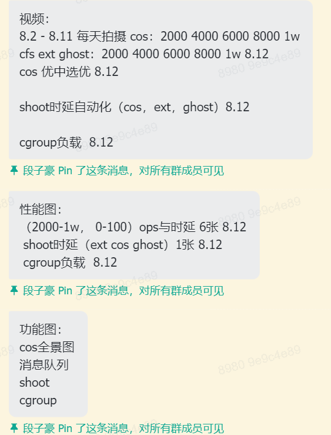

### 进度表

// TODO: 加入每周进度表图片

### 7.10

讨论EXT-eBPF-Shinjuku的开发流程：

fifo->普通负载线程测试->加入qos->交互负载测试->抢占->rocksdb

### 7.15

7.16-7.22  我 cos重构，cos粗略文档；峰哥小萱 完成rocksdb ext负载测试； 

7.23-7.29 我 cos用户态库搭建，cos cgroup顾问； 峰哥小萱 cos cgroup实现，cos rocksdb移植；

 7.30-8.5 cosrocksdb移植完成，cos cgroup实现，cos cgroup负载实现； 

8.6-8.15 文档 ppt（精简，有性能效果展示）图片（在此列出核心cos图片：cos整体架构图，cos消息队列图，cos shoot图，shoot时延对比图，rocksdb统一性能测试对比图，cgroup负载影响对比图）

### 7.21

7.24-7.30：完成cos用户态库搭建和rocksdb支持，绘制性能对比图； 

7.31-8.6：支持cos cgroup与cgroup负载实现，绘制性能对比图；

8.7-8.13：完成文档撰写与关键图片绘制：三个性能对比图，消cos整体架构图，shoot ipi图片，消息队列图片等； 

8.14-8.15：收尾；

### 7.24

1. 讨论COS内核的消息发送实现：
   1. sched_setscheduler中，若是设置调度类为ghost，则设置if_new
   1. 在dequeue钩子里，设置if_blocked
   1. pick_next_task的pnt_prologue中，通过排除if_new和if_blocked排除法判断是否抢占，是则设置抢占标志位if_preempt
   1. context_swtich的prepare_task_switch中，检查if_new，若是则发new消息，检查if_preempt，若是则发preempt消息

2. 讨论COS用户态的Shinjuku调度算法实现：

   shinjuku实现：

   增加message结构体字段：bool preempt_by_cfs; int cpu_id

   在用户态创建struct cpu_state{ int pid; bool availible; }

   1. 初始化pid = 0， avalible = true
   2. 调用shoot之后，修改对应cpu的cpu_state，置pid，置avalible为true
   3. task preempt事件中，若preempt_by_cfs，修改cpu_id对应availible为false；否则为true
   4. task dead/blocked事件中，修改cpu_id对应cpu state，置avalible true，pid = 0
   5. 在调度循环中，遍历所有cpu，优先挑选avalible && pid = 0的cpu；然后挑选avalible && pid != 0的CPU，检测其pid对应task是否耗尽时间片

### 7.25

1. 讨论COS内核线程安全问题解决：

   shoot的时候，需要判断该线程是否还在运行，可能在抢占和dequeue的时候暂时不能运行，但是又马上可以运行了，此时，在被抢占和dequeue的时候，建议将nexttosched设置为null

   同时，对于每一个cpu上的cosrq，会存在线程安全问题，cpu会操控自己的rq，同时，lord cpu也会修改，例如，shoot的时候

2. 讨论看门狗问题：

   CONFIG_PSI 

### 7.28

本周：

1 ghost shinjuku算法同步 

2 cfs rocksdb负载同步 

3 实现local和remote shoot时延测试自动化 

4 最终汇总cfs cos ghost在100 1000 2000 3000 4000 5000qps数据 

第二周 

三个人每天在一起 

cgroup四个系统调用实现完 

添加cgroup lib 

实现相关测试场景与ghost对比，重点是限制干扰线程cpu使用率

最后一周 

在一起三个人 

一起汇总数据，认真绘制性能图 功能图（cgroup，ipi，lord，共享内存）

录制视频 

写文档

ppt

### 7.30

讨论COS内核现有问题及解决方案：

1. exit后拉高电平还是会被cfs抢占，解决方法：为电平读取和修改加锁即可
2. 会出现莫名其妙的线程dequeue后再也没有enqueue，解决方法：未知，据调查是因为返回用户态的时候获取锁而blocked
3. 0%和50%延迟过高，可能是有时候比不过ghost的重要原因，解决方法：全链路追踪探究
4. qps过高会出现vmvare死机，显示禁用cpu，解决方法：推测是vmvare对cpu的限制，目前无法解决，除非不用虚拟机

### 8.1

讨论展示构成：

文档：

背景（用户态调度迫切性，linux调度模块）

ext

  bpf事件（8.2 8.3）

  shinjuku-bpf系统设计（8.4 8.5）

  mq（8.5）

cos

  整体架构（8.2）

  模块：lord模块（8.3） mq消息系统（8.4 8.5） shootarea系统（8.6） shoot流程（ipi）（8.7 8.8） cgroup模块（8.9）

  高性能：高性能内核用户态共享内存读写（原子指令，内存屏障）（8.10）；shoot高性能（ipi，优先级动态调整，共享内存减少用户态内核内存拷贝）（8.11）

  整体调度流程（8.12）

性能对比：

ext初赛和决赛对比

重点：

开发流程：commit流程和遇到的bug（经典log）

难点：linux内核开发（很难） 和sosp对比（sosp，哈工大历史没有）

性能图

四张功能图

性能对比视频