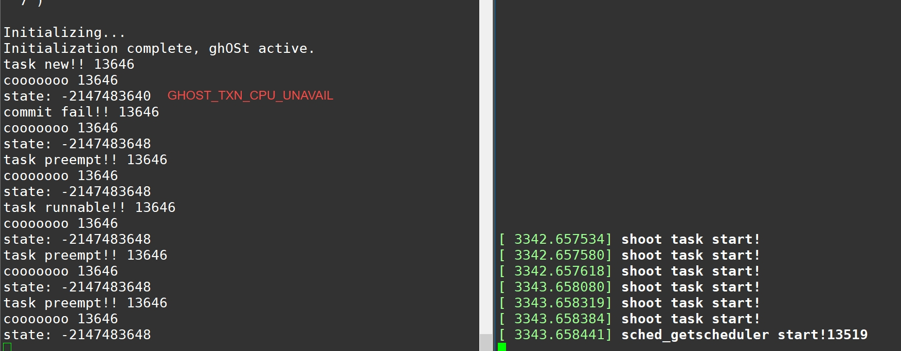

目标cpu上是更高优先级的task，无法抢占

ghost_txn是per cpu数据。通过共享内存ghost_cpu_data获取ghost_txn，从而检查其提交是否成功

不过ghost的commit难道是异步的吗？所以它没有用系统调用返回值来标识是否成功，而是通过读共享内存？


ghost还有latch task的机制？详见`ghost_latched_task_preempted`

是这样的，这个latched task就相当于我们的next to sched。我们可以通过`ghost_set_pnt_state(task_struct)`来设置一个task为next to sched，也可以通过`ghost_latched_task_preempted`将这个东西进行抢占。

除此之外，ghost还引入了一个保护机制，就是这个latched task被设定之后，如果agent要抢占它必须得等到下一个scheduler tick（DEFER_LATCHED_PREEMPTION_BY_AGENT）


关于抢占，找完了所有发抢占消息的地方后，我们可以看到抢占主要发生的是这几个点：

1. 关于latched task被抢占的处理

2. pick_next_ghost_agent

   这是agent的调度类

   这个函数中，prev好像默认是ghost调度类的。也就是说，它的场景应该是一个ghost调度类的prev下来之后触发reschedule，就会调用这个ghost agent调度类的pick函数。

   所以我们不是在prev下来之后马上send信息，而是推迟到了ghost agent调度类的pick中，然后判断下是否因为抢占下来再发送消息。

3. prepare_task_switch

   在context_switch之前被调用

   ```c
   	if (rq->ghost.check_prev_preemption) {
   		rq->ghost.check_prev_preemption = false;
   		send message
   	}
   ```
   

感觉应该是2处理的是ghost线程被cfs调度类抢占的情况，3处理的是ghost调度类之间线程互相抢占的情况。


然后是两个重要标记

1. check_prev_preemption

   唯一对这东西赋值的地方是在：

   ```c
   /*
    * Called at the start of every pick_next_task() via __schedule().
    */
   static void pnt_prologue(struct rq *rq, struct task_struct *prev,
   			 struct rq_flags *rf)
   {
   	struct ghost_enclave *e;
   
   	rq->ghost.check_prev_preemption = ghost_produce_prev_msgs(rq, prev);
   ```

   也即每次pnt之前。里面用了排除法来认定prev是否因为被抢占而下来。

2. ghost.must_resched

   1. 在_pick_next_task_ghost中，rq->ghost.switchto_count > 0  设置为true
   2. 在_pick_next_task_ghost中ghost_prepare_switch之前，设置为false
   3. 在ghost_set_pnt_state中置为false，因为这东西大概类似于set next to sched，所以清空原来的next to sched的must reschedule标志
   4. 


前提猜想：

1. latched task意为被标记为下一个需要马上调度的任务，类似段哥的next to sched

2. rq->ghost.agent ！= NULL 说明当前CPU为agent绑核的cpu

   

研究方法：

找出所有发送TASK_PREEMPT消息的地方，对其做出归纳总结


出现地方：

`task_deliver_msg_preempt` -- `_ghost_task_preempted`  -- `ghost_task_preempted`和`ghost_latched_task_preempted`

所以我们重点看下 `ghost_task_preempted`和`ghost_latched_task_preempted`的引用即可。

1. `ghost_task_preempted`

   1. `pick_next_ghost_agent`

      此为ghost agent调度类的pnt事件。

      当agent on_rq的时候，如果（|关系）：

      1. local agent可运行（pick_agent(rq)返回no NULL。pick_agent应该类似于cos中那堆条件语句，比如说lord_on之类的）
      2. rq->curr即将在这一轮的schedule()中被抢占（`rq->nr_running > rq->ghost.ghost_nr_running`）

      并且`rq->ghost.check_prev_preemption`为true，则抢占。

      也即：

      ```c
      prev = rq->curr;
      next = pick_agent(rq);
      preempted = (rq->nr_running > rq->ghost.ghost_nr_running);
      
      if(next || preempted) {
      	if(rq->ghost.check_prev_preemption) {
              send preempt message;
              kick agent;
              force_offcpu(prev);
              rq->ghost.check_prev_preemption = false; // 防止context switch的时候再发一次消息
          }
      }
      ```

   2. `prepare_task_switch`

      该函数的注释为

      ```c
      /*
       * Called in the context switch path when switching from 'prev' to 'next'
       * (either via a normal schedule or switchto).
       */
      ```

      它在内核上下文切换时被调用：

      `__schedule` -- `context_switch` -- `prepare_task_switch` -- `ghost_prepare_task_switch`

      只有在prev为ghost调度类，且不为agent、且rq->ghost.check_prev_preemption为true的情况下，才需要发送抢占消息

      ```c
      if(ghost_policy(prev) && (prev!=agent) && rq->ghost.check_prev_preemption) {
      	send msg;
          kick agent;
          rq->ghost.check_prev_preemption = false;
      }
      ```

2. `ghost_latched_task_preempted`

   这东西结合latched的意思，应该是指抢占next to sched的意思。它里面大概做的：

   ```c
   // 如果latched的task是ghost policy就抢占，发送抢占消息，唤醒对应agent，并且设latched task为null
   ```

   感觉这个应该不是研究重点。所以我们可以重点看下第一种情况。
   
   
   
   `rq->ghost.latched_task`应该只会在`_ghost_commit_txn`中被修改为next
   
   
   
   总结一下，大概就是这几种情况：
   
   1. 被local agent抢占
   
      _task_tick_ghost、pick_next_ghost_agent
   
   2. 注意move to another cpu时不要发送抢占消息
   
   3. agent死亡时被释放
   
   4. 在context switch时的特殊判断处理
   
      
   
   1. `invalidate_cached_tasks`
   
      应该是在将任务p从一个CPU移动到另一个CPU的时候调用
   
      1. `ghost_move_task`
   
         ```c
         /*
          * Migrate 'next' (if necessary) in preparation to run it on 'cpu'.
          *
          * An important side-effect is that 'next' is guaranteed to not be
          * cached on any cpu when this function returns (e.g. latched_task).
          */
         ```
   
         这玩意是用来将next迁移到cpu的，如果next为latched task并且为本地CPU，则清空latched task，但是不发送抢占消息。
   
         这b好像只会在commit_txn中被调用。那么也就是说，它传入的next之后会被设置为latched。所以在这里面一会儿latched问题也不大。
   
      2. `_dequeue_task_ghost`和`move_queued_task`
   
      这玩意里面那个skip_latched_preemption应该跟ext有点异曲同工之妙，它是用来区分move to other cpu和抢占的。我们在`ghost_move_task`将其设为真，在move结束（？）时clear它。
   
   2. `_task_tick_ghost`
   
      在`sched_tick_remote`中被调用。用于抢占在`pick_next_ghost_agent`中未被抢占的latched task
   
   3. `pick_next_ghost_agent`
   
      当local agent要润并且没有设置delay preemtion，或者cfs进程要润，的时候抢占latched task
   
   4. `release_from_ghost`
   
      当agent死亡的时候，释放所有latched task并且发送抢占信息
   
   5. `ghost_set_pnt_state`
   
      更换latched task，所以以前那个相当于被抢占了
   
   6. `prepare_task_switch`
   
      在`prepare_task_switch`中如果这玩意不为空，说明是被cfs抢占了，所以需要发送抢占消息。
   
      值得注意的是，看他这注释意思，应该是latched task会比别的优先调度，如果latched task都没调那说明烷基八氮了


总结两个地方：

可以看到，具体是在两个地方发送抢占消息，这两个地方分别对应了两种不同的情形

1. ​    agent所在的cpu上运行的ghost任务被local agent/cfs任务抢占

   也即：

   在lord CPU上，ghost prev → cfs task / local agent

2. 非agent所在的cpu上运行的ghost任务被其他ghost  /cfs任务抢占

   也即：

   在非lord CPU上，ghost prev → ghost task / cfs task

其中，第一种情形在`pick_next_ghost_agent`中被处理，第二种情形在`prepare_task_switch`中被处理。

其实两种情况都可以在`prepare_task_switch`中被处理，第一种情况被提前处理是为了防止ghost prev -> cfs -> agent的多余上下文切换，直接一步到位 ghost prev -> agent。


于是，接下来我们就可以看看重要的`rq->ghost.check_prev_preemption`是在哪里修改的了。

它只会在一个地方赋值为true：

```c
/*
 * Called at the start of every pick_next_task() via __schedule().
 */
static void pnt_prologue(struct rq *rq, struct task_struct *prev,
			 struct rq_flags *rf)
{
	struct ghost_enclave *e;

	rq->ghost.check_prev_preemption = ghost_produce_prev_msgs(rq, prev);
```

调度路径：`pick_next_task`最开始 -- `ghost_pnt_prologue` -- `pnt_prologue`

```c
/*
 * Produce voluntary task state change msgs first (e.g. TASK_BLOCKED,
 * TASK_YIELD in case they end up waking the local agent).
 *
 * Returns 'false' if 'prev' should not be considered for a preemption edge.
 *
 * The basic idea is to elide TASK_PREEMPTED if a voluntary task state change
 * msg was already produced for 'prev' (for e.g. agents don't expect to see a
 * TASK_PREEMPTED immediately after a TASK_BLOCKED).
 */
static bool ghost_produce_prev_msgs(struct rq *rq, struct task_struct *prev)
{
```

里面主要是通过排除法来确认task从CPU上下来是因为抢占。

对了，还需要注意一点，如果pnt中next == prev，记得需要重置check_prev_preemption：

```c
out_return:
#ifdef CONFIG_SCHED_CLASS_GHOST
	/*
	 * pick_next_task opted to keep the same task running, but we left
	 * check_prev_preemption on!  This will break switchto, which checks
	 * that field during context_switch()
	 */
	if (WARN_ON_ONCE(p == prev && rq->ghost.check_prev_preemption))
		rq->ghost.check_prev_preemption = false;
#endif
```

还有在pnt中，如果设置了ELIDE_PREEMPT，那么我们就别发抢占消息了

以及pnt的这一段：

```c
	/*
	 * Handle a couple of unusual code paths:
	 * - 'prev' blocked but it was woken up before it got off the
	 *   runqueue (see 'light' wakeup in ttwu_remote()).
	 * - 'prev' blocked voluntarily but __schedule() made it runnable
	 *   to handle a pending signal.
	 * - cond_resched() called __schedule(preempt) but there isn't
	 *   any higher priority task to switch to.
	 */
	if (task_has_ghost_policy(prev) && prev->state == TASK_RUNNING) {
		/*
		 * When an agent blocks via ghost_run() we end up here with
		 * 'prev == agent' via schedule(). Without the check below
		 * we will simply return 'prev' (aka the agent) from this
		 * function and subvert the blocking in ghost_run().
		 */
		if (unlikely(prev != agent && !rq->ghost.must_resched)) {
			next = prev;
			rq->ghost.check_prev_preemption = false;
			goto done;
		}
	}
```

如果一个非agent的task被设为blocked，但又马上变成runnable了，我们就需要继续选择其为next，并且重置check_prev_preemption不发送抢占消息了


switchto_count


补充：

推迟到context switch而不是在pnt中发抢占消息的原因：

```c
	 * We prefer to use an explicit signal over checking the sched_class
	 * of 'next' in ghost_prepare_task_switch() because sometimes even
	 * higher priority sched classes can pick 'rq->idle' to run next.
	 * (e.g. pick_next_task_fair() does this with core tagging enabled).
我们更倾向于使用显式信号，而不是在 ghost_prepare_task_switch() 中检查 'next' 的 sched_class，因为有时甚至优先级更高的 sched_class 也可能选择 'rq->idle' 来运行下一个任务。（例如，在启用了核心标记（core tagging）的情况下，pick_next_task_fair() 可能会选择运行 'rq->idle'。）
```


也就是说，我们是这样的。（不考虑lord CPU情况，毕竟cos没有这个概念）

一个ghost task正在运行，此时触发__schedule()。那么我们就会在pick next task的开头检测一下ghost task是被抢占还是自愿下的CPU，如果是前者，那么我们就在上下文切换的时候发送preempt消息。


**好了，那么所有都看完了，接下来就只剩指定cos方案了。**

首先，我们可以初步区分下两种情况，一种是对普通ghost调度类的抢占，另一种是next to sched还没oncpu就被抢占。

都不考虑这两个被local agent抢占的情况


我突然发现了一点！！！

在上面那个第一种情况中，虽然我们最后还是选择了local agent抢先于cfs运行，但是我们会拉高boost priotity标志，从而通知用户态进行agent的迁移

```c
// in shinjuku
	  if (boosted_priority()) {
        global_scheduler_->PickNextGlobalCPU(agent_barrier);
        continue;
      }
```

6666，所以这个也是由用户态实现的啊


重要标志：

可以看到，在两个地方决定着是否需要抢占的是` rq->ghost.check_prev_preemption`


或者，我们也可参照ext的思路，在enqueue的时候标记task为SCX_TASK_QUEUED，在dequeue的时候取消标记，在未经过dequeue_task_scx【排除block等】的put_prev_task（）中发送抢占消息。


runnable只在一个地方被弄为false：

```c
static void _switched_from_ghost(struct rq *rq, struct task_struct *p)
{
	if (unlikely(p->ghost.new_task)) {
		WARN_ON_ONCE(!task_current(rq, p));
		p->ghost.new_task = false;
		_ghost_task_new(rq, p, /*runnable=*/false);
		ghost_wake_agent_of(p);
	}
```

别的地方都是通过`task_on_rq_queued(p)`计算的。

```c
static inline int task_on_rq_queued(struct task_struct *p)
{
	return p->on_rq == TASK_ON_RQ_QUEUED;
}
```

关于这个的介绍：

```c
 * p->on_rq <- { 0, 1 = TASK_ON_RQ_QUEUED, 2 = TASK_ON_RQ_MIGRATING }:
 *
 *   is set by activate_task() and cleared by deactivate_task(), under
 *   rq->lock. Non-zero indicates the task is runnable, the special
 *   ON_RQ_MIGRATING state is used for migration without holding both
 *   rq->locks. It indicates task_cpu() is not stable, see task_rq_lock().
```

也就是说这两个b应该都是代表running的意思，所以我们不能粗暴用running区分？

`TASK_ON_RQ_QUEUED`在`activate_task`中被标志，

`TASK_ON_RQ_MIGRATING`：非睡眠的dequeue即为cpu迁移

```c
void deactivate_task(struct rq *rq, struct task_struct *p, int flags)
{
	p->on_rq = (flags & DEQUEUE_SLEEP) ? 0 : TASK_ON_RQ_MIGRATING;

	dequeue_task(rq, p, flags);
}
```


```c
task preempt!! 26174
26174 deque, state = 1
26174  preempt 26175
26175 enqueue, state = 1
cooooooo 26174
26175 deque, state = 1
state: -2147483648
task preempt!! 26175
task state 2
WARNING: All log messages before absl::InitializeLog() is called are written to STDERR
F0000 00:00:1690525419.218876   25952 fifo_scheduler.cc:173] Check failed: task->queued() 
```

可以看到，174被pick出来而deque了，然后抢占了175,175就enqueue了。然后shoot174.然后175又被pick出来，结果可能没cpu了所以没被shoot，就导致了这种情况。

```c
task preempt!! 42677
42677 deque, state = 1
42677  preempt 42665, oncpu = 0
42665 enqueue, state = 1
cooooooo 42677 on cpu 1
42665 deque, state = 1
42665  preempt 42542, oncpu = 0
42542 enqueue, state = 1
cooooooo 42665 on cpu 2
2
```


1. task_deliver_msg_task_new——ghost_uninhibit_task_msgs——__sw_region_free——enclave_actual_release

   释放

2. task_deliver_msg_task_new——\_ghost_task_new——\_switched_from_ghost

   从ghost切到别的调度类

3. task_deliver_msg_task_new——\_ghost_task_new——ghost_task_new——_switched_to_ghost

   从别的调度类切到ghost

4. task_deliver_msg_task_new——\_ghost_task_new——ghost_task_new——ghost_produce_prev_msgs

   task_deliver_msg_task_new——\_ghost_task_new——ghost_task_new——prepare_task_switch

5. task_deliver_msg_task_new——\_ghost_task_new——ghost_task_new——_task_woken_ghost

6. task_deliver_msg_task_new——generate_task_new——gf_ctl_write    这个应该是我们在把新tid写入fd的时候
7. p->ghost.new_task——\_\_ghost_prep_task——ghost_prep_task——\_ghost_sched_fork——ghost_sched_fork
8. p->ghost.new_task——\_\_ghost_prep_task——ghost_prep_task——_ghost_setscheduler


1. task_deliver_msg_task_new——\_ghost_task_new——ghost_task_new——_switched_to_ghost

   从别的调度类切到ghost

2. task_deliver_msg_task_new——\_ghost_task_new——ghost_task_new——_task_woken_ghost


```shell
sudo  > agenttime
sudo  > clienttime
python agenttime clienttime > latency
```

