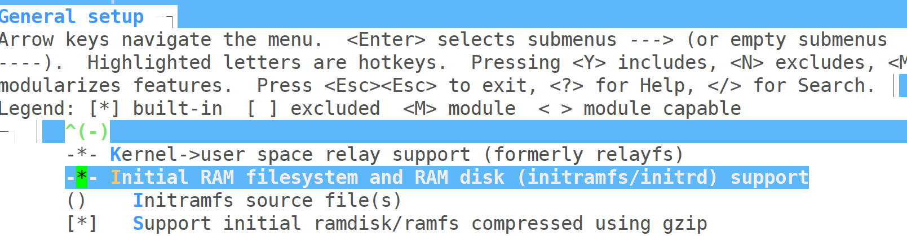
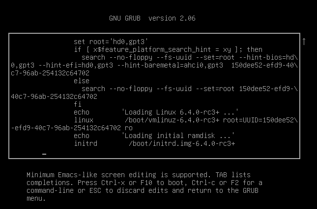
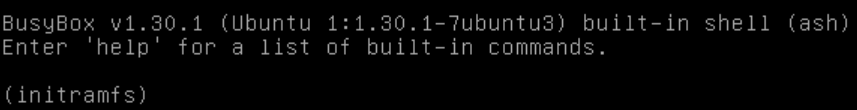
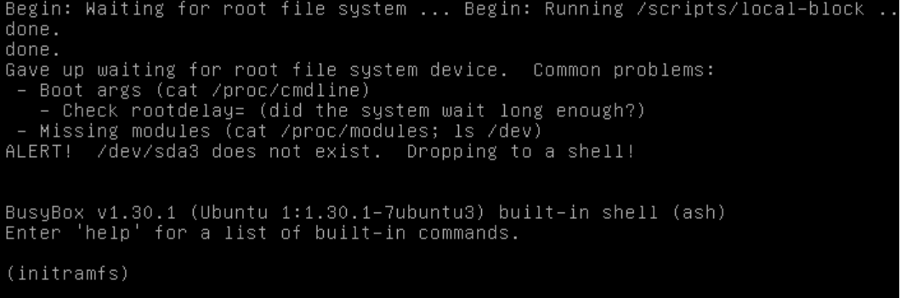

# 内核启动流程

在传统的BIOS系统中，计算机具体的启动流程如下：

1. 电源启动：当计算机的电源打开时，电源供电给计算机的硬件设备。
2. BIOS自检：计算机的BIOS固件会自检硬件设备，包括RAM、处理器、硬盘等，以确保它们正常工作。
3. 引导设备选择：BIOS会根据预先定义的启动顺序（通常是硬盘、光驱、USB等）选择一个启动设备。
4. MBR（Master Boot Record）加载：如果选择的启动设备是硬盘，BIOS会加载该硬盘的MBR，其中包含了引导加载程序。
5. GRUB加载：MBR中的引导加载程序通常是GRUB（或其他引导加载程序）。GRUB会被加载到计算机的内存中，并开始执行。
6. GRUB菜单：GRUB会显示一个菜单，列出可供选择的操作系统或内核。
7. 操作系统加载：用户选择操作系统后，GRUB会加载相应的操作系统或内核，并将控制权交给它。

## cpu供电

首先电源对cpu进行供电

## BIOS

#### 执行 0xFFFFFFF0 地址处的指令

CPU 开始执行 0xFFFFFFF0 地址处的指令，该地址处是一条 JUMP 指令，这条指令清空了基址寄存器的值，并让指令跳回到 BIOS 开始处以执行 BIOS。
CPU 启动后其大多数寄存器会被初始化为预定的值，包括指令寄存器（Instruction register，IR），它保存着 CPU 将要执行指令的内存地址。

此时， CPU 会有一个特殊行为：对 IR 的初始值加上一个基址寄存器的值，生成一个 32 位的地址 0xFFFFFFF0。之所以称为特殊行为，是因为实模式下 CPU 只能寻址 1MB 地址空间，而这个 32 位地址已经大于 1MB 的内存限制。因此，0xFFFFFFF0 也被称为重置向量（reset vector），参考上图 0xFFFFFFF0 处的标识。

#### 初始化必要硬件

BIOS 内部可以分成两个区块: code block（普通程序）、boot block（引导程序）。上电后，boot block 会先被执行，它会检查 code block 的代码是否正确，如果正确，就会转到 code block 继续执行下去。0xF0000 地址实际上是 BIOS 中的 boot block 的开始处。在这个阶段，会初始化部分硬件。系统的 CPU、USB 只有部分被初始化。

#### 加电自检POST

初始化完成后，CPU 进行 BIOS 加电自检（power on self test, POST）。这个过程会检查计算机的各项组件，如 CPU、显卡、内存、鼠标、键盘等。如果找不到内存或者键盘都有可能让BIOS停止工作并且打印一些相关的错误信息，如果找不到显卡 BIOS 会发出蜂鸣警告

#### 执行其他bios

接下来bios会开始寻找其他设备的 ROM，如果找到任何其他设备的 BIOS，它们也会被执行。

#### 设置中断向量表

BIOS在初始化过程中会设置中断向量表（Interrupt Vector Table，IVT），它是一个存储中断处理程序地址的表格。

BIOS会在计算机启动时加载到内存中，并在初始化过程中设置IVT。默认情况下，BIOS会提供一组固件中断处理程序，用于处理硬件相关的中断事件，如时钟中断、键盘中断等。这些固件中断处理程序是由BIOS开发商提供的，并且通常被称为BIOS中断服务例程（BIOS Interrupt Service Routines，ISR）。

这些固件中断处理程序是针对特定硬件的操作，它们执行特定的功能，如处理键盘输入、显示字符、控制外设等。这些处理程序被存储在IVT中相应的中断向量位置，并在硬件触发中断时被调用。

需要注意的是，随着操作系统的引导和加载，操作系统会接管对中断的处理，并根据自己的需求替换IVT中的中断处理程序。操作系统可以使用自己的中断处理程序来处理特定的中断事件，以满足操作系统的功能需求。

#### 显示bios界面

下一步，显卡就会显示 BIOS 界面，并进行更深入的检查。

#### 写相关资源信息

检查完成后，BIOS 会根据自己的"系统资源表"，对系统进行进一步确认，从而确定计算机配有哪些资源或设备。例如 BIOS 支持随插即用，它会检测并配置随插即用设备。然后 BIOS 会遵循高级配置电源接口（Advanced Configuration Power Interface，ACPI）在内存中设置好一系列的数据来描述硬件信息，以便被操作系统内核利用。


## MBR

到这一步，BIOS 开始尝试加载操作系统。它会从硬盘，光驱，软驱，网络等几个地方依次寻找操作系统（用户可以在 BIOS 设定中修改查找的优先级）。如果找不到操作系统，BIOS 会停机并给出错误信息。

假设在硬盘上找到了操作系统，它会首先读取硬盘上的大小为 512 Bytes 的 0号扇区，这个扇区被称为 主引导记录（Master Boot Record，MBR），其包含三部分：

a) 引导程序（Boot Loader）

b) 硬盘分区表（Partition Table）

c) 结束标志字

BIOS 读完磁盘上的 MBR 之后会把它拷贝到内存 0x7C00 地址处，然后 CPU 跳转到该内存地址执行 MBR 里的指令。事实上，被复制到物理内存的内容就是 Boot Loader。常见的 Boot Loader 有 GRUB。

第1阶段：BIOS加载MBR中的GRUB(GRUB第一阶段的文件），而GRUB只有446字节，无法实现太多功能，所以该阶段的主要作用其实是加载1.5阶段的文件（/boot/grub/下的文件，也即`grub.cfg`）

【此处详见 [史上最详细linux启动过程讲解---没有之一](https://cloud.tencent.com/developer/article/1114481)】

第1.5阶段：用来加载识别文件系统的文件，**识别完系统后才可以找到/boot目录**。

第2阶段：显示GRUB菜单：GRUB的阶段2会根据配置文件（通常是grub.cfg）中的设置显示引导菜单。菜单上列出了可用的操作系统选项和其他引导项。可以加载/boot下的os，涉及到加载内核映像、初始化ramdisk（initrd/initramfs）和传递内核启动参数。GRUB在加载内核同时，也把initrd加载到内存中并运行


## Linux

https://blog.csdn.net/jinking01/article/details/105082993

运行/sbin/init，进行系统初始化

做很多设置，例如挂载根文件系统


# GRUB详解

下文将从文件系统初始化的角度对上面提到的GRUB进行详解。

## 概述

文件系统在启动流程中的发展历程可以分为以下三个部分：

1. GRUB文件系统

   由 GRUB 自身通过 BIOS 提供的服务加载

2. initramfs

   由GRUB加载，用于挂载真正的文件系统

3. 真正的根文件系统

下面，将介绍1和2两个流程。

## GRUB

> GRUB（GNU GRand Unified Bootloader）是一种常用的引导加载程序，用于在计算机启动时加载操作系统。
>
> GRUB的主要功能是在计算机启动时提供一个菜单，让用户选择要启动的操作系统或内核。它支持多个操作系统，包括各种版本的Linux、Windows、BSD等。通过GRUB，用户可以在多个操作系统之间轻松切换。
>
> 除了操作系统选择，GRUB还提供了一些高级功能，例如引导参数的设置、内存检测、系统恢复等。它还支持在启动过程中加载内核模块和初始化RAM磁盘映像（initrd或initramfs）。
>
> GRUB具有高度可配置性，允许用户自定义引导菜单、设置默认启动项、编辑内核参数等。它还支持引导加载程序间的链式引导，可以引导其他引导加载程序，如Windows的NTLDR。

GRUB的基本作用流程为：

1. BIOS加载MBR，MBR加载GRUB，开始执行GRUB程序
2. GRUB程序读取`grub.cfg`配置文件
3. GRUB程序依据配置文件，进行内核的加载、根文件系统的挂载等操作，最后将主导权转交给内核

### grub.cfg

内核启动时，GRUB程序会读取`/boot/grub/`目录下的GRUB配置文件`grub.cfg`，其中记录了所有GRUB菜单可供选择的内核选项（menuentry）及其对应的启动依赖参数。以6.4.0内核选项为例：

```shell
# menuentry标识着GRUB菜单中的一个内核选项
menuentry 'Ubuntu' --class ubuntu --class gnu-linux --class gnu --class os $menuentry_id_option 'gnulinux-simple-XXX' {
        recordfail # 记录上次启动是否失败，用于处理启动失败的情况
        load_video # 加载视频驱动模块，用于在启动过程中显示图形界面
        gfxmode $linux_gfx_mode # 设置图形模式
        insmod gzio # 加载gzio模块，提供对GZIP压缩和解压缩功能的支持
        # 如果是在Xen虚拟化平台上，则加载xzio和lzopio模块
        if [ x$grub_platform = xxen ]; then insmod xzio; insmod lzopio; fi 
        
        insmod part_gpt # 加载part_gpt模块，支持GUID分区表（GPT）
        insmod ext2 # 加载ext2模块，支持ext2文件系统
        
        # 设置文件系统的根分区
        set root='hd0,gpt3' 
        if [ x$feature_platform_search_hint = xy ]; then
          search --no-floppy --fs-uuid --set=root --hint-bios=hd0,gpt3 --hint-efi=hd0,gpt3 --hint-baremetal=ahci0,gpt3  XXX
        else
          search --no-floppy --fs-uuid --set=root XXX
        fi
        
        linux   /boot/vmlinuz-6.4.0-rc3+ root=UUID=XXX ro text # 指定内核映像的路径和启动参数
        initrd  /boot/initrd.img-6.4.0-rc3+ # 指定initramfs映像的路径
}
```

可以看到，`grub.cfg`主要记录了一些该**内核启动需要的依赖module**，以及**内核映像和initramfs映像的路径**。

menuentry的代码中，有以下几个要点值得注意：

1. `insmod gzio `

   由于加载gzio模块，提供对GZIP压缩和解压缩功能的支持。

   看到这里我第一反应是觉得有点割裂，为啥这看着比较无关紧要的解压缩功能要在内核启动之前就需要有呢？于是我想起来在配置内核时，有一个选项是这样的：

   

   在配置选项中，我们选择了对initramfs的支持，并且勾选了`Support initial ramdisk/ramfs compressed using gzip `，也即在编译时通过gzip压缩initramfs的大小以节省空间。

   所以说，我们在内核启动之前，持有的initramfs处于被压缩的状态。故而，我们自然需要在内核启动之前安装gzio模块，从而支持之后对initramfs的解压缩了。

2. `insmod ext2`

   这句代码说明，GRUB的临时文件系统为ext2类型，这句代码事实上是在安装GRUB建立临时文件的必要依赖包，从而GRUB程序之后才能建立其临时文件系统、从/boot/initrd.img获取initramfs映像。

3. `linux   /boot/vmlinuz-6.4.0-rc3+ root=UUID=XXX ro text`

   指定了启动参数，也即将根文件系统以只读（`ro`）的方式挂载在`root=UUID=XXX`对应的块设备上，并且默认以`text`方式（也即非图形化的Shell界面）启动内核。

   <u>此处的启动参数可在下一个部分介绍的`grub`文件中个性化。</u>

### grub.cfg的生成与修改

实际运用中，很多时候需要对启动参数进行一些修改。下面介绍两种修改`grub.cfg`的方法。

#### /etc/default/grub

可以看到，`grub.cfg`其实格式较为固定（也即由一系列内容也比较相似的menuentry构成）。因而，实际上我们是通过`grub.d`生成`grub.cfg`的（6.S081实验中事实上也涉及了这一点），而`/etc/default/grub`则是GRUB程序以及`grub.cfg`生成的配置文件。下面介绍下该文件主要有哪些配置选项。

```shell
# If you change this file, run 'update-grub' afterwards to update
# /boot/grub/grub.cfg.
# For full documentation of the options in this file, see:
#   info -f grub -n 'Simple configuration'

# 开机时GRUB界面的持续时间，此处设置为30s
GRUB_TIMEOUT=30
GRUB_CMDLINE_LINUX=""

# 不使用图形化界面
#GRUB_TERMINAL=console
# 图形化界面的大小
#GRUB_GFXMODE=640x480
# 不使用UUID
#GRUB_DISABLE_LINUX_UUID=true

# 隐藏recovery mode
#GRUB_DISABLE_RECOVERY="true"
```

重点看下这几个参数：

1. `GRUB_CMDLINE_LINUX`

   表示最终生成的grub.cfg中的每一个menuentry中的linux那一行需要附加什么参数。

   例如说，如果设置为：

   ```shell
   # 表示initramfs在挂载真正的根文件系统之前，需要等待120s，用于防止磁盘没准备好导致的挂载失败
   GRUB_CMDLINE_LINUX="rootdelay=120" 
   ```

   那么，最终在menuentry中的启动参数就为：

   ```shell
   linux   /boot/vmlinuz-6.4.0-rc3+ root=UUID=XXX ro rootdelay=120 text
   ```

   其他一些常见的选项：

   ```shell
   # 直接以路径来标识块设备而非使用UUID。此为old option，建议尽量使用UUID
   GRUB_CMDLINE_LINUX="root=/dev/sda3"
   # 标明init进程（启动后第一个进程）的具体路径。此处指明为`/bin/sh`
   GRUB_CMDLINE_LINUX="init=/bin/sh"
   ```

在修改完`grub`文件之后，我们需要执行`sudo update-grub`，来重新生成`grub.cfg`文件供下次启动使用。

#### 在GRUB界面直接修改


我们可以在GRUB界面选中所需内核，按下e键：



然后就可以对启动参数进行修改。

值得注意的是，此修改仅对本次启动有效。如果需要长期修改，建议还是通过第一种方法去修改。


## initramfs

GRUB程序会通过`initrd.img`启动initramfs，从而进行真正的根文件系统挂载。

> initrd.img是一个Linux系统中的初始化内存盘（initial RAM disk）的映像文件。它是一个压缩的文件系统映像，通常在引导过程中加载到内存中，并提供了一种临时的根文件系统，以便在正式的根文件系统（通常位于硬盘上）可用之前提供必要的功能和模块。

我们可以通过`unmkinitramfs /boot/initrd.img-6.4.0-rc3+ /tmp/initrd/`命令解压initrd，探究里面到底有什么玩意。

```c
├── bin -> usr/bin
├── conf
├── etc
├── init
├── lib -> usr/lib
├── lib32 -> usr/lib32
├── lib64 -> usr/lib64
├── libx32 -> usr/libx32
├── run
├── sbin -> usr/sbin
├── scripts
├── usr
└── var
init
```

可以看到，这实际上就是一个小型的文件系统，也即initramfs。它有自己的built-in Shell（BusyBox）：



有一些较少的Shell命令（bin和sbin目录下），以及用来挂载真正的根文件系统的代码逻辑（存储在scripts目录下）。【我猜】在正常情况下，系统会执行scripts下的脚本代码挂载真正的文件系统。当挂载出现异常时，系统就会将控制权交给initramfs内置的Shell BusyBox，由用户自己探究出了什么问题。

我们接下来可以追踪下initramfs的script目录下的文件系统挂载流程。

挂载真正文件系统的主要函数为`local_mount_root`：

```shell
# 仅展示主要流程代码
local_mount_root()
{
	# 预处理，获取参数等（也即上面grub.cfg配置的root=UUID）
	local_top
	if [ -z "${ROOT}" ]; then
		panic "No root device specified. Boot arguments must include a root= parameter."
	fi
	
	# 根据UUID获取对应的块设备
	local_device_setup "${ROOT}" "root file system"
	ROOT="${DEV}"

	# 挂载前的预处理
	local_premount
	
	# 挂载
	mount ${roflag} ${FSTYPE:+-t "${FSTYPE}"} ${ROOTFLAGS} "${ROOT}" "${rootmnt?}"
}
```

由于研究这个是错误驱动（乐），因而我只主要看了下`local_device_setup`：

```shell
# $1=device ID to mount设备ID
# $2=optionname (for root and etc)要挂载的是什么玩意，此处应为root file system
# $3=panic if device is missing (true or false, default: true)
# Sets $DEV to the resolved device node $DEV是最终获取到的块设备
local_device_setup()
{
	local dev_id="$1"
	local name="$2"
	local may_panic="${3:-true}"
	local real_dev
	local time_elapsed
	local count

	# 获取grub.cfg的rootdelay参数的设备等待时间。如果没有该参数，默认是30秒
	local slumber=30
	if [ "${ROOTDELAY:-0}" -gt $slumber ]; then
		slumber=$ROOTDELAY
	fi

	# 等待设备
	case "$dev_id" in
	UUID=*|LABEL=*|PARTUUID=*|/dev/*)
		FSTYPE=$( wait-for-root "$dev_id" "$slumber" )
		;;
	*)
		wait_for_udev 10
		;;
	esac

	# 等待结束了。如果条件为真，说明还是获取不到对应的设备，那就只能说明这个设备死了
	# 所以我们就得把问题告诉用户，让用户自己解决，并且进入BusyBox Shell
	# We've given up, but we'll let the user fix matters if they can
	while ! real_dev=$(resolve_device "${dev_id}") ||
	      ! get_fstype "${real_dev}" >/dev/null; do
		if ! $may_panic; then
			echo "Gave up waiting for ${name}"
			return 1
		fi
		echo "Gave up waiting for ${name} device.  Common problems:"
		echo " - Boot args (cat /proc/cmdline)"
		echo "   - Check rootdelay= (did the system wait long enough?)"
		if [ "${name}" = root ]; then
			echo "   - Check root= (did the system wait for the right device?)"
		fi
		echo " - Missing modules (cat /proc/modules; ls /dev)"
		panic "ALERT!  ${dev_id} does not exist.  Dropping to a shell!"
	done

	DEV="${real_dev}"
}
```

可以看到，这里如果进入错误状态，最终就是这样的效果2333：



