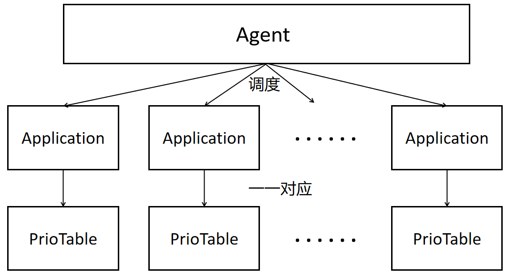
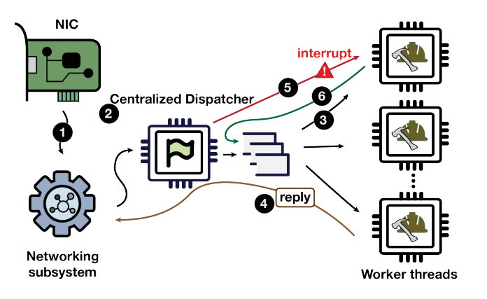

# 1. 概述

用户态调度框架的实现一直是工业界的一大需求。随着工业界的负载种类的增加，对于调度的诉求也在不断变化。目前主要使用的是Linux原生的调度算法：CFS(*Completely-Fairness-Scheduler*)，即完全公平调度算法。CFS能够通用地对不同的负载进行调度，并且取得一个相对好的性能，但是无法对特定的负载、不同的诉求作出调整。比如，io密集型和计算密集型两种负载，前者需要及时地响应输入，因此处理输入的设备或者软件进程应该长时间出于可运行的状态，一旦对应的输入到达，处理进程就应该被及时唤醒被处理数据，因此此类调度场景应该使用灵活的调度算法，以方便处理输入数据的进程拥有更高的优先级，方便抢占；后者需要长时间占据cpu来进行计算，此类调度场景则需要相对固定的优先级，并没有太多抢占的发生。

对于底层，用户态的负载是无法被感知的。**内核没办法根据用户态的负载的特性来决定使用何种调度算法更加合适**。因此需要设计一个用户态的调度框架来解决这个问题，而这样的用户态调度框架应该具有以下特性：

1. 能够与内核通信，时刻更新有关待调度进程和调度的决策等信息。
2. 实现了多种调度算法，可以针对不同的负载作出最合适的调度算法的选择。
3. 能够兼容cgroup，对于底层的cpu、io和内存做到很好的管理。

// WORD-TODO 超链接ghOSt

ghOSt就是一个由Google实现的比较成熟的用户态调度框架，但是ghOSt虽然可以支持绑核操作（指定一个负责特定调度算法的Agent所调度的任务只运行在设置好的cpu上），但无法彻底兼容cgroup。

// WORD-TODO 超链接EXT

SCHED-EXT是由Google基于6.2.0版本的Linux内核开发的补丁，其添加了很多有关调度的eBPF事件和SCHED-EXT调度类，结合在eBPF程序编写的钩子函数，可以满足在用户态触发相应的事件后实现用户和内核的通信，进而完成用户态的调度算法实现，并且可以做到兼容cgroup。我们基于这个内核，实现了一个**基于CFS且兼容的用户态调度框架**。这个用户态调度框架目前拥有四个调度算法，分别是：SJF(*Shortest Job First*)、MFQ(*Multi-Level Feedback Queue Scheduling Algorithm*)、CFS(*Completely-Fair-Scheduler*)和Shinjuku调度算法。

// WORD-TODO 超链接性能测试

关于性能的测试，我们专门写了能够生成测试线程的程序作为任务的生产者，在EXT调度框架被开启之后，用户态的调度就由原先的CFS调度类转向了SCHED-EXT调度类，任务便被委派到指定的调度算法代理程序（Agent进程），最后由Agent去决策任务的调度方案。

ghOSt作为一个大量修改内核后的比较成型的调度框架，使用共享内存的方法使得用户与内核之间的通信非常方便，用户的决策时间传达到内核以及内核将待调度任务发送到用户都是微秒级别的。而SCHED-EXT只是作为一个内核补丁，支持了eBPF的事件实现，提供了注入调度算法的途径，在性能上的实现远不如ghOSt。

但是，SCHED-EXT的优势在于流程简单，可以彻底兼容cgroup。如果对其在内核的实现进行修改并且让它变得完善，那么这个用户态调度框架就可以实现以上的三个特性进而成为一个十分完美的调度框架了。

**因此，我们目前基于SCHED-EXT实现了以下的功能**：

1. 多种调度算法的实现。
2. 使用共享内存的方法完善了用户与内核之间的通信。
3. 对其性能进行测试。

ghOSt对我们整个项目的构建提供了很多实现思路，因此在我们的文档里首先会提及ghOSt的相关设计思路，如果我们之后还想优化ghOSt，比如使其兼容`cgroup`或者增添新的调度算法以及优化其现有调度算法，有关ghOSt的知识是有必要掌握的。然后是对于我们的用户态调度框架的介绍，我们称之为EXT调度框架。在这篇介绍了可以看到EXT的设计实现思路以及不同的调度算法。

// WORD-TODO 超链接未来展望

在文档的最后可以看到我们对于EXT调度框架的未来展望。我们希望EXT调度框架可以成为一个功能强大的调度框架，最终能够适用于各种各样的负载，并且表现出良好的特性。


# 2. 需求分析

通过赛题分析可知，首先我们需要实现将用户态调度策略注入Linux内核。原生Linux内核完全不支持在用户态实现一个调度算法并注入内核。虽然现在可以通过eBPF将用户态的程序注入内核，但是eBPF主要是起监控搜集信息作用，而且原生的Linux内核调度相关事件点很少，对调度决策的修改难以实现。所以首先我们需要修改Linux内核，使得可以通过eBPF或者新建系统调用等机制来将用户态的调度决策传入内核。但是这涉及的工作量过大，以现有的SCHED-EXT补丁（采取eBPF注入策略）和ghOSt（采取系统调用策略）为例，二者对内核的修改均超出了一万行，是Google联合斯坦福等其他研究机构的团队耗时几个月的代码成果。所以对于我们组三名计科本科生来说，在4月初赛题发布到8月中旬的短短4个月是不可能自己从零开始开发出一个将用户态调度策略注入内核的内核补丁。因此，**基于EXT和ghOSt开发**是明智的选择。

其次，虽然SCHED-EXT实现了内核部分，但是其用户态的调度算法框架比较简陋，只有简单的示例程序。而ghOSt作为一个特别成熟的成果，内核和用户态框架均实现很完善。所以，**我们的策略是首先通过研究学习ghOSt的论文和其用户态调度框架的组织，然后基于EXT去实现我们的用户态调度框架**。我们参考ghOSt基于SCHED-EXT实现了4800行的代码框架和调度算法，并且取得了不错的效果，在很多方面优于Linux的原生CFS调度类【// WORD-TODO 插入拷打CFS超链接】。截止初赛，我们达到了题目的用户态调度框架基本要求：包括但不限于：实现task delegation 的机制、实现preemption的机制以及对 fairness 的考虑等。

同时，赛题还要求，调度框架需要兼容CFS调度类相关组件，如cgroup。SCHED-EXT内核是符合此要求的，但是ghOSt内核则存在一定的不兼容。所以将ghOSt内核修改至实现**兼容CFS调度类的相关组件**也将会是我们未来决赛的目标之一。

// WORD-TODO 超链接

对于性能方面，ghOSt和我们实现的EXT用户态框架均可以在部署速度和代码量方面**远胜**Linux原生内核（具体见[效果展示](##5.4-性能对比)）。但是在有些方面，即使我们在用户态尽力进行优化，但是由于SCHED-EXT内核相关实现，部分性能方面对比原生CFS调度类没有优势，存在很大优化空间。所以**修改优化SCHED-EXT内核**将会是我们未来决赛的目标之一。

对于扩展题：挖掘实际应用的场景，并针对该场景设计实现调度策略并通过该调度框架注入到内核达到优化，我们目前找到了实际场景：io密集型场景，如数据库大量请求。也基于EXT用户态框架部署了Shinjuku调度算法，但是对于负载一侧，还在实现中，这也是我们未来决赛的目标。


# 3. ghOSt分析

ghOSt是由Google开发并维护的一个基于Linux5.11.0内核实现的一个高性能通用用户态调度框架。它提供了丰富的API，用来从用户空间接收用户进程决定的调度策略，并将其作为事务提交给内核执行。程序员可以使用任何语言或工具来开发调度策略，并且无需重启机器即可使负载使用特定调度策略被调度。

ghOSt项目分为ghOSt-kernel和ghOSt-userspace两个部分。ghOSt-kernel部分是添加了ghOSt框架所需内核补丁的Linux5.11.0内核，userspace部分为ghOSt用户态调度框架的主体。

由于ghOSt框架维护较为成熟和完善，并且其为一个支持策略优化、无中断升级和故障隔离的高性能框架，与我们的赛题较为贴切，故而我们详细调研了ghOSt-userspace，并决定将其作为我们的实现参考之一。

// WORD-TODO 超链接

接下来，我们将分成四个部分对我们调研的ghOSt进行详细的分析与介绍。在第一部分中，我们将介绍ghOSt的整体架构；在第二部分中，我们将介绍ghOSt的核心概念及其相关定义；在第三部分中，我们将介绍通过ghOSt框架实现的调度算法的启动流程；第四部分中，我们将介绍ghOSt的几种不同线程间通信方式。

## 3.1 整体架构

ghOSt将“做出一个调度决策”这个过程分成了三个主体来实现，如下图所示。


三个主体分别为Kernel（下称Kernel端）、ghOSt agents（下称Agent端）和WorkLoad（下称Client端）。

* Kernel端

  即为添加了ghOSt运行所需补丁的Linux内核。ghOSt在内核中新增了调度类Ghost，用于：

  1. 接收并执行来自userspace的调度决策，将进程调度到指定CPU上
  2. 将进程相关信息传递到userspace，以帮助其做出调度决策

* Agent端

  Agent由程序员负责编写代码。

  它是调度算法（如FIFO、EDF等等）的具体实现，负责管理调度Client端创建的线程，做出调度决策，并将调度决策传入内核。它还可以接收来自内核的信息，并将其中Client关心的部分告知Client。

* Client端

  Client为具体的多线程应用场景。它产生的线程交给Agent进行调度。它可能会从Agent处接收来自内核的信息，从而动态调整负载的工作逻辑；它也可能会更新线程的某些信息（例如状态、优先级等），从而动态地影响Agent做出调度策略。

// WORD-TODO 超链接

下文将围绕这三个主体及其之间的相互作用关系，从[ghOSt核心概念介绍](##3.2-ghOSt核心概念介绍)、[调度分析](##3.3-初始化及调度流程)以及[通信分析](##3.4-通信分析)这三个方面详细介绍ghOSt。

## 3.2 ghOSt核心概念介绍

下面是ghost中的相关概念解释和其之间联系。

### 3.2.1 专用名词和文档格式介绍

+ ghOSt特有概念：

   `Topology`、`Message`、`Channel`、`StatusWord`、`StatusWordTable`、`Task`、`GhostThread `、`RunRequest`、`Agent`、`Enclave`、`Scheduler`、`ghOSt内核接口层`。下文是对这些定制概念的解释。

+ ghOSt用户态框架：

  ghOSt项目分为ghOSt-kernel和ghOSt-userspace两个部分，下文除非明确提及，这里我们只介绍ghOSt-userspace。

+ 介绍格式：

  - 标题层级

    首先是ghOSt定制概念，每个部分的子标题是其细化的概念，如Agent和其下面的Agent和FullAgent，就是ghOSt定制概念和其细化概念。

  - 统一格式

    * 介绍：详细介绍此ghOSt定制概念的含义和作用等。

    * 类定义：列出其在ghOSt中类的相关字段以及其介绍，这些字段可能将会在本次介绍中使用到，注意这些字段的名称。

    * 初始化以及工作流程：介绍此ghOSt定制概念的初始化流程，和其工作流程。

    * 与其他ghOSt定制概念的联系

+ ghOSt内核接口层：

  ghOSt内核前期开发提供了一系列的系统调用，但是最近将其改为使用`ioctl`（类似于kvm），下面我们将使用ghOSt内核接口指代`ioctl`。

+ ghOSt共享内存：在ghOSt中一共有三种类型的内核用户共享内存。

  - 一号共享内存：enclave的`ghost_cpu_data`，存放`RunRequest`中的`ghost_txn`。共享内存对应文件：`/sys/fs/ghost/enclave_$id/cpu_data`。

  - 二号共享内存：`StatusWordTable`，存放`StatusWord`。共享内存对应文件：`/sys/fs/ghost/enclave_$id/sw_regions/sw_$swid`。

  - 三号共享内存：`Channel`消息队列，存放`Message`消息。

### 3.2.2 核心概念介绍

#### Topology

topology代表了一台计算机的cpu拓扑架构，包括物理cpu、逻辑cpu、socket、L1 L2 L3 cache、NUMA节点等之间的关系。


##### 相关背景知识

###### CPU（中央处理器）

CPU是计算机系统中的主要组件之一，用于执行程序的指令和进行数据处理。CPU是一种微处理器，它负责解释和执行计算机程序中的指令，并协调和控制系统中的其他硬件和设备。一般而言，CPU的概念在软件层面上，代表**逻辑CPU**的概念。

###### 超线程（HT）

超线程技术是在单个核心处理单元中集成两个逻辑处理单元，也就是一个CPU核（共享的运算单元），两个逻辑CPU（有各自独立的处理器状态），在一个CPU核同时执行多个程序而共同分享一个CPU核内的资源，对于寄存器，每一个超线程是独有的，而其余部分如ALU（整数运算单元）、FPU（浮点运算单元）、L2 Cache（二级缓存）则保持不变，这些部分是被分享的。
​虽然采用超线程技术能同时执行两个线程，但它并不象两个真正的CPU那样，每各CPU都具有独立的资源。当两个线程都同时需要某一个资源时，其中一个要暂时停止，并让出资源，直到这些资源闲置后才能继续。因此超线程的性能并不等于两个CPU的性能。

###### L1 L2 L3 cache

cache（缓存）是为了提高`CPU`访存而增加的。

一般，一个超线程有自己的L1 cache，`L1 cache`分为数据缓存和指令缓存，同一个CPU核中的超线程共享`L2 cache`，同一个物理CPU中的`核`共享`L3 cache`。

###### sibling

那些共享`L2 cache`的同一个CPU核下的逻辑CPU，被称为`sibling`。每个处理器核心可以被认为是具有多个`siblings`的实体。这些`siblings`是通过超线程技术创建的逻辑CPU。

###### L3 sibling

`L3 sibling`是指共享同一级别三级缓存`L3 Cache`的`逻辑CPU`。

###### socket

`插槽`，是一种用于安装和连接CPU到主板的接口。它是主板上的物理插座，可以容纳特定类型和规格的处理器。一个`插槽`只能插一个`物理CPU`，所以在ghOSt中可以将插槽和物理CPU看成一个概念。

###### SMP

`SMP（Symmetric Multiprocessing，对称多处理）`是一种计算机体系结构，用于构建多处理器系统。在`SMP`架构中，多个`物理CPU`共享同一总线、交叉点或其他互连结构，以及系统内存和其他共享资源。与之相对的是`NUMA`。

###### NUMA

`NUMA（非一致性存储访问）`是一种计算机体系结构设计，是为了解决多处理器系统中的内存访问性能问题而设计的。在传统的`对称多处理（SMP）`系统中，所有处理器共享同一总线或交叉点连接的内存，内存访问的延迟是均匀且一致的。

然而，随着处理器数量的增加和系统规模的扩展，共享内存结构会导致性能瓶颈。当多个处理器同时访问共享内存时，总线或交叉点的带宽可能成为瓶颈，并且内存访问延迟会增加。这种情况下，多处理器系统的性能无法线性扩展。在`NUMA`架构中，物理内存被划分为多个区域，每个区域与特定的处理器或处理器组相关联。

在`NUMA`架构中，每个处理器都有本地内存（Local Memory）和远程内存（Remote Memory）。本地内存指的是与处理器直接关联的内存区域，而远程内存是与其他处理器关联的内存区域。

* 分布式内存：

   `NUMA`系统将物理内存分布在多个节点上，每个节点包含处理器和本地内存。每个节点都可以独立访问本地内存，但对于远程内存的访问会产生额外的延迟。

* 非一致性访问：

  不同节点上的处理器访问本地内存的延迟较低，而访问远程内存的延迟较高。这是因为远程内存需要通过节点间的连接进行访问。

* 内存映射：

  操作系统负责将进程的内存映射到适当的`NUMA`节点。这样，进程可以尽可能地访问本地内存，以减少远程内存访问的开销。

##### ghOSt中代码体现

以下名词仍然接上面背景知识，但是以下的概念将和ghOSt框架联系较大。

###### 物理CPU（chip）

+ 基本概念：`物理CPU`就是插在主机上的真实的 CPU 硬件，也是现代计算机体系结构中的`CPU`。
+ 数量关系：`物理CPU`包含一个或多个`CPU核`。
+ 内存资源：同一个物理CPU上共享一个`L3 cache`。

每一个`socket`上插上一个`物理CPU`，在软件层面中可以使用`socket`指代一块`物理CPU`。

###### CPU核（核心）

+ 基本概念：`CPU核`是指处理器中独立执行指令和处理数据的单元。它是一个完整的处理器，具有自己的执行单元、控制逻辑、缓存和其他必要的资源。
+ 数量关系：若不支持超线程，则一个`CPU核`只有一个`逻辑CPU`，否则，则会有2个或者更多`逻辑CPU`。
+ 内存资源：一般同一个`CPU核`一般共享L2 cache，取决不同硬件实现。

###### 逻辑CPU

+ 基本概念：操作系统视角的CPU，是一个上下文执行实体，多个`逻辑CPU`可以实现并行。
+ 内存资源：一般同一个`逻辑CPU`有自己的TLB，地址空间（页表）和L1 cache，取决不同硬件实现。

下面除明确指定，否则`CPU`就是`逻辑CPU`

###### NUMA node

+ 基本概念：`NUMA`系统由多个`NUMA node`组成，每个节点包含至少一个`物理CPU`和本地内存。每个节点可以具有不同的处理能力和内存容量。
+ 数量关系：一般NUMA node至少有一个物理CPU。
+ 内存资源：每个NUMA node有自己的本地内存。

通过上面的背景知识介绍，可以明白，ghOSt中的`Topology`，所指代的是`逻辑CPU`（下称作CPU）之间的内存亲和度（`L1 L2 L3 cache`和`NUMA node`）的关系，为方便用户态做出更合理的调度决策。

#### Task与GhostThread

##### 介绍

* Task：任务，被agent调度的线程，里面包含两类信息。
  * 基本信息
    	   `Gtid`（ghOSt thread ID），`StatusWord`（和内核共享的一块内存，用于实时更新Task相关信息），`Seqnum`。
  * 调度算法相关信息
           对于每一个调度算法的Task，其中应该存储和调度算法相关的信息，如对于EDF（*Earlist Deadline First*），task中应该存储ddl，对于CFS（*Completely Fair Scheduler*），task中应该存储nice值等信息。

* GhostThread：对`std::thread`的封装，被ghOSt调度的线程。

##### 类定义

```c++
class Task {
  Gtid gtid; // ghost线程id
  StatusWordType status_word; // 对应的status word
  Seqnum seqnum; // seq
}
```

```c++
class GhostThread {
  int tid_; // 线程id
  Gtid gtid_; // ghost线程id（google线程id）
  KernelScheduler ksched_; // 调度类：ghost或cfs
  Notification started_; // 线程一运行，将会通知此条件变量
  std::thread thread_; // 线程
}
```

##### 初始化及工作流程

每一个调度类被设为`SCHED_GHOST`的线程，都将被ghOSt调度，下面讲述一个线程被创建后设置调度类为ghOSt后，到其ghOSt实例侧的task被创建的历程。

+ `GhostThread`构造函数中：
1. 调用`SetGlobalEnclaveFdsOnce()`获取全局dir_fd和ctl_fd，若获取不到，则找到一个活跃的enclave，将其设置为全局enclave。
  
2. 创建线程，进行相关字段的设置。
  
3. 通过条件变量通知线程开始运行。
  
4. 调用ghOSt内核接口`SchedTaskEnterGhost()`使得线程被ghOSt调度。
  
   + `SchedTaskEnterGhost()`：将自己的gtid写入 `/sys/fs/ghost/enclave_$id/task`中。
  
  5. 执行线程体函数。


至此，ghOSt线程被创建，与此同时内核将会生成一条`MSG_TASK_NEW`的消息，传入到该线程要被运行的cpu的channel上。

+ Agent消费`MSG_TASK_NEW`，调用函数`TaskNew()`，该函数一般随不同调度算法不同而不同，核心流程都是新建task并且加入调度队列。

##### 与其他ghOSt概念的联系

task是ghOSt thread在Agent侧的体现，ghOSt内核将创建ghOSt thread的信息通过channel传到Agent处，Agent创建其对应的task。Agent每次做完调度决策决定调度指定task后，将相关事务信息通过runrequest传入到内核。

#### RunRequest

##### 介绍

承载着将某线程运行到某cpu上的请求事务的信息，其中的`ghost_txn`是1号共享内存存储的实例。

##### 类定义

```c++
class RunRequest {
  Enclave* enclave_; //所处的enclave
  Cpu cpu_; //对应的cpu
  ghost_txn* txn_; //对应的事务
  bool allow_txn_target_on_cpu_;
};
```

##### 初始化及工作流程

**初始化流程**

enclave初始化：

+ 读取 `/sys/fs/ghost/enclave_$id/cpu_data`，获取cpu data region，这就是enclave的的`data_region_`和内核共享的内存

+ 调用mmap建立此共享内存

+ 初始化encalve下所有cpu对应的runrequest，将其联系到`data_region_`共享内存

##### 与其他ghOSt概念的联系

runrequest负责将agent目前从channel中获取所有信息后决定调度的task的信息传入到内核。


#### StatusWordTable

##### 介绍

二号共享内存，存储statusword（简称sw）。

##### 类定义

```c++
class StatusWordTable {
  int fd_; // 该共享内存文件描述符
  size_t map_size_; // 共享内存大小
  ghost_sw_region_header* header_; //相关信息
  ghost_status_word* table_; //存储sw的table
};
```

```c++
struct ghost_sw_region_header {
	uint32_t version;	
	uint32_t id;		
	uint32_t numa_node;
	uint32_t start;		
	uint32_t capacity;
	uint32_t available;	
}
```

##### 初始化以及工作流程

enclave初始化：

+ 打开 `/sys/fs/ghost/enclave_$id/sw_regions/sw_$swid`，获取swtable共享内存区域；

+ 调用 `mmap()`建立起此共享内存；

+ 设置ghOSt实例的全局的`gbl_sw_table_`。

##### 与其他ghOSt概念的联系

statusword table负责存储一个enclave中所有的statusword。


#### StatusWord

##### 介绍

存储在二号共享内存中的实例，sw是存储和线程（task agent）相关的信息。方便内核实时修改线程相关信息。

##### 类定义

```c++
class StatusWord {
  Gtid owner_;  // 所属的agent或task的gtid
  ghost_sw_info sw_info_; // sw的坐标
  ghost_status_word* sw_; // sw实体
};
```

```c++
struct ghost_sw_info {
	uint32_t id; //status_word region id
	uint32_t index;	// 下标
};
```

```c++
struct ghost_status_word {
	uint32_t barrier;
	uint32_t flags;
	uint64_t gtid;
	int64_t switch_time; // 上一次切换上cpu的时间
	uint64_t runtime; // 总运行时间ns
} 
```

##### 初始化以及工作流程

**初始化流程**

agent：调用ghOSt内核接口`GetStatusWordInfo()`，内核创建指定agent的sw，并且返回其`ghost_sw_info`。

task：创建ghOSt线程的时候，内核创建对应task的sw，传回用户态。


##### 与其他ghOSt概念的联系

对于每个线程（agent，task），都有一个status word与其一一对应。在该线程被创建的时候，ghOSt内核便在statusword table中找到一块空闲项，分配给该线程。存储的内容是该线程和内核交互的信息（如最近一次运行的时间）。


#### Channel

##### 介绍

三号共享内存，即存储消息的消息队列，实质上是一块和内核的共享内存，是一块环形队列ring（Linux内核广泛使用的用户态共享内存形式，如`iouring()`也是使用ring）。

##### 类定义

```C++
class Channel {
	int elems_, node_, fd_;
  	size_t map_size_; 
  	ghost_queue_header* header_; //存放消息队列
}
```

```C++
struct ghost_queue_header {
	uint32_t version; //版本
	uint32_t start; //从header到ring开始的偏移量
	uint32_t nelems; //ring的大小（2整数次幂）
} 
```

```C++
struct ghost_ring {
	_ghost_ring_index_t head; // 内核从head & (nelems-1)生产消息
	_ghost_ring_index_t tail; // 用户态agent从tail & (nelems-1)消费消息
	_ghost_ring_index_t overflow; // 当内核检测到环形队列满，无法生产消息的时候，将其+1，初始值为0
	struct ghost_msg msgs[0];  // 环形队列体，大小是上面的nelems
};
```

##### 初始化及工作流程

初始化：

+ 调用ghOSt内核接口`CreateQueue()`创建消息队列；

+ 用户调用`mmap()`建立与内核共享内存。

工作流程：

+ 读取消息（使用内存屏障）；

+ 将其从队列中删除（使用内存屏障）。

##### 与其他ghOSt概念的联系

对于per-cpu模型，每一个agent对应一个channel；而对于centralized模型，全局agent负责去消费唯一的channel。Channel是ghOSt内核将cpu和agent负责调度的task相关信息传入到agent处的途径。


#### Message

##### 介绍

存储在三号共享内存中的实例，消息存储在消息队列里，是内核传递给用户态agent的信息，反应着线程调度的情况和cpu相关情况。

###### **消息类型**

// WORD-TODO  画成表

往往随着调度算法的改变，这些消息的相关处理函数也会被选择性地重写。

task相关消息：对于这类消息，往往会因为基于不同的调度算法而不同。主要事件如下表所示：


cpu相关信息，这类消息和cpu相关，不同的调度算法同样可以选择性地重写。主要事件如下表所示：


在每个agent做调度之前，它们都会通过以上回调函数处理完所有的消息，以便做出正确的决策。

##### 类定义

```c++
class Message {
	const ghost_msg* msg_; // 存放的消息
}
```

```c++
struct ghost_msg {
	uint16_t type; // 消息类型
	uint16_t length; // 该消息长度
	uint32_t seqnum; // 消息的seq
	uint32_t payload[0]; // 变长消息体，根据不同消息类型进行转化
};
```

##### 初始化及工作流程

**初始化**

由ghOSt内核生成，通过channel传递到用户态，等待用户态处理。

##### 与其他ghOSt概念的联系

消息，存储在消息队列channel中，代表cpu或者task的最新状态。


#### Agent

##### 介绍

对于每一个CPU，都有一个管理的agent与之对应，该agent负责通过RunRequest，也就是和内核共享内存将自己本次决定的task调度到cpu上。

在per-cpu模型中，每一个agent都是处于活跃的状态，而对于centralized模型，只有某个cpu对应的agent被选为全局agent，其他agent将处于沉睡状态，不参与调度直到它们自己被选为全局agent，此时全局agent负责所有cpu的调度。

在每一个agent上，都能在自己负责的cpu上运行自己的调度策略，具备很高的灵活性。

对于单个agent，首先通过statusword读取内核传递过来的信息，再通过channel读取内核传递过来的message，通过对二者的处理，再读取要被调度的队列进行调度。

##### 类定义

```c++
class Agent {
  Enclave* enclave_; // 该agent所处于的enclave
  Gtid gtid_; // 该agent线程的gtid
  Cpu cpu_; // 该agent所负责调度的cpu
  Notification ready_, finished_, enclave_ready_, do_exit_; // 相关条件变量，用于和主线程通信
  std::thread thread_; // agent线程
  StatusWord status_word_; // agent的sw
}
```

##### 初始化以及工作流程

**初始化流程**

1. 在StartAgentTasks()函数中，对当前enclave的所有cpu，都新建一个agent

2. 执行agent的线程体，也就是ThreadBody()函数

- 对于ThreadBody()函数：

  1. 若该agent对应的scheduler存在，则通过其获取该agent对应的消息队列channel

  2. 等待当前enclave上所有老agent的退出

  3. 通过内核接口SchedAgentEnterGhost将本cpu迁移到其管理的cpu之上（很好理解，一开始agent线程被创建，它不一定运行在它管理的cpu上）

  4. 通过内核接口GetStatusWordInfo获取其statusword

  5. 在enclave中记录当前agent和其cpu的一一对应（CpuRep）

  6. 调用AgentThread()方法，该方法由各个调度算法实现，体现该调度算法的思想，也就是下面的工作流程

  7. 调度结束，等待退出


**工作流程**

+ 对于所有的调度（不论是啥调度算法），它们的工作流程一般是：

  + 只要agent线程没有被主线程告知退出，或者其负责调度的cpu队列不为空，它就处于如下循环：

    1. 调用当前scheduler的Schedule()函数：

    2. 消费掉其消息队列的所有消息

    3. 运行特定调度算法选出对于的task

    4. 使用runrequest将其调度到当前cpu

    5. 退出


##### 与其他ghOSt概念的联系

可以看成传统操作系统中的调度器，负责调度线程（task）。在每次调度前，消费完channel中的所有message，再根据调度算法决定调度某个task，通过runrequest将该调度信息传入内核，若调度失败（消费的task不够新），则重新消费未消费的message，再进行调度。


#### Enclave

##### 介绍

Enclave在ghOSt中，有隔离环境的意思，每一个Enclave就是一块被隔离的区域，包含这块Enclave所掌控的CPU集合。

Enclave包含了一个CPU集合，在ghOSt中，一个主机上的所有CPU可以被分为若干Enclave，每个Enclave上至少有一个CPU。

在每一个Enclave上，可以运行不同的ghOSt调度模型，如，在一个SMP架构上，一共有四核8线程，CPU0-2被分为Enclave1，CPU3-7被分为Enclave2，在两块Enclave上，Enclave1运行per-cpu调度模型，三个CPU均运行FIFO调度算法，Enclave1则运行centralized模型，5个CPU均运行EDF调度算法。

在代码中，enclave将会包含运行在它上面的scheduler，agent和topology。

同时，enclave还肩负着agent和ghOSt内核之间交流通信的责任，它将会提供一系列封装内核接口，供上面的agent调用。

特殊关系：enclave之余它上面被调度的线程，犹如目录之于文件。

那么，介绍完enclave的概念之后，我来介绍下ghOSt中，enclave的初始化enclave的初始化是FullAgent，也就是agent集合的初始化的前提。

##### 类定义

```c++
class Enclave {
  std::list<Scheduler*> schedulers_;
  std::list<Agent*> agents_;
  CpuRep cpus_[MAX_CPUS];
  ghost_cpu_data* data_region_;
  size_t data_region_size_;
  int dir_fd_ = -1;
  int ctl_fd_ = -1;
  int agent_online_fd_ = -1;
}
```

##### 初始化及工作流程

初始化流程：


+ 首先设置本enclave所管理的cpu拓扑和cpu位图

+ 根据传入的dir_fd来进行判断，若传入-1则自己新建，然后再将enclave attach上，否则表示将attach到已有的enclave上

  - 这里以新建然后attach步骤为例：

  - 首先新建encalve的ctl_fd，也就是控制fd

    * 打开 /sys/fs/ghost/ctl，这是全局控制中心，所有的ghOSt相关命令，将会写入这个控制中心，需要按一定格式写入，然后内核将会处理写入的命令

    * 向控制中心写入命令：StrCat("create ", id, " ", GHOST_VERSION)，id是独一无二的enclave_id，从1开始，若重复则加一后重试

    * 之后打开 /sys/fs/ghost/enclave_$id/ctl，这是独属于某个enclave的控制中心，获取到控制fd

  - 然后新建enclave的dir_fd，也就是目录fd（参考上面的特殊关系）

    * 通过读取enclave局部控制中心的特定偏移量，读取出上面的enclave_id，之后打开/sys/fs/ghost/enclave_/$id，这个就是目录fd

  - 进行common_init，这里我需要说下，一般而言一个ghOSt实例只能有一个enclave，要运行多个enclave，则需要运行多个ghOSt实例并且合理分配cpu

    * 首先设置ghOSt用户态实例的ctl_fd和dir_fd，和上面一样

    * 读取 /sys/fs/ghost/enclave_$id/abi_version，获取ghOSt版本，校验版本符合要求

    * 读取 /sys/fs/ghost/enclave_$id/cpu_data，获取cpu data region，这就是上面的data_region_和内核共享的内存，调用mmap建立此共享内存

    * 新建ghOSt用户态实例的statuwordtable

      + 打开 /sys/fs/ghost/enclave_/$id/ctl 局部控制中心

      + 写入命令：StrCat("create sw_region ", id, " ", numa_node)

      + 打开 /sys/fs/ghost/enclave_$id/sw_regions/sw_$swid，获取swtable共享内存区域

      + 调用 mmap建立起此共享内存

  - 打开 /sys/fs/ghost/enclave_$id/cpumask，获取本encalve cpu位图文件，一开始是空值，然后向里面写入本enclave的cpu位图，
    当其修改后可以写入去告诉内核更新cpu位图，但是需要慎重分配cpu

+ 为enclave写每个cpu初始化自己的cpu reps，也就是对cpu对应的run_request和agent的初始化，其中对于run_request，就是将其联系到data_region_共享内存

+ 如果tick_config_参数是CpuTickConfig::kAllTicks，调用SetDeliverTicks方法设置

+ 调用agent_bpf_init初始化agent的bpf

##### 与其他ghOSt概念的联系

由若干cpu集合组成，在这片enclave上运行一个ghOSt用户态实例，可以采取per-cpu模型（每个cpu一个agent负责调度）或centralized模型（enclave所有cpu归一个agent调度）。可以将一台主机分成若干enclave，每个enclave上有若干cpu，在每个enclave上运行一个ghOSt实例。


#### Scheduler

##### 介绍

Scheduler，调度类，被需要实现的调度算法所继承，体现了该调度算法的核心思想。

##### 类定义

```c++
class Scheduler {
  Enclave* const enclave_;
  CpuList cpus_;
  std::shared_ptr<TaskAllocator<TaskType>> const allocator_;
}
```

##### 初始化及工作流程

**初始化流程**

+ 将本scheduler关联到传入的enclave

+ 设置相关字段

+ 和调度算法实现相关，一般流程是新建并且关联channel，以及其他相关初始化操作


##### 与其他ghOSt概念的联系

将agent和其对应的运行队列，channel组织起来，同时控制agent运行特定调度算法。

#### ghOSt内核接口层

##### 介绍

###### 内核ioctl封装接口

ghOSt初期内核版本提供了一系列的系统调用，后面改成统一使用iotcl系统调用去操控（类似于kvm）。下面是其部分封装的相关接口。

+ Run() 提供给上层的encalve调用，两种情况

  - `LocalYieldRunRequest()`：对于per-cpu模型，当agent没有线程调度时调用此函数；对于centralized模型，则是供全局agent去掌管所有cpu

  - `PingRunRequest()`：提示对应的agent有事件发生：例如task迁移

+ `SyncCommit()`提供给上层`encalve::SubmitSyncRequests()`调用，sync模式提交指定的cpu集群的事务

+ `Commit()`提供给上层`encalve::SubmitRunRequests()`调用，提交指定的cpu集群的事务

+ `CreateQueue()`提供给`Channel`的构造函数调用，创建消息队列

+ `GetStatusWordInfo()`提供给`StatusWord`的构造函数调用，创建返回agent的sw


###### ghOSt文件系统：

上面提及到了许许多多的路径，它们有一个共同的前缀：`/sys/fs/ghost`。对于这个目录，它是ghOSt文件系统，存储所有和ghOSt相关的东西。

下面是这个文件系统的概览和介绍。

```
/sys/fs/ghost/
├── ctl                                    // ctl_fd
├── enclave_1                              // dir_fd，代表某个enclave的所有数据
│   ├── abi_version                        // ghOSt abi版本信息
│   ├── agent_online                       // 指定agent是否在线（即是否负责调度）
│   ├── commit_at_tick
│   ├── cpu_data                           // runrequest共享内存
│   ├── cpulist                            
│   ├── cpumask                            // 当前enclave所有cpu的位图
│   ├── ctl                                // 该enclave的ctl_fd
│   ├── deliver_agent_runnability
│   ├── deliver_cpu_availability
│   ├── deliver_ticks
│   ├── live_dangerously
│   ├── runnable_timeout
│   ├── status
│   ├── switchto_disabled
│   ├── sw_regions                         // statuswordtable共享内存
│   │   └── sw_0
│   ├── tasks                              // 当前enclave下所有task
│   └── wake_on_waker_cpu
└── version                                // ghOSt版本信息
```

##### 类定义

```C++
class Ghost {
  static constexpr char kGhostfsMount[] = "/sys/fs/ghost"; //ghOSt文件系统目录
  int gbl_ctl_fd_; // 全局控制fd，对应着 /sys/fs/ghost/ctl
  int gbl_dir_fd_; // 全局目录fd，对应着 /sys/fs/ghost/enclave_/$id
  StatusWordTable* gbl_sw_table_; //全局sw table
}
```

##### 初始化及工作流程

**初始化流程**

在enclave初始化中，将会帮ghOSt内核接口层相关变量初始化，若fd没有设置，则会在ghOSt线程被创建的时候设置。

**工作流程**

封装`iotcl`接口，供上层调用。

##### 与其他ghOSt概念的联系

为上层统一封装内核系统调用接口，以及整个ghOSt用户态实例的一些全局性变量和信息。


## 3.3 初始化及调度流程

在ghOSt的用户态调度框架里，每个调度类主要以两大模型来呈现出各自的效果，分别是per-cpu和centralized，Agent被称为“调度类的代理”，主要负责决策哪个任务应该被优先执行。per-cpu场景下，每个Agent和一个cpu绑定起来，所有由这个Agent管辖的任务都将在这个cpu上被调度和执行；在centralized场景下，由一个global-Agent去掌管所有Agent所负责的任务，并且将这些任务调度到合适理想的cpu上（指负载比较小更适合调度当前任务的cpu）。因此，对于整个ghOSt，per-cpu和centralized两个场景的分析是非常重要的。

per-cpu场景和centralized场景的差别主要体现在整体框架上，因此会详写per-cpu场景来展示ghOSt，对于centralized场景只会添加整体框架和一些必要的补充说明。

### 3.3.1 整体框架以及流程图

整体框架：


调度进程建立的流程图：


### 3.3.2 Per-cpu

- 每个agent对应着一个cpu，在agent的初始化时每个agent都会和一个cpu绑定起来，每个agent对应一个调度类，而由这个调度类所掌管的任务最终都会被调度到这个cpu上被执行

绑定体现：

```cpp
for (const Cpu& cpu : *enclave_.cpus()) {
  agents_.push_back(MakeAgent(cpu));
  agents_.back()->StartBegin();
}
```

在上面这段代码中，`agents_`是一个装有agent泛型类的vector容器，对于每个`enclave_`（在核心概念介绍篇已经介绍，enclave是掌管agent和调度类的集群）下的所有cpu做循环，于是对于每个cpu都会调用`MakeAgent`方法来构造与该cpu相关联的特定的agent，这就是`per-cpu`的字面意思，也是该场景的关键所在。

#### 执行流程

现在通过一个具体的Agent以及调度类来对per-cpu模型作说明，于此同时可以展示出整个ghOSt是如何以一个具体的调度类运作的，从Agent的创立开始，再到agent进程的诞生，以及最终的Agent和client线程（**创建出需要被调度的任务的线程**）的通信是如何建立的。在这一章节将会以FIFO（*First-Input-First-Out*）这个调度算法作展示，说明per-cpu模型下的入口以及整个流程的起初流程。

##### 流程之前

对于每一个调度类，都需要一些固定的参数或者特定的参数的组合，使用Google的ABSL（google的c++库）的`ABSL_FLAG`方法将参数传入用户态：

```cpp
// 传入cpu位图，即cpulist，调度类能够使用的cpu编号
ABSL_FLAG(std::string, ghost_cpus, "1-5", "cpulist");
```

而这些传入的参数会在每个调度类的main函数下的前四行有所体现：

```cpp
// 初始化命令对象
absl::InitializeSymbolizer(argv[0]);
// 将命令由shell传入
absl::ParseCommandLine(argc, argv);

// 定义config变量，config中包含了该agent所需要的所有参数，如cpulist，enclave_fd(enclave的目录路径，之后会提及)等
ghost::AgentConfig config;
// 解析config参数，即将config中所包含的参数赋值到全局变量中，由全局变量参与之后的流程
ghost::ParseAgentConfig(&config);
```

这就是在整个正式流程开启之前的工作了。

#### 调度代理进程的建立

调度代理进程的建立过程就是整个Agent搭建起来的过程，而这个Agent搭建起来的过程被ghOSt封装得非常完善而且非常通俗易懂。接下来仍然会以多个步骤的形式来展现agent的进程的建立过程。在Agent进程建立起来之后，在整个用户态就存在了一个可以直接调度用户态程序的调度器。

每个调度类的主进程，即main函数都会调用下面这一行代码：
```cpp
  // FullFifoAgent说明这是在fifo调度算法场景
  auto uap = new ghost::AgentProcess<ghost::FullFifoAgent<ghost::LocalEnclave>,
                                     ghost::AgentConfig>(config);
```
这一行代码就是具体的调度代理进程建立的过程，uap的全称为：**userspace-agent-process**，即用户态代理进程，这个进程用于决策被调度的任务的执行先后顺序以及管控任务之间的抢占行为。在建立agent进程的过程中使用`fork()`系统调用，生成的父进程最终回到main函数与终端进行交互以响应终止信号，而生成的子进程用于被委派调度任务、进行决策，在父进程接收到终止信号之前都不会被终止。  

##### ShareBlob的建立

> 在计算机领域，BLOB是Binary Large Object的缩写，指二进制大型对象。BLOB通常用于数据库管理系统中，用来存储二进制数据，例如图像、声音或其他大型媒体文件。BLOB可以存储多种数据类型，包括文本、图像、音频和视频等。BLOB通常被视为二进制数据类型，它们不会被数据库处理或修改，而是被视为未经处理的数据块。

- 作用：在父进程和子进程之间就地构造的一块共享内存区域（**这里父子进程是针对于整个agent进程而言的，父进程最终负责与终端交互，子进程负责具体调度**）
- 注意： 

  这个辅助类是用于父进程和 fork 出来的子进程之间同步的一块共享内存。它只能在共享内存区域中就地构造（in-place construction），否则父进程和子进程将拥有不同的 blob 副本。虽然可以使用一个简单的结构体，但这个类将自动就地构造其成员。


- 最重要的字段：`blob_`：

  这是通过ghOSt框架自定义的share memory(共享内存)建立的一块共享内存，ghOSt使用mmap系统调用来获取父进程和子进程之间共享内存的地址，然后计算出了父进程和子进程之间数据（在share memory之间被定义为data_）存放位置，以及client的数据存放位置（在后续的agent和client之间通信的时候用到）。

大致的共享内存建立流程如下：（在ghOSt里，共享内存是非常重要的一环，它贯穿了agent父进程和子进程之间的通信，agent进程和kernel进程之间的通信）

1. 使用原子定义的变量`unique`来作计数（在一个很多agent被同时建立的pc端，多块共享内存被建立的情况下，将它们区分开来是非常有必要的，因此使用计数来加以区分），同时将共享内存的名字作为参数传入`CreatShmem`函数中去实际地建立共享内存
2. 在整个`/proc`文件夹下寻找对应当前进程的pid文件，接着在这个文件里面寻找已经创建的共享内存文件，这时候因为对应的共享内存文件还没有被建立，因此这时候找到的共享内存文件的文件描述符会是-1，这样的检查是有必要的，防止之后会创建相同的共享内存文件发生数据的重叠或者覆盖
3. 调用系统调用来在当前进程目录下创建特定名字的共享内存文件
4. 将创建的共享内存文件裁剪到预设好的大小，在ghOSt里面这个大小是按照每一页4096个字节去创建的，文件大小可以根据需求来设置
5. 使用mmap系统调用来创建预设大小的共享内存，将其地址赋值给变量`shmem_`
6. 之后就是依照已经mmap出来的共享内存地址按照预设的规则来分配`data_`（数据）的地址，`header`（头地址）的地址和`client`（用户）的地址
7. 最后这块共享内存，即shmem会被当做返回值返回，至此，agent父进程和子进程之间的共享内存就成功建立好了

将这块共享内存转换为二进制数据之后转载进入一个命名为`sb`的变量，就算建立完成了。

- 其它用到的类：

  Notification

  创建了四个类型为Notification的变量，分别是：

  1. agent_ready：标志着子进程，即agent进程准备就绪
  2. kill_agent：标志着父进程要杀掉子进程
  3. rpc_pending：父进程和子进程之间的rpc通信，这里指子进程在等待父进程的的指令
  4. rpc_done_：父进程和子进程之间的rpc通信，这里指父进程结束了对于子进程的命令

  既然是agent父进程和子进程之间的通信用的共享内存，这块共享内存还具有使用条件变量来进行父子进程之间通信的作用，Notification作为通信类很好得实现了一些诸如`sleep`和`wake_up`的通信操作。

##### ForkedProcess

在AgentProcess类里面，有一个变量名叫`agent_proc_`变量，这个变量有着至关重要的作用——统筹了agent父进程和子进程，作为自定义的ForkedProcess类，其中有着能够区分父进程和子进程的`IsChild()`方法，在特定的构造函数里面使用了`fork()`系统调用来进行父进程和子进程的创建，接下来会对ForkedProcess这个类有关`fork()`系统调用的部分作介绍。

- ForkedProcess构造函数的流程：在通信进程的建立过程中调用的ForkedProcess构造函数时使用时以`stderr`为参数的构造函数，这个stderr是取在前期准备过程中的定义的`config`变量中的`stderr`变量，是常规的标准错误输出值 -2

1. 获取当前进程的pid，赋值到变量`ppid`上
2. 检测当前是否有多线程到达，如果当前有多线程到达，那么会存在fork的风险
3. 调用fork系统调用，其返回值赋值到变量`p`上，用于区分父进程和子进程
4. 首先是子进程，即当`p == 0`时：

   1. 将当前的标准错误输出值dup2，重定向标准错误输出
   2. 有可能父进程是有多个子进程的，而在通信进程的场景下，我们只需要通信进程fork一次，即出现一个父进程和子进程即可，因此调用了absl库里的特定函数去清除掉了可能存在的父进程的所有子进程
   3. 防止成为孤儿进程：有可能会出现父进程已经被杀死但是子进程仍然存在的情况，因此当调用**能够返回父进程的pid**的系统调用`getppid()`时，将其与`ppid`作比较，如果不相等，说明当前父进程已经被杀死，这时直接返回false的error
   4. 最后，使用`setpgid(*/*pid=*/*0, */*pgid=*/*0)`系统调用**将自身与父进程彻底分隔开**，以保证子进程不会接受到父进程所接收到的信号。虽然这样操作很容易出现孤儿进程的情况，但是在ghOSt的场景下，这种情况的诞生是必然的--我们必须要维护一个父进程来调度用户态下特定的任务，而当接收到这些任务时我们只需要将任务丢给子进程去完成具体的调度就好了。只要对于父进程和子进程的消亡控制得当（在ghOSt场景里父进程会接收到sigint信号被kill，被kill时会触发条件变量来把子进程kill掉），就可以避免孤儿进程出现的情况，并且很好地实现目的
   5. setpgid()的作用:它使得子进程脱离父进程管辖。在系统调用的注释里是这样说的：

   ```c
   /* 将与PID匹配的进程的进程组ID设置为PGID。
      如果PID为零，则设置当前进程的进程组ID。
      如果PGID为零，则使用进程的进程ID。  */
   ```

   因此，同时将pid和pgid设置为zero，会创建一个新的进程组，而当前的子进程的pid就成为了这个进程组的组长，此时子进程和父进程就隔离了开来，同时享受着终端的信号，因此不难得知在子进程里必须做点什么特殊的工作来确保子进程不会被胡乱地杀死来产生一些奇怪的错误。

5. 父进程：父进程对于子进程状态可能发生终止或者停止的`SIGCHILD`信号做了一些特殊操作：获取子进程的进程描述符，然后在特殊情况下（如子进程返回值大于0，正常情况下子进程返回值应该是0）作异常处理。之后还用了**RALL**机制来拿到当前进程返回值后建立进程了对于ForkedProcess类指针的映射

6. 将`child_`变量赋值为父进程和子进程的返回值，这对于区别父进程和子进程有着非常重要的作用，在`IsChild()`方法里`child_ == 0`对于从ForkedProcess类的构造函数里返回的进程究竟是父进程还是子进程做了很好的判断

ForkedProcess类至此就建立起来了，`agent_proc_`被赋值会立即判断当前出来的进程是不是父进程，如果是父进程，它将在条件变量里等待着子进程发出的`agent_ready_.Notify()`信号，然后返回到main函数里去等待用户态任务的出现。而`agent_ready`正是shareblob里面的字段，接下来的小节里将会介绍**使用条件变量实现进程之间的通信**。

##### 使用条件变量实现进程之间的通信

ghOSt里使用了`Notification`类去实现了进程之间的通信，最重要的三个方法：

1. `Notify()`，告知持有该变量的进程所有准备工作都做好了，可以继续往下行进了，于是被告知的进程会继续接下来的工作
2. `WaitForNotification()`，告知持有该变量的进程等待通知
3. `Reset()`，将`Notification`类的变量设置为`kNoWaiter`，即没有需要等待的进程，需要下一次操作如`Notify()`或者`WaitForNotification()`等该变量才发挥特定作用

一个Notification变量的几种状态：

1. `kNoWaiter`：没有正在等待的进程
2. `kWaiter`：有正在等待的进程
3. `kNotified`：当前进程已经可以苏醒了

而这几种状态都是在`Notification`类里面一个名为`notified_`的变量当中去体现的，其定义如下：

```cpp
// 当前Notification的状态.
std::atomic<NotifiedState> notified_ = NotifiedState::kNoWaiter;
```

可以看到，起初notified_的状态其实是kNoWaiter，是类`NotifiedState`当中的状态之一。

几个重要函数：

- `WaitForNotification()`

  在一个while(true)循环里执行以下逻辑：

  1. 原子地加载出Notification的状态`notified_`
  2. 如果已经得到了kNotified状态那就直接返回，因为当前进程已经被注意到了
  3. 如果当前变量的状态是kNowaiter，那么会原子地将当前变量状态交换为kWaiter
  4. 如果当前变量的状态是kWaiter，那么直接跳出当前循环，会在之后的futex锁里面持续等待
  5. 在futex锁里等待

其源码如下：

```cpp
void Notification::WaitForNotification() {
  while (true) {
    NotifiedState v = notified_.load(std::memory_order_acquire);
    if (v == NotifiedState::kNotified) {
      return;
    } else if (v == NotifiedState::kNoWaiter) {
      // 这里只需要使用 relaxed（松散模式）是因为我们总是会通过 futex 或重新获取加载来进行同步。
      if (!notified_.compare_exchange_weak(v, NotifiedState::kWaiter,
                                           std::memory_order_relaxed)) {
        continue;
      }
    } else {
      break;  // 我们会在下面进行等待
    }
  }
  Futex::Wait(&notified_, NotifiedState::kWaiter); // 实际的等待
}
```

- `Notify()`

  在一个while(true)循环里执行以下逻辑：

  1. 原子地加载出Notification的状态`notified_`
  2. 将当前变量的状态原子地交换设置为kNotified，然后break
  3. 如果有正在等待通知的进程，那么就直接使用futex锁的wake方法，来将当前变量上正在等待的进程给唤醒

源码如下：

```cpp
void Notification::Notify() {
  NotifiedState v;

  while (true) {
    v = notified_.load(std::memory_order_acquire); // 加载最新状态

    CHECK(!HasBeenNotified());
    if (notified_.compare_exchange_weak(v, NotifiedState::kNotified,
                                        std::memory_order_release)) {
                                          // 将状态设置为kNotified
      break;
    }
  }

  if (v == NotifiedState::kWaiter) {
    Futex::Wake(&notified_, std::numeric_limits<int>::max()); // 唤醒其它等待的线程
  }
}
```

- `Reset()`

将kNoWaiter状态存入`notified_`变量中，没有等待的进程即为初始状态。

```cpp
  // 将通知重置为 "未通知" 状态。
  // 使用时要小心 - 在重置之后，你需要与调用 Notify 的对象进行通信，例如通过另一个通知。
  // 通知程序无法 '注意到' 此对象已准备好进行另一个通知。
  void Reset() {
    notified_.store(NotifiedState::kNoWaiter, std::memory_order_relaxed);
  }
```

至此，Notification类的重要方法都介绍完了。

##### 具体agent的建立

> 在所有的调度算法场景里，都存在着agent的具体构造这一步。这一步是在agent调度进程建立的子进程建立这个过程中的fork出来的子进程里进行的。自从fork之后，父进程就在条件变量里一直等待，而子进程需要完成后续的工作，然后通知父进程准备就绪，让父进程回到了main进程中成终端交互，在用户态成功建立起agent并且调度任务。而具体agent的建立这一步就是agent调度进程子进程的fork返回出来之后的一个最重要的步骤。

在这一章节中，主要是介绍一个agent的建立都需要经历哪些步骤。

整个agent建立的最关键的一行代码：

```cpp
full_agent_ = std::make_unique<FullAgentType>(config); // Agent的建立
```

在这一行代码中，重点需要关注的是FullAgentType这个泛型，这是一个作为可以容纳所有Agent类型的基类。这一行代码使用了`make_unique`这个api，调用了FullAgentType(config)的构造函数并且返回了指向具体agent类的智能指针，config是之前提到过的在main进程准备工作里由用户传入的一些必要参数的封装。

仍然以FIFO场景为例，来看看这个Agent的构造函数的过程：

首先来看在main进程里面的创建用户态Agent进程的代码，重点关注的是传入的泛型。

```cpp
  // userspace-agent-process 建立
  auto uap = new ghost::AgentProcess<ghost::FullFifoAgent<ghost::LocalEnclave>,
                                     ghost::AgentConfig>(config);
```

FullFifoAgent是为了FIFO调度算法实现的特有的调度类，继承了基类FullAgent。其接受模板参数LocalEnclave，也是ghOSt中的一个基类，继承了类Enclave，其中包含了一系列关于enclave建立的api，以及Agent和Scheduler与它的联系。AgentConfig就是ghOSt当中对调度类所需要的参数的整体封装。不同的调度类对于参数也许有着不同的需求，ghOSt把这些参数封装成了配置类Config并且在用户态main进程就实现了参数的传入。

在这行代码里，可以看到主要是调用了AgentProcess的构造函数，这个构造函数的前面几个步骤在之前就已经介绍：shareblob的建立、ForkedProcess。

接下来看看FullFifoAgent接收config为参数的构造函数：

```cpp
explicit FullFifoAgent(AgentConfig config) : FullAgent<EnclaveType>(config) {
    scheduler_ =
        MultiThreadedFifoScheduler(&this->enclave_, *this->enclave_.cpus()); // 调度器建立
    this->StartAgentTasks(); // 开启调度任务
    this->enclave_.Ready(); // 集群等待
  }
```

其中包含了四个大步骤：

1. enclave的建立
2. 调度器的建立
3. 开启调度任务
4. 准备好enclave集群

对于这四个步骤，接下来的章节会一一仔细介绍其中的细节。需要注意的一点是FullFifoAgent类继承了FullAgent类，而在FullAgent类里其构造函数即是enclave建立的关键，不仅如此，FullAgent类里还包含着StartAgentTasks这样的开启任务的方法。

##### enclave的建立

```cpp
  // userspace-agent-process 建立
  auto uap = new ghost::AgentProcess<ghost::FullFifoAgent<ghost::LocalEnclave>,
                                     ghost::AgentConfig>(config);
```

再次来看到这一行代码，传入FullFifoAgent的enclave类型为LocalEnclave，而上一小节里，agent的建立的四大步骤的第一大步骤为FullAgent的构造函数，而FullAgent的构造函数里包含了**enclave(config)**的过程，即enclave以config为参数的构造函数。

来看看LocalEnclave的构造函数过程：

1. 将传入的config中所包含的cpulist，即cpu位图、拓扑参数和`enclave_fd`，即**enclave文件目录传入**，即初始值赋值。在ghOSt内核里，enclave是有着固定的文件目录的，因此每次建立agent时都不需要刻意传入`enclave_fd`，除非自己有需求，在AgentConfig这个类里enclave_fd的初始值也为-1。

2. 如果传入的`enclave_fd`为-1，那么就调用api `CreateAndAttachToEnclave()`来创建并且绑定enclave，否则调用api `AttachToExistingEnclave()`来直接绑定当前已经存在的集群。

3. 这里对于`CreateAndAttachToEnclave()`做详细说明：

   在ghOSt的内核里，ghOSt的文件系统的顶层目录为：`/sys/fs/ghost/`，其文件结构如下：

   ```bash
   $ pwd
   /sys/fs/ghost
   $ tree
   |- enclave_1
   	|- ctl
   	|- cpu_data
   	|- cpumask
   ```

   这个函数做的第一件事情就是获取`ctl_fd_`和`dir_fd_`，分别为文件ctl核enclave_1的路径的文件描述符。

   接着获取`data_fd_`，即文件`cpu_data`的文件描述符。之后使用mmap系统调用在`data_fd_`建立共享内存，即核心概念介绍篇中提到的StatusWordTable，用于内核与用户态之间的通信。

   最后获取`cpumask_fd_`，即cpumask文件的文件描述符，在该文件将用户态传入的cpulist作为字符串传入，用于标识enclave所管辖的cpu范围。

4. BuildCpuReps()：在第3步建立了共享内存区域`data_region_`之后，对于enclave所管辖的每个cpu，进行事务对象的建立与绑定，即每个cpu都单独与一个事务绑定起来，便于之后的调度决策提交。

到这里enclave就成功建立了，其建立过程主要是用户态与内核通信的共享区域以及cpu核事务txn的一一对应绑定过程。

##### 调度类的建立

调度类的建立主要包含两个步骤：分配器的建立和调度器的建立，后者依赖于前者的创建。源代码如下：

```cpp
auto allocator = std::make_shared<ThreadSafeMallocTaskAllocator<FifoTask>>(); // 分配器构造
auto scheduler = std::make_unique<FifoScheduler>(enclave, std::move(cpulist),
                                                   std::move(allocator)); // 调度类实际建立
```

对于分配器，ThreadSafeMallocTakAllocator继承了SingleThreadMallocTaskAllocator，其构造函数是默认构造函数，类内主要的方法为通过gtid(ghost thread id)获取task和`freetask`（释放task内存）以及`foreachtask(func)`遍历每个task使用func方法这些操作。ThreadSafeMallocTakAllocator可以进行适当的重写以满足特殊需求。因此allocator主要是对于task的一些封装操作。

对于调度器，FifoScheduler继承了`BasicDispatchScheduler<FifoTask>`，在类BasicDispatchScheduler里，对于调度器进行了enclave和cpulist的初始化，并且把刚刚创建的分配器赋值到变量`allocator_`里。并且，还显示了对于task的一系列状态转移操作，如`TaskNew()`等。

调度器建立后，会被加入enclave所管理的调度器数组`schedulers_`中。

##### 任务的开启

关于任务的开启，可以先看源代码：

```cpp
void StartAgentTasks() {
    // 我们将 "start" 分为 "StartBegin" 和 "StartComplete" 两个部分，以加快初始化速度。
    // 我们创建所有的代理任务，它们都会迁移到它们的CPU并等待旧的代理（如果有的话）终止。
    for (const Cpu& cpu : *enclave_.cpus()) {
      agents_.push_back(MakeAgent(cpu)); // 往agents_数组中添加新的agent
      agents_.back()->StartBegin(); // 最新加入的agent开始调度
    }
    for (auto& agent : agents_) {
      agent->StartComplete(); // 标志着agent初始化完毕，正式开始调度
    }
  }
```

这一步是任务的开启，又分为了两个步骤：每个cpu建立对应的Agent，并且每个Agent开始运作，然后是每个Agent被标志为开始。

本章一开始就提到，per-cpu的精髓就是每个Agent和一个cpu对应，而在这段源代码的第一段for循环里，可以看到装有所有agent的数组`agents_`都加入了以cpu为参数而创建的单独agent，之后新加入的agent调用了`StartBegin()`方法来开启运作。

- StartBegin()：

```cpp
void Agent::StartBegin() { thread_ = std::thread(&Agent::ThreadBody, this); }
```

StartBegin()做的事情就是开启另外一个线程，而这个线程会执行有关调度的任务。这就体现了在agent进程中子进程是负责调度的观点。

ThreadBody是一个统一的函数，步骤如下：

1. 获取消息队列的fd
2. 获取当前enclave的statuswordtable
3. 将当前agent加入enclave的`agents_`，这同样也是装有agent的数组
4. 执行AgentThread()方法，这个方法是每个调度类都需要去重写的符合自身调度算法的一个方法，如FIFO调度算法就需要体现出先进先出的调度特点。在这个方法里先进行了信号的唤醒--`ready_.Notify()`，然后等待集群准备好--`WaitForEnclaveReady()`。之后会对`AgentThread()`的流程做详细介绍。
5. WaitForExitNotification()：等待子进程的结束通知

在任务的开启的源代码的第二段for循环里，对每个Agent进行了标志完成的操作，其实就是`ready_.WaitForNotification()`的条件操作，与`AgentThread()`里的`SignalReady()`操作相互对应。

##### enclave准备工作结束，开始调度

enclave的准备工作是agent进程的子进程实现的四大步骤的最后一步，主要是对于enclave掌管的调度器和agent进行了通知，标志着enclave当前已经准备就绪，所有正在等待enclave的进程都可以被唤醒了。

具体步骤：

1. 对enclave掌管的所有调度器进行循环，所有调度器会查看enclave目前是否存在着新的任务，如果有就纳入调度器的管理（`DiscoverTasks()`）
2. 对enclave掌管的所有调度器进行循环，再对当前调度器所掌管的所有cpu进行循环，获取每个cpu的agent，将每个agent的消息队列切换到应该与`agent->barrier()`相关联的状态（这里是第一次提到barrier，这是ghOSt实现用户态和内核之间通信的一个字段，目的是让agent传到内核的调度策略实现同步，在ghOSt论文中有提及，由于本章不是对ghOSt论文的解读，因此这里不作过多描述）
3. 对于enclave下掌管的所有cpu进行循环，再获取每个cpu对应的agent，每个agent都调用`EnclaveReady()`方法，标志Enclave已经准备就绪
4. 最后将标志变量提起标志着enclave准备工作结束

##### 幕后工作和Debug

> 在full_agent_建立起来之后，还有一些幕后工作和debug手段

1. GhostSignals::IgnoreCommon()

源代码：

```cpp
std::signal(SIGINT, SigIgnore);
std::signal(SIGTERM, SigIgnore);
std::signal(SIGUSR1, SigIgnore);
```

在子进程里忽略了Ctrl-C，进程销毁和自定义的`SIGUSR1`信号。之前提到过，在ForkedProcess里面子进程进行了setpgid操作之后已经脱离了父进程，因此会和父进程共同响应同一个终端的信号，为了让调度进程持续不断的进行，这里进行了对于终止信号的忽略操作。而对于自定义的SIGUSR1信号，这是父进程用于debug的手段，因此在子进程也直接忽略。

- 父进程的debug手段-rpc

ghOSt自定义了信号SIGUSR1，但是这个信号目前在ghOSt中还没有被具体实现。

在子进程里，定义了一个`rpc_handler`线程，其包含了对于rpc的响应和处理操作，而且仍然是使用Notification条件变量的wait和Notify操作去等待和唤醒。在父进程里自定义了对于`SIGUSR1`的响应函数，而这个响应函数其实是调用了在父进程中返回main进程的AgentProcess类变量uap中的Rpc函数。Rpc函数和`rpc_handler`线程使用条件变量相交互，并且在父进程和子进程的共享内存shareblob里可以实现一些自定义的行为。由于ghOSt还未去实现这些，因此这些事情只是被当作一个未来可以拓展的功能而已。

- 子进程里的rpc_handler_线程：

```cpp
    auto rpc_handler = std::thread([this]() {
      for (;;) {
        sb_->rpc_pending_.WaitForNotification(); // 等待父进程通知
        sb_->rpc_pending_.Reset();
        if (full_agent_->enclave_.IsOnline()) {
          sb_->rpc_res_ = AgentRpcResponse();  
          full_agent_->RpcHandler(sb_->rpc_req_, sb_->rpc_args_, sb_->rpc_res_); // 满足条件则开始调用rpc函数
        } else {
          sb_->rpc_res_.response_code = -ENODEV;
        }
        sb_->rpc_done_.Notify(); // 通知父进程工作结束
      }
    });
    rpc_handler.detach(); //
```

- 父进程的rpc操作：

```cpp
  void PerformRpc(uint64_t req, const AgentRpcArgs& args)
      ABSL_EXCLUSIVE_LOCKS_REQUIRED(rpc_mutex_) {
    CHECK(!agent_proc_->IsChild());

    sb_->rpc_req_ = req;
    sb_->rpc_args_ = args; // rpc函数参数赋值
    sb_->rpc_pending_.Notify(); // 通知rpc_handler线程
    sb_->rpc_done_.WaitForNotification();
    sb_->rpc_done_.Reset();
  }
```

- 退出操作：

在rpc_handler_建立之后这个线程就被detatch出去了（分离）。由于父进程除非被Ctrl-C强行终止否则不会被终止，而子进程也和父进程分离了，在delete uap之前子进程也不会消亡，因此这个被分离出去的线程无需担心主进程突然终止带来的特殊情况。

在父进程如果接受了Ctrl-C的终止操作，那么会进行delete uap的操作，AgentProcess的析构函数也是自定义的。在子进程分离出`rpc_handler`线程之后执行了下面的代码：

```cpp
sb_->agent_ready_.Notify(); // 子进程通知父进程可以返回到main函数中
sb_->kill_agent_.WaitForNotification(); // 子进程等待被终止的通知
```

第一行代码，使得在条件变量里等待的父进程退出，回到main函数。回到main函数之后定义了一个Notification类型的变量`exit`，在Ctrl-C终止信号到来之前，一直进行着`exit.WaitForNotification()`的操作。

第二行代码一直在等待，直到delete uap之后调用了AgentProcess的析构函数之后执行了`kill_agent_.Notify()`结束了子进程。

##### AgentThread()

在**任务的开启**一节中，谈到了`AgentThread()`方法，它是每个调度类都需要去重写的一个能够体现自身调度类个性的方法。但是，其实里面执行的代码也是大部分相同的，实际上需要重写的是调度类里面的Schedule方法。

FIFO调度类的schedule方法：

```cpp
void FifoScheduler::Schedule(const Cpu& cpu, const StatusWord& agent_sw) {
  BarrierToken agent_barrier = agent_sw.barrier(); // Asq
  CpuState* cs = cpu_state(cpu); // 获取cpu状态

  Message msg;
  while (!(msg = Peek(cs->channel.get())).empty()) {
    DispatchMessage(msg); // 分发消息
    Consume(cs->channel.get(), msg); // 消费
  }

  FifoSchedule(cpu, agent_barrier, agent_sw.boosted_priority()); // 具体调度，commit信息的提交
}
```

这段源码干了三件事情：

1. 获取了agent进程和内核通信的字段`agent_barrier`
2. 将消息队列里面的消息一一取出并且做分发
3. 使用特殊的调度算法--FifoSchedule(…)

这就是AgentThread里大致的内容，处于一个while循环中，然后一直调用schedule方法。

### 3.3.3 Centralized

per-cpu场景和centralized场景最大的区别其实就是centralized场景设置了`global_cpu_`。所有的其余流程都一致，而由于`global_cpu_`的建立，与其对应的agent就变成了全局agent。这个agent将掌管所有task的调度，而其它被建立起来的task将不参与调度。对于代码体现，可以直接看fullagent的构造函数：

```cpp
explicit FullFifoAgent(FifoConfig config) : FullAgent<EnclaveType>(config) {
    global_scheduler_ = SingleThreadFifoScheduler(
        &this->enclave_, *this->enclave_.cpus(), config.global_cpu_.id(),
        config.preemption_time_slice_); // 包含全局cpu的设立
    this->StartAgentTasks();
    this->enclave_.Ready();
  }
```

可以看到，大体上和per-cpu场景其实是一模一样的，但是调度器换成了**全局调度器**，也有多线程换成了单线程。调度器内的默认消息队列也变成了`global_channel_`，还增加了`SetGlobalCpu()`和`PickNextGlobalCpu()`等选择全局cpu的方法。

## 3.4 通信分析

三个主体之间的通信方式各有不同。

* Kernel ↔ Agent
  * Kernel → Agent	消息队列 + 共享内存
  * Agent → Kernel    系统调用
* Agent ↔ Client    共享内存

### 3.4.1 Kernel ↔ Agent

// WORD-TODO 超链接

这部分的内容已在[3.2](##3.2-ghost核心概念介绍)进行了详细分析，因而在此仅做一个启发性的流程简介。

#### Kernel → Agent

在具体的调度请求处理过程中，Kernel通过消息队列和共享内存的形式来将来自内核的消息传递给Agent，其中**消息队列**为主要方式。

ghOSt在用户态框架中预定义了一些关于线程生命周期的事件接口，例如`TaskNew`（一个线程被设置为Ghost调度类）、`TaskRunnable`（Ghost调度类的一个线程变为Runnable状态）等，以支持调度策略的动态注入。当这些相关事件发生之后，Kernel端会将对应事件的相关信息封装为一个`Message`结构体，通过消息队列将其传递给Agent。之后，Agent再从消息队列中获取`Message`，并根据`Message`对应的事件类型调用对应的事件接口，更新自身调度器的状态。这样一来，ghOSt就成功地将内核的重要消息传递到了用户态。

#### Agent → Kernel

Agent通过**系统调用**参数传递的方式将调度决策传递给内核进行最终执行。


### 3.4.2 Agent ↔ Client

3.4小节将着重介绍此过程。

#### 概述

Agent与Client之间的通信，是采用**共享内存**实现的。

当多线程程序运行时，许多时候都需要动态地获取线程状态以及从Agent处获取的各种信息，并且根据线程状态进行调度决策。

传统的CFS调度类也对此提供了一定的支持，例如线程可以通过系统调用`getpriority()`和`setpriority()`来获取和修改nice值，从而改变线程的调度优先级。然而，这样的系统调用仅适用于CFS调度算法，专用性较强、作用范围较为有限，并且反复在内核态和用户态之间切换造成的开销也比较大，同时传递的参数类别如果过多就会造成系统调用数量膨胀。而用户态调度框架需要支持除去CFS调度算法以外的更多种调度算法，同时也需要更加灵活、更加高效、更加具有可扩展性的信息共享。

因而，在这样的背景下，ghOSt-userspace摒弃了借助系统调用实现的通信方法，而选择采用共享内存的方式进行调度器（也即Agent）与用户程序（也即Client）之间的信息交互。


#### PrioTable

具体来说，ghOSt采用`PrioTable`类来封装一片连续的物理内存，对外提供共享内存的通用接口。

##### 具体结构

其具体结构如下图所示：


可以看到，`PrioTable`类将共享内存分为了四个区域：hedaer、由sched\_item构成的数组、由work\_class构成的数组以及stream，并且持有一个指向共享内存区域开头地址的指针hdr。

* Header

  * 概述

    Header区域存放了一个类型为`ghost_shmem_hdr`的结构体，其字段记录了当前`PrioTable`的关键信息。

  * 主要成员字段

    ```c
    struct ghost_shmem_hdr {
      uint16_t hdrlen; /* header结构体的大小 */
      uint32_t maplen; /* header所代表的PrioTable底层基于的共享内存的大小 */
      uint32_t si_num; /* 'sched_item[]' 数组中的元素个数 */
      uint32_t si_off; /* 'sched_item[]' 数组起始位置的offset */
      uint32_t wc_num; /* 'work_class[]' 数组中的元素个数 */
      uint32_t wc_off; /* 'work_class[]' 数组起始位置的offset */
      uint32_t st_cap; /* stream的最大容量 */
      uint32_t st_off; /* stream起始位置的offset */
    } 
    ```

* sched_item array

  * 概述

    该区域存放了元素类型为`sched_item`的数组，其具体元素数量在Header中的字段指定。`sched_item`是一个可执行task的抽象，它记录了task的相关信息。

  * 主要成员字段

    ```c
    struct sched_item {
      uint32_t sid;   /* 每个sched_item特有的id */
      uint32_t wcid;  /* 标识着该sched_item所属的work class的id */
      uint64_t gpid;  /* 类似于线程ID */
      uint32_t flags; /* 调度属性，比如说Runnable, Idle等*/
      seqcount_t seqcount; /* 保证并发安全的信号量 */
      uint64_t deadline; /* EDF Scheduler的特有字段 */
    } 
    ```

* work_class array

  * 概述

    该区域存放了元素类型为`work_class`的数组，其具体大小在Header中的字段指定。`work_class`代表了task的运行类别，如仅运行一次（`ONE_SHOT`）、需要以固定某个时间间隔运行多次（`REPEATABLE`）等等，具体可以由用户指定。

  * 主要成员字段

    ```c
    struct work_class {
      uint32_t id;       /* 每个work_class特有的id */
      uint32_t flags;    /* work_class的属性，比如说ONE_SHOOT, REPEATABLE等 */
      uint32_t qos;      /* 此work class的qos(quality of service) */
      uint64_t exectime; /* 纳秒为单位的运行时间 */
      uint64_t period;   /* 被work class "REPEATABLE"使用的字段，表明定时任务运行时间间隔 */
    }
    ```

* stream

  * 概述

    该区域为类似索引的区域，标志`sched_item`数组中某个特定的元素是否被更新，以便调度程序在更新共享内存时快速跳转到需要更新的元素位置处。


##### 数量关系

`PrioTable`、`Agent`、`Application`三者的关系如下图所示：



`Application`、`PrioTable`、`thread`、`sched item`、`work class`的对应关系如下图所示：


#### 使用示例

总而言之，`PrioTable`事实上就是对一块用于在Agent与Client之间共享各种信息的物理内存的封装。在这片共享内存中，存放了需要被Agent调度的Client进程中的所有线程的信息，以及其他诸如work class、stream这样的这些辅助调度的信息。Agent和Client可以通过其提供的接口来读写这片共享内存，从而实现更加灵活的调度决策。

下面以ghOSt提供的Shinjuku测试场景（下称RocksDB实验）为例，对`PrioTable`的具体使用做一个简单的演示说明。


##### 场景介绍

* 硬件环境

  本次实验运行在一个2-socket CPU的其中一个socket上，这个socket共有12个物理core，24个logical core。

* workload

  Client进程中有两种线程，分别为Load generator线程和Worker线程。前者用于源源不断生成具有稳定的平均吞吐量的SQL请求，并且将这些请求均匀派发给各个Worker线程；后者用于在读取到内存中的RocksDB数据库上处理来自Load generator的SQL请求。

##### 具体实现

在RocksDB实验中，将Load generator线程数量限定为1，并且分配给CFS调度类进行管理；将Worker线程通过容量为200的线程池进行管理，并且分配给基于Ghost调度类实现的Shinjuku调度算法进行管理。

两种线程的执行流程状态图如下图所示：


Worker被调度时清空请求队列，随后沉睡等待下一次被唤醒；Load generator每次挑选空闲worker，并且为worker分配请求，最后再唤醒Worker进行请求处理。其中的沉睡唤醒机制是通过共享内存（也即使用`PrioTable`）实现的。

故而，Worker线程、Load generator线程以及Agent进程三者之间的交互关系可以总结为下图：


##### 通信分析

由上述分析可知，`PrioTable`具体用于实现沉睡唤醒机制。因而下面，我们就着重介绍一下它的实现流程以及对应的代码体现。方便起见，以下将以RocksDB实验从初始化开始，到初始化完成开始正常运行这一代码流程为线索，来分析`PrioTable`在其中具体起到的通信作用。

1. 初始化`PrioTable`

   在`InitPrioTable`中，最主要进行了work class的初始化和sched item的初始化。

   由于ghOSt只负责调度Worker线程，并且Worker线程对应的任务都不是需要定时重复执行的任务，因而只设置一个类型为`ONE_SHOT`的work class即可。

   每个Worker线程对应于一个sched item，需要将其初始化为非Runnable（也即Idle）状态。

   ```c++
   void InitPrioTable() {
     const int wcid = 0;
     /* step1: 仅设置并且初始化一个work class，因为ghOSt只调度在生命周期中只执行一次的工作线程 */
     struct work_class* wc = prio_table_.GetWorkClass(wcid, wc);
     wc->id = 0;
     wc->flags = WORK_CLASS_ONESHOT;
     /* step2: 初始化prio table中的所有sched item */
     int sid = 0;
     for (struct sched_item& si : prio_table_.GetSchedItemArray()) {
       si.sid = (sid++);
       si.wcid = wcid;
       si.flags = 0;// 标记为not Runnable
     }
   }
   ```

2. 唤醒Worker线程

   Load generator首先均匀地将请求按照FIFS顺序派发给线程池中空闲的工作线程。随后，它通过将`PrioTable`中的Worker线程对应的sched item的对应flag字段标记为Runnable的形式来唤醒Worker线程。

   ```c++
   /* step1: 挑选出所有空闲的工作线程 */
   uint32_t worker_sid = GetIdleWorkerSIDs();
   /* step2: 为这些工作线程派发request */
   Request request;
   for (size_t i = 0; i < options().batch; ++i) {
     if (network(sid).Poll(request)) {
       worker_work()[worker_sid]->requests.push_back(request);
     } else {
       // 没有请求可以执行了
       break;
     }
   }
   /* step3: 唤醒工作线程以让它们工作 */
   if (!worker_work()[worker_sid]->requests.empty()) {
     struct sched_item* si = prio_table_.GetSchedItem(worker_sid);
     si->flags |= SCHED_ITEM_RUNNABLE; // 标记为Runnable
   }
   ```

3. 调度Worker线程

   为了使得Load generator的策略生效，Agent需要在做出调度决策之前读取共享内存，更新其内部管理的线程状态，从而更好地做出下一次调度决策。

   ```c++
   while(true) {
       /* 实时读取共享内存，以获取Client端最新设置的线程状态 */
   	UpdateSchedParams();
       /* 进行调度 */
       GlobalSchedule(status_word(), agent_barrier);
   }
   ```

4. Worker线程进入沉睡

   就如同Load generator一样，Worker线程也只需改变自己的sched item的flag字段，将其置为Idle，即可进入沉睡。

   ```c++
   prio_table_helper_->MarkIdle(sid);
   prio_table_helper_->WaitUntilRunnable(sid);
   ```

综上所述，ghOSt通过`PrioTable`实现了沉睡唤醒机制。Agent和Client进程可以修改`PrioTable`，从而修改自身/其他线程的状态（以及别的数值），从而影响调度决策。


# 4. 基于EXT框架的开发设计

EXT（extendible scheduler class）是Google开发的一个**基于eBPF**实现用户态自定义调度的Linux内核补丁。

具体而言，EXT在Linux内核新增了一个和CFS调度类（SCHED_NORMAL）类似的Linux调度类SCHD_EXT。该调度类定义了一系列最终由用户在用户态实现的eBPF事件接口，内核的EXT调度类在每一轮调度的时候都会触发这些事件，从而达到用户态调度策略的动态注入。

在前文对ghOSt充分调研的基础上，我们对EXT框架进行了**扩展开发**。我们完善了EXT框架的lib库，使其在原来的基础上增加了Agent端与Client端的通信，这极大提高了EXT框架的调度灵活性；我们还在扩展EXTlib库的基础上，为EXT框架新增了SJF、CFS、MFQ以及**Shinjuku**这四种调度算法。

// WORD-TODO 超链接

在下面的五个部分中，我们将首先在第一部分EXT概述对EXT框架进行简要的介绍。然后，我们将在第二部分介绍在EXT框架中调度算法的启动流程。接着，我们将在第三部分Client-Agent模型中介绍我们对EXT框架的扩展开发。再然后，我们将在第四部分**重点**介绍我们基于ghOSt-Shinjuku实现的EXT-Shinjuku。最后，我们将在第五部分介绍我们基于EXT框架实现的其他调度算法。


## 4.1 EXT概述

### 4.1.1 EXT调度类简介

sched_ext补丁集添加了一个名为SCHED_EXT的新调度类。它与大多数其他调度类类似，程序可以调用sched_setscheduler()的调用来选择它进行调度。

SCHED_EXT是一个非特权调度类类，任何进程都可以将自己置于SCHED_EXT中。SCHED_EXT的优先级**高于SCHED_IDLE而低于SCHED_NORMAL**。因此，SCHED_EXT调度器不会影响CFS调度器的正常运行。

BPF编写的调度程序对整个系统是全局的，也即一个系统同时只能由一个调度程序管理。如果没有加载BPF调度程序，则SCHED_EXT类中的任何进程将像在SCHED_NORMAL中一样运行。然而，一旦加载了BPF调度程序，调度程序将接管所有SCHED_EXT任务。

实现调度程序的BPF程序通常会管理一组调度队列，每个队列都包含等待执行的可运行任务。默认情况下，系统中每个CPU都有一个调度队列和一个全局队列。当CPU准备好运行新任务时，调度程序将从相应的调度队列中取出一个任务并将其分配给CPU。

调度程序的BPF部分大多实现为一组通过操作结构（*operations structure*）调用的回调函数，每个回调函数通知BPF代码需要进行的事件或决策。


### 4.1.2 线程调度流程

sched_ext使用DSQ（Dispatch Queues）作为调度队列，可以同时作为FIFO和优先级队列进行操作。

默认情况下，有一个全局FIFO队列（SCX_DSQ_GLOBAL）和每个CPU一个本地DSQ（SCX_DSQ_LOCAL）。BPF调度器可以使用scx_bpf_create_dsq()和scx_bpf_destroy_dsq()来管理DSQ。

CPU总是从其本地DSQ中执行任务。当CPU正在寻找下一个要运行的任务时，如果本地DSQ不为空，则选择第一个任务。否则，CPU尝试消耗全局DSQ。如果这也没有产生可运行的任务，就会调用ops.dispatch()。


#### 线程侧

##### select_cpu

当任务被唤醒时，会首先调用此函数。

通过select_cpu选择的CPU只是一个暂时的结果，实际的决策是在调度的最后一步中进行的。然而，如果在这里选择的CPU和任务最终运行的CPU匹配，将会有一定的性能提升。

值得注意的是，如果CPU选择无效，调度器将忽略该选择。

##### enqueue

task一旦选择了目标CPU，enqueue()事件就会被触发。

在enqueue事件中的具体实现中，可以：

+ 将任务立即调度到全局或本地DSQ

+ 将任务立即调度到自定义DSQ

+ 将任务入队到BPF Scheduler的数据结构中，以待下一次调度


#### cpu侧

##### dispatch

dispatch()是由用户实现的。其功能为催促BPF程序做出调度决策，并将需要调度的线程入队到某个DSQ中。

当一个CPU准备进行调度时，首先查看它的本地DSQ（dispatch queue）。如果为空，接着会查看全局DSQ。如果仍然没有要运行的任务，就会调用dispatch()函数。

将任务调度到一个DSQ中。可以使用任何目标DSQ，例如`SCX_DSQ_LOCAL`（当前cpu的本地DSQ）、`SCX_DSQ_LOCAL_ON | cpu`（表示`cpu`对应的本地DSQ）、`SCX_DSQ_GLOBAL`或自定义DSQ。scx_bpf_dispatch()会安排任务的调度，而不是立即执行任务。

将任务从指定的非本地DSQ转移到正在进行调度的DSQ。该函数不能在持有任何BPF锁的情况下调用。scx_bpf_consume()在尝试消费指定的DSQ之前会清空待处理的已调度任务。

### 4.1.3 EXT eBPF事件及回调函数

// WORD-TODO 画成表

## 4.2 启动流程

> EXT下所有的调度算法共有一个框架—基于eBPF的bootstrap为主导的用户态框架。在这个框架下，main函数负责调度进程的创建，通过`sched_setscheduler(...)`系统调用来将main函数的调度类设置为SCHED-EXT调度类，从而开启eBPF事件。所有的任务都会被委派到这个main调度进程里进行决策，即类似于ghOSt的agent进程，这就是**task delegation**的实现机制过程。

接下来就详细地介绍bootstrap在用户态的运行。

### 4.2.1 bootstrap概述

* 程序框架图：


在ext的框架下，有两个主要步骤：

1. bootstrap
2. sched_main_loop

在这两个流程中，bootstrap主要负责main函数的传参以及bpf程序的搭建，是一个相对固定的流程；sched_main_loop主要负责具体task的调度，其中包括了具体调度算法的实现以及最终被调度的task的分发。

接下来将就这两个流程做详细说明。

### 4.2.2 bootstrap

> `bootstrap(int argc, char ** argv)`，作为main函数第一个调用的函数，接受argc和argv两个参数，起了初始化eBPF程序配置，处理参数和将eBPF程序打开并加载入内核使其发挥连接用户态和内核态的作用。

bootstrap的主体流程：  

1. 初始化eBPF程序配置
2. 处理参数
3. 打开并加载eBPF程序

#### 初始化eBPF程序配置

在`bootstrap()`函数的开始，可能会初始化eBPF程序的配置。

* 重要常量的赋值：

  ```cpp
  struct sched_param sched_param = {
    .sched_priority = sched_get_priority_max(SCHED_EXT), // 指定优先级
  };
  bool switch_partial = false; // 指定调度类
  ```

  sched_priority字段顾名思义，可以指定调度算法的优先级。而`switch_partial`是一个可选参数，在处理参数的环节中，如果输入的参数有 **-p** （不同调度算法参数可能不一致），其被赋值为true，并且当前调度类会接管当前用户态的所有任务的调度工作。

* 信号量的响应函数以及bpf严格模式的开启：

```cpp
signal(SIGINT, sigint_handler);
signal(SIGTERM, sigint_handler);
libbpf_set_strict_mode(LIBBPF_STRICT_ALL);
```

EXT自定义了进程终止函数`sigint_handler`，这个函数将预先设置为0的变量`exit_req`的重新赋值为1，从而退出某些条件为 `!exit_req` 的循环。

bpf严格模式是一种安全机制，旨在增加对 BPF 程序的验证和限制，以提高安全性和防止滥用。通过开启严格模式，libbpf 库会强制执行一系列规则和限制，以确保 BPF 程序的安全性和正确性。

最后，将当前进程设置为新的调度器来作为启用EXT框架的第一步：

```cpp
err = syscall(__NR_sched_setscheduler, getpid(), SCHED_EXT, &sched_param);  
```

这一行代码调用了系统调用`sched_setscheduler()`，告知内核当前进程需要使用SCHED_EXT调度类去调用，为接下来在用户态实现具体调度类做了铺垫。  

#### 处理参数

bootstrap接受main函数的两个参数：int argc, char ** argv。这是典型的处理参数的模型。

以CFS调度类处理参数的方法为例：

```cpp
while ((opt = getopt(argc, argv, "b:ph")) != -1) {
  switch (opt) {
    case 'b': // -b
      batch_size = strtoul(optarg, NULL, 0);
      break;
    case 'p': // -p
      switch_partial = true;
      break;
    default:
      fprintf(stderr, help_fmt, basename(argv[0])); // 输出帮助信息
      exit(opt != 'h');
  }
}
```

1. 在while循环中不断接受参数
2. 使用getopt系统调用来获取参数，赋值到opt
3. 根据opt的值进入不同的case

从实现来看，EXT框架下的调度类接受的参数为一个小写字母，而每个小写字母都有其独特的作用。  

#### 打开并加载eBPF程序

eBPF程序使得用户无需修改内核模块，可以直接将编写好的函数加载进入内核模块中，使得事件发生时内核调用的不是原来的函数而是用户在eBPF程序定义好的钩子函数。通过这种方式，用户态的调度类从内核获取需要被调度的任务，并且再拿到了内核任务之后复制一个几乎一模一样的副本，结合在用户态实现的数据结构和相关调度算法，将需要调度的任务按预想的逻辑进行排序，从而决策出下一次需要被运转到内核中执行的任务。  

在介绍如何打开并加载eBPF程序之前，先介绍相关背景知识。  


#### eBPF程序背景知识

- eBPF程序注入内核大体过程：eBPF 程序本身使用 C 语言编写的 “内核代码”，注入到内核之前需要用 LLVM 编译器编译得到 BPF 字节码，然后加载程序将字节码载入内核。当然，为了防止注入的 eBPF 程序导致内核崩溃，内核中有专门的验证器保证 eBPF 程序的安全性，如 eBPF程序 不能随意调用内核参数，只能受限于 BPF helpers 函数（BPF helpers函数来自于libbpf库，需要手动下载）；除此之外，eBPF 程序不能包含不能到达的逻辑，循环必须在有限时间内完成且次数有限制等等。  


- bpf_map：
  常驻于内存，用户用户态与eBPF程序之间，以及eBPF程序之间和内核之间的通信，bpf_map是实现用户和内核通信的重要角色。bpf_map在eBPF程序中定义，需要声明其类型、条目限制数，值的类型，并且根据需要进行命名。在用户态需要打开bpf_map的文件描述符以获取对bpf_map的控制权，进而用户可以对bpf_map进行插入、查询、删除等操作。 
- struct_ops：
  在修改了内核，内核态里增加了用户定义好的结构体的情况下，struct_ops可以定义内核结构体里成员到eBPF程序编写好的函数的映射，在用户态里可以通过libbpf库里的相关api获取这一类结构体变量指针，并将结构体里的成员和在eBPF程序里编写好的函数进行一一映射，而这些结构体里的成员，实际上是对应了独立的内核事件，当事件被触发时，相应的eBPF钩子函数就会被调用。  

#### eBPF程序构建整体流程

在了解了eBPF程序背景知识后，再来看看在EXT框架里eBPF程序是如何运行的。

整体流程可以分为四步：

1. 打开eBPF程序
2. bpf字节码加载进入内核
3. 获取bpf_map文件描述符
4. 将bpf钩子函数和内核事件绑定

接下来以cfs调度算法为例详细介绍这四个步骤。

- 打开eBPF程序：

  源代码：

  ```cpp
  skel = scx_cfs__open(); // scx_cfs是bpf程序名称
  
  // skel的定义如下：
  static struct scx_cfs *skel;
  ```

  skel(skeleton)，为eBPF程序的骨架，在eBPF开发中，使用骨架来加载、验证和管理eBPF程序。

  当scx_cfs.bpf.c程序被编译时，首先会生成程序骨架，骨架是一个用于加载、验证和管理eBPF程序的框架，它提供了与eBPF程序相关的各种功能和操作的接口。然后生成eBPF字节码，字节码可以在Linux内核中执行。在生成eBPF字节码的过程中，会生成skel.h文件，这个文件包含了与eBPF程序骨架相关的定义和数据结构，可以在用户空间代码中使用，以与eBPF程序进行交互。

  skel成功生成后，可以通过其中的两个字段：bss和rodata来分别获取在eBPF程序中定义的变量和常量。这些变量和常量可以扮演用户态程序和内核通信之间的重要角色，比如，在CFS调度算法中，可以在eBPF程序中定义nice值变量，当触发任务入队的钩子函数时将该变量赋值，同时，在用户态也可以看到这个值的变化。还可以通过skel的maps字段来实现bpf_map在用户态的构造，来实现用户态和内核之间信息的传递。

- bpf字节码加载进入内核：

  源代码：

  ```cpp
  err = scx_cfs__load(skel); // 将eBPF程序编译出来的字节码加载进入内核
  ```

  将骨架skel加载进入内核后，内核中即可以执行与该骨架相关联的eBPF程序。

- 打开bpf_map文件描述符：

  源代码：

  ```cpp
  // 包含了从内核中获取的需要被调度的任务
  enqueued_fd = bpf_map__fd(skel->maps.enqueued);
  // 包含了从用户态决定的需要传到内核中被调度的任务
  dispatched_fd = bpf_map__fd(skel->maps.dispatched);
  
  // enqueued-map的定义
  struct {
  __uint(type, BPF_MAP_TYPE_QUEUE);
  __uint(max_entries, USERLAND_MAX_TASKS);
  __type(value, struct scx_userland_enqueued_task);
  } enqueued SEC(".maps");
  
  // dispatched-map的定义
  struct {
  __uint(type, BPF_MAP_TYPE_QUEUE);
  __uint(max_entries, USERLAND_MAX_TASKS);
  __type(value, s32);
  } dispatched SEC(".maps");
  ```

  `skel->maps.enqueued`和`skel->maps.dispatched`都是在eBPF程序里定义的一种映射关系，前者是入队列，后者是出队列，分别负责任务从内核到用户态的入队和用户态到内核的出队。内核当中一旦有任务需要被调度，触发了相关的钩子函数之后，这些需要被调度的任务就会加入到enqueued_map中，用户态相应地会感知到新的需要被调度的出现，于是开始基于特定调度算法对任务进行调度。当用户态决策出哪些任务会被传回内核中被执行后，这些任务就会加入到dispatched_map中，由eBPF程序将这些任务传回内核。  

- 将bpf钩子函数和内核事件绑定：

  源代码：

  ```cpp
  ops_link = bpf_map__attach_struct_ops(skel->maps.userland_ops); // 将bpf钩子函数结构体和bpf_map做绑定
  
  // ops_link的定义
  static struct bpf_link *ops_link;
  
  // userland_ops的定义
  SEC(".struct_ops")
  struct sched_ext_ops userland_ops = {
      .select_cpu     = (void *)userland_select_cpu, // 选择cpu
      .enqueue        = (void *)userland_enqueue,    // 入队
      .dispatch       = (void *)userland_dispatch,   // 分发
      .prep_enable    = (void *)userland_prep_enable,// 前期准备
      .init           = (void *)userland_init,       // 初始化
      .exit           = (void *)userland_exit,       // 终止bpf程序
      .timeout_ms     = 3000,                        // 超时时间设置
      .name           = "userland",                  // 名称
  };
  ```

  `skel->maps.userland_ops`是在eBPF程序定义的内核结构体`schd_ext_ops`的实现，`sched_ext_ops`是在内核中定义的有关EXT调度类事件信息的结构体，其中的成员代表着一个调度事件或者一些参数的设置，例如`init`代表着调度类的初始化事件。在eBPF程序中，`userland_ops`并没有被直接指明为maps字段，而是被声明为结构体的操作字段，通过`bpf_map__attach_struct_ops`这个函数，可以将`userland_ops`作为一个映射并且使其和一个操作该映射的结构体绑定起来，并将关联后的结构体指针存储在`ops_link`中，便可以使用该结构体指针去执行map的各种操作，如查找、插入、更新和删除。

至此，整个bootstrap流程的介绍就结束了，bootstrap结束之后，用户态程序拥有了能够与内核进行直接信息交换的各种映射，以及可以获取在eBPF程序中定义的各种变量，这些映射和变量都为调度算法在用户态的实现提供了很大的帮助。

### 4.2.3 sched_main_loop流程

> sched_main_loop流程本质上就是调度算法的运行流程。在EXT框架的用户态，每个调度算法首先要被实现，能支持`pick_next_task()`这样的获取下一个需要被调度的任务的api等，然后调度算法被搬上sched_main_loop流程，按部就班的执行从内核中获取需要执行的任务、调度任务、任务放弃cpu的流程。当然，在某些特定的调度算法中这个流程可能会稍微变化。

sched_main_loop的三个流程：

1. 内核中需要被调度的任务入队
2. 将选择好的任务发送至内核使其被调度
3. 放弃cpu

源代码如下：

```cpp
static void sched_main_loop(void) {
  while (!exit_req) {
    drain_enqueued_map();
    dispatch_batch();
    sched_yield();
  }
}
```

#### drain_enqueued_map

- 作用：在eBPF定义的enqueued_map映射里不断取值，即需要被调度的任务，并且对待调度的任务按需执行响应操作。

- 步骤：（在无限循环里进行）

  1. `bpf_map_lookup_and_delete_elem(enqueued_fd, NULL, &task)`

     该行代码的作用是：根据`enqueued_fd`文件描述符从enqueued_map这个映射中查找指定的值，将这个值的指针赋值到task变量的地址，并且将这个值从enqueued_map中删除。由于这个被指定的值设置成了NULL，即说明可以从enqueued_map中任意取出一个元素。如果取出失败了，即enqueued_map空了或者发生了错误，那么就直接返回。这与该函数的意义——“榨干enqueud_map”是完全符合的，不断地从enqueued_map中不管顺序地取出元素，直到enqueued_map被“榨干”为止。

  2. 建立task的共享内存：

     在生成测试线程时，每个测试线程会根据线程组号在`/etc/cos/shm`目录下生成相应的文件，这个文件被视作该线程组内所有线程和用户态进行通信的区域，即共享内存区域。通过这段共享内存区域，用户可以自定义对于task注入运行截止时间（ddl）的设置，而这样的定义会在这段共享内存中被获取，依照这样的设置可以选用合适的调度算法，比如FIFO进行对任务的调度。

     源代码：

     ```cpp
     if (tgid != getpid()) {
         // 由于该pid对应进程下的线程不需要被调度，因此需要避开
     
         if (tgid2hashtable.count(tgid) == 0) {
             char buf[128];
             snprintf(buf, sizeof(buf), "/etc/cos/shm/shm_%d", tgid);                 // 获取共享内存文件名称
             int shm_fd = open(buf, O_RDWR);                                          // 获取共享内存文件描述符
             void *shm =
                 mmap(NULL, SHM_SIZE, PROT_READ | PROT_WRITE, MAP_SHARED, shm_fd, 0); // 使用mmap系统调用获取共享内存地址
             if (shm == MAP_FAILED) { 
                 goto enqueue; // 入队
             }
             tgid2hashtable[tgid] = LFHashTable<struct entry>(shm, SHM_SIZE, 0);      // 记录映射关系
         }
     
         struct entry tmp = tgid2hashtable[tgid].Get(task.pid);               
         memcpy(&(task.data), &tmp, sizeof(struct entry));
     }
     ```

     由代码可以看出，这里利用了mmap系统调用和哈希表，首先将对应的文件打开，获取文件描述符后建立共享内存并且获得共享内存指针，接着将需要被调度的线程的线程组号和对应的文件的共享内存指针映射起来，再通过线程号从中获取条目，将刚刚拿到的待调度的任务中的数据（`task.data`）复制到条目中，`task.data`包含着注入任务累计运行时间等重要信息，这些信息在相应的调度算法中会起作用。

  3. enqueue:
     这一步被封装为了函数`vruntime_enqueue(&task)`。  

     每个从enqueued_map里获得的任务（`task`），都需要在用户态定义的与自身调度算法相符合的数据结构中入队（`enqueue`），即往自身定义的队列中加入新的元素。

     例如，在CFS调度算法场景中，自定义了一个运行队列数据结构`cfs_rq`，这一步就可以归结为一行代码：

     ```cpp
     cfs_rq.enqueue_cfs_task(curr); // 将当前任务curr加入运行队列中
     ```

     当然，不同的调度算法中在enqueue时可能需要进行一些特定的操作，但大体的入队流程是：

     1. get_enqueued_task(bpf_tas->pid)：  

        这里的bpf_task实际上就是在`drain_enqueue_map()`函数里传入`vruntime_enqueue`函数的`task`，都是来自于内核的任务。这一步需要注意的是，在ext的调度框架下，每个调度场景都预先定义好了`USERLAND_MAX_TASKS`个用户态任务类型（`enqueued_task`）的任务：  

        ```cpp
        struct enqueued_task tasks[USERLAND_MAX_TASKS];
        ```

        用户态任务类型`enqueued_task`是对于来自内核的任务的一个简要的副本，不同的调度算法会给出不同的定义，主要区别取决于调度算法决策下一个调度任务的关键因素是什么，`enqueued_task`是根据这些关键因素来定义的。比如，CFS场景下的调度关键是虚拟运行时间的计算，而要计算虚拟运行时间，就应该获取任务的nice值，这个nice值又只能通过内核来获取，因此在构造CFS场景下用户态的任务副本是，nice值就是必须要从内核任务`bpf_task`获取的一个关键因素，它是`enqueued_task`的一个成员变量。   

        CFS场景下`enqueued_task`的定义：  

        ```cpp
        struct enqueued_task {
            public:
            enum class State : uint32_t {
                kBlocked = 0,  // Task阻塞
                kRunnable,     // Task可以运行
                kRunning,      // Task正在运行
                kDone,         // Task被终止或者运行结束
                kNumStates,
            };
            __u64 sum_exec_runtime_;
            enqueued_task() : sum_exec_runtime_(0), vruntime_(0) {
                set_state(State::kRunnable); // 初始状态赋值为可运行
            }
        
            Duration vruntime_; // 每个任务的虚拟运行时间
        
            bool operator<(const struct enqueued_task &s) const { // 重载小于符号，以虚拟运行时间作为比较排序的关键
                if (vruntime_ == s.vruntime_) {
                return (uintptr_t)this < (uintptr_t)(&s);
                }
                return vruntime_ < s.vruntime_;
            }
        
            // 一些参数的获取和设置函数
            void set_state(const State &state);
            void set_nice(uint64_t nice) { nice_ = nice; }
            uint64_t get_nice() { return nice_; }
            void set_weight(uint32_t weight) { weight_ = weight; }
            void set_inverse_weight(uint32_t inverse_weight) {
                inverse_weight_ = inverse_weight;
            }
            uint32_t get_inverse_weight() { return inverse_weight_; }
            bool is_runnable() { return task_state_ == State::kRunnable; }
            bool is_running() { return task_state_ == State::kRunning; }
        
            private:
        
            uint64_t nice_; // 每个任务的nice值
            // 每个任务的权重和权重的倒数，通过nice值映射得出
            uint32_t weight_; 
            uint32_t inverse_weight_;
        
            State task_state_; // 任务的状态
        };
        ```

        通过`bpf_task->pid`，直接通过tasks数组随机访问一个已经静态初始化好的`enqueued_task`，基于这个访问到的`enqueued_task`需要从`bpf_task`里获取nice值以执行cfs场景下的调度算法。  

        于从tasks数组通过pid获取`enqueued_task`相对应的是，通过`enqueued_task`从tasks数组里获取pid：  

        ```cpp
        static __u32 task_pid(const struct enqueued_task *task) {
            return ((uintptr_t)task - (uintptr_t)tasks) / sizeof(*task);
        }
        ```

        在每个调度算法里，都会有结构体`scx_userland_enqueued_task`的定义，这个定义在对应的common.h头文件中，这个结构体里的成员都是这个调度算法所必须的一些成员变量，这个结构体被作为`enqueued_map`中的值。  

        CFS场景下`scx_userland_enqueued_task`的定义：  

        ```cpp
        struct scx_userland_enqueued_task {
            __s32 pid;    
            u64 sum_exec_runtime; // 任务在内核实际累计运行时间
            u64 weight;
        
            __s32 tgid;    // 线程组id
            uint64_t nice; // cfs场景下的关键变量
        };
        ```
     
   2. `update_enqueued(curr, bpf_task)`：  
     
      根据内核的`bpf_task`与自身调度算法对当前需要加入运行队列的任务`curr`进行一些关键值的计算等操作，例如CFS场景下每个元素在入队前都需要计算虚拟运行时间，而计算虚拟运行时间需要来自内核的`bpf_task`的nice值和实际累计运行时间，eBPF程序使得用户与内核通讯的高效性在此得见。  
     
   3. enqueue_task： 

      将当前更新获得到的任务`curr`加入运行队列中，以供后续的调度操作。通常情况下，这个入队操作实际上就是排序的过程，这取决于当前用户态是何调度算法，采用的是什么数据结构。  

#### dispatch_batch

在这一步，需要完成任务的分发。每次从`enqueued_map`获取来自内核需要调度的任务后，就需要通过自身的调度算法计算需要被传到内核去执行的任务是哪些。在EXT框架下，每次分发默认的任务数上限为8（定义好的`batch_size`），即每次传到内核去执行的任务的个数最多为8个，这取决于用户态当前的运行队列的可以被调度的任务总数。

步骤：

1. `pick_next_task()`：根据自身调度算法选取下一个需要被执行的任务。
2. `dispatch_task(pid)` ：执行`err = bpf_map_update_elem(dispatched_fd, NULL, &pid, 0);`来更新dispatched_map中的元素，再由相应的事件触发后通过dispatched_map来进行任务到内核的分发。

源代码如下：  

```cpp
static void dispatch_batch(void) {

  for (i = 0; i < batch_size; i++) {

    struct enqueued_task *task;
    __s32 pid;

    task = cfs_rq.pick_next_cfs_task(); // 选择下一个要执行的任务

    pid = task_pid(task);

    dispatch_task(pid); // bpf_map_update_elem(dispatched_fd, NULL, &pid, 0)，即更新dispatched_map
}
```

#### sched_yield

在这一步，会调用sched_yield()系统调用来放弃当前线程对于cpu的占用，让调度器去调度其它线程。不让用户态调度线程一直开启是有原因的，这一步的意义对于性能非常重要。

其实，EXT的整体实现思想是：只有在有需要的时候才开启唤醒调度线程去调度来自内核的任务，在没有需要的时候尽可能的让不必要的调度线程处于可以运行但不占用cpu的状态即可。

这种思想的实现方法体现在eBPF程序和诸多钩子事件中。

在内核态里，当触发了enqueue事件时，会调用eBPF程序里的`enqueue_task_in_user_space`函数，来将这个在内核里需要被调度的任务进行初始化、加入`enqueued_map`的映射中，并且将值原本是false的`usersched_needed`变量设置为true。在触发了dispath事件后，如果`usersched_needed`为true，则会唤醒用户态的调度线程并开启调度操作。

综上可知，在必要的时候放弃cpu可以使得EXT框架的性能得到进一步提高，因此这一步是至关重要的。

## 4.3 Client-Agent模型

### 4.3.1 概述

在充分调研ghOSt以及充分理解EXT框架的运作流程之后，我们基于原生EXT用户态调度框架进行了一些通信方面的**额外开发**。

在上面，我们对原生EXT的调度流程进行了详细的分析。可以看到，在原生EXT框架中，进行调度决策所需要的信息只能从内核结构体task_struct中获取。而当我们需要自己设计一个调度算法，需要由用户指定某些相关的自定义信息的时候，除非修改内核的task_struct，否则是根本无法传入到Agent端的。

为了使原生EXT框架适用于该场景下调度算法的开发，我们在EXT框架原有的基础上，为其增加了一层Agent与Client之间的通信接口，从而极大提高了EXT框架的灵活性。具体设计如下图所示：


下面，我们将围绕着这张图，对Client-Agent模型进行详细的介绍。我们首先介绍增加了Client与Agent之间通信之后的调度算法执行流程，然后再分析我们的具体实现代码。

### 4.3.2 总体流程

增加了Client与Agent通信之后的简要调度流程如下所示：

1. 用户创建线程后，该线程将会被默认的CFS调度器调度执行

2. **用户为线程设置某些自定义属性**；线程调度类被设置为SCHD_EXT，触发enqueue事件，被Agent接收

3. Agent根据enqueued_map中线程来自内核的信息**以及用户为线程设置的信息**，进行调度决策排序，然后按序传入dispatched_map进行实际的调度

4. bpf的dispatch事件则将所有dispatchmap中的所有线程按序传入内核进行调度

### 4.3.3 具体实现

线程调度时延是关键性能之一，所以必须采取高效的手段去传递自定义调度信息。因而最终，Agent与Client之间的线程通信，我们采用基于**共享内存**的**无锁哈希表**实现。每个Client进程都拥有一块对应的共享内存。Agent可以根据Client进程的id（pid）来找到其对应的那块共享内存进行必要的读写。


#### 数据结构

##### entry

我们将共享内存视为一个`struct entry`类型的数组。entry的结构体定义如下所示：

```cpp
struct entry {
#ifdef SJF_SCHEDULER
  uint64_t exp_runtime;
#endif  // SJF

#ifdef CFS_SCHEDULER
  uint32_t nice;
  double vruntime;
#endif  // CFS

#ifdef SHINJUKU_SCHEDULER
  bool should_update;  // if true, the scheduler should update responding fields
  int pid;             // thread id
  uint32_t flags;      // indicate whether the task is runnable
  uint32_t qos;
  int schedule_count;
#endif  // Shinjuku
};
```

可以看到，entry的具体成员字段因调度算法而异。如果需要新增调度算法，只需修改`lib/cos_client.h`下的entry即可。

##### 共享内存

为了实现并发安全，我们将共享内存看作一个元素为`struct entry`的无锁哈希表。其具体定义和实现如下所示（省略部分非主要代码）：

###### 定义

```cpp
template <typename THDINFO> // 在实际使用中，THDINFO一般为struct entry
struct Entry {
  int32_t key;
  THDINFO value;
}; // 存储哈希表的kv对，k为线程id，v是泛型，为用户自定义调度信息

template <typename THDINFO>
class LFHashTable {
 private:
  void* shd_mem_; // 哈希表所在的共享内存指针
  int32_t key_info_;

 public:
  size_t capacity_;
  Entry<THDINFO>* table_; // 哈希表，位置为上面的共享内存
}
```

###### 插入

```cpp
bool Add(int32_t key, THDINFO value) { // 用于新增/更新键值对
  assert(key != 0);
  for (int idx = hash(key);; idx = (idx + 1) % capacity_) {
    if (table_[idx].key == 0) {
      if (!__sync_bool_compare_and_swap(&table_[idx].key, 0, key)) { // 原子操作实现无锁
        continue;
      }
    }
    if (table_[idx].key != key) {
      continue;
    }
    table_[idx].value = value;
    return true;
  }
}
```

###### 读取

```cpp
THDINFO Get(int32_t key) { // 用于获取键对应的值
  assert(key != 0);
  for (int idx = hash(key);; idx = (idx + 1) % capacity_) {
    if (table_[idx].key == 0) {
      return {};
    }
    if (table_[idx].key != key) {
      continue;
    }
    return table_[idx].value;
  }
}
```

#### Client

在Client端中使用共享内存，只需遵循如下几个步骤：

1. 定义条件宏，并且引用相关头文件

   ```cpp
   #define SHINJUKU_SCHEDULER // Shinjuku为例
   #include "cos_client.h" // for struct entry
   #include "hash.h" // for hashtable
   ```

2. 对hashtable进行初始化

   ```cpp
   // 获取mmap路径
   char buf[128];
   snprintf(buf, sizeof(buf), "/etc/cos/shm/shm_%d", getpid());
   int shm_fd = open(buf, O_RDWR | O_CREAT | O_TRUNC, 0644);
   // 获取mmap内存指针
   void* shm = mmap(NULL, SHM_SIZE, PROT_READ | PROT_WRITE, MAP_SHARED, shm_fd, 0);
   ftruncate(shm_fd, SHM_SIZE);
   memset(shm, 0, SHM_SIZE); // important!!
   
   auto hashtable = LFHashTable<struct entry>(shm, SHM_SIZE, 0);
   ```

3. 使用Add()方法新增/更新信息即可

   ```cpp
   hashtable.Add(t.tid(), {true, t.tid(), SCHED_ITEM_RUNNABLE, 200});
   ```

值得注意的是，为了防止并发问题，只能在将一个线程设置为SCHED_EXT之前操作共享内存，对其进行信息的更新。这是因为，在EXT实现中，线程调用sched_setscheduler系统调用将自己的调度类从CFS修改为EXT之前，agent是不会收到调度该线程的信息的，从而也就不会依据其对线程进行初始化。我们利用了这个特性达到了信息同步的效果，而免去了使用条件变量和ipc信号量的开销。

#### Agent

在Agent中，我们需要读取hashtable，对来自Client端的信息进行实时的更新。接下来，我们将从初始化hashtable和读写hashtable两部分来介绍我们的实现流程。

##### 初始化

各个调度算法对于初始化hashtable的时机都是统一的。我们统一采用懒加载（*Lazy Load*）策略，仅当一个进程第一次访问Agent时（也即第一次有该进程中的线程入队），我们才会进行hashtable的初始化。因而，hashtable的具体初始化工作在函数`drain_enqueued_map`中实现：

```cpp
// key为进程pid，value为该进程对应的共享内存
std::map<__s32, LFHashTable<struct entry>> tgid2hashtable;

static void drain_enqueued_map(void) {
  while (1) {
    struct scx_userland_enqueued_task task;
    ... // 获取task

    __s32 tgid = task.tgid; // 获取线程所属进程的pid

    if (tgid2hashtable.count(tgid) == 0) {  // Agent第一次调度该进程
        /* 初始化对应的hashtable */
        char buf[128];
        snprintf(buf, sizeof(buf), "/etc/cos/shm/shm_%d", tgid);
        int shm_fd = open(buf, O_RDWR);
        void *shm = mmap(NULL, 4096 * 100, PROT_READ | PROT_WRITE, MAP_SHARED,
                         shm_fd, 0);
        if (shm == MAP_FAILED) {  // the client doesn't use share memory
          	goto enqueue;
        }
        tgid2hashtable[tgid] = LFHashTable<struct entry>(shm, SHM_SIZE 0);
    }
    ...
  enqueue: ...
  }
}
```

##### 读写

具体读写hashtable的时机因调度算法实现而异。在此，我们仅以SJF算法中使用懒更新（*Lazy Update*）策略更新共享内存为例，更加复杂的做法详情见Shinjuku调度算法的用户通信这一部分（使用集中刷新方式）。// WORD-TODO 超链接

在SJF算法的实现中，我们需要在每个线程第一次入队的时候从用户处获取该线程对应的预期执行时间（*Expected Runtime*）。我们选择的lazy策略为，仅在一个线程变为Runnable状态时，才从共享内存中初始化其exp_runtime。

```cpp
if (tgid2hashtable.count(tgid) == 0) {
    ... // 初始化
}

struct entry tmp = tgid2hashtable[tgid].Get(task.pid);
memcpy(&(task.data), &tmp, sizeof(struct entry));
enqueued:...
```

## 4.4 Shinjuku

上文介绍了我们基于EXT框架做的一些开发完善，以及对EXT框架开发的通用流程进行了详细的介绍。接下来，我们将介绍我们基于EXT框架实现的几个调度算法。在本部分中，我们将在ghOSt的基础上，将ghOSt的Shinjuku算法移植到EXT框架中，并且最终展现出了良好的可行性。

### 4.4.1 Shinjuku

#### 概述

Shinjuku是一个高度专门用于某些场景调度的操作系统。它通过硬件支持以及对Linux内核模块的修改，使得基于其上运行的Shinjuku调度算法在**微秒粒度**上实现了抢占机制，一改过去调度系统对于短执行时间请求（下称“短请求”和“长请求”）的饥饿，使得它能够在微秒级应用程序（如网络搜索、社交网络、机器翻译等云应用程序）的请求处理上表现出高吞吐量、低尾延迟的优良特性。

Shinjuku调度算法基于Shinjuku操作系统。它在用户态实现了多优先级抢占式调度，同时涉及了许多与应用程序的通信，能够体现出用户态调度框架的优点，故而本文选取其作为一个主要案例来对EXT框架进行展示。

由于本文研究重点在于调度框架以及调度算法，因而，除非特别说明，下文中所提及的“Shinjuku”皆为Shinjuku调度算法的简称，而非Shinjuku系统。

#### 实现思路

Shinjuku调度算法是基于centrallized model实现的**抢占式调度**策略。

也就是说，Shinjuku中应该会有一个调度线程，专门用于向各个工作线程派发需要处理的请求。依据用户策略的不同，每一个请求都会被分配一定的运行时间片。当一个请求的执行时间超过其运行时间片，其执行就会被终止。

下文将详细介绍Shinjuku策略的总体实现及部分要点。

##### 三种线程

Shinjuku将一个请求处理系统分为了三个部分。



* Networking subsystem（下称“generator”）

  用于对传来的请求（如网络请求、数据库操作请求等）进行预处理，然后将请求传递给Centralized dispatcher线程。

* Centralized dispatcher（下称“dispatcher”）

  用于将从generator处获取的请求依据FCFS（*First Come First Serve*）原则派送给多个Worker threads进行处理。

* Worker threads（下称“worker”）

  用于处理dispatcher派发而来的请求，并将请求处理结果反馈给generator。

三种线程以流水线工作的方式对请求进行处理，并且通过相同的地址空间（Shinjuku系统为单地址空间操作系统）来直接进行通信。三种线程都**独占**一个CPU核心（或者超线程），并且禁止了操作系统的任何抢占以及时钟中断，从而保证请求被及时处理。

##### 抢占机制

为了保证短请求不因长请求执行时间过长而导致饥饿，Shinjuku引入了对抢占机制的实现。为了实现微秒级别的抢占，Shinjuku摒弃过于笨重导致抢占耗时达到毫秒粒度的Linux内核原生抢占机制，而通过软硬件结合的方式（本文仅介绍软件方式）实现了快速抢占机制。

不论是短请求还是长请求，所有请求都有一个每次运行的**运行时间片**（最大时间限制）。每个请求都被抽象表示为一个包含有上下文信息的结构体，并且在结构体中记录了一些时间戳信息，例如该请求本次被调度时的时间戳等，用于在用户态计算该请求当前的已运行时间。

当请求的已运行时间超过其持有的时间片长度，dispatcher线程就会控制worker线程终止该请求的执行，转而去执行请求队列头中的另一个请求，原来的请求会因抢占从而再次回归请求队列，以待下一次被dispatcher派发。

值得注意的一点细节是，请求队列采用**双端队列**（deque）实现。一个被抢占的请求再次入队具体是被加入到请求队列首还是请求队列尾则由具体的调度策略实现决定。

##### 多优先级

Shinjuku提供对不同类型请求拥有不同调度优先级的支持。

具体来说，Shinjuku可以以**多级双端队列**为数据结构。它可以为每种类型的请求都创建一个请求队列，每个请求队列的优先级依其所对应的请求类型的不同而不同。dispatcher每次从请求队列中取出请求时，会选择当前优先级最高的请求队列队首的请求。

而请求队列的优先级可以通过两种方式获取，一种是由用户程序决定，另一种是根据BVT算法在运行时自适应计算。


在之后的Shinjuku实现中，由于重点为EXT用户态调度框架的运用，因而为了方便起见，我们将会选择第一种优先级决定方法，也即单纯由用户态决定优先级。

#### Shinjuku系统的缺陷

相比于过去其他非抢占式的调度系统，Shinjuku在吞吐量和尾延迟上都有巨大优势。但它高度专业于某一个workload，导致其劣势也较为明显。具体来说，Shinjuku仍有以下几点不足：

* 空窗期造成的资源浪费较大

  在生产场景中，当负载较低时，往往会想要使用空闲的计算资源来服务于低优先级的批处理应用程序或运行无服务器函数。然而，原生的Shinjuku为每个worker线程各自分配并且绑定了一个CPU核心，这也就造成了在低负载情况下的资源浪费。

* 实现复杂

  Shinjuku一共使用2535行代码实现。Shinjuku系统涉及对内核模块代码的替换修改，较为复杂，并且不兼容最新的内核版本。

### 4.4.2 EXT-Shinjuku

#### 实现思路

Shinjuku算法策略在上文已经详细介绍过，因而，下文对其算法流程不做赘述，而将重点放在EXT-Shinjuku与原生Shinjuku的不同点上。

* 三种线程

  Shinjuku策略中共有三种线程，分别为dispatcher、generator以及worker。<u>下文实现的EXT-Shinjuku调度算法仅负责对worker线程的调度。</u>

  * worker

    worker是EXT-Shinjuku策略的**核心调度对象**。

    我们对原生Shinjuku理论中的worker概念做了一些变动，故而，在介绍我们的EXT-Shinjuku实现之前，有必要对worker线程再进行一次详细清晰的说明。

    在原生Shinjuku中，由于独占CPU，worker这一角色更像是CPU资源的抽象；而请求具有独立的保存上下文信息的结构体，拥有自己的时间片和时间戳，并且实质上受dispatcher的抢占式调度管理，故而，请求这一概念更像是任务（task）的抽象。也就是说，原生Shinjuku的“抢占式调度”是**以一次请求为粒度**的。

    而在EXT-Shinjuku中，worker线程不再独占CPU，转而变为更类似于任务（task）的概念。每个worker线程都可以被抽象为一个一次性处理多个请求（请求数量由用户指定）的任务。每个worker线程都拥有一个独立的请求队列，线程的生命周期为被创建→处理清空请求队列→被销毁。

    

    因而，EXT-Shinjuku的“抢占式调度”是**以一次处理多个请求的task为粒度**的。相比于原生Shinjuku，这一点为短请求处理均匀分散了执行调度开销，提高了性能。

    值得注意的是，为了避免线程频繁创建和销毁导致的性能开销，在具体的用户程序中，推荐使用**线程池**来管理worker线程。

  * dispatcher

    我们将实现了Shinjuku算法的centrallized scheduler作为dispatcher这一角色，它不断更新当前worker线程的最新信息，并据此做出调度决策。

  * generator

    由于下文重点在于Shinjuku调度策略的实现，因而对generator的实现着墨不多，仅需知道其作用为预处理/生成请求，并将请求送入worker的请求队列即可。

* 线程通信

  原生的Shinjuku调度策略运行在单地址空间操作系统之上，因而线程间通信较为简便，并且避免了使用条件变量带来的巨大开销，但这同时也降低了Shinjuku调度算法的跨平台性。

  在我们的EXT-Shinjuku实现中，我们通过在三种线程之间使用**共享内存**来模拟原生Shinjuku系统的单地址空间特性，提高了Shinjuku算法的通用性的同时，也不失其性能开销小、通信简便的优点。

* 抢占机制

  抢占机制与原生Shinjuku相同，都是在调度对象的结构体中记录时间戳、在当前运行时超过时间片时被抢占的用户态机制。

* 多优先级

  EXT-Shinjuku提供对多优先级的支持，并且优先级完全由用户决定。用户可自定义策略，选择固定优先级或者运行时动态调整worker线程的优先级，较为灵活。

#### 总体架构

EXT-Shnjuku的实现也遵循如图【// WORD-TODO 加上EXT总体架构图的图片编号+超链接】所示的架构，可分为userland端、bpf端以及client端。bpf端用于辅助Shinjuku算法的实现，负责将从内核传递而来的信息告知userland，以及通过系统调用执行来自userland的调度决策；userland实现了Shinjuku算法的逻辑，负责根据bpf端和client端传递来的信息进行调度决策。

下面，我们将主要介绍userland端和bpf端的Shinjuku代码实现。

#### 数据结构

##### userland

userland实现了Shinjuku算法的逻辑，因而，下面介绍的两个数据结构分别为Shinjuku算法的调度对象和运行队列。

* `struct enqueued_task`

  代表了Shinjuku算法的调度对象。

  ```c++
  // 代表着的调度对象的运行状态
  enum class RunState {
    kBlocked, // 任务处于不活跃状态（执行完成、还没开始执行）
    kQueued, // 任务正在运行队列中，等待被调度
    kOnCpu, // 任务正在运行中
    kYielding, // 任务被yield
    kPaused, // 任务暂停运行
  };
  
  // 存储调度对象的一些信息
  struct enqueued_task {
    /* 基本信息 */
    RunState run_state = RunState::kBlocked; // 当前调度对象的运行状态
    int pid = 0; // 当前调度对象对应线程的pid
  
    /* 抢占机制实现相关 */
    u64 sum_exec_runtime = 0; // 来自内核。
      						// 当前调度对象上一次入队时内核记录的累积运行时，用于计算累积运行时
    u64 last_ran = 0; // 来自内核。
      				// 当前调度对象上次被调度时的时间戳，用于计算累积运行时
    bool preempted = false; // 当前调度对象上一次运行是否是因为被抢占
      
    /* 优先级、与client端通信相关 */
    uint32_t qos = 20; // 当前调度对象的优先级。qos越大，优先级越高。
    bool prio_boost = false; // 当前调度对象是否需要提升优先级。
      					   // 影响该调度对象重新进入运行队列时是插入队头还是队尾
    bool has_work = false; // 当前调度对象是否在client端被标记为运行状态
    UnscheduleLevel unschedule_level 
        = UnscheduleLevel::kNoUnschedule; // 将在下文详细介绍，此处可忽略
      
    /* 一些获取状态信息的方法 */
    bool paused() const { return run_state == RunState::kPaused; }
    bool blocked() const { return run_state == RunState::kBlocked; }
    bool queued() const { return run_state == RunState::kQueued; }
    bool oncpu() const { return run_state == RunState::kOnCpu; }
    bool yielding() const { return run_state == RunState::kYielding; }
  };
  ```

* `ShinjukuRq`

  代表Shinjuku调度策略的运行队列，一个多级双端队列的包装类。

  ```c++
  class ShinjukuRq {
   public:
    // 选取当前优先级最高的调度对象并调度它。类似于ghOSt中的`GlobalSchedule`
    void PickNextShinjukuTask(); 
  
    // 将task加入到运行队列中
    // 当back为true的时候，调度对象会被加进对应优先级的双端队列尾；
    // 当back为false或者task->prio_boost为true的时候，调度对象会被加入对应优先级的双端队列头
    void EnqueueShinjukuTask(struct enqueued_task *task, bool back = true);
  
    // 将task从运行队列中移除
    void DequeueShinjukuTask(struct enqueued_task *task);
  
    // 标记task为yield状态
    void Yield(struct enqueued_task *task);
    // 取消task的yield状态
    void Unyield(struct enqueued_task *task);
  
    // 返回当前优先级最高的双端队列
    // 按照优先级从高到低轮询查找的queue selection policy
    int FirstFilledRunqueue() const {
      for (auto it = run_queue_.rbegin(); it != run_queue_.rend(); it++) {
        if (!it->second.empty()) {
          return it->first;
        }
      }
      return -1;
    }
  
   private:
    // 多级双端队列。key为qos（也即优先级），value为运行队列
    // 每个优先级对应一个运行队列，优先级越高，其对应运行队列中的调度对象优先级也就越高
    // 每个调度对象入队时会进入自己优先级值对应的那个运行队列
    std::map<uint32_t, std::deque<struct enqueued_task *>> run_queue_;
  
    // 放置被yield的task的队列。在做出调度决策时，如果`run_queue_`为空，那么则会将
    // `yielding_tasks_`中的所有任务填充进`run_queue_`
    std::vector<struct enqueued_task *> yielding_tasks_;
  };
  ```

##### bpf

bpf端主要负责串联内核与userland的通信，因而，下面将以通信方式的不同作为划分依据，分类别介绍bpf端的主要数据结构。

* bpf共享内存

  * 结构体定义

    * `scx_userland_enqueued_task`

      将来自内核的线程信息传递给userland的载体。

      ```c++
      struct scx_userland_enqueued_task {
        __s32 pid;             // 线程id
        u64 sum_exec_runtime;  // 累积净运行时
        __s32 tgid;            // 线程组id，一般可认为为线程所属进程的pid
        bool first_run;  // 该线程是否第一次被userland接收
        bool runnable;   // 只在`first_run`为true时才有意义。
          			   // 表示该线程第一次被userland接收时是否为runnable状态
      };
      ```

    * `cpu_stat`

      代表CPU的状态信息。

      ```c++
      struct cpu_stat {
        bool idle;       // cpu是否空闲
        bool availible;  // 如果idle为true，
          			   // 或者idle为false但cpu运行着由userland调度的线程时为true
        __s32 pid;       // 当前正在该cpu上运行的线程的id
        bool assigned;   // 当前cpu是否在userland做出调度决策时被分配
         				   // 此为仅在userland端使用的临时变量，
          			   // userland需要在做出调度决策后将此标记位清零
      };
      ```

  * bpf map定义

    * `enqueued`、`dispatched`、`preempted`

      // WORD-TODO 超链接

      都为装载着线程的bpf队列。其中，`enqueued`、`dispatched`在前文已经介绍过，`preempted`将在[调度流程](#####调度流程)中详细介绍。
    
      * `enqueued`  成员为`scx_userland_enqueued_task`，用于在bpf端和userland端之间传递线程信息。
      * `dispatched`  成员为线程id，用于将userland端做出的调度决策通过bpf端传递给内核执行。
      * `preempted`  成员为线程id，userland端将需要被抢占的线程入队，由bpf端进行实际抢占。

    * `cpulist`

      存储着当前系统所有可用CPU（默认最大上限为64）的状态信息，key为CPU ID，value为`cpu_stat`。

    * `is_first_run`
    
      key为线程id，标识对应线程是否为第一次被userland调度。

* 消息队列

  当线程被抢占、线程停止运行以及线程被yield这几个事件发生时，bpf端就会向userland端发送消息。userland端会在每次进行调度决策之前清空消息队列，以更新自身保存的线程信息。

  * 结构体定义

    * `message`

      ```c++
      struct message {
        int type; // 标识该消息的类型，具体取值见下面的宏定义
          
        /* payload */
        int pid; // 线程id
        u64 timestamp; // 时间戳
      };
      /* message type */
      #define TASK_QUIESCENT 1
      #define TASK_PREEMPTED 2
      #define TASK_YIELD 3
      #define TASK_RUNNING 4
      ```

  * bpf map定义

    * `message_queue`

      装载着`message`的消息队列。

#### userland

##### 总述

下文将结合代码详细说明我们的Shinjuku实现的userland部分的算法流程。

主要逻辑在`sched_main_loop`中：

```c++
static void sched_main_loop(void) {
  while (!exit_req) {
    /* 更新线程状态 */
    update_shm(); // 从共享内存获取来自client端的最新信息，将在下文进行详细的介绍
    consume_message(); // 从消息队列获取来自内核的最新信息，将在下文详细介绍
    drain_enqueued_map(); // 获取需要被调度的任务
    /* 进行调度决策 */
    shinjuku_rq.PickNextShinjukuTask();
  }
}
```

相比于前面介绍的通用流程，Shinjuku算法新增了与Client通信的共享内存和与内核通信的消息队列，因而在`sched_main_loop`中真正进行调度决策之前，首先需要针对这两种通信手段进行更新。

// WORD-TODO 超链接

下面，在第一部分[调度流程](#####调度流程)中，我们会重点介绍调度决策这一部分，也即函数` drain_enqueued_map()`及函数`shinjuku_rq.PickNextShinjukuTask()`的流程；在第二部分[消息队列](#####消息队列)中，我们会重点介绍函数`consume_message()`的流程；在第三部分[用户通信](#####用户通信)中，我们会重点介绍函数` update_shm()`的流程。


##### 调度流程

Shinjuku算法的核心是抢占机制的实现，详细介绍了抢占机制也就相当于展示了Shinjuku调度流程的全貌。

因而，下文将以一个任务从新建到结束运行的生命周期为线索，首先对调度流程的总体思路进行一个详细的介绍；然后，再具体到分别代表了任务入队（包含新任务和旧任务）以及调度出队的程的函数` drain_enqueued_map()`及函数`shinjuku_rq.PickNextShinjukuTask()`，分析我们的最终代码实现，从而实现全方位全覆盖的详细说明。

* 生命周期

  * Task New

    当前任务第一次被Shinjuku调度，如果它为Runnable状态，Shinjuku会将其加入到其对应qos的双端队列的**尾部**；如果它为非Runnable状态，Shinjuku则会将其置为`RunState::kBlocked`状态，等待它变为Runnable状态。

    ```c++
    if (first_run) {  // TaskNew
        if (runnable)
          shinjuku_rq.EnqueueShinjukuTask(curr);
        else
          curr->run_state = RunState::kBlocked;  
    ```

    Shinjuku算法在调度时，以FIFO的顺序从最高优先级的双端队列取出任务。如果当前任务被选中，则它会被调度。Shinjuku Scheduler需要更新其状态为Running（也即`kOnCpu`）、清空其抢占标识位，以及更新其表示上一次被调度时间的时间戳。

    ```c++
    task->run_state = RunState::kOnCpu;
    task->preempted = false;
    task->prio_boost = false;
    task->last_ran = current_timestamp;
    ```

  * Task Runnable

    在当前任务转化为Runnable状态时，Shinjuku会将其加入到其对应qos的双端队列的**头部**。

    ```c++
    shinjuku_rq.EnqueueShinjukuTask(curr, /* back =  */false);
    ```

  * Task Preempted

    可以分为两种情况，一个是当前任务被EXT调度类的任务抢占，另一个是当前任务被其他调度类的线程抢占。

    * 被EXT调度类任务抢占

      Shinjuku Scheduler会轮询所有其管理的正在运行的线程，计算它们的当前运行时间。如果当前线程的当前运行时间超过Scheduler设定的抢占时间片，则Scheduler会强制终止其执行，将其设置为`kPaused`状态，并且提升其在队列中的优先级。

      ```c++
      // 令正在运行的task强行终止
      void unschedule_task(struct enqueued_task *task) {
        // task必须合法，且正在运行中
        assert(task != nullptr);
        assert(task->oncpu());
      
        // 对task进行抢占
        preempt_task(task);
        
        // 提升被抢占任务的调度优先级
        task->preempted = true;
        task->prio_boost = true;
        // 更新被抢占任务的状态
        task->run_state = RunState::kPaused;
        task->unschedule_level = UnscheduleLevel::kNoUnschedule;
      }
      ```

    * 被其他调度类任务抢占

      为了保证EXT调度类的兼容性，也即当EXT调度类掌管调度时，其他原生Linux线程不会被干扰，EXT Scheduler需要在其他Linux调度类的线程需要运行时进行礼让。

    当EXT线程被抢占时（不论是哪种情况），Shinjuku Scheduler就会收到来自bpf端的`TASK_PREEMPTED`信息，并且根据被抢占EXT线程的状态进行对应的处理。由于被抢占后任务会提升调度优先级，因而需要将当前任务插入到Shinjuku runqueue的**头部**（`prio_boost`为true即会插入到头部）。

    ```c++
    // 提升被抢占任务的调度优先级
    task->preempted = true;
    task->prio_boost = true;
    if (task->oncpu()) {  // 被抢占线程原本正在运行中，对应被抢占的第一二种情况
      shinjuku_rq.EnqueueShinjukuTask(task); // 将其入队，状态转换为kQueued
    } else if (task->queued()) { // 被抢占线程原本在运行队列中，对应被抢占的第二种情况
      // 将其重新入队
      shinjuku_rq.DequeueShinjukuTask(task);
      shinjuku_rq.EnqueueShinjukuTask(task);
    }
    ```

  * Task Stop

    在当前任务结束执行（可能为主动结束或者被动结束）时，userland端就会收到来自bpf端的`TASK_QUIESCENT`信息，并且根据其状态进行对应的处理。

    ```c++
    if (task->yielding()) {
      shinjuku_rq.Unyield(task);
    }
    if (task->oncpu()) {  // 线程原本正在运行中
      task->run_state = RunState::kBlocked;
    } else if (task->queued()) { // 线程原本正在运行队列中，移出队列，设置其为kPaused状态
      shinjuku_rq.DequeueShinjukuTask(task);
    }
    ```


* 具体实现

  * ` drain_enqueued_map()` 

    ` drain_enqueued_map()` 的核心函数为`shinjuku_enqueue`，也即进行一些预处理，然后将task放入到Shinjuku的运行队列中。

    ```c++
    static void drain_enqueued_map(void) {
      while (1) {
        // ...省略上文已经介绍过的建立共享内存的流程
    	shinjuku_enqueue(&task);
      }
    }
    ```

    在EXT框架中，当任务变为Runnable状态就会触发该`shinjuku_enqueue`函数；而在Shinjuku调度算法中，需要将“任务刚被新建就为可运行状态”和“任务从其他状态变为可运行状态”这两个状态加以区分。因而，为了综合这二者的特点，我们引入来自内核的变量`first_run`用以标记线程是否为第一次被调度。

    ```c++
    static int shinjuku_enqueue(const struct scx_userland_enqueued_task *bpf_task) {
      // 获取存储在storage的enqueued_task结构体
      struct enqueued_task *curr = get_enqueued_task(bpf_task->pid);
        
      // 填入从内核中传递而来的参数pid以及sum_exec_runtime
      update_enqueued(curr, bpf_task);
    
      if (bpf_task->first_run) {  // TaskNew
        if (bpf_task->runnable)
          shinjuku_rq.EnqueueShinjukuTask(curr);
        else
          curr->run_state = RunState::kBlocked;  // may not happen
      } else {  // TaskRunnable
        if (curr->queued()) return 0;
        shinjuku_rq.EnqueueShinjukuTask(curr, false);
      }
    
      return 0;
    }
    ```

  * `shinjuku_rq.PickNextShinjukuTask()`

    `shinjuku_rq.PickNextShinjukuTask()`有两个任务：

    1. 遍历所有正在运行中的调度类为EXT的任务，轮询它们的当前运行时，并且据此判断是否需要进行抢占
    2. 找出并从runqueue中取出任务并派发给所有空闲CPU（包括其上当前正在运行的任务即将被Shinjuku抢占的CPU）

    我们可以通过两次遍历所有CPU的循环来解决这两个任务。

    1. 第一次循环

       遍历所有CPU。如果当前CPU不空闲，则continue到下一个CPU；否则，从Shinjuku runqueue中取出目前优先级最高的任务，将任务派发到dispatch队列中。大致流程如下：

       ```c++
       void ShinjukuRq::PickNextShinjukuTask() {
           int key = 0;
           struct cpu_stat value;
           
           // 遍历所有CPU
           for (key = 0;; key++) {
             	if (bpf_map_lookup_elem(cpulist_fd, &key, &value) != 0)
                   break; // 已遍历完所有CPU
               struct cpu_stat cs = value; // cpu_state信息从bpf端读取
               if (!cs.idle ) { // CPU空闲才会分配任务
                 continue;
               }
               if (rq.empty()) break; // runqueue为空则停止分配
       
               struct enqueued_task *next = rq.Peek(); // 调度当前优先级最高的任务
               rq.pop_front();
       
               dispatch_task(next->pid); // dispatch
       
               // 修改被dispatch的任务的状态
               next->run_state = RunState::kOnCpu; // 设置运行状态为Running
               next->preempted = false; // 重置抢占标志
               next->prio_boost = false;
               cs.assigned = true; // 标记该CPU已经被分配任务
           }
       }
       ```

    2. 第二次循环

       遍历所有CPU。如果当前CPU不能被抢占（因为运行着其他调度类的线程，或者已经在第一轮循环中被分配任务），则continue到下一个CPU；否则，对其上运行的任务依据以下策略进行抢占：

       * 如果当前任务curr和调度队列中优先级最高的任务peek的优先级：
         * curr < peek	直接抢占
         * curr == peek  如果curr使用完了其运行时间片才会抢占
         * curr > peek    不抢占

       最后从Shinjuku runqueue中取出目前优先级最高的任务，将任务派发到dispatch队列中。

       大致流程如下：

       ```c++
       void ShinjukuRq::PickNextShinjukuTask() {
           int key = 0;
           struct cpu_stat value;
           
           // 遍历所有CPU
           for (key = 0;; key++) {
             	if (bpf_map_lookup_elem(cpulist_fd, &key, &value) != 0)
                   break; // 已遍历完所有CPU
               struct cpu_stat cs = value; // cpu_state信息从bpf端读取
               if (!cs.availible || cs.assigned) { // CPU可以被抢占才会分配任务
                 	continue;
               }
               if (rq.empty()) break; // runqueue为空则停止分配
       
               // 进行抢占
               struct enqueued_task *peek = rq.front();
               struct enqueued_task *curr = get_enqueued_task(cs.pid);
               if (!curr || !peek)	return;
               
               // 决策是否进行抢占
               bool should_preempt = false; 
               if (curr->run_state == RunState::kOnCpu) {
                   // 计算curr的当前运行时
                   u64 elapsed_runtime = current_time - curr->last_ran;
       
                   uint32_t current_qos = curr->qos;
                   uint32_t peek_qos = peek->qos;
       
                   if (current_qos < peek_qos) {
                   	should_preempt = true;
                   } else if (current_qos == peek_qos) {
                       if (elapsed_runtime >= preemption_time_slice_) {
                         should_preempt = true;
                       }
                   }
                   
                   // CPU不能抢占，跳到下一个CPU
                   if (!should_preempt)	continue;
       
                   unschedule_task(curr);
               }
       
               // 下面的入队逻辑同第一轮循环，在此不再赘述
               ...
       ```

综上所述，便完成了`PickNextShinjukuTask`的Shinjuku调度算法的抢占逻辑。


##### 消息队列

在前面的调度流程分析中，Shinjuku Scheduler需要监测线程状态的转变，并据此做出相应的事件处理。

我们将来自内核的线程状态转变这一事件所包含的信息封装为`message`结构体。每当线程状态转换这一类事件发生，bpf端就会向消息队列`message_queue`发送一个指定类型的`message`。userland会定期查看`message_queue`，根据消息的类型来做出不同的反应。

具体来说，我们将“定期查看消息队列”这一逻辑封装在函数`consume_message()`中，在`sched_main_loop()`中调用`shinjuku_rq.PickNextShinjukuTask()`之前清空消息队列，更新任务状态，从而做出最新最及时的调度决策。

函数`consume_message()`的逻辑较为简单，即为根据结构体`message`的`type`字段的不同做对应不同的处理，故而在此不做赘述。


##### 用户通信

* 概述

  原生的Shinjuku操作系统为单地址空间操作系统，因而三种线程之间的通信可以直接通过读写系统内存即可实现。在EXT-Shinjuku中，我们使用共享内存来达到同样的效果。

  EXT-Shinjuku这部分以及上文对EXT框架的介绍部分对bpf端和userland端之间的共享内存通信方式已经介绍得很详细了，在此不做赘述，本部分将详细介绍userland端与client端的通信。

  在EXT-Shinjuku中，client端可以通过【// TODO 超链接到哈希表那部分】来影响调度决策。适用于Shinjuku的`struct entry`相关定义如下所示：

  ```c++
  struct entry {
  #ifdef SHINJUKU_SCHEDULER
    bool should_update;  // 如果为真，则表明该entry被client修改，
      				   // Scheduler需要根据该entry的信息更新线程状态。
      				   // 在我们当前的EXT-Shinjuku实现中，该字段需要client手动设置
    int pid;             // 该entry对应的线程id
    uint32_t flags;      // 标志对应线程是否runnable
    uint32_t qos;		   // 对应线程的优先级
  #endif
  };
  
  #ifdef SHINJUKU_SCHEDULER
  #define SCHED_ITEM_RUNNABLE (1U << 0) /* flags字段取值 */
  #endif
  ```

  client端可以通过比方说如下代码，来修改线程的qos和flags，影响调度决策，详情可见`tests/test_shinjuku/shinjuku_client_test.cpp`。

  ```c++
  hashtable.Add(t.tid(), {true, t.tid(), SCHED_ITEM_RUNNABLE, 200});
  ```

  client端的代码以及对qos的修改实现都较为简单，故而在此不做赘述，本部分将重点介绍在Shinjuku的具体实现中如何兼容本身的抢占式调度特性及用户指定的线程运行状态。

  线程运行时，用户可能在任意时刻在共享内存中将其状态标记为非Runnable以使其终止运行。为了方便管理，以及与自身的调度逻辑兼容，Shinjuku并没有选择即时更新和响应来自用户的终止请求，而是选择类似“**集中刷新**”的方式，也即在每次`sched_main_loop`时进行统一的处理。

  下面，我们将从定义开始，分析Shinjuku实现用户通信的具体流程。

* 定义

  为了实现这样的延迟终止（*deferred unschedule*），Shinjuku引入了如下定义：

  ```c++
  // 代表延迟终止的级别
  enum class UnscheduleLevel {
    kNoUnschedule, 	// 无需延迟终止
    kCouldUnschedule, // 该task被用户态分配了新的工作内容，
      				// 所以需要把它设置为可以被延迟终止状态，从而使得其能够被抢占
    kMustUnschedule,  // 该task被用户标记为运行终止，所以需要马上停止运行
  };
  ```

  ```c++
  struct enqueued_task {
    ...
    bool has_work = false; // 当前调度对象是否在client端被标记为运行状态
    UnscheduleLevel unschedule_level = UnscheduleLevel::kNoUnschedule;
  };
  ```

  可以简单理解为，`kNoUnschedule`即为not running状态（如queued），`kCouldUnschedule`即为running状态，`kMustUnschedule`即为stop状态。

* 状态转移

  这几种延迟终止级别的状态转移可以用下图表示：

  

  其主要转移逻辑在``sched_main_loop()`中的`update_shm()`以及`shinjuku_rq.PickNextShinjukuTask()`中。

  * `update_shm()`

    其大致逻辑如下。

    ```c++
    // 遍历所有的entry，如果需要则更新
    for(auto hashtable : all_client_shm){
    	for(auto entry : hashtable){
            if(entry.should_update) {
                update_entry(entry);
                entry.should_update = false;
            }
    	}
    }
    ```

    可以看到，其关键函数为用以更新线程状态的`update_entry()`。

    在`update_entry()`中，我们首先将`entry`中的信息更新到`struct enqueued_task`的成员字段中。然后，我们需要根据两个参数：`had_work`（更新**之前**task的`has_work`字段值）和`has_work`（更新**之后**task的`has_work`字段值）的值，进行上述延迟终止级别状态的转移。同时，也需要进行对应的run state的转移，其状态转移表如下所示：

    ```c
    Case#  had_work  has_work   run_state change
    (a)      0         0        无，因为此时不会触发shm更新
    // had_work为0表示线程原来应该已经停止执行，因而处于kPaused状态；然后has_work为1，表示
    // 线程变为可运行状态，因而需要将其加入到运行队列中
    (b)      0         1        kPaused -> kQueued
    // had_work为1表示线程原来正在运行或者可运行，因而处于kOnCpu或kQueued状态；
    // 然后has_work为0，表示线程需要马上停止运行，因而需要将其立刻变为停止状态
    (c)      1         0        kQueued/kOnCpu -> kPaused
    (d)      1         1        无，因为此时不会触发shm更新
    ```

    对应代码实现为：

    ```c++
    // case a
    if (!had_work) {
        if (!task->has_work) {
            return;  
        }
    }
    ```

    ```c
    // case b
    if (!had_work) {
        if (task->has_work) {
          if (task->paused()) { // kPaused -> kQueued
            shinjuku_rq.EnqueueShinjukuTask(task);
          } else if (task->oncpu()) { // Must--(oncpu+case b)->Could
            assert(task->unschedule_level == UnscheduleLevel::kMustUnschedule);
            task->unschedule_level = UnscheduleLevel::kCouldUnschedule;
          }
        }
    }
    ```

    ```c++
    // case c
    if (had_work) {
        if (!task->has_work) {
          if (task->oncpu()) { // 延迟终止，并不立即被抢占
            task->unschedule_level = UnscheduleLevel::kMustUnschedule;
          } else if (task->queued()) {
            shinjuku_rq.DequeueShinjukuTask(task);
          }
        }
    }
    ```

    ```c++
    // case d
    if (had_work) {
        if (task->has_work) {  // case (d).
          if (task->oncpu()) {
            task->unschedule_level = UnscheduleLevel::kCouldUnschedule;
          }
        }
    }
    ```

  * `shinjuku_rq.PickNextShinjukuTask()`

    在其流程中，会对`kMustUnschedule`进行统一的终止运行，对`kCouldUnschedule`进行部分终止运行。

    * `kCouldUnschedule`

      ```c++
      if (current_qos == peek_qos) {
          if (curr->unschedule_level >=
                     UnscheduleLevel::kCouldUnschedule) {
            should_preempt = true;
          }
      }
      ```

      仅在当前任务和需要抢占任务的优先级相等时当前任务才会被抢占。

    * `kMustUnschedule`

      ```c++
      for (key = 0;; key++) {
        if (bpf_map_lookup_elem(cpulist_fd, &key, &value) == 0) {
          struct cpu_stat cs = value;
          struct enqueued_task *task = get_enqueued_task(cs.pid);
          if (task->unschedule_level ==
                         UnscheduleLevel::kMustUnschedule) {
                unschedule_task(task);
          }
        }
      }
      ```

      会直接进行统一的抢占。


#### bpf

bpf端负责串联userland端与内核的通信。由上文可知，除去上文已经介绍过的bpf端的基本框架，在Shinjuku实现中，bpf端还有如下两个任务：

1. 状态更新

   bpf端需要更新`cpu_stat`，以及为`message_queue`填入消息。这些都是通过EXT框架的bpf事件来实现的。

2. 实现抢占

   bpf端需要对`preempted`中的线程执行实质上的抢占操作。

下面将分别介绍这两个任务的具体实现。

##### 内核事件

* 更新`cpu_stat`

  `cpu_stat`的结构体定义为：

  ```c++
  struct cpu_stat {
    bool idle;       // cpu是否空闲
    bool availible;  // 如果idle为true，
      			   // 或者idle为false但cpu运行着由userland调度的线程时为true
    __s32 pid;       // 当前正在该cpu上运行的线程的id
    bool assigned;   // 当前cpu是否在userland做出调度决策时被分配
     				   // 此为仅在userland端使用的临时变量，
      			   // userland需要在做出调度决策后将此标记位清零
  };
  ```

  故而，需要：

  * 在`init`中对`cpulist`进行初始化

    ```c
    // init the cpulist map
    int i = 0;
    bpf_repeat(64) {
        struct cpu_stat tmp_cs;
        tmp_cs.idle = false;
        tmp_cs.pid = 0;
        tmp_cs.availible = false;
        tmp_cs.assigned = false;
    
        bpf_map_update_elem(&cpulist, &i, &tmp_cs, BPF_ANY);
        i ++;
    }
    ```

  * 在`stopping`事件发生时将task的对应cpu的`idle`字段置为false

  * 在`update_idle`事件发生时更新其字段

    ```c
    void BPF_STRUCT_OPS(userland_update_idle, s32 cpu, bool idle)
    {
    	struct cpu_stat *cs = bpf_map_lookup_elem(&cpulist, &cpu);
    	if (cs) {
    		cs->idle = idle;
    		cs->pid = idle ? 0 : cs->pid;
    		cs->availible = idle ? true : cs->availible;
    	}
    }
    ```

  * 在`running`事件发生时更新task对应cpu的字段

    ```c
    int task_cpu = p->on_cpu;
    struct cpu_stat *cs = bpf_map_lookup_elem(&cpulist, &task_cpu);
    if (cs) {
        cs->pid = p->pid;
        if (!first_run) { // cpu is not occupied by EXT tasks
            cs->availible = false;
        } else { // cpu is occupied by EXT tasks
            cs->availible = true;
        }
        cs->idle = false;
    }
    ```

  

* `message_queue`

  当四种消息类型对应的事件发生时，bpf端就需要将消息放入消息队列，并唤醒userland端进行调度。具体的消息创建代码较为简单，在此便不再赘述，下面仅简要介绍一下各个消息入队发生的具体bpf事件位置。

  * `TASK_QUIESCENT`    在`stopping`事件，并且参数`runnable`为false时。此时表示线程真正停止运行，代表了线程的Dead状态。
  * `TASK_PREEMPTED`    在`stopping`事件，并且参数`runnable`为true时。此时表示线程停止状态，但仍为runnable，说明线程被抢占。
  * `TASK_YIELD`    在`yield`事件中。
  * `TASK_RUNNING`    在`running`事件中。


##### 抢占实现

当userland端需要抢占某个线程，终止其运行的时候，只需要将对应线程id放入preempted队列即可，真正的抢占由bpf端实现。

* userland

  ```c++
  bpf_map_update_elem(preempted_fd, NULL, &pid, 0);
  ```

* bpf

  `do_preemption()`会在`userland_dispatch()`中被调度，最主要通过`scx_bpf_kick_cpu()`促使对应cpu进行reschedule来实现抢占。

  ```c
  // drain the preepmted map
  static void do_preemption()
  {
  	bpf_repeat(4096) {
          // 从preempted中获取需要被抢占的任务p
  		s32 pid;
  		struct task_struct *p;
  		if (bpf_map_pop_elem(&preempted, &pid))
  			break;
  		p = bpf_task_from_pid(pid);
  		if (!p)
  			continue;
  
  		if (p->__state == UTASK_RUNNING) {
  			// force rescheduling on the CPU to do a preemption
  			scx_bpf_kick_cpu(p->on_cpu, SCX_KICK_PREEMPT);
  		}
  		bpf_task_release(p);
  	}
  }
  ```


#### EXT-Shinjuku的优势

相比于原生Shinjuku，由ghOSt-Shinjuku移植而来的EXT-Shinjuku有如下优点：

* 多workload共存

  在EXT-Shinjuku中，worker线程以线程池的方式存在，无需独占CPU，并且dispatcher角色由可同时调度多个应用程序的Shinjuku scheduler承担。故而，EXT-Shinjuku可以做到在低负载的情况下，充分利用计算资源服务于较低优先级的其他应用程序，从而避免了空窗期造成的资源浪费

* 实现简单

  EXT-Shinjuku一共使用1389行代码实现，降低了**50%**的代码量；多数代码为用户态编程，少数为eBPF程序修改，实现较为简单，兼容性也更强。

* 部署迅速

  得益于EXT用户态调度框架的特性，EXT-Shinjuku算法部署迅速，不到30s即可编译完成并投入使用。

* 代码轻便

  相比于ghOSt，EXT使用eBPF将代码动态注入内核，因而更为简单轻便。


## 4.5 其他调度算法

### 4.5.1 MFQ

#### 介绍

多级反馈队列调度算法（Multi-Level Feedback Queue Scheduling Algorithm）是一种用于进程调度的算法，它将进程分为多个队列，并根据进程的行为和优先级在这些队列之间进行调度。

算法将进程划分为多个队列，通常使用多个优先级来表示不同队列。每个队列都有不同的优先级，其中优先级较高的队列会比优先级较低的队列更早得到执行的机会。

进程调度规则：当系统中只有一个队列中有进程时，该队列中的进程将以抢占的方式获得CPU时间片，直到它被阻塞、结束或者时间片用完。当系统中有多个队列中都有进程时，较高优先级的队列中的进程将获得CPU时间片，而较低优先级的队列中的进程则在较高优先级的队列中的进程用完时间片后才获得执行机会。

时间片分配：为了保证公平性和响应性，算法通常使用固定长度的时间片来分配给每个进程。当一个进程的时间片用完后，它将被暂停并移到下一个较低优先级的队列中等待执行。这样，进程在不同优先级队列中的执行顺序会根据其耗时情况而变化。

通过以上的机制，多级反馈队列调度算法能够在提供公平性的同时，根据进程的行为和优先级动态调整执行顺序，使得系统能够高效地利用CPU。


#### 实现

##### 多级反馈队列的初始化

```cpp
static const size_t queue_num_ = 5; //多级反馈队列数量为5
 const std::vector<size_t> queue_sizes_ = {1000, 2000, 4000, 6000, 10000}; // 各个多级反馈队列的长度
// 各个多级反馈队列运行的最长时间片，最后一个无穷大
const std::vector<__u64> max_time_ = {1 * MS2NS, 3 * MS2NS, 10 * MS2NS, 20 * MS2NS, 0}; 
// 各个多级反馈队列最长不被调度的时间
const std::vector<__u64> max_gap_ = {0, 6 * MS2NS, 20 * MS2NS, 40 * MS2NS, 100 * MS2NS}; 
std::vector<std::queue<enqueued_task*>> mfq_; // 多级反馈队列
std::vector<__u64> latest_sched_time_; // 各个队列中最近被调度的时间
size_t total_sched_num_; // 一次性最多被调度出去的线程，分为正常调度和饥饿补偿调度
size_t normal_sched_num_; // 正常调度的线程，占上面的四分之三
```

##### 从enqueue_task中获取要被调度的任务

对每个从enqueue_task中读取的线程，执行enqueue函数

```cpp
bool Enqueue(enqueued_task* task) {
	// 更新运行时间
	...
    // 根据运行时间确定调度队列
    size_t queue_id = 0;
    for (; queue_id < queue_num_ - 1; queue_id++) {
      if (task->sum_exec_runtime < max_time_[queue_id]) {
        break;
      }
    }
    task->queue_id = queue_id;
    // 入队
    mfq_[task->queue_id].push(task);
}
```


##### 调度

调用scheduler函数返回本次的调度线程队列，按顺序推入dispatch_task

```cpp
std::vector<enqueued_task*> Schedule() {
	// 获取当前时间戳
    __u64 now = (__u64)getTimeStamp();

    // 找到目标调度队列
    size_t chosen_queue = 0;
    for (; chosen_queue < queue_num_; chosen_queue++) {
      if (!mfq_[chosen_queue].empty()) {
        break;
      }
    }

    // 找到饥饿补偿队列
	// 饥饿补偿：为了防止低优先级的队列线程饥饿，每次都会检查是否有队列超过饥饿补偿时间，超过则取超过最大的进行调度
    size_t max_gap_queue = queue_num_;
    size_t max_gap_time = 0;
    for (auto i = chosen_queue + 1; i < queue_num_; i++) {
      if (max_gap_time < now - latest_sched_time_[i - 1] &&
          !mfq_[i - 1].empty()) {
        max_gap_time = now - latest_sched_time_[i - 1];
        max_gap_queue = i;
      }
    }

    // 若没有队列可以调度，返回
    if (chosen_queue >= queue_num_) {
      return ans;

    // 只有普通调度，则所有调度线程数量都被普通调度霸占
    } else if (max_gap_queue >= queue_num_) {
      // 弹出队列
      size_t cnt = std::min(mfq_[chosen_queue].size(), total_sched_num_);
      for (size_t i = 0; i < cnt; i++) {
        ans.push_back(mfq_[chosen_queue].front());
        mfq_[chosen_queue].pop();
      }

      // 更新调度时间
      latest_sched_time_[chosen_queue] = now;

    // 普通调度和饥饿调度都有，则前者占四分之三
    } else if (max_gap_queue <= queue_num_) {
      // 弹出队列
      size_t cnt = std::min(mfq_[chosen_queue].size(), normal_sched_num_);
      for (size_t i = 0; i < cnt; i++) {
        ans.push_back(mfq_[chosen_queue].front());
        mfq_[chosen_queue].pop();
      }

      size_t starvation_cnt =
          std::min(mfq_[max_gap_queue].size(), total_sched_num_ - cnt);
      for (size_t i = 0; i < starvation_cnt; i++) {
        ans.push_back(mfq_[max_gap_queue].front());
        mfq_[max_gap_queue].pop();
      }

      // 更新调度时间
      latest_sched_time_[chosen_queue] = now;
      latest_sched_time_[max_gap_queue] = now;
    }

    return ans;
}
```

以上就是MFQ的核心流程

### 4.5.2 CFS

cfs调度算法的任务队列的数据结构为红黑树，值为每个待调度进程，进程按照虚拟运行时间进行排序，虚拟运行时间越小的进程被调度的优先级越高，即每次调度都从红黑树的最左节点开始选取进程。

- CfsRq：cfs调度场景下的运行队列

  - 代码实现：

    ```cpp
    class CfsRq {
     public:
      CfsRq() : cur_(nullptr), min_vruntime_(0), rq_size_(0) {}
      ~CfsRq() = default;
    
      /* cfs调度算法里最重要的函数.
      选择下一个要跑的cfs_task, 同时更新最小的虚拟运行时间.
      */
      struct enqueued_task *pick_next_cfs_task();
    
      /*将一个cfs_task加入到cfs运行队列中*/
      void enqueue_cfs_task(struct enqueued_task *task);
    
      /*在cfs运行队列里删除指定的任务*/
      bool dequeue_cfs_task(struct enqueued_task *task);
    
      /*初始化任务的nice值, 权值, 权值的倒数，和任务的
       *状态.*/
      void task_new(struct enqueued_task *task, uint64_t nice);
    
      /* 更新运行队列里的最小运行时间, 保证每个被选择调度的任务可以相对公
       * 平地接受调度决策*/
      void update_min_vruntime();
    
      /*检查运行队列是否为空*/
      bool is_empty() { return rq_size_ == 0; }
    
      /*返回cfs运行队列里最左边的任务*/
      struct enqueued_task *left_most_rq_task() {
        return is_empty() ? nullptr : *cfs_rq_.begin();
      }
    
      struct enqueued_task *cur_;
    
     private:
      std::set<struct enqueued_task *, Compare> cfs_rq_; // 运行队列，数据结构为红黑树
      static const int kmin_nice_ = -20;
      static const int kmax_nice_ = 19;
      Duration min_vruntime_; // 运行队列中的最小虚拟运行时间
      uint32_t rq_size_;
    };
    ```

  - nice值、weight值和inverse_weight值三者之间的关系以及计算公式：

    nice值在内核里被划分为了40个档次，分别是-20到19依次递增1。依据nice值，内核定义了权值到nice值的映射，用于表示每个进程的权重，代码定义如下：

    ```cpp
    static constexpr uint32_t kNiceToWeight[40] = {
        88761, 71755, 56483, 46273, 36291,  // -20 .. -16
        29154, 23254, 18705, 14949, 11916,  // -15 .. -11
        9548,  7620,  6100,  4904,  3906,   // -10 .. -6
        3121,  2501,  1991,  1586,  1277,   // -5 .. -1
        1024,  820,   655,   526,   423,    // 0 .. 4
        335,   272,   215,   172,   137,    // 5 .. 9
        110,   87,    70,    56,    45,     // 10 .. 14
        36,    29,    23,    18,    15      // 15 .. 19
    };
    ```

    这个权值的定义是以0这个nice值为中心进行扩展的，nice值0对应权重1024，即2^10。

    cfs的虚拟运行时间的计算公式如下：

    $vruntime = physical_runtime * inverse\_weight >> 22$

    inverse_weight是根据2^32 / weight计算出来的，inverse_weight的定义如下：

    ```cpp
    static constexpr uint32_t kNiceToInverseWeight[40] = {
        48388,     59856,     76040,     92818,     118348,    // -20 .. -16
        147320,    184698,    229616,    287308,    360437,    // -15 .. -11
        449829,    563644,    704093,    875809,    1099582,   // -10 .. -6
        1376151,   1717300,   2157191,   2708050,   3363326,   // -5 .. -1
        4194304,   5237765,   6557202,   8165337,   10153587,  // 0 .. 4
        12820798,  15790321,  19976592,  24970740,  31350126,  // 5 .. 9
        39045157,  49367440,  61356676,  76695844,  95443717,  // 10 .. 14
        119304647, 148102320, 186737708, 238609294, 286331153  // 15 .. 19
    };
    ```

  - 重要api：`pick_next_cfs_task()`

    ```cpp
    struct enqueued_task *CfsRq::pick_next_cfs_task() {
      if (is_empty()) {
    		// 更新运行队列的最小虚拟运行时间
        update_min_vruntime();
        return nullptr;
      }
    
    	// 从红黑树的最左边选取任务
      struct enqueued_task *next = left_most_rq_task();
      if (!dequeue_cfs_task(next)) {
    		// 删除选出的任务
        printf("error : delete cfs task\n");
      }
    	// 设置任务状态
      next->set_state(enqueued_task::State::kRunning);
    	// 再次最小虚拟运行时间
      update_min_vruntime();
      return next;
    }
    ```

- cfs调度算法的实现：

  1. 在vruntime_enqueue函数里，在任务即将加入运行队列时先调用`task_new`函数来设置任务的nice值和权值的倒数。然后调用`update_enqueued`函数来更新即将加入运行队列的任务的虚拟运行时间，最后调用红黑树的插入元素api来讲任务加入运行队列。
  2. 在`dispatch_batch`函数中，通过`pick_next_cfs_task()`来获取下一个需要运行的任务，选出来的任务自然就被送回内核去执行了。

### 4.5.3 SJF

#### 介绍

SJF（*Shortest Job First*）算法是一种调度算法，用于在作业调度或进程调度中选择最短执行时间的任务或进程来获得更好的性能。

在SJF算法中，每个任务或进程都有一个估计的执行时间。调度器根据任务的估计执行时间来选择下一个要执行的任务。当一个任务到达时，调度器会比较该任务的估计执行时间与当前正在运行的任务的执行时间，选择具有最短执行时间的任务来执行。如果有多个任务的估计执行时间相同，通常选择最先到达的任务。

SJF算法的优点是能够最小化平均等待时间，从而提高系统的吞吐量和响应时间。通过优先执行执行时间最短的任务，可以减少任务的等待时间，并尽快完成任务。

在我们的EXT-SJF实现中，我们从用户态传入每个线程的估计的执行时间，最终在userland端依照其进行排序。


#### 实现

##### 数据结构

* 任务结构体

  ```c++
  struct enqueued_task {
    // 最小堆排序函数
    bool operator<(const struct enqueued_task &s) const {
      if (exp_runtime_ == s.exp_runtime_) {
        return pid_ > s.pid_;  // FIFS
      }
      return exp_runtime_ > s.exp_runtime_;
    }
  
    __u64 sum_exec_runtime_;  // 上次task入队的时间戳
    __u64 exp_runtime_;       // 来自用户态的估计执行时间
    __s32 pid_;               // task的线程id
    bool first_run_;          // 标识该task是否为第一次运行
  };
  
  struct Compare {
    bool operator()(struct enqueued_task *t1, struct enqueued_task *t2) {
      return *t1 < *t2;
    }
  };
  ```

* 运行队列

  ```c++
  class SjfRq {
   public:
    struct enqueued_task *pick_next_sjf_task(); // 选择下一个要被调度的任务并且将其从队列删除
  
    void enqueue_sjf_task(struct enqueued_task *task); // 将task放入运行队列
  
    int size() { return sjf_rq_.size(); } // 返回当前运行队列中的任务数
  
   private:
    std::priority_queue<struct enqueued_task *, // 实际的运行队列，最小堆
      	std::vector<enqueued_task *>, Compare> sjf_rq_;
  };
  
  SjfRq sjf_rq = SjfRq();
  ```


# 5. 系统测试

本部分将从部署速度、代码量和有效性验证三个部分，来展现我们基于EXT框架开发的系统功能的完整性。

## 5.1 部署速度对比

如果需要为Linux原生内核新增并切换更适用于各种workload的调度策略，则需要大量修改内核代码，并且需要重启系统、停止业务，开销巨大；而用户态调度框架支持用户态各种调度策略的动态注入，经过短暂的编译即可使用，无需重启系统，更为轻量级。

在实际的个人开发流程中，我们进行了多次内核的编译与系统的重启，每次平均都需要花费1~2个小时的部署时间；而使用用户态调度框架进行调度算法的动态注入，则从编译到运行只需花费不到五分钟的时间。可以看到，部署速度带来的提升是十分巨大的。


## 5.2 代码量对比

我们发挥了用户态调度框架代码量较少的特性。

我们将ghOSt-Shinjuku移植到EXT框架上实现了EXT-Shinjuku。ghOSt-Shinjuku、EXT-Shinjuku与原生Shinjuku系统的代码量对比如下表所示：


可以看到，相比于原生Shinjuku系统，我们减少了约**50%**的代码量；相比于ghOSt-Shinjuku，我们减少了**近400行**代码量。

## 5.3 有效性验证

### 5.3.1 SJF

我们在控制台打印了EXT-SJF调度算法中的调度队列，得到如下输出：


从打印出的调度队列可以看出，EXT-SJF实现中依据预期运行时从小到大的顺序进行任务的调度派发。

综上所述，EXT-SJF实现是有效的。

### 5.3.2 Shinjuku

我们通过编写测试用例，验证了EXT-Shinjuku的有效性。

在`tests/test_shinjuku/shinjuku_simple_test.cpp`中，我们对EXT-Shinjuku的基本功能做了测试，如调度一个线程、调度多个线程、在线程逻辑中将调度类从EXT切换到CFS等，最终通过测试。

在`tests/test_shinjuku/shinjuku_client_test.cpp`中，我们对EXT-Shinjuku对于用户通信的特性功能进行了两个测试。

第一个测试`TestStateMachine`测试了在用户态改变线程运行状态，我们在Shinjuku Scheduler的输出中成功捕捉到了状态转移的信息，并且最后预期结果符合预期。

第二个测试`TestQos`测试在用户态为不同线程设置了不同的调度优先级（共有五个优先级，每个优先级运行5个线程），并且计算其调度时延。经数据处理后，具体现象如下图所示。**qos值越高，线程调度时延越小，线程优先级越高。**


综上所述，EXT-Shinjuku实现是有效的。

## 5.4 性能对比

### 5.4.1 SJF vs Linux原生CFS

#### 实验场景

实际应用场景中，会有真正有用的工作线程和无用的干扰线程。在这样的work load下，我们往往**需要工作线程比干扰线程更被优先调度**。

本次测试模拟了这个场景。我们创建了30个工作线程和30个干扰线程，两者都会自旋100ms以模拟大量计算工作。我们还为工作线程分配了100ms的预期运行时，为干扰线程分配了10s的预期运行时。**故而，依据SJF算法的原理，工作线程应该比干扰线程被优先调度执行。**

在`tests/test_sjf/sjf_test.cpp`中，我们使用Linux原生CFS和EXT-SJF分别实现了上述场景，从而对SJF和原生CFS进行对比测试。

我们在一次实验中一共运行20次测试，每一次都会统计工作线程和干扰线程的**平均调度延迟和平均运行时**，并且剔除其中数据过于夸张的无效数据（以大于30个线程中非零最小值的10倍为无效指标），最后再针对20次测试求平均值。

#### 性能指标及测试结果

1. 调度延迟

   我们通过来对我们的实验结果中调度延迟这一部分进行度量：

   // WORD-TODO  换成word公式

   

   从计算式可知，**越大，则干扰线程等待被调度的等待时间越长，调度算法在该workload上的效果越好。**

2. 平均运行时

   我们统计了工作线程和干扰线程的平均实际运行时，也即包括调度等待时间（可能由于线程切换而有多次）和实际工作时间（100ms）。

   因而，**工作线程的平均运行时越接近100ms，干扰线程的平均运行时越大，调度算法在该workload上的效果越好。**

#### 实验结果

我们运行五次实验，对每次比例取平均值，最终得到如下结果：

1. 调度延迟

   

2. 平均运行时

   

#### 结果分析

1. 调度延迟

   由于CFS完全公平的特性，因而干扰线程和工作线程的调度延迟一致，故而最终的取值应该较为接近1，实验结果符合预期；

   **而EXT-SJF的值明显大于CFS的值**，这说明**用户指定的特权线程调度延迟明显低于非特权线程**，体现了SJF算法的特点，实验结果符合预期。

2. 平均运行时

   由于CFS完全公平的特性，因而工作线程和干扰线程优先级接近，平均运行时数据较为接近，实验结果符合预期；

   而在EXT-SJF中，**干扰线程的平均运行时明显大于工作线程的平均运行时**，**SJF工作线程的平均运行时远小于CFS工作线程的平均运行时**，体现了SJF算法的特点，实验结果符合预期。

综上所述，在此特定work load下，SJF调度算法能够显著提高工作线程的优先级，明显降低干扰线程的干扰。使用SJF调度算法能够比使用Linux原生CFS调度算法获得**明显的性能提升**，这充分体现了EXT-SJF在该类work load下相比于Linux原生CFS调度类的**优越性**。


# 6. 总结和未来展望

## 6.1 总结

基于增加了SCHED-EXT补丁后的版本为6.2.0的Linux内核，我们实现了一个基于CFS且兼容cgroup的用户态调度框架**EXT**。EXT目前支持四种调度算法：
1. SJF (*Shortest Job First*)
2. MFQ (*Multilevel Feedback Queue*)
3. CFS (*Completely Fair Scheduler*)
4. Shinjuku调度算法

* **task delegation机制的实现**：在EXT框架里，main函数通过设置调度类为SCHED-EXT将当前用户态的所有任务委派到main进程，由main进程决策每个task的执行顺序
* **preemption机制**：在Shinjuku实现中，我们在用户态实现了多优先级的时间片抢占机制
* **对于Fair的考虑**：在线程没有被SCHED-EXT调度类调度之前，线程被CFS调度类调度，每个线程占用cpu的时间是相对公平的。在不同的负载下，面对不同的诉求，EXT框架可以选择相应的调度算法去调度任务，但可能会破坏线程之间的“公平性”。不过这样的设计是合理的，因为不是所有的负载都是需要被公平地调度才能达到性能的最大化，而是需要被特定的算法调度才能有良好的性能体现

* **性能总结：**
  1. 验证了Sinjuku的有效性，qos（优先级）越高，调度延迟越低
  2. SJF和CFS在同时面对两个负载，其中一个具有较高的优先级时，SJF表现出了比CFS更加好的处理效果——SJF可以优先处理优先级较高的负载从而符合诉求，CFS只是公平地在调度

## 6.2 未来展望

- 增加绑核特性：

  目前的EXT调度框架并不支持绑核操作，我们希望未来能实现这一功能。使得每个调度Agent能够掌管着由用户设定的cpu，其调度的任务都在这些设定好的cpu上运行。

  绑核操作的实现使得整个调度框架的功能更加齐全，对于一些复杂的场景也许能够提供更好的帮助，完成一些比较特殊的要求。

- 优化Shinjuku：

  Shinjuku作为一个比较成熟的调度算法，需要内核对应的支持才能发挥出其最优性能，而目前的内核由于没办法提供获取cpu是否处于空闲状态的方法等特性无法充分地发挥该调度算法的性能，我们希望优化Shinjuku在EXT里的表现来支持EXT调度框架更高效的应用于复杂的负载。

  要优化Shinjuku，目前的思路是增添一个系统调用，这个系统调用可以满足使得特定的线程立即抢占指定的cpu。如果这个系统调用可以完成，就可以实现Shinjuku在EXT调度框架下微秒级别的抢占，从而提升其性能。

- 完善ghOSt，实现ghOSt兼容cgroup：

  ghOSt和Linux里使用的CFS调度算法已经做过了严格的测试，并且ghOSt在性能上明显优于Linux的原生调度算法。然而ghOSt没有Linux内核那么好的底层特性，原因就在于ghOSt没有对于io和内存的控制。如果ghOSt兼容cgroup，那么ghOSt的性能应该可以更上一层楼。虽然兼容cgroup这一项在ghOSt的论文里没有提及。

- 寻找特定的场景做性能分析：  

  我们的初衷是使得EXT用户态调度框架可以满足不同的负载的诉求。目前的测试只是简单的建立线程并且验证调度算法的正确性，对于性能的测试需要一个特殊的场景结合这个用户态调度框架来去做分析。我们想要寻找一个特定的场景去跑对应的负载来测试这个用户态调度框架的性能，结合性能再去对这个框架的实现去完善相关功能。


# 7. 开发规范

在学术和工业化的代码开发流程中，开发规范是不可忽视的一环，我们的开发规范分为以下两种：

- 代码风格规范：

  所有的代码均需要符合`google c++`规范，通过cpplint脚本检测纠正。同时注释中严禁包含中文等非ascii字符

- commit信息规范：

  commit信息需要符合正则表达式：(feat|fix|refactor|style|doc|test):([\s\S]*)，并且不能包含非ascii字符

  feat：新增功能

  fix：bug修复

  refactor：代码重构

  style：格式修复

  doc：文档相关

  test：测试相关

- 规范的保证：

  对于上述规范，不能保证开发成员在每次修改后均运行相关规范脚本。我们采用的是git团队协作开发工具，所以通过git的hooks机制，在每次commit之前运行pre-commit和commit-msg两个检测脚本，使得每次提交均需要通过以下检测才能成功提交，否则将会输出检测失败的原因提示成员修改。

  下面是检测规范：

  1. commit 信息不能包含中文

  2. commit信息需要符合commit规范

  3. 文件名不能含有中文

  4. 代码文件内容不能有中文

  5. 执行google代码格式化，需要通过google代码规范检测

  在pre-commit和commit-msg两个git hooks脚本中实现。


# 8. 参考文献

参考：https://morven.life/posts/knowledge-about-ebpf/  
