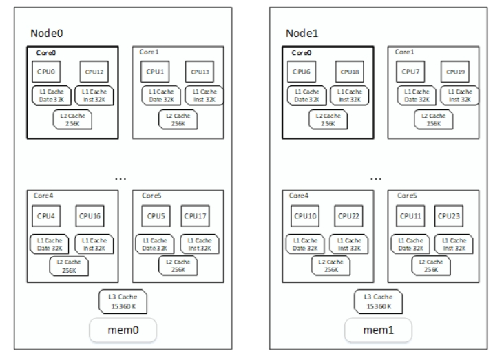

下面是ghost中的相关概念解释和其之间联系


前置介绍

+ ghOSt定制概念：Topology Message Channel StatusWord StatusWordTable Task GhostThread RunRequest Agent Enclave Scheduler ghOSt内核接口层以及
  其二级标题，下面的都是对这些定制概念的解释

+ ghOSt用户态框架：ghOSt分为ghOSt用户态框架和其基于的ghOSt定制版linux内核，下文除非明确提及，这里我们只介绍用户态框架，所以ghOSt一词除特殊说明，否则
                  表示其用户态框架

+ 介绍格式：

	- 在标题层级上面，首先是上面ghOSt定制概念，然后下面的子标题，则是其细化的概念，如Agent和其下面的Agent和FullAgent，就是ghOSt定制概念和其细化概念

	- 在下面对定制概念的解释中，除了Topology，其他都有统一格式：

		* 介绍：详细介绍此ghOSt定制概念的含义和作用等

		* 类定义：列出其在ghOSt中类的相关字段以及其介绍，这些字段可能将会在本次介绍中使用到，注意这些字段的名称

		* 初始化以及工作流程：介绍此ghOSt定制概念的初始化流程，和其工作流程

		* 与其他ghOSt定制概念的联系：如题

+ ghOSt内核接口层：ghOSt内核之前提供了一系列的系统调用，但是最近将其改为使用ioctl（类似于kvm），下面我们将使用ghOSt内核接口指代ioctl

+ ghOSt共享内存：在ghOSt中一共有三种类型的内核用户共享内存：

	- 1号共享内存：enclave的ghost_cpu_data，存放RunRequest中的ghost_txn。共享内存对应文件：/sys/fs/ghost/enclave_$id/cpu_data

	- 2号共享内存：StatusWordTable，存放StatusWord。共享内存对应文件：/sys/fs/ghost/enclave_$id/sw_regions/sw_$swid

	- 3号共享内存：Channel消息队列，存放message消息。


## Topology

topology代表了一台计算机的cpu拓扑架构，包括物理cpu，逻辑cpu，socket，L1 L2 L3 cache，NUMA节点等之间的关系



#### 相关背景知识

##### CPU（中央处理器）

`CPU`是计算机系统中的主要组件之一，用于执行程序的指令和进行数据处理。`CPU`是一种微处理器，它负责解释和执行计算机程序中的指令，并协调和控制
系统中的其他硬件和设备。一般而言，`CPU`的概念在软件层面上，代表`逻辑CPU`的概念

##### 超线程（HT）

`超线程`技术是在单个核心处理单元中集成两个逻辑处理单元，也就是一个`CPU核`（共享的运算单元），两个`逻辑CPU`（有各自独立的处理器状态），在一颗`CPU核`同
时执行多个程序而共同分享一颗`CPU核`内的资源，对于寄存器，每一个超线程是独有的，而其余部分如ALU（整数运算单元）、FPU（浮点运算单元）、L2 Cache（二级缓
存）则保持不变，这些部分是被分享的。
虽然采用`超线程`技术能同时执行两个线程，但它并不象两个真正的CPU那样，每各CPU都具有独立的资源。当两个线程都同时需要某一个资源时，其中一个要暂时停止，并
让出资源，直到这些资源闲置后才能继续。因此`超线程`的性能并不等于两颗CPU的性能。

##### L1 L2 L3 cache

`cache（缓存）`是为了提高`CPU`访存而增加的.
+ 一般而言一个超线程有自己的L1 cache，`L1 cache`分为数据缓存和指令缓存。
+ 一般同一个`CPU核`中的`超线程`共享`L2 cache`
+ 一般同一个`物理CPU中`的`核`共享`L3 cache`

##### sibling

对于那些共享`L2 cache`的同一个`CPU核`下的`逻辑CPU`，被称为`sibling`。每个`处理器核心`可以被认为是具有多个`siblings`的实体。这些`siblings`是通过`超
线程`技术创建的`逻辑CPU`

##### L3 sibling

`L3 sibling`是指共享同一级别三级缓存`L3 Cache`的`逻辑CPU`

##### socket

插槽

##### SMP

`SMP（Symmetric Multiprocessing，对称多处理）`是一种计算机体系结构，用于构建多处理器系统。在`SMP`架构中，多个`物理CPU`共享同一总线、交叉点或其他互
连结构，以及系统内存和其他共享资源。与之相对的是`NUMA`

##### NUMA

`NUMA（非一致性存储访问）`是一种计算机体系结构设计，是为了解决多处理器系统中的内存访问性能问题而设计的。在传统的`对称多处理（SMP）`系统中，所有处理器
共享同一总线或交叉点连接的内存，内存访问的延迟是均匀且一致的。

然而，随着处理器数量的增加和系统规模的扩展，共享内存结构会导致性能瓶颈。当多个处理器同时访问共享内存时，总线或交叉点的带宽可能成为瓶颈，并且内存访问延
迟会增加。这种情况下，多处理器系统的性能无法线性扩展。在`NUMA`架构中，物理内存被划分为多个区域，每个区域与特定的处理器或处理器组相关联。

在`NUMA`架构中，每个处理器都有本地内存（Local Memory）和远程内存（Remote Memory）。本地内存指的是与处理器直接关联的内存区域，而远程内存是与其他处理
器关联的内存区域。

分布式内存：`NUMA`系统将物理内存分布在多个节点上，每个节点包含处理器和本地内存。每个节点都可以独立访问本地内存，但对于远程内存的访问会产生额外的延迟。
非一致性访问：不同节点上的处理器访问本地内存的延迟较低，而访问远程内存的延迟较高。这是因为远程内存需要通过节点间的连接进行访问。

内存映射：操作系统负责将进程的内存映射到适当的`NUMA`节点。这样，进程可以尽可能地访问本地内存，以减少远程内存访问的开销。


#### ghOSt中代码体现

以下名词仍然接上面背景知识，但是以下的概念将和ghOSt框架联系较大

##### 物理CPU（chip）

+ 基本概念：`物理CPU`就是插在主机上的真实的 CPU 硬件，也是现代计算机体系结构中的`CPU`。
+ 数量关系：`物理CPU`包含一个或多个`CPU核`。
+ 内存资源：同一个物理CPU上共享一个`L3 cache`

ps：每一个`socket`上插上一个`物理CPU`，在软件层面中可以使用`socket`指代一块`物理CPU`

##### CPU核（核心）

+ 基本概念：`CPU核`是指处理器中独立执行指令和处理数据的单元。它是一个完整的处理器，具有自己的执行单元、控制逻辑、缓存和其他必要的资源。
+ 数量关系：若不支持超线程，则一个`CPU核`只有一个`逻辑CPU`，否则，则会有2个或者更多`逻辑CPU`
+ 内存资源：一般同一个`CPU核`一般共享L2 cache，取决不同硬件实现

##### 逻辑CPU

+ 基本概念：操作系统视角的CPU，是一个上下文执行实体，多个`逻辑CPU`可以实现并行
+ 内存资源：一般同一个`逻辑CPU`有自己的tlb，地址空间（页表）和L1 cache，取决不同硬件实现

ps：下面除明确指定，否则`CPU`就是`逻辑CPU`

##### NUMA node

+ 基本概念：`NUMA`系统由多个`NUMA node`组成，每个节点包含至少一个`物理CPU`和本地内存。每个节点可以具有不同的处理能力和内存容量
+ 数量关系：一般NUMA node至少有一个物理CPU
+ 内存资源：每个NUMA node有自己的本地内存

通过上面的背景知识介绍，可以明白，ghOSt中的`Topology`，所指代的就是`逻辑CPU`（下称作CPU）之间`L1 L2 L3 cache`和`NUMA node`的关系，为方便用户态
更科学的做出调度


## Task与GhostThread

#### 介绍

Task：任务，被agent调度的线程，里面包含两类信息

基本信息：
Gtid（ghOSt thread ID），StatusWord（和内核共享的一块内存，用于实时更新Task相关信息），Seqnum

调度算法相关信息：
对于每一个调度算法的Task，其中应该存储和调度算法相关的信息，如对于edf（最短截止时间优先），task中应该存储ddl，对于cfs（完全公平调度算法），
task中应该存储nice值等信息

GhostThread：对std::thread的封装，被ghost调度的线程，创建一个GhostThread后在ghOSt实例处会创建一个对应的task

#### 类定义

```
class Task {
  Gtid gtid; // ghost线程id
  StatusWordType status_word; // 对应的sw
  Seqnum seqnum; //seq
}

class GhostThread {
  int tid_; //线程id
  Gtid gtid_; //ghost线程id（google线程id）
  KernelScheduler ksched_; //调度类：ghost或cfs
  Notification started_; //线程一运行，将会通知此条件变量
  std::thread thread_; // 线程
}
```

#### 初始化及工作流程

初始化流程：

每一个调度类被设为SCHED_GHOST的线程，都将被ghOSt调度，下面讲述一个线程被创建后设置调度类为ghOSt后，到其ghOSt实例侧的task被创建的历程

+ GhostThread构造函数中：

+ 调用SetGlobalEnclaveFdsOnce()获取全局dir_fd和ctl_fd，若没有，则找到一个活跃的enclave，设置之

+ 创建线程，执行相关字段的设置

+ 通知条件变量线程开始运行

+ 调用ghOSt内核接口SchedTaskEnterGhost进入ghOSt调度

	- 获取全局dir_fd

	- 写入自己gtid进入 /sys/fs/ghost/enclave_$id/task中

+ 执行线程体函数

至此，ghost线程被创建，与此同时内核将会生成一条MSG_TASK_NEW的消息，传入到该线程要被运行的cpu的channel上

+ agent消费MSG_TASK_NEW，调用函数TaskNew，该函数一般随不同调度算法不同而不同，核心流程都是新建task并且加入调度队列

#### 与其他ghOSt概念的联系

TODO


## RunRequest

#### 介绍

承载着信息：将某线程运行到某cpu上的请求事务，其中的ghost_txn是1号共享内存存储的实例

#### 类定义

```
class RunRequest {
  Enclave* enclave_; //所处的enclave
  Cpu cpu_; //对应的cpu
  ghost_txn* txn_; //对应的事务
  bool allow_txn_target_on_cpu_;
};

struct ghost_txn {
	int32_t version;
	int32_t cpu;		/* readonly-after-init */
	_ghost_txn_state_t state;
	uint32_t agent_barrier;
	uint32_t task_barrier;
	uint16_t run_flags;
	uint8_t commit_flags;
	uint8_t unused;
	int64_t gtid;
	int64_t commit_time;	/* the time that the txn commit succeeded/failed */
	uint64_t cpu_seqnum;
	/*
	 * Context-dependent fields.
	 */
	union {
		/* only used during a sync-group commit */
		_ghost_txn_owner_t sync_group_owner;
	} u;
};
```

#### 初始化及工作流程

初始化流程：

在enclave初始化中：

+ 读取 /sys/fs/ghost/enclave_$id/cpu_data，获取cpu data region，这就是enclave的的data_region_和内核共享的内存

+ 调用mmap建立此共享内存

+ 初始化encalve下所有cpu对应的runrequest，将其联系到data_region_共享内存


工作流程：

TODO

#### 与其他ghOSt概念的联系

TODO


## StatusWordTable


#### 介绍

2号共享内存，存储statusword（简称sw）

#### 类定义

```
class StatusWordTable {
  int fd_; // 该共享内存文件描述符
  size_t map_size_; // 共享内存大小
  ghost_sw_region_header* header_; //相关信息
  ghost_status_word* table_; //存储sw的table
};

struct ghost_sw_region_header {
	uint32_t version;	
	uint32_t id;		
	uint32_t numa_node;
	uint32_t start;		
	uint32_t capacity;
	uint32_t available;	
}
```

#### 初始化以及工作流程

初始化：

在enclave初始化中：

+ 打开 /sys/fs/ghost/enclave_$id/sw_regions/sw_$swid，获取swtable共享内存区域

+ 调用 mmap建立起此共享内存

+ 设置ghOSt实例的全局的gbl_sw_table_

#### 与其他ghOSt概念的联系

TODO


## StatusWord

#### 介绍

存储在2号共享内存中的实例，sw是存储和线程（task agent）相关的信息。方便内核实时修改线程相关信息

#### 类定义

```
class StatusWord {
  Gtid owner_;  // 所属的agent或task的gtid
  ghost_sw_info sw_info_; // sw的坐标
  ghost_status_word* sw_; // sw实体
};

struct ghost_sw_info {
	uint32_t id; //status_word region id
	uint32_t index;	// 下标
};

struct ghost_status_word {
	uint32_t barrier;
	uint32_t flags;
	uint64_t gtid;
	int64_t switch_time; // 上一次切换上cpu的时间
	uint64_t runtime; // 总运行时间ns
} 
```

#### 初始化以及工作流程

初始化流程：

agent：调用ghOSt内核接口GetStatusWordInfo，内核创建指定agent的sw，并且返回其ghost_sw_info

task：创建ghOSt线程的时候，内核创建对应task的sw，传回用户态

工作流程：

TODO

#### 与其他ghOSt概念的联系

TODO


## Channel

#### 介绍

3号共享内存，即存储消息的消息队列，实质上是一块和内核的共享内存，是一块环形队列ring（linux内核广泛使用的用户态共享内存形式，如iouring也是使用ring）

#### 类定义

```

class Channel {
	int elems_, node_, fd_;
  	size_t map_size_; 
  	ghost_queue_header* header_; //存放消息队列
}
struct ghost_queue_header {
	uint32_t version; //版本
	uint32_t start; //从header到ring开始的偏移量
	uint32_t nelems; //ring的大小（2整数次幂）
} 

struct ghost_ring {
	_ghost_ring_index_t head; // 内核从head & (nelems-1)生产消息
	_ghost_ring_index_t tail; // 用户态agent从tail & (nelems-1)消费消息
	_ghost_ring_index_t overflow; // 当内核检测到环形队列满，无法生产消息的时候，将其+1，初始值为0
	struct ghost_msg msgs[0];  // 环形队列体，大小是上面的nelems
};
```

#### 初始化及工作流程

初始化：

+ 调用ghOSt内核接口CreateQueue创建消息队列

+ 用户调用mmap建立与内核共享内存

工作流程：

+ 读取消息（使用内存屏障）

+ 将其从队列中删除（使用内存屏障）

#### 与其他ghOSt概念的联系

对于per-cpu模型，每一个agent对应一个channel；而对于centralized模型，全局agent负责去消费唯一的channel

TODO


## Message

#### 介绍

存储在3号共享内存中的实例，消息存储在消息队列里，是内核传递给用户态agent的信息，反应着线程调度的情况和cpu相关情况

消息类型：

往往随着调度算法的改变，这些消息的相关处理函数也会被选择性地重写

task相关消息：对于这类消息，往往会因为基于不同的调度算法而不同

+ MSG_TASK_DEAD：void TaskDead(TaskType* task, const Message& msg)

+ MSG_TASK_BLOCKED：void TaskBlocked(TaskType* task, const Message& msg)

+ MSG_TASK_WAKEUP：void TaskRunnable(TaskType* task, const Message& msg)

+ MSG_TASK_NEW：void TaskNew(TaskType* task, const Message& msg)

+ MSG_TASK_PREEMPT：void TaskPreempted(TaskType* task, const Message& msg)

+ MSG_TASK_YIELD：void TaskYield(TaskType* task, const Message& msg)

+ MSG_TASK_DEPARTED：void TaskDeparted(TaskType* task, const Message& msg)

+ MSG_TASK_SWITCHTO：void TaskSwitchto(TaskType* task, const Message& msg)

+ MSG_TASK_AFFINITY_CHANGED：void TaskAffinityChanged(TaskType* task, const Message& msg)

+ MSG_TASK_ON_CPU：void TaskOnCpu(TaskType* task, const Message& msg)

+ MSG_TASK_PRIORITY_CHANGED：void TaskPriorityChanged(TaskType* task, const Message& msg)

+ MSG_TASK_LATCH_FAILURE：

cpu相关信息，这类消息和cpu相关，不同的调度算法同样可以选择性地重写

+ MSG_CPU_TICK：void CpuTick(const Message& msg)

+ MSG_CPU_TIMER_EXPIRED：void CpuTimerExpired(const Message& msg)

+ MSG_CPU_NOT_IDLE：void CpuNotIdle(const Message& msg)

+ MSG_CPU_AVAILABLE：void CpuAvailable(const Message& msg)

+ MSG_CPU_BUSY：void CpuBusy(const Message& msg)

+ MSG_CPU_AGENT_BLOCKED：void AgentBlocked(const Message& msg)

+ MSG_CPU_AGENT_WAKEUP：void AgentWakeup(const Message& msg)

在每个agent做调度之前，它们都会通过以上回调函数处理完所有的消息，以便做出正确的决策

#### 类定义

```
class Message {
	const ghost_msg* msg_; // 存放的消息
}
struct ghost_msg {
	uint16_t type; // 消息类型
	uint16_t length; // 该消息长度
	uint32_t seqnum; // 消息的seq
	uint32_t payload[0]; // 变长消息体，根据不同消息类型进行转化
};
```

#### 初始化及工作流程

初始化：

由ghost内核生成，通过channel传递到用户态，等待用户态处理

#### 与其他ghOSt概念的联系

TODO


## Agent

#### 介绍

对于每一个CPU，都有一个管理的agent与之对应，该agent负责通过RunRequest，也就是和内核共享内存将自己本次决定的task调度到cpu上

在per-cpu模型中，每一个agent都是处于活跃的状态，而对于centralized模型，只有某个cpu对应的agent被选为全局agent，其他agent将处于沉睡状态，不参与调度直
到它们自己被选为全局agent，此时全局agent负责所有cpu的调度

在每一个agent上，都能在自己负责的cpu上运行自己的调度策略，具备很高的灵活性

对于单个agent，首先通过statusword读取内核传递过来的信息，再通过channel读取内核传递过来的message，通过对二者的处理，再读取要被调度的队列，

进行调度的时候

#### 类定义

class Agent {
  Enclave* enclave_; // 该agent所处于的enclave
  Gtid gtid_; // 该agent线程的gtid
  Cpu cpu_; // 该agent所负责调度的cpu
  Notification ready_, finished_, enclave_ready_, do_exit_; // 相关条件变量，用于和主线程通信
  std::thread thread_; // agent线程
  StatusWord status_word_; // agent的sw
}

#### 初始化以及工作流程

初始化流程：

+ 在StartAgentTasks()函数中，对当前enclave的所有cpu，都新建一个agent

+ 之后，执行agent的线程体，也就是ThreadBody()函数

	- 对于ThreadBody()函数：

	- 若该agent对应的scheduler存在，则通过其获取该agent对应的消息队列channel

	- 等待当前enclave上所有老agent的退出

	- 通过内核接口SchedAgentEnterGhost将本cpu迁移到其管理的cpu之上（很好理解，一开始agent线程被创建，它不一定运行在它管理的cpu上）

	- 通过内核接口GetStatusWordInfo获取其statusword

	- 在enclave中记录当前agent和其cpu的一一对应（CpuRep）

	- 调用AgentThread()方法，该方法由各个调度算法实现，体现该调度算法的思想，也就是下面的工作流程

	- 调度结束，等待退出


工作流程：

+ 对于所有的调度（不论是啥调度算法），它们的工作流程一般是：

+ 只要agent线程没有被主线程告知退出，或者其负责调度的cpu队列不为空，它就处于如下循环

	- 调用当前scheduler的Schedule()函数：

	- 消费掉其消息队列的所有消息

	- 运行特定调度算法选出对于的task

	- 使用runrequest将其调度到当前cpu

+ 退出


#### 与其他ghOSt概念的联系

TODO


## Enclave

#### 介绍

Enclave在ghOSt中，有隔离环境的意思，每一个Enclave就是一块被隔离的区域，包含这块Enclave所掌控的CPU集合。

Enclave包含了一个CPU集合，在ghOSt中，一个主机上的所有CPU可以被分为若干Enclave，每个Enclave上至少有一个CPU。

在每一个Enclave上，可以运行不同的ghOSt调度模型，如，在一个SMP架构上，一共有四核8线程，CPU0-2被分为Enclave1，CPU3-7被分为Enclave2，

在两块Enclave上，Enclave1运行percpu调度模型，三个CPU均运行FIFO调度算法，Enclave1则运行centralized模型，5个CPU均运行EDF调度算法。


在代码中，enclave将会包含运行在它上面的scheduler，agent和topology

同时，enclave还肩负着agent和ghOSt内核之间交流通信的责任，它将会提供一系列封装内核接口，供上面的agent调用

特殊关系：enclave之余它上面被调度的线程，犹如目录之于文件

那么，介绍完enclave的概念之后，我来介绍下ghOSt中，enclave的初始化

enclave的初始化是FullAgent，也就是agent集合的初始化的前提

#### 类定义

```
class Enclave {
  std::list<Scheduler*> schedulers_;
  std::list<Agent*> agents_;
  CpuRep cpus_[MAX_CPUS];
  ghost_cpu_data* data_region_;
  size_t data_region_size_;
  int dir_fd_ = -1;
  int ctl_fd_ = -1;
  int agent_online_fd_ = -1;
}
```

#### 初始化及工作流程

初始化流程：


+ 首先设置本enclave所管理的cpu拓扑和cpu位图

+ 根据传入的dir_fd来进行判断，若传入-1则自己新建，然后再将enclave attach上，否则表示将attach到已有的enclave上

	- 这里以新建然后attach步骤为例：

	- 首先新建encalve的ctl_fd，也就是控制fd

		* 打开 /sys/fs/ghost/ctl，这是全局控制中心，所有的ghOSt相关命令，将会写入这个控制中心，需要按一定格式写入，然后内核将会处理写入的命令

		* 向控制中心写入命令：StrCat("create ", id, " ", GHOST_VERSION)，id是独一无二的enclave_id，从1开始，若重复则加一后重试

		* 之后打开 /sys/fs/ghost/enclave_$id/ctl，这是独属于某个enclave的控制中心，获取到控制fd

	- 然后新建enclave的dir_fd，也就是目录fd（参考上面的特殊关系）

		* 通过读取enclave局部控制中心的特定偏移量，读取出上面的enclave_id，之后打开/sys/fs/ghost/enclave_/$id，这个就是目录fd

	- 进行common_init，这里我需要说下，一般而言一个ghOSt实例只能有一个enclave，要运行多个enclave，则需要运行多个ghOSt实例并且合理分配cpu

		* 首先设置ghOSt用户态实例的ctl_fd和dir_fd，和上面一样

		* 读取 /sys/fs/ghost/enclave_$id/abi_version，获取ghOSt版本，校验版本符合要求

		* 读取 /sys/fs/ghost/enclave_$id/cpu_data，获取cpu data region，这就是上面的data_region_和内核共享的内存，调用mmap建立此共享内存

		* 新建ghOSt用户态实例的statuwordtable

			+ 打开 /sys/fs/ghost/enclave_/$id/ctl 局部控制中心

			+ 写入命令：StrCat("create sw_region ", id, " ", numa_node)

			+ 打开 /sys/fs/ghost/enclave_$id/sw_regions/sw_$swid，获取swtable共享内存区域

			+ 调用 mmap建立起此共享内存

	- 打开 /sys/fs/ghost/enclave_$id/cpumask，获取本encalve cpu位图文件，一开始是空值，然后向里面写入本enclave的cpu位图，
	  当其修改后可以写入去告诉内核更新cpu位图，但是需要慎重分配cpu

+ 为enclave写每个cpu初始化自己的cpu reps，也就是对cpu对应的run_request和agent的初始化，其中对于run_request，就是将其联系到data_region_共享内存

+ 如果tick_config_参数是CpuTickConfig::kAllTicks，调用SetDeliverTicks方法设置

+ 调用agent_bpf_init初始化agent的bpf

#### 与其他ghOSt概念的联系

TODO


## Scheduler

#### 介绍

Scheduler，调度类，被需要实现的调度算法所继承，体现了该调度算法的核心思想

TODO

#### 类定义

```
class Scheduler {
  Enclave* const enclave_;
  CpuList cpus_;
  std::shared_ptr<TaskAllocator<TaskType>> const allocator_;
}
```

#### 初始化及工作流程

初始化流程：

+ 将本scheduler关联到传入的enclave

+ 设置相关字段

+ 和调度算法实现相关，一般流程是新建并且关联channel，以及其他相关初始化操作


#### 与其他ghOSt概念的联系

TODO


## ghOSt内核接口层

#### 介绍

##### 内核ioctl封装接口

在ghOSt初期内核版本，是提供了一系列的系统调用，后面改成统一使用iotcl系统调用去操控（类似于kvm）。下面是其部分封装的相关接口

+ Run() 提供给上层的encalve调用，两种情况

	- LocalYieldRunRequest：对于percpu模型，当agent没有线程调度时调用此函数；对于centralized模型，则是供全局agent去掌管所有cpu

	- PingRunRequest：提示对应的agent有事件发生：例如task迁移

+ SyncCommit() 提供给上层encalve::SubmitSyncRequests()调用，sync模式提交指定的cpu集群的事务

+ Commit() 提供给上层encalve::SubmitRunRequests()调用，提交指定的cpu集群的事务

+ CreateQueue() 提供给channel的构造函数调用，创建消息队列

+ GetStatusWordInfo()：提供给StatusWord的构造函数调用，创建返回agent的sw


##### ghOSt文件系统：

上面提及到了许许多多的路径，它们有一个共同的前缀：/sys/fs/ghost。对于这个目录，它是ghOSt文件系统，存储所有和ghOSt相关的东西

下面是这个文件系统的概览和介绍

```
/sys/fs/ghost/
├── ctl
├── enclave_1
│   ├── abi_version
│   ├── agent_online
│   ├── commit_at_tick
│   ├── cpu_data
│   ├── cpulist
│   ├── cpumask
│   ├── ctl
│   ├── deliver_agent_runnability
│   ├── deliver_cpu_availability
│   ├── deliver_ticks
│   ├── live_dangerously
│   ├── runnable_timeout
│   ├── status
│   ├── switchto_disabled
│   ├── sw_regions
│   │   └── sw_0
│   ├── tasks
│   └── wake_on_waker_cpu
└── version
```

#### 类定义

```
class Ghost {
  static constexpr char kGhostfsMount[] = "/sys/fs/ghost"; //ghOSt文件系统目录
  int gbl_ctl_fd_; // 全局控制fd，对应着 /sys/fs/ghost/ctl
  int gbl_dir_fd_; // 全局目录fd，对应着 /sys/fs/ghost/enclave_/$id
  StatusWordTable* gbl_sw_table_; //全局sw table
}
```

#### 初始化及工作流程

初始化流程：

在enclave初始化中，将会帮ghOSt内核接口层相关变量初始化，若fd没有设置，则会在ghOSt线程被创建的时候设置

工作流程：

封装iotcl接口，供上层调用

#### 与其他ghOSt概念的联系

TODO


