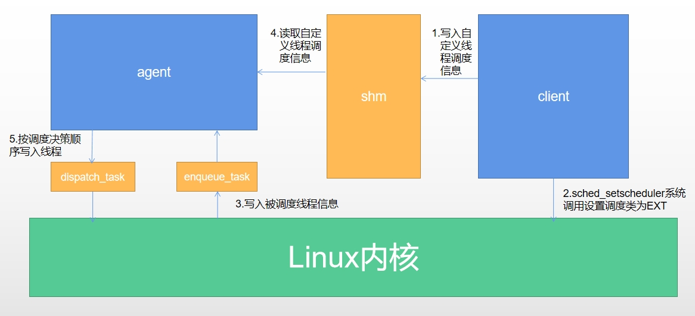
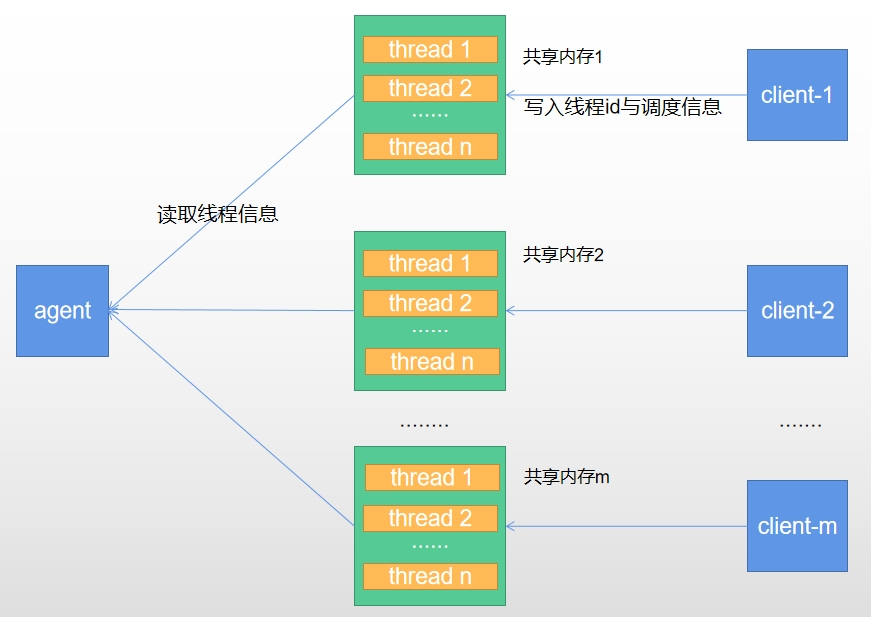
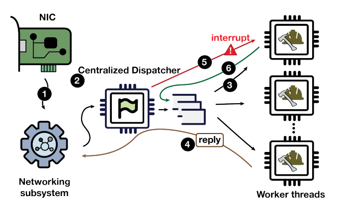
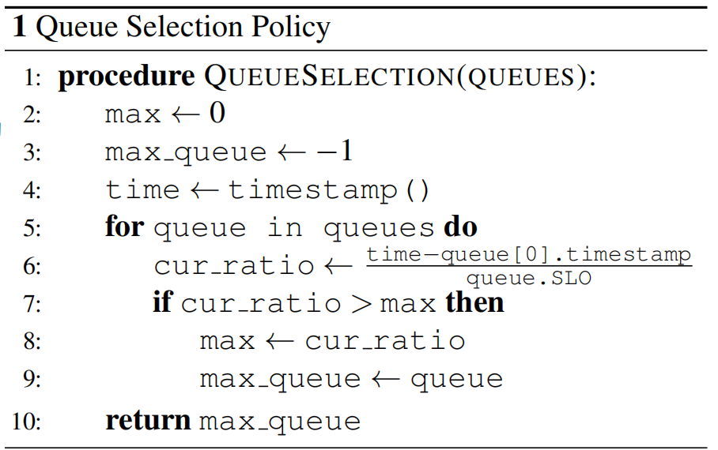

# 4.EXT

## 4.1 EXT调度类

EXT（extendible scheduler class）是google开发的一个基于ebpf实现用户态自定义调度的linux内核补丁。

具体而言，是在linux内核新增了一个调度类SCHD_EXT，和CFS调度类（SCHED_NORMAL）类似的一个linux调度类，该调度类定义了一系列的ebpf事件，旨在让用户在用户态自定义ebpf钩子函数，内核的EXT调度类在每一轮调度的时候都会触发这些事件（4.2），调用这些钩子函数达到用户态实现调度算法的目的。


### 4.1.1 背景

毫无疑问，有人会尝试将BPF引入内核的CPU调度器，这只是时间问题。在1月底，Tejun Heo与David Vernet、Josh Don和Barret Rhoden合作发布了30个补丁系列的第二版，旨在实现这一目标。将调度决策延迟到BPF程序中可能会有一些有趣的事情，但要让整个开发社区接受这个想法可能需要一些工作。

BPF的核心思想是允许程序在运行时从用户空间加载到内核中；使用BPF进行调度具有潜力使得调度行为与目前在Linux系统中看到的有很大不同。“可插拔”的调度器概念并不是新鲜的；例如，在2004年的一次讨论中，Con Kolivas提出了一系列注定失败的补丁，其中涉及到可插拔的调度器。当时，这个可插拔调度器的想法受到了强烈的反对；因为只有将精力集中在单个调度器上，开发社区才能找到一种方式，满足所有工作负载，而不会将内核填满各种特殊目的的调度器的混乱。

当然，内核只有一个CPU调度器的想法并不完全准确；实际上，还有几个调度器可供应用程序选择，包括实时调度器和截止时间调度器。但是，在Linux系统上几乎所有的工作都在默认的“完全公平调度器”下运行，它确实在各种从嵌入式系统到超级计算机的工作负载管理方面都做得很好。人们总是渴望更好的性能，但多年来几乎没有要求提供可插拔调度器机制的请求。

那么，为什么现在提出BPF机制呢？为了避免长时间的讨论，这个补丁系列的说明信详细描述了这项工作的动机。简而言之，这个论点是，使用BPF编写调度策略极大地降低了尝试新的调度方法的难度。自完全公平调度器问世以来，我们的工作负载和运行它们的系统变得更加复杂；需要进行实验来开发适合当前系统的调度算法。BPF调度类可以以安全的方式进行实验，甚至无需重新启动测试机器。使用BPF编写的调度器还可以提高针对某些特定工作负载的性能，这些工作负载可能不值得在主线内核中支持，并且部署到大型系统集群中也更加容易。

### 4.1.2 EXT调度类简介

这个补丁集添加了一个名为SCHED_EXT的新调度类，可以通过类似于大多数其他调用sched_setscheduler()的调用来选择它（选择SCHED_DEADLINE有点更加复杂）。它是一个非特权调度类类，这意味着任何进程都可以将自己置于SCHED_EXT中。SCHED_EXT的优先级高于空闲调度类（SCHED_IDLE）而低于完全公平调度类（SCHED_NORMAL）。因此，SCHED_EXT调度器不能阻止CFS调度器的正常运行。

BPF编写的调度程序对整个系统是全局的；没有为不同的进程组加载自己的调度程序的规定。如果没有加载BPF调度程序，则放置在SCHED_EXT类中的任何进程将像在SCHED_NORMAL中一样运行。然而，一旦加载了BPF调度程序，它将接管所有SCHED_EXT任务的责任。还有一个神奇的函数，BPF调度程序可以调用（scx_bpf_switch_all()），它将所有运行在实时优先级调度类（包括CFS）以下的进程移动到SCHED_EXT中。

实现调度程序的BPF程序通常会管理一组调度队列，每个队列都可能包含等待在CPU上执行的可运行任务。默认情况下，系统中每个CPU都有一个调度队列和一个全局队列。当CPU准备好运行新任务时，调度程序将从相应的调度队列中取出一个任务并将其分配给CPU。调度程序的BPF部分大多实现为一组通过操作结构调用的回调函数，每个回调函数通知BPF代码需要进行的事件或决策。该列表很长，完整的列表可以在SCHED_EXT存储库分支的include/sched/ext.h中找到。该列表包括：


### 4.1.3 调度类切换

只有在加载和运行BPF调度器时才会使用sched_ext。

如果任务将其调度策略明确设置为SCHED_EXT，那么在加载BPF调度器之前，它将被视为SCHED_NORMAL，并由CFS调度。加载后，这些任务将切换并由sched_ext进行调度。

BPF调度器可以通过在其init()操作中调用scx_bpf_switch_all()来选择调度所有普通和较低级别的任务。在这种情况下，所有SCHED_NORMAL、SCHED_BATCH、SCHED_IDLE和SCHED_EXT任务都由sched_ext进行调度。在示例调度器中，可以使用-a选项选择此模式。

终止sched_ext调度程序、触发SysRq-S或检测到任何内部错误（包括停滞的可运行任务）都会中止BPF调度器，并将所有任务恢复回CFS。


### 4.1.4 线程调度流程

为了匹配调度器核心和BPF调度器之间的阻抗，sched_ext使用DSQ（Dispatch Queues）作为调度队列，可以同时作为FIFO和优先级队列进行操作。默认情况下，有一个全局FIFO队列（SCX_DSQ_GLOBAL）和每个CPU一个本地DSQ（SCX_DSQ_LOCAL）。BPF调度器可以使用scx_bpf_create_dsq()和scx_bpf_destroy_dsq()来管理任意数量的DSQ。

CPU总是从其本地DSQ中执行任务。任务被"分派"到一个DSQ中。非本地DSQ被"消耗"以将任务传输到消费CPU的本地DSQ中。

当CPU正在寻找下一个要运行的任务时，如果本地DSQ不为空，则选择第一个任务。否则，CPU尝试消耗全局DSQ。如果这也没有产生可运行的任务，就会调用ops.dispatch()。


#### 线程侧

##### select_cpu

当任务唤醒时，首先调用操作。这个操作有两个目的。首先，它是CPU选择的优化提示（optimization hint）。其次，如果选择的CPU处于空闲状态，则唤醒该CPU

通过select_cpu选择的CPU是一个优化提示，而不是绑定。实际的决策是在调度的最后一步中进行的。然而，如果CPU ops.select_cpu()返回的CPU与任务最终运行的CPU匹配，将会有一定的性能提升。

scx_bpf_kick_cpu()辅助函数唤醒任何CPU，但是合理使用ops.select_cpu()可能更简单和更高效。

调度器核心将忽略无效的CPU选择，例如，如果它超出了任务允许的cpumask范围。

##### enqueue

一旦选择了目标CPU，就会调用enqueue()操作。它可以做出以下决定之一：

+ 通过使用SCX_DSQ_GLOBAL或SCX_DSQ_LOCAL参数调用scx_bpf_dispatch()将任务立即调度到全局或本地DSQ（dispatch queue）。

+ 通过使用小于2^63的DSQ ID参数调用scx_bpf_dispatch()将任务立即调度到自定义DSQ。

+ 将任务排队在BPF一侧。


#### cpu侧

##### dispatch

当一个CPU准备进行调度时，首先查看它的本地DSQ（dispatch queue）。如果为空，接着会查看全局DSQ。如果仍然没有要运行的任务，就会调用dispatch()函数，该函数可以使用以下两个函数来填充本地DSQ。

+ scx_bpf_dispatch()

+ scx_bpf_consume()

将任务调度到一个DSQ中。可以使用任何目标DSQ，例如SCX_DSQ_LOCAL、SCX_DSQ_LOCAL_ON | cpu、SCX_DSQ_GLOBAL或自定义DSQ。目前，scx_bpf_dispatch()无法在持有BPF锁的情况下调用，但正在进行相关工作并将得到支持。scx_bpf_dispatch()会安排任务的调度，而不是立即执行任务。可以有多达ops.dispatch_max_batch个待处理的任务。

将任务从指定的非本地DSQ转移到正在进行调度的DSQ。该函数不能在持有任何BPF锁的情况下调用。scx_bpf_consume()在尝试消费指定的DSQ之前会清空待处理的已调度任务。


##### dispatch返回

在dispatch()返回后，如果本地DSQ中有任务，CPU会运行第一个任务。如果本地DSQ为空，则按照以下步骤进行：

1.尝试消费全局DSQ。如果成功，运行任务

2.如果dispatch()已经调度了任何任务，则重试dispatch

3.如果前一个任务是一个SCX任务且仍然可运行，继续执行它（参见SCX_OPS_ENQ_LAST）。

4.进入空闲状态。

请注意，BPF调度器可以选择在ops.enqueue()中立即调度任务，就像上面的简单示例中所示。如果仅使用内置的DSQ（Dispatch Queues），则无需实现ops.dispatch()，因为任务从未排队到BPF调度器，本地和全局DSQ都会自动消耗。


### 4.1.5 ebpf事件

#### prep_enable()和enable()

当一个新的任务进入SCHED_EXT时，prep_enable()和enable()这两个回调函数将通知调度程序。prep_enable()可以用于为该任务设置任何相关数据，它可以阻塞并用于内存分配。enable()则无法阻塞，它实际上启用了新任务的调度。

```
s32 BPF_STRUCT_OPS(userland_prep_enable, struct task_struct *p, struct scx_enable_args *args)
{
	if (bpf_task_storage_get(&task_ctx_stor, p, 0,
				 BPF_LOCAL_STORAGE_GET_F_CREATE))
		return 0;
	else
		return -ENOMEM;
}
```

#### select_cpu()

回调函数用于为刚刚唤醒的任务选择一个CPU，并返回要将任务放置在的CPU编号。这个决策可以在任务实际运行之前重新审视，但它可能被调度程序用于唤醒选择的CPU（如果它当前处于空闲状态）。这个相当于预选cpu，为后续真正选cpu提供信息。

```
s32 BPF_STRUCT_OPS(userland_select_cpu, struct task_struct *p,
		   s32 prev_cpu, u64 wake_flags)
{
	if (keep_in_kernel(p)) {
		s32 cpu;
		struct task_ctx *tctx;

		tctx = bpf_task_storage_get(&task_ctx_stor, p, 0, 0);
		if (!tctx) {
			scx_bpf_error("Failed to look up task-local storage for %s", p->comm);
			return -ESRCH;
		}

		if (p->nr_cpus_allowed == 1 ||
		    scx_bpf_test_and_clear_cpu_idle(prev_cpu)) {
			tctx->force_local = true;
			return prev_cpu;
		}

		cpu = scx_bpf_pick_idle_cpu(p->cpus_ptr);
		if (cpu >= 0) {
			tctx->force_local = true;
			return cpu;
		}
	}

	return prev_cpu;
}

```


#### enqueue()

将一个任务加入调度程序以进行运行。通常，该回调将调用scx_bpf_dispatch()将任务放置到选择的调度队列中，该队列最终将在任务运行时为其提供时间片长度如果将片长指定为SCX_SLICE_INF，则在此任务运行时，CPU将关闭时钟中断。值得注意的是，enqueue()不必将任务放入任何调度队列；如果任务不应立即运行，可以将任务暂时放在某个地方。但内核会跟踪这些任务，以确保没有任务被遗忘；如果任务滞留时间过长（默认为30秒，但超时时间可以缩短），BPF调度程序最终被卸载。

```
void BPF_STRUCT_OPS(userland_enqueue, struct task_struct *p, u64 enq_flags)
{
	if (keep_in_kernel(p)) {
		u64 dsq_id = SCX_DSQ_GLOBAL;
		struct task_ctx *tctx;

		/*
		// Per-task scheduling context 
		struct task_ctx {
			bool force_local; /* Dispatch directly to local DSQ 
		};
		*/
		tctx = bpf_task_storage_get(&task_ctx_stor, p, 0, 0);
		if (!tctx) {
			scx_bpf_error("Failed to lookup task ctx for %s", p->comm);
			return;
		}

		if (tctx->force_local)
			dsq_id = SCX_DSQ_LOCAL;
		tctx->force_local = false;
		scx_bpf_dispatch(p, dsq_id, SCX_SLICE_DFL, enq_flags);
		__sync_fetch_and_add(&nr_kernel_enqueues, 1);
		return;
	} else if (!is_usersched_task(p)) {
		enqueue_task_in_user_space(p, enq_flags);
	}
}

```

​    

#### dispatch()

当一个CPU的调度队列为空时，调用回调函数将任务分派到该队列中以保持CPU忙碌。如果调度队列仍然为空，调度程序将尝试从全局队列中获取任务。

```
void BPF_STRUCT_OPS(userland_dispatch, s32 cpu, struct task_struct *prev)
{
	/*
	* Whether the user space scheduler needs to be scheduled due to a task being
	* enqueued in user space.
	*/
	if (usersched_needed)
		dispatch_user_scheduler();

	bpf_repeat(4096) {
		s32 pid;
		struct task_struct *p;

		if (bpf_map_pop_elem(&dispatched, &pid))
			break;

		/*
		 * The task could have exited by the time we get around to
		 * dispatching it. Treat this as a normal occurrence, and simply
		 * move onto the next iteration.
		 */
		p = bpf_task_from_pid(pid);
		if (!p)
			continue;

		scx_bpf_dispatch(p, SCX_DSQ_GLOBAL, SCX_SLICE_DFL, 0);
		bpf_task_release(p);
	}
}

```

#### update_idle()

回调函数将通知调度程序一个CPU何时进入或离开空闲状态。

#### runnable()、running()、stopping()和quiescent()

分别通知调度程序任务的状态更改。它们分别在任务变为可运行、在CPU上开始运行、从CPU上被取下或变为不可运行时调用。

#### cpu_acquire()和cpu_release()

回调函数通知调度程序系统中CPU的状态。当一个CPU对BPF调度程序可用时，回调函数cpu_acquire()将通知它这个事实。当一个CPU不可用时（例如，一个实时调度类可能已经使用它），将通过调用cpu_release()来通知它。


## 4.2 Client-Agent模型





### 4.2.1 线程用户态调度流程



+ 用户调用clone或者fork系统调用后创建初线程和进程后，该线程将会被默认的cfs调度器调度执行

+ 该线程调度类被设置为SCHD_EXT，将会触发enqueue事件，该线程的**task_struct**结构体被传到enqueuemap，被agent调度线程接收

+ agent根据enqueuemap中线程的task_struct信息，进行调度决策排序，然后按序传入dispatchmap

+ bpf的dispatch事件则将所有dispatchmap中的所有线程按序传入内核进行调度

上面进行调度决策所需要的信息，只能从内核结构体task_struct中获取，也就是说定死了，当我们需要自己设计一个调度算法，需要自定义相关的信息的时候，我们是根本无法传入的（除非修改内核task_struct)，那么我们怎么做到在不修改内核的情况下，将自定义调度信息传入到agent线程呢


### 4.2.2 自定义信息如何传递？

上面说到，自定义的信息在不修改内核的情况下，貌似是无法传递的，但是我们注意到，信息的流转最终是到agent线程处，由agent线程来做决定，那么，我们能不能跳过内核，将原来的信息流程从**需要被EXT调度的线程-->内核-->agent线程**改为**需要被EXT调度的线程-->agent线程**呢？可以！

但是这其中涉及到两个问题，首先是需要被EXT调度的线程和agent线程不在一个进程，二者之间如何通信？

在linux内核中，有如下几种进程间信息传递方案：

+ ipc共享内存

+ ipc消息队列

+ ipc信号量

+ 信号

+ 管道

+ 套接字

+ mmap共享内存


#### 高效

线程调度时延是关键性能之一，所以必须采取高效的手段去传递自定义调度信息，这里我们采用基于`共享内存`的`无锁哈希表`

+ 共享内存

理论上，上面除了信号量，其他都可以使用来进行信息传递，但是，线程调度很受时延影响，所以我们必须采取最高效的手段————共享内存

具体方案是这样，需要被EXT调度的线程将自己的线程id和相关信息写入共享内存，agent在调度的时候，通过线程id在共享内存中读取

+ 哈希表

将agent通过线程id在指定的共享内存中查找的时候，通过建立以线程id为key的哈希表，能够将查询事件复杂度从o（n）变为o（1）

+ 无锁化

通过对哈希表实现无锁插入和删除，大大降低并发查询和插入的时延

##### 实现

无锁哈希表的定义
```
template <typename THDINFO>
struct Entry {
  int32_t key;
  THDINFO value;
}; // 存储哈希表的kv对，k为线程id，v是泛型，为用户自定义调度信息

template <typename THDINFO>
class LFHashTable {
 private:
  void* shd_mem_; // 哈希表所在的共享内存指针
  int32_t key_info_;

 public:
  size_t capacity_;
  Entry<THDINFO>* table_; // 哈希表，位置为上面的共享内存

  LFHashTable() {}

  LFHashTable(void* shd_mem, size_t mem_size, int32_t key_info)
      : shd_mem_(shd_mem), key_info_(key_info) {
    capacity_ = mem_size / sizeof(Entry<THDINFO>);
    table_ = reinterpret_cast<Entry<THDINFO>*>(shd_mem);
  }
}
```

无锁哈希表的插入
```
bool Add(int32_t key, THDINFO value) { 
  assert(key != 0);
  for (int idx = hash(key);; idx = (idx + 1) % capacity_) {
    if (table_[idx].key == 0) {
      if (!__sync_bool_compare_and_swap(&table_[idx].key, 0, key)) {
        continue;
      }
    }
    if (table_[idx].key != key) {
      continue;
    }
    table_[idx].value = value;
    return true;
  }
}
```

无锁哈希表的读取
```
THDINFO Get(int32_t key) {
  assert(key != 0);
  for (int idx = hash(key);; idx = (idx + 1) % capacity_) {
    if (table_[idx].key == 0) {
      return {};
    }
    if (table_[idx].key != key) {
      continue;
    }
    return table_[idx].value;
  }
}
```


### 4.2.3 信息如何同步？

//TODO 图片

当一个线程需要被EXT调度的时候，它的自定义调度信息必须赶在agent调度它之前传递

如何在agent调度前完成传递自定义调度信息？回忆操作系统课相关知识：

条件变量？no。agent和需要被EXT调度的线程不在一个进程中，不能共享地址空间。无法使用条件变量！

ipc信号量？yes。ipc信号量是专门用于跨进程间线程同步

设计方案：

agent 在调度前先阻塞，直到被调度线程传递完调度信息后，再通过ipc信号量唤醒

#### 高效

太慢了，每一次都需要agent阻塞和被调度线程系统调用陷入内核去唤醒，有没有更高效的同步方案？

了解linux内核底层机制：调用sched_setscheduler系统调用将自己的调度类从cfs修改为ext之前，agent是不会收到调度该线程的信息的！

所以只需要在将调度类设置为EXT之前，将信息通过共享内存传递即可！！！


## 4.3 启动流程

> EXT下所有的调度算法共有一个框架—基于ebpf的bootstrap为主导的用户态框架。

接下来就详细地介绍bootstrap在用户态的运行。

### 4.3.1 bootstrap概述

在ext的框架下，有三个主要步骤：

1. bootstrap
2. sched_main_loop
3. destroy

为了统一叫法，这个流程被称为bootstrap大众化流程。

在这三个流程中，bootstrap主要负责main函数的传参以及bpf程序的搭建，是一个相对固定的流程；sched_main_loop主要负责具体task的调度，其中包括了具体调度算法的实现以及最终被调度的task的分发；destroy主要负责bpf程序的销毁，任务量最轻。

接下来将就这三个流程做详细说明。

### 4.3.2 bootstrap

> bootstrap(int argc, char ** argv)，作为main函数第一个调用的函数，接受argc和argv两个参数，起了初始化eBPF程序配置，处理参数和将eBPF程序打开并加载入内核使其发挥连接用户态和内核态的作用。

bootstrap的主体流程：  

1. 初始化eBPF程序配置
2. 处理参数
3. 打开并加载eBPF程序


#### 初始化eBPF程序配置

在`bootstrap()`函数的开始，可能会初始化eBPF程序的配置。

* 重要常量的赋值：

  ```cpp
  struct sched_param sched_param = {
  .sched_priority = sched_get_priority_max(SCHED_EXT),
  };
  bool switch_partial = false;
  ```

  sched_priority字段顾名思义，可以指定调度算法的优先级。而switch_partial是一个可选参数，在处理参数的环节中，如果输入的参数有 **-p** （不同调度算法参数可能不一致），其被赋值为true，并且当前调度类会接管当前用户态的所有任务的调度工作。

* 信号量的响应函数以及bpf严格模式的开启：

```cpp
signal(SIGINT, sigint_handler);
signal(SIGTERM, sigint_handler);
libbpf_set_strict_mode(LIBBPF_STRICT_ALL);
```

ext自定义了进程终止函数`sigint_handler`，这个函数将预先设置为0的变量exit_req的重新赋值为1，从而退出某些条件为 `!exit_req` 的循环。

bpf严格模式是一种安全机制，旨在增加对 BPF 程序的验证和限制，以提高安全性和防止滥用。通过开启严格模式，libbpf 库会强制执行一系列规则和限制，以确保 BPF 程序的安全性和正确性。

最后，将当前进程设置为新的调度器来作为启用ext框架的第一步：

`err = syscall(__NR_sched_setscheduler, getpid(), SCHED_EXT, &sched_param);`  

这一行代码调用了系统调用sched_setscheduler(getpidi(), SCHED_EXT, &schd_param)，告知内核当前进程需要使用SCHED_EXT调度类去调用，为接下来在用户态实现具体调度类做了铺垫。  

#### 处理参数

bootstrap接受main函数的两个参数：int argc, char ** argv。这是典型的处理参数的模型。

以cfs调度类处理参数的方法为例：

```cpp
while ((opt = getopt(argc, argv, "b:ph")) != -1) {
  switch (opt) {
    case 'b':
      batch_size = strtoul(optarg, NULL, 0);
      break;
    case 'p':
      switch_partial = true;
      break;
    default:
      fprintf(stderr, help_fmt, basename(argv[0]));
      exit(opt != 'h');
  }
}
```

1. 在while循环中不断接受参数
2. 使用getopt系统调用来获取参数，赋值到opt
3. 根据opt的值进入不同的case

从实现来看，ext框架下的调度类接受的参数为一个小写字母，而每个小写字母都有其独特的作用。  

#### 打开并加载eBPF程序

eBPF程序使得用户无需修改内核模块，可以直接将编写好的函数加载进入内核模块中，使得事件发生时内核调用的不是原来的函数而是用户在eBPF程序定义好的钩子函数。通过这种方式，用户态的调度类从内核获取需要被调度的任务，并且再拿到了内核任务之后复制一个几乎一模一样的副本，结合在用户态实现的数据结构和相关调度算法，将需要调度的任务按预想的逻辑进行排序，从而决策出下一次需要被运转到内核中执行的任务。  

在介绍如何打开并加载eBPF程序之前，先介绍相关背景知识。  


#### eBPF程序背景知识

- eBPF程序注入内核大体过程：eBPF 程序本身使用 C 语言编写的 “内核代码”，注入到内核之前需要用 LLVM 编译器编译得到 BPF 字节码，然后加载程序将字节码载入内核。当然，为了防止注入的 eBPF 程序导致内核崩溃，内核中有专门的验证器保证 eBPF 程序的安全性，如 eBPF程序 不能随意调用内核参数，只能受限于 BPF helpers 函数（BPF helpers函数来自于libbpf库，需要手动下载）；除此之外，eBPF 程序不能包含不能到达的逻辑，循环必须在有限时间内完成且次数有限制等等。  

  

参考：https://morven.life/posts/knowledge-about-ebpf/  

- bpf_map：常驻于内存，用户用户态与eBPF程序之间，以及eBPF程序之间和内核之间的通信，bpf_map是实现用户和内核通信的重要角色。bpf_map在eBPF程序中定义，需要声明其类型、条目限制数，值的类型，并且根据需要进行命名。在用户态需要打开bpf_map的文件描述符以获取对bpf_map的控制权，进而用户可以对bpf_map进行插入、查询、删除等操作。  
- struct_ops：在修改了内核，内核态里增加了用户定义好的结构体的情况下，struct_ops可以定义内核结构体里成员到eBPF程序编写好的函数的映射，在用户态里可以通过libbpf库里的相关api获取这一类结构体变量指针，并将结构体里的成员和在eBPF程序里编写好的函数进行一一映射，而这些结构体里的成员，实际上是对应了独立的内核事件，当事件被触发时，相应的eBPF钩子函数就会被调用。  


#### eBPF程序构建整体流程

在了解了eBPF程序背景知识后，再来看看在ext框架里eBPF程序是如何运行的。

整体流程可以分为四步：

1. 打开eBPF程序
2. bpf字节码加载进入内核
3. 获取bpf_map文件描述符
4. 将bpf钩子函数和内核事件绑定

接下来以cfs调度算法为例详细介绍这四个步骤。

- 打开eBPF程序：

  源代码：

  ```cpp
  skel = scx_cfs__open(); // scx_cfs是bpf程序名称
  
  // skel的定义如下：
  static struct scx_cfs *skel;
  ```

  skel(skeleton)，为eBPF程序的骨架，在eBPF开发中，使用骨架来加载、验证和管理eBPF程序。

  <aside>
  当scx_cfs.bpf.h程序被编译时，首先会生成程序骨架，骨架是一个用于加载、验证和管理eBPF程序的框架，它提供了与eBPF程序相关的各种功能和操作的接口。然后生成eBPF字节码，字节码可以在linux内核中执行。在生成eBPF字节码的过程中，会生成skel.h文件，这个文件包含了与eBPF程序骨架相关的定义和数据结构，可以在用户空间代码中使用，以与eBPF程序进行交互。


  </aside>

  skel成功生成后，可以通过其中的两个字段：bss和rodata来分别获取在eBPF程序中定义的变量和常量。这些变量和常量可以扮演用户态程序和内核通信之间的重要角色，比如，在cfs调度算法中，可以在eBPF程序中定义nice值变量，当触发任务入队的钩子函数时将该变量赋值，同时，在用户态也可以看到这个值的变化。还可以通过skel的maps字段来实现bpf_map在用户态的构造，来实现用户态和内核之间信息的传递。

- bpf字节码加载进入内核：

  源代码：

  ```cpp
  err = scx_cfs__load(skel);
  ```

  将骨架skel加载进入内核后，内核中即可以执行与该骨架相关联的eBPF程序。

- 打开bpf_map文件描述符：

  源代码：

  ```cpp
  // 包含了从内核中获取的需要被调度的任务
  enqueued_fd = bpf_map__fd(skel->maps.enqueued);
  // 包含了从用户态决定的需要传到内核中被调度的任务
  dispatched_fd = bpf_map__fd(skel->maps.dispatched);
  
  // enqueued-map的定义
  struct {
  __uint(type, BPF_MAP_TYPE_QUEUE);
  __uint(max_entries, USERLAND_MAX_TASKS);
  __type(value, struct scx_userland_enqueued_task);
  } enqueued SEC(".maps");
  
  // dispatched-map的定义
  struct {
  __uint(type, BPF_MAP_TYPE_QUEUE);
  __uint(max_entries, USERLAND_MAX_TASKS);
  __type(value, s32);
  } dispatched SEC(".maps");
  ```

  `skel->maps.enqueued`和`skel->maps.dispatched`都是在eBPF程序里定义的一种映射关系，前者是入队列，后者是出队列，分别负责任务从内核到用户态的入队和用户态到内核的出队。内核当中一旦有任务需要被调度，触发了相关的钩子函数之后，这些需要被调度的任务就会加入到enqueued_map中，用户态相应地会感知到新的需要被调度的出现，于是开始基于特定调度算法对任务进行调度。当用户态决策出哪些任务会被传回内核中被执行后，这些任务就会加入到dispatched_map中，由eBPF程序将这些任务传回内核。  

- 将bpf钩子函数和内核事件绑定：

  源代码：

  ```cpp
  ops_link = bpf_map__attach_struct_ops(skel->maps.userland_ops);
  
  // ops_link的定义
  static struct bpf_link *ops_link;
  
  // userland_ops的定义
  SEC(".struct_ops")
  struct sched_ext_ops userland_ops = {
      .select_cpu     = (void *)userland_select_cpu,
      .enqueue        = (void *)userland_enqueue,
      .dispatch       = (void *)userland_dispatch,
      .prep_enable    = (void *)userland_prep_enable,
      .init           = (void *)userland_init,
      .exit           = (void *)userland_exit,
      .timeout_ms     = 3000,
      .name           = "userland",
  };
  ```

  `skel->maps.userland_ops`是在eBPF程序定义的内核结构体schd_ext_ops的实现，sched_ext_ops是在内核中定义的有关ext调度类事件信息的结构体，其中的成员代表着一个调度事件或者一些参数的设置，例如`init`代表着调度类的初始化事件。在eBPF程序中，userland_ops并没有被直接指明为maps字段，而是被声明为结构体的操作字段，通过`bpf_map__attach_struct_ops`这个函数，可以将userland_ops作为一个映射并且使其和一个操作该映射的结构体绑定起来，并将关联后的结构体指针存储在ops_link中，便可以使用该结构体指针去执行map的各种操作，如查找、插入、更新和删除。

  

至此，整个bootstrap流程的介绍就结束了，bootstrap结束之后，用户态程序拥有了能够与内核进行直接信息交换的各种映射，以及可以获取在eBPF程序中定义的各种变量，这些映射和变量都为调度算法在用户态的实现提供了很大的帮助。

### 4.3.3 sched_main_loop流程

> sched_main_loop流程本质上就是调度算法的运行流程。在ext框架的用户态，每个调度算法首先要被实现，能支持pick_next_task()这样的获取下一个需要被调度的任务的api等，然后调度算法被搬上sched_main_loop流程，按部就班的执行从内核中获取需要执行的任务、调度任务、任务放弃cpu的流程。当然，在某些特定的调度算法中这个流程可能会稍微变化。

sched_main_loop的三个流程：

1. 内核中需要被调度的任务入队
2. 将选择好的任务发送至内核使其被调度
3. 放弃cpu

源代码如下：

```cpp
static void sched_main_loop(void) {
  while (!exit_req) {
    drain_enqueued_map();
    dispatch_batch();
    sched_yield();
  }
}
```

#### drain_enqueued_map

- 作用：在eBPF定义的enqueued_map映射里不断取值，即需要被调度的任务，并且对待调度的任务按需执行响应操作。

- 步骤：（在无限循环里进行）

  1. `bpf_map_lookup_and_delete_elem(enqueued_fd, NULL, &task)`

     该行代码的作用是：根据enqueued_fd文件描述符从enqueued_map这个映射中查找指定的值，将这个值的指针赋值到task变量的地址，并且将这个值从enqueued_map中删除。由于这个被指定的值设置成了NULL，即说明可以从enqueued_map中任意取出一个元素。如果取出失败了，即enqueued_map空了或者发生了错误，那么就直接返回。这与该函数的意义--“榨干enqueud_map”是完全符合的，不断地从enqueued_map中不管顺序地取出元素，直到enqueued_map被“榨干”为止。

  2. 建立task的共享内存

     在生成测试线程时，每个测试线程会根据线程组号在/etc/cos/shm目录下生成相应的文件，这个文件被视作该线程组内所有线程和用户态进行通信的区域，即共享内存区域。通过这段共享内存区域，用户可以自定义对于task注入运行截止时间（ddl）的设置，而这样的定义会在这段共享内存中被获取，依照这样的设置可以选用合适的调度算法，比如fifo进行对任务的调度。

     源代码：

     ```cpp
     if (tgid != getpid()) {
         // 由于本pid下的线程不需要被调度，因此需要避开
         printf("%dagent dispatch thread %d parent proccess%d\n", getpid(),
             task.pid, tgid);
     
         if (tgid2hashtable.count(tgid) == 0) {
             char buf[128];
             snprintf(buf, sizeof(buf), "/etc/cos/shm/shm_%d", tgid);
             int shm_fd = open(buf, O_RDWR);
             void *shm =
                 mmap(NULL, SHM_SIZE, PROT_READ | PROT_WRITE, MAP_SHARED, shm_fd, 0);
             if (shm == MAP_FAILED) {  // the client doesn't use share memory
                 goto enqueue;
             }
             tgid2hashtable[tgid] = LFHashTable<struct entry>(shm, SHM_SIZE, 0);
         }
     
         struct entry tmp = tgid2hashtable[tgid].Get(task.pid);
         memcpy(&(task.data), &tmp, sizeof(struct entry));
     }
     ```

     由代码可以看出，这里利用了mmap系统调用和哈希表，首先将对应的文件打开，获取文件描述符后建立共享内存并且获得共享内存指针，接着将需要被调度的线程的线程组号和对应的文件的共享内存指针映射起来，再通过线程号从中获取条目，将刚刚拿到的待调度的任务中的数据（`task.data`）复制到条目中，`task.data`包含着注入任务累计运行时间等重要信息，这些信息在相应的调度算法中会起作用。

  3. enqueue
     这一步被封装为了函数`vruntime_enqueue(&task)`。  

     每个从enqueued_map里获得的任务（`task`），都需要在用户态定义的与自身调度算法相符合的数据结构中入队（`enqueue`），即往自身定义的队列中加入新的元素。

     例如，在cfs调度算法场景中，自定义了一个运行队列数据结构`cfs_rq`，这一步就可以归结为一行代码：

     ```cpp
     cfs_rq.enqueue_cfs_task(curr); // 将当前任务curr加入运行队列中
     ```

     当然，不同的调度算法中在enqueue时可能需要进行一些特定的操作，但大体的入队流程是：

     1. get_enqueued_task(bpf_task→pid)：  

        这里的bpf_task实际上就是在`drain_enqueue_map()`函数里传入`vruntime_enqueue`函数的`task`，都是来自于内核的任务。这一步需要注意的是，在ext的调度框架下，每个调度场景都预先定义好了`USERLAND_MAX_TASKS`个用户态任务类型（`enqueued_task`）的任务：  

        ```cpp
        struct enqueued_task tasks[USERLAND_MAX_TASKS];
        ```

        用户态任务类型`enqueued_task`是对于来自内核的任务的一个简要的副本，不同的调度算法会给出不同的定义，主要区别取决于调度算法决策下一个调度任务的关键因素是什么，`enqueued_task`是根据这些关键因素来定义的。比如，cfs场景下的调度关键是虚拟运行时间的计算，而要计算虚拟运行时间，就应该获取任务的nice值，这个nice值又只能通过内核来获取，因此在构造cfs场景下用户态的任务副本是，nice值就是必须要从内核任务`bpf_task`获取的一个关键因素，它是`enqueued_task`的一个成员变量。   

        cfs场景下`enqueued_task`的定义：  

        ```cpp
        struct enqueued_task {
            public:
            enum class State : uint32_t {
                kBlocked = 0,  // Task阻塞
                kRunnable,     // Task可以运行
                kRunning,      // Task正在运行
                kDone,         // Task被终止或者运行结束
                kNumStates,
            };
            __u64 sum_exec_runtime_;
            enqueued_task() : sum_exec_runtime_(0), vruntime_(0) {
                set_state(State::kRunnable);
            }
        
            Duration vruntime_;
        
            bool operator<(const struct enqueued_task &s) const {
                if (vruntime_ == s.vruntime_) {
                return (uintptr_t)this < (uintptr_t)(&s);
                }
                return vruntime_ < s.vruntime_;
            }
        
            void set_state(const State &state);
            void set_nice(uint64_t nice) { nice_ = nice; }
            uint64_t get_nice() { return nice_; }
            void set_weight(uint32_t weight) { weight_ = weight; }
            void set_inverse_weight(uint32_t inverse_weight) {
                inverse_weight_ = inverse_weight;
            }
            uint32_t get_inverse_weight() { return inverse_weight_; }
            bool is_runnable() { return task_state_ == State::kRunnable; }
            bool is_running() { return task_state_ == State::kRunning; }
        
            private:
        
            uint64_t nice_;
            uint32_t weight_;
            uint32_t inverse_weight_;
        
            State task_state_;
        };
        ```

        通过`bpf_task->pid`，直接通过tasks数组随机访问一个已经静态初始化好的`enqueued_task`，基于这个访问到的`enqueued_task`需要从`bpf_task`里获取nice值以执行cfs场景下的调度算法。  

        于从tasks数组通过pid获取`enqueued_task`相对应的是，通过pid从tasks数组里获取pid：  

        ```cpp
        static __u32 task_pid(const struct enqueued_task *task) {
            return ((uintptr_t)task - (uintptr_t)tasks) / sizeof(*task);
        }
        ```

        在每个调度算法里，都会有结构体`scx_userland_enqueued_task`的定义，这个定义在对应的common.h头文件中，这个结构体里的成员都是这个调度算法所必须的一些成员变量，这个结构体被作为`enqueued_map`中的值。  

        cfs场景下`scx_userland_enqueued_task`的定义：  

        ```cpp
        struct scx_userland_enqueued_task {
            __s32 pid;
            u64 sum_exec_runtime;
            u64 weight;
        
            __s32 tgid;
            uint64_t nice; // cfs场景下的关键变量
            struct entry data;
        };
        ```

     2. `update_enqueued(curr, bpf_task)`：  

        根据内核的`bpf_task`与自身调度算法对当前需要加入运行队列的任务`curr`进行一些关键值的计算等操作，例如cfs场景下每个元素在入队前都需要计算虚拟运行时间，而计算虚拟运行时间需要来自内核的`bpf_task`的nice值和实际累计运行时间，eBPF程序使得用户与内核通讯的高效性在此得见。  

     3. enqueue_task：将当前更新获得到的任务`curr`加入运行队列中，以供后续的调度操作。通常情况下，这个入队操作实际上就是排序的过程，这取决于当前用户态是何调度算法，采用的是什么数据结构。  

#### dispatch_batch

在这一步，需要完成任务的分发。每次从`enqueued_map`获取来自内核需要调度的任务后，就需要通过自身的调度算法计算需要被传到内核去执行的任务是哪些。在ext框架下，每次分发默认的任务数上限为8（定义好的`batch_size`），即每次传到内核去执行的任务的个数最多为8个，这取决于用户态当前的运行队列的可以被调度的任务总数。

步骤：

1. `pick_next_task()`：根据自身调度算法选取下一个需要被执行的任务
2. `dispatch_task(pid)` ：执行`err = bpf_map_update_elem(dispatched_fd, NULL, &pid, 0);`来更新dispatched_map中的元素，再由相应的事件触发后通过dispatched_map来进行任务到内核的分发。

源代码如下：  

```cpp
static void dispatch_batch(void) {

  for (i = 0; i < batch_size; i++) {

    struct enqueued_task *task;
    __s32 pid;

    task = cfs_rq.pick_next_cfs_task();

    pid = task_pid(task);

    dispatch_task(pid); // bpf_map_update_elem(dispatched_fd, NULL, &pid, 0)，即更新dispatched_map
}
```

#### sched_yield

在这一步，会调用sched_yield()系统调用来放弃当前线程对于cpu的占用，让调度器去调度其它线程。不让用户态调度线程一直开启是有原因的，这一步的意义对于性能非常重要。

其实，ext的整体实现思想是：只有在有需要的时候才开启唤醒调度线程去调度来自内核的任务，在没有需要的时候尽可能的让不必要的调度线程处于可以运行但不占用cpu的状态即可。

这种思想的实现方法体现在eBPF程序和诸多钩子事件中。

在内核态里，当触发了enqueue事件时，会调用eBPF程序里的`enqueue_task_in_user_space`函数，来将这个在内核里需要被调度的任务进行初始化、加入`enqueued_map`的映射中，并且将值原本是false的`usersched_needed`变量设置为true。在触发了dispath事件后，如果usersched_needed为true，则会唤醒用户态的调度线程并开启调度操作。

综上可知，在必要的时候放弃cpu可以使得ext框架的性能得到进一步提高，因此这一步是至关重要的。

### 4.3.4 析构

在触发了终止信号后，exit_req变量由0被变为1。sched_main_loop循环退出。

之后分别执行：

1. bpf_link__destroy(ops_link)
2. scx_cfs__destroy(skel)

即将控制钩子函数的结构体的链接和eBPF程序的骨架给销毁。


## 4.4 Shinjuku

// TODO 承上启下

我们还在ghOSt的基础上，将ghOSt的Shinjuku算法移植到EXT框架中，并且最终展现出了良好的可行性。

### 4.4.1 Shinjuku

#### 概述

Shinjuku是一个高度专门用于某些场景调度的操作系统。它通过硬件支持以及对Linux内核模块的修改，使得基于其上运行的Shinjuku调度算法在**微秒粒度**上实现了抢占机制，一改过去调度系统对于短执行时间请求（下称“短请求”和“长请求”）的饥饿，使得它能够在微秒级应用程序（如网络搜索、社交网络、机器翻译等云应用程序）的请求处理上表现出高吞吐量、低尾延迟的优良特性。

Shinjuku调度算法基于Shinjuku操作系统。它在用户态实现了多优先级抢占式调度，同时涉及了许多与应用程序的通信，能够体现出用户态调度框架的优点，故而本文选取其作为一个主要案例来对EXT框架进行展示。

由于本文研究重点在于调度框架以及调度算法，因而，除非特别说明，下文中所提及的“Shinjuku”皆为Shinjuku调度算法的简称，而非Shinjuku系统。

#### 实现思路

Shinjuku调度算法是基于centrallized model实现的**抢占式调度**策略。

也就是说，Shinjuku中应该会有一个调度线程，专门用于向各个工作线程派发需要处理的请求。依据用户策略的不同，每一个请求都会被分配一定的运行时间片。当一个请求的执行时间超过其运行时间片，其执行就会被终止。

下面，我将详细介绍Shinjuku策略的总体实现及部分要点。

##### 三种线程

Shinjuku将一个请求处理系统分为了三个部分。



* Networking subsystem（下称“generator”）

  用于对传来的请求（如网络请求、数据库操作请求等）进行预处理，然后将请求传递给Centralized dispatcher线程。

* Centralized dispatcher（下称“dispatcher”）

  用于将从generator处获取的请求依据FCFS（*First Come First Serve*）原则派送给多个Worker threads进行处理。

* Worker threads（下称“worker”）

  用于处理dispatcher派发而来的请求，并将请求处理结果反馈给generator。

三种线程以流水线工作的方式对请求进行处理，并且通过相同的地址空间（Shinjuku系统为单地址空间操作系统）来直接进行通信。三种线程都**独占**一个CPU核心（或者超线程），并且禁止了操作系统的任何抢占以及时钟中断，从而保证请求被及时处理。

##### 抢占机制

为了保证短请求不因长请求执行时间过长而导致饥饿，Shinjuku引入了对抢占机制的实现。为了实现微秒级别的抢占，Shinjuku摒弃过于笨重导致抢占耗时达到毫秒粒度的Linux内核原生抢占机制，而通过软硬件结合的方式（本文仅介绍软件方式）实现了快速抢占机制。

// TODO 插入一个Linux内核的垃圾抢占性能图片/数据

不论是短请求还是长请求，所有请求都有一个每次运行的**运行时间片**（最大时间限制）。每个请求都被抽象表示为一个包含有上下文信息的结构体，并且在结构体中记录了一些时间戳信息，例如该请求本次被调度时的时间戳等，用于在用户态计算该请求当前的已运行时间。

当请求的已运行时间超过其持有的时间片长度，dispatcher线程就会控制worker线程终止该请求的执行，转而去执行请求队列头中的另一个请求，原来的请求会因抢占从而再次回归请求队列，以待下一次被dispatcher派发。

值得注意的一点细节是，请求队列采用**双端队列**（deque）实现。一个被抢占的请求再次入队具体是被加入到请求队列首还是请求队列尾则由具体的调度策略实现决定。

##### 多优先级

Shinjuku提供对不同类型请求拥有不同调度优先级的支持。

具体来说，Shinjuku可以以**多级双端队列**为数据结构。它可以为每种类型的请求都创建一个请求队列，每个请求队列的优先级依其所对应的请求类型的不同而不同。dispatcher每次从请求队列中取出请求时，会选择当前所属请求队列优先级最高的请求。

而请求队列的优先级可以通过两种方式获取，一种是由用户程序决定，另一种是根据BVT算法在运行时自适应计算。



在之后的Shinjuku实现中，由于重点为EXT用户态调度框架的运用，因而为了方便起见，我们将会选择第一种优先级决定方法，也即单纯由用户态决定优先级。

#### Shinjuku系统的缺陷

相比于过去其他非抢占式的调度系统，Shinjuku在吞吐量和尾延迟上都有巨大优势。但它高度专业于某一个workload，导致其劣势也较为明显。具体来说，Shinjuku仍有以下几点不足：

* 空窗期造成的资源浪费较大

  在生产场景中，当负载较低时，往往会想要使用空闲的计算资源来服务于低优先级的批处理应用程序或运行无服务器函数。然而，原生的Shinjuku为每个worker线程各自分配并且绑定了一个CPU核心，这也就造成了在低负载情况下的资源浪费。

* 实现复杂

  Shinjuku一共使用2535行代码实现。并且Shinjuku系统涉及对内核模块代码的修改，较为复杂，不兼容最新的内核版本。

### 4.4.2 EXT-Shinjuku

#### 实现思路

Shinjuku算法策略在上文已经详细介绍过，因而，下文对其算法流程不做赘述，而将重点放在EXT-Shinjuku与原生Shinjuku的不同点上。

* 三种线程

  Shinjuku策略中共有三种线程，分别为dispatcher、generator以及worker。<u>下文实现的EXT-Shinjuku调度算法仅负责对worker线程的调度。</u>

  * worker

    worker是EXT-Shinjuku策略的**核心调度对象**。

    我们对原生Shinjuku理论中的worker概念做了一些变动，故而，在介绍我们的EXT-Shinjuku实现之前，有必要对worker线程再进行一次详细清晰的说明。

    在原生Shinjuku中，由于独占CPU，worker这一角色更像是CPU资源的抽象；而请求具有独立的保存上下文信息的结构体，拥有自己的时间片和时间戳，并且实质上受dispatcher的抢占式调度管理，故而，请求这一概念更像是任务（task）的抽象。也就是说，原生Shinjuku的“抢占式调度”是**以一次请求为粒度**的。

    而在EXT-Shinjuku中，worker线程不再独占CPU，转而变为更类似于任务（task）的概念。每个worker线程都可以被抽象为一个一次性处理多个请求（请求数量由用户指定）的任务。每个worker线程都拥有一个独立的请求队列，线程的生命周期为被创建→处理清空请求队列→被销毁。

    // TODO: 画一张图，表示worker线程的生命周期

    因而，EXT-Shinjuku的“抢占式调度”是**以一次处理多个请求的task为粒度**的。相比于原生Shinjuku，这一点为短请求处理均匀分散了执行调度开销，提高了性能。

    值得注意的是，为了避免线程频繁创建和销毁导致的性能开销，在具体的用户程序中，推荐使用**线程池**来管理worker线程。

  * dispatcher

    我们将实现了Shinjuku算法的centrallized scheduler作为dispatcher这一角色，它不断更新当前worker线程的最新信息，并据此做出调度决策。

  * generator

    由于下文重点在于Shinjuku调度策略的实现，因而对generator的实现着墨不多，仅需知道其作用为预处理/生成请求，并将请求送入worker的请求队列即可。

* 线程通信

  原生的Shinjuku调度策略运行在单地址空间操作系统之上，因而线程间通信较为简便，并且避免了使用条件变量带来的巨大开销，但这同时也降低了Shinjuku调度算法的跨平台性。

  在我们的EXT-Shinjuku实现中，我们通过在三种线程之间使用**共享内存**来模拟原生Shinjuku系统的单地址空间特性，提高了Shinjuku算法的通用性的同时，也不失其性能开销小、通信简便的优点。

* 抢占机制

  抢占机制与原生Shinjuku相同，都是在调度对象的结构体中记录时间戳、在当前运行时超过时间片时被抢占的用户态机制。

* 多优先级

  EXT-Shinjuku提供对多优先级的支持，并且优先级完全由用户决定。用户可自定义策略，选择固定优先级或者运行时动态调整worker线程的优先级，较为灵活。

#### 总体架构

EXT-Shnjuku的实现也遵循如图【// TODO 加上EXT总体架构图的图片编号+超链接】所示的架构，可分为userland端、bpf端以及client端。bpf端用于辅助Shinjuku算法的实现，负责将从内核传递而来的信息告知userland，以及通过系统调用执行来自userland的调度决策；userland实现了Shinjuku算法的逻辑，负责根据bpf端和client端传递来的信息进行调度决策。

下面，我们将主要介绍userland端和bpf端的Shinjuku代码实现。

#### 数据结构

##### userland

userland实现了Shinjuku算法的逻辑，因而，下面介绍的两个数据结构分别为Shinjuku算法的调度对象和运行队列。

* `struct enqueued_task`

  代表了Shinjuku算法的调度对象。

  ```c++
  // 代表着的调度对象的运行状态
  enum class RunState {
    kBlocked, // 任务处于不活跃状态（执行完成、还没开始执行）
    kQueued, // 任务正在运行队列中，等待被调度
    kOnCpu, // 任务正在运行中
    kYielding, // 任务被yield
    kPaused, // 任务暂停运行
  };
  
  // 存储调度对象的一些信息
  struct enqueued_task {
    /* 基本信息 */
    RunState run_state = RunState::kBlocked; // 当前调度对象的运行状态
    int pid = 0; // 当前调度对象对应线程的pid
  
    /* 抢占机制实现相关 */
    u64 sum_exec_runtime = 0; // 来自内核。
      						// 当前调度对象上一次入队时内核记录的累积运行时，用于计算累积运行时
    u64 last_ran = 0; // 来自内核。
      				// 当前调度对象上次被调度时的时间戳，用于计算累积运行时
    bool preempted = false; // 当前调度对象上一次运行是否是因为被抢占
      
    /* 优先级、与client端通信相关 */
    uint32_t qos = 20; // 当前调度对象的优先级。qos越大，优先级越高。
    bool prio_boost = false; // 当前调度对象是否需要提升优先级。
      					   // 影响该调度对象重新进入运行队列时是插入队头还是队尾
    bool has_work = false; // 当前调度对象是否在client端被标记为运行状态
    UnscheduleLevel unschedule_level 
        = UnscheduleLevel::kNoUnschedule; // 将在下文详细介绍，此处可忽略
      
    /* 一些获取状态信息的方法 */
    bool paused() const { return run_state == RunState::kPaused; }
    bool blocked() const { return run_state == RunState::kBlocked; }
    bool queued() const { return run_state == RunState::kQueued; }
    bool oncpu() const { return run_state == RunState::kOnCpu; }
    bool yielding() const { return run_state == RunState::kYielding; }
  };
  ```

* `ShinjukuRq`

  代表Shinjuku调度策略的运行队列，一个多级双端队列的包装类。

  ```c++
  class ShinjukuRq {
   public:
    // 选取当前优先级最高的调度对象并调度它。类似于ghOSt中的`GlobalSchedule`
    void PickNextShinjukuTask(); 
  
    // 将task加入到运行队列中
    // 当back为true的时候，调度对象会被加进对应优先级的双端队列尾；
    // 当back为false或者task->prio_boost为true的时候，调度对象会被加入对应优先级的双端队列头
    void EnqueueShinjukuTask(struct enqueued_task *task, bool back = true);
  
    // 将task从运行队列中移除
    void DequeueShinjukuTask(struct enqueued_task *task);
  
    // 标记task为yield状态
    void Yield(struct enqueued_task *task);
    // 取消task的yield状态
    void Unyield(struct enqueued_task *task);
  
    // 返回当前优先级最高的双端队列
    // 按照优先级从高到低轮询查找的queue selection policy
    int FirstFilledRunqueue() const {
      for (auto it = run_queue_.rbegin(); it != run_queue_.rend(); it++) {
        if (!it->second.empty()) {
          return it->first;
        }
      }
      return -1;
    }
  
   private:
    // 多级双端队列。key为qos（也即优先级），value为运行队列
    // 每个优先级对应一个运行队列，优先级越高，其对应运行队列中的调度对象优先级也就越高
    // 每个调度对象入队时会进入自己优先级值对应的那个运行队列
    std::map<uint32_t, std::deque<struct enqueued_task *>> run_queue_;
  
    // 放置被yield的task的队列。在做出调度决策时，如果`run_queue_`为空，那么则会将
    // `yielding_tasks_`中的所有任务填充进`run_queue_`
    std::vector<struct enqueued_task *> yielding_tasks_;
  };
  ```

##### bpf

bpf端主要负责串联内核与userland的通信，因而，下面将以通信方式的不同作为划分依据，分类别介绍bpf端的主要数据结构。

* bpf共享内存

  * 结构体定义

    * `scx_userland_enqueued_task`

      将来自内核的线程信息传递给userland的载体。

      ```c++
      struct scx_userland_enqueued_task {
        __s32 pid;             // 线程id
        u64 sum_exec_runtime;  // 累积净运行时
        __s32 tgid;            // 线程组id，一般可认为为线程所属进程的pid
        bool first_run;  // 该线程是否第一次被userland接收
        bool runnable;   // 只在`first_run`为true时才有意义。
          			   // 表示该线程第一次被userland接收时是否为runnable状态
      };
      ```

    * `cpu_stat`

      代表CPU的状态信息。

      ```c++
      struct cpu_stat {
        bool idle;       // cpu是否空闲
        bool availible;  // 如果idle为true，
          			   // 或者idle为false但cpu运行着由userland调度的线程时为true
        __s32 pid;       // 当前正在该cpu上运行的线程的id
        bool assigned;   // 当前cpu是否在userland做出调度决策时被分配
         				   // 此为仅在userland端使用的临时变量，
          			   // userland需要在做出调度决策后将此标记位清零
      };
      ```

  * bpf map定义

    * `enqueued`、`dispatched`、`preempted`

      都为装载着线程的bpf队列。其中，`enqueued`、`dispatched`在前文已经介绍过【// TODO check】，`preempted`将在【// TODO 超链接  调度策略】中详细介绍。

      * `enqueued`  成员为`scx_userland_enqueued_task`，用于在bpf端和userland端之间传递线程信息。
      * `dispatched`  成员为线程id，用于将userland端做出的调度决策通过bpf端传递给内核执行。
      * `preempted`  成员为线程id，userland端将需要被抢占的线程入队，由bpf端进行实际抢占。

    * `cpulist`

      存储着当前系统所有可用CPU（默认最大上限为64）的状态信息，key为CPU ID，value为`cpu_stat`。

    * `is_first_run`

      key为线程id，标识对应线程是否为第一次被userland调度。

* 消息队列

  当线程被抢占、线程停止运行以及线程被yield这几个事件发生时，bpf端就会向userland端发送消息。userland端会在每次进行调度决策之前清空消息队列，以更新自身保存的线程信息。

  * 结构体定义

    * `message`

      ```c++
      struct message {
        int type; // 标识该消息的类型，具体取值见下面的宏定义
          
        /* payload */
        int pid; // 线程id
        u64 timestamp; // 时间戳
      };
      /* message type */
      #define TASK_QUIESCENT 1
      #define TASK_PREEMPTED 2
      #define TASK_YIELD 3
      #define TASK_RUNNING 4
      ```

  * bpf map定义

    * `message_queue`

      装载着`message`的消息队列。

#### userland

##### 总述

下文将结合代码详细说明我们的Shinjuku实现的userland部分的算法流程。

主要逻辑在`sched_main_loop`中：

```c++
static void sched_main_loop(void) {
  while (!exit_req) {
    /* 更新线程状态 */
    update_shm(); // 从共享内存获取来自client端的最新信息，将在下文进行详细的介绍
    consume_message(); // 从消息队列获取来自内核的最新信息，将在下文详细介绍
    drain_enqueued_map(); // 获取需要被调度的任务
    /* 进行调度决策 */
    shinjuku_rq.PickNextShinjukuTask();
  }
}
```

相比于前面介绍的三种【// TODO: CHECK!】调度算法，Shinjuku算法新增了与Client通信的共享内存和与内核通信的消息队列，因而在`sched_main_loop`中真正进行调度决策之前，首先需要针对这两种通信手段进行更新。

下面，在第一部分“调度流程“中，我们会重点介绍调度决策这一部分，也即函数` drain_enqueued_map()`及函数`shinjuku_rq.PickNextShinjukuTask()`的流程；在第二部分”消息队列“中，我们会重点介绍函数`consume_message()`的流程；在第三部分”用户通信“中，我们会重点介绍函数` update_shm()`的流程。


##### 调度流程

Shinjuku算法的核心是抢占机制的实现，详细介绍了抢占机制也就相当于展示了Shinjuku调度流程的全貌。

因而，下文将以一个任务从新建到结束运行的生命周期为线索，首先对调度流程的总体思路进行一个详细的介绍；然后，再具体到分别代表了任务入队（包含新任务和旧任务）以及调度出队的程的函数` drain_enqueued_map()`及函数`shinjuku_rq.PickNextShinjukuTask()`，分析我们的最终代码实现，从而实现全方位全覆盖的详细说明。

* 生命周期

  * Task New

    当前任务第一次被Shinjuku调度，如果它为Runnable状态，Shinjuku会将其加入到其对应qos的双端队列的**尾部**；如果它为非Runnable状态，Shinjuku则会将其置为`RunState::kBlocked`状态，等待它变为Runnable状态。

    ```c++
    if (first_run) {  // TaskNew
        if (runnable)
          shinjuku_rq.EnqueueShinjukuTask(curr);
        else
          curr->run_state = RunState::kBlocked;  
    ```

    Shinjuku算法在调度时，以FIFO的顺序从最高优先级的双端队列取出任务。如果当前任务被选中，则它会被调度。Shinjuku Scheduler需要更新其状态为Running（也即`kOnCpu`）、清空其抢占标识位，以及更新其表示上一次被调度时间的时间戳。

    ```c++
    task->run_state = RunState::kOnCpu;
    task->preempted = false;
    task->prio_boost = false;
    task->last_ran = current_timestamp;
    ```

  * Task Runnable

    在当前任务转化为Runnable状态时，Shinjuku会将其加入到其对应qos的双端队列的**头部**。

    ```c++
    shinjuku_rq.EnqueueShinjukuTask(curr, /* back =  */false);
    ```

  * Task Preempted

    可以分为两种情况，一个是当前任务被EXT调度类的任务抢占，另一个是当前任务被其他调度类的线程抢占。

    * 被EXT调度类任务抢占

      Shinjuku Scheduler会轮询所有其管理的正在运行的线程，计算它们的当前运行时间。如果当前线程的当前运行时间超过Scheduler设定的抢占时间片，则Scheduler会强制终止其执行，将其设置为`kPaused`状态，并且提升其在队列中的优先级。

      ```c++
      // 令正在运行的task强行终止
      void unschedule_task(struct enqueued_task *task) {
        // task必须合法，且正在运行中
        assert(task != nullptr);
        assert(task->oncpu());
      
        // 对task进行抢占
        preempt_task(task);
        
        // 提升被抢占任务的调度优先级
        task->preempted = true;
        task->prio_boost = true;
        // 更新被抢占任务的状态
        task->run_state = RunState::kPaused;
        task->unschedule_level = UnscheduleLevel::kNoUnschedule;
      }
      ```

    * 被其他调度类任务抢占

      为了保证EXT调度类的兼容性，也即当EXT调度类掌管调度时，其他原生Linux线程不会被干扰，EXT Scheduler需要在其他Linux调度类的线程需要运行时进行礼让。

    当EXT线程被抢占时（不论是哪种情况），Shinjuku Scheduler就会收到来自bpf端的`TASK_PREEMPTED`信息，并且根据被抢占EXT线程的状态进行对应的处理。由于被抢占后任务会提升调度优先级，因而需要将当前任务插入到Shinjuku runqueue的**头部**（`prio_boost`为true即会插入到头部）。

    ```c++
    // 提升被抢占任务的调度优先级
    task->preempted = true;
    task->prio_boost = true;
    if (task->oncpu()) {  // 被抢占线程原本正在运行中，对应被抢占的第一二种情况
      shinjuku_rq.EnqueueShinjukuTask(task); // 将其入队，状态转换为kQueued
    } else if (task->queued()) { // 被抢占线程原本在运行队列中，对应被抢占的第二种情况
      // 将其重新入队
      shinjuku_rq.DequeueShinjukuTask(task);
      shinjuku_rq.EnqueueShinjukuTask(task);
    }
    ```

  * Task Stop

    在当前任务结束执行（可能为主动结束或者被动结束）时，userland端就会收到来自bpf端的`TASK_QUIESCENT`信息，并且根据其状态进行对应的处理。

    ```c++
    if (task->yielding()) {
      shinjuku_rq.Unyield(task);
    }
    if (task->oncpu()) {  // 线程原本正在运行中
      task->run_state = RunState::kBlocked;
    } else if (task->queued()) { // 线程原本正在运行队列中，移出队列，设置其为kPaused状态
      shinjuku_rq.DequeueShinjukuTask(task);
    }
    ```


* 具体实现

  * ` drain_enqueued_map()` 

    ` drain_enqueued_map()` 的核心函数为`shinjuku_enqueue`，也即进行一些预处理，然后将task放入到Shinjuku的运行队列中。

    ```c++
    static void drain_enqueued_map(void) {
      while (1) {
        // ...省略上文已经介绍过的建立共享内存的流程
    	shinjuku_enqueue(&task);
      }
    }
    ```

    在EXT框架中，当任务变为Runnable状态就会触发该`shinjuku_enqueue`函数；而在Shinjuku调度算法中，需要将“任务刚被新建就为可运行状态”和“任务从其他状态变为可运行状态”这两个状态加以区分。因而，为了综合这二者的特点，我们引入来自内核的变量`first_run`用以标记线程是否为第一次被调度。

    ```c++
    static int shinjuku_enqueue(const struct scx_userland_enqueued_task *bpf_task) {
      // 获取存储在storage的enqueued_task结构体
      struct enqueued_task *curr = get_enqueued_task(bpf_task->pid);
        
      // 填入从内核中传递而来的参数pid以及sum_exec_runtime
      update_enqueued(curr, bpf_task);
    
      if (bpf_task->first_run) {  // TaskNew
        if (bpf_task->runnable)
          shinjuku_rq.EnqueueShinjukuTask(curr);
        else
          curr->run_state = RunState::kBlocked;  // may not happen
      } else {  // TaskRunnable
        if (curr->queued()) return 0;
        shinjuku_rq.EnqueueShinjukuTask(curr, false);
      }
    
      return 0;
    }
    ```

  * `shinjuku_rq.PickNextShinjukuTask()`

    `shinjuku_rq.PickNextShinjukuTask()`有两个任务：

    1. 遍历所有正在运行中的调度类为EXT的任务，轮询它们的当前运行时，并且据此判断是否需要进行抢占
    2. 找出并从runqueue中取出任务并派发给所有空闲CPU（包括其上当前正在运行的任务即将被Shinjuku抢占的CPU）

    我们可以通过两次遍历所有CPU的循环来解决这两个任务。

    1. 第一次循环

       遍历所有CPU。如果当前CPU不空闲，则continue到下一个CPU；否则，从Shinjuku runqueue中取出目前优先级最高的任务，将任务派发到dispatch队列中。大致流程如下：

       ```c++
       void ShinjukuRq::PickNextShinjukuTask() {
           int key = 0;
           struct cpu_stat value;
           
           // 遍历所有CPU
           for (key = 0;; key++) {
             	if (bpf_map_lookup_elem(cpulist_fd, &key, &value) != 0)
                   break; // 已遍历完所有CPU
               struct cpu_stat cs = value; // cpu_state信息从bpf端读取
               if (!cs.idle ) { // CPU空闲才会分配任务
                 continue;
               }
               if (rq.empty()) break; // runqueue为空则停止分配
       
               struct enqueued_task *next = rq.Peek(); // 调度当前优先级最高的任务
               rq.pop_front();
       
               dispatch_task(next->pid); // dispatch
       
               // 修改被dispatch的任务的状态
               next->run_state = RunState::kOnCpu; // 设置运行状态为Running
               next->preempted = false; // 重置抢占标志
               next->prio_boost = false;
               cs.assigned = true; // 标记该CPU已经被分配任务
           }
       }
       ```

    2. 第二次循环

       遍历所有CPU。如果当前CPU不能被抢占（因为运行着其他调度类的线程，或者已经在第一轮循环中被分配任务），则continue到下一个CPU；否则，对其上运行的任务依据以下策略进行抢占：

       * 如果当前任务curr和调度队列中优先级最高的任务peek的优先级：
         * curr < peek	直接抢占
         * curr == peek  如果curr使用完了其运行时间片才会抢占
         * curr > peek    不抢占

       最后从Shinjuku runqueue中取出目前优先级最高的任务，将任务派发到dispatch队列中。

       大致流程如下：

       ```c++
       void ShinjukuRq::PickNextShinjukuTask() {
           int key = 0;
           struct cpu_stat value;
           
           // 遍历所有CPU
           for (key = 0;; key++) {
             	if (bpf_map_lookup_elem(cpulist_fd, &key, &value) != 0)
                   break; // 已遍历完所有CPU
               struct cpu_stat cs = value; // cpu_state信息从bpf端读取
               if (!cs.availible || cs.assigned) { // CPU可以被抢占才会分配任务
                 	continue;
               }
               if (rq.empty()) break; // runqueue为空则停止分配
       
               // 进行抢占
               struct enqueued_task *peek = rq.front();
               struct enqueued_task *curr = get_enqueued_task(cs.pid);
               if (!curr || !peek)	return;
               
               // 决策是否进行抢占
               bool should_preempt = false; 
               if (curr->run_state == RunState::kOnCpu) {
                   // 计算curr的当前运行时
                   u64 elapsed_runtime = current_time - curr->last_ran;
       
                   uint32_t current_qos = curr->qos;
                   uint32_t peek_qos = peek->qos;
       
                   if (current_qos < peek_qos) {
                   	should_preempt = true;
                   } else if (current_qos == peek_qos) {
                       if (elapsed_runtime >= preemption_time_slice_) {
                         should_preempt = true;
                       }
                   }
                   
                   // CPU不能抢占，跳到下一个CPU
                   if (!should_preempt)	continue;
       
                   unschedule_task(curr);
               }
       
               // 下面的入队逻辑同第一轮循环，在此不再赘述
               ...
       ```

综上所述，便完成了`PickNextShinjukuTask`的Shinjuku调度算法的抢占逻辑。


##### 消息队列

在前面的调度流程分析中，Shinjuku Scheduler需要监测线程状态的转变，并据此做出相应的事件处理。

我们将来自内核的线程状态转变这一事件所包含的信息封装为`message`结构体。每当线程状态转换这一类事件发生，bpf端就会向消息队列`message_queue`发送一个指定类型的`message`。userland会定期查看`message_queue`，根据消息的类型来做出不同的反应。

具体来说，我们将“定期查看消息队列”这一逻辑封装在函数`consume_message()`中，在`sched_main_loop()`中调用`shinjuku_rq.PickNextShinjukuTask()`之前清空消息队列，更新任务状态，从而做出最新最及时的调度决策。

函数`consume_message()`的逻辑较为简单，即为根据结构体`message`的`type`字段的不同做对应不同的处理，故而在此不做赘述。


##### 用户通信

* 概述

  原生的Shinjuku操作系统为单地址空间操作系统，因而三种线程之间的通信可以直接通过读写系统内存即可实现。在EXT-Shinjuku中，我们使用共享内存来达到同样的效果。

  EXT-Shinjuku这部分以及上文对EXT框架的介绍部分对bpf端和userland端之间的共享内存通信方式已经介绍得很详细了，在此不做赘述，本部分将详细介绍userland端与client端的通信。

  在EXT-Shinjuku中，client端可以通过【// TODO 超链接到哈希表那部分】来影响调度决策。适用于Shinjuku的`struct entry`相关定义如下所示：

  ```c++
  struct entry {
  #ifdef SHINJUKU_SCHEDULER
    bool should_update;  // 如果为真，则表明该entry被client修改，
      				   // Scheduler需要根据该entry的信息更新线程状态。
      				   // 在我们当前的EXT-Shinjuku实现中，该字段需要client手动设置
    int pid;             // 该entry对应的线程id
    uint32_t flags;      // 标志对应线程是否runnable
    uint32_t qos;		   // 对应线程的优先级
  #endif
  };
  
  #ifdef SHINJUKU_SCHEDULER
  #define SCHED_ITEM_RUNNABLE (1U << 0) /* flags字段取值 */
  #endif
  ```

  client端可以通过比方说如下代码，来修改线程的qos和flags，影响调度决策，详情可见`tests/test_shinjuku/shinjuku_client_test.cpp`。

  ```c++
  hashtable.Add(t.tid(), {true, t.tid(), SCHED_ITEM_RUNNABLE, 200});
  ```

  client端的代码以及对qos的修改实现都较为简单，故而在此不做赘述，本部分将重点介绍在Shinjuku的具体实现中如何兼容本身的抢占式调度特性及用户指定的线程运行状态。

  线程运行时，用户可能在任意时刻在共享内存中将其状态标记为非Runnable以使其终止运行。为了方便管理，以及与自身的调度逻辑兼容，Shinjuku并没有选择即时更新和响应来自用户的终止请求，而是选择类似“**集中刷新**”的方式，也即在每次`sched_main_loop`时进行统一的处理。

  下面，我们将从定义开始，分析Shinjuku实现用户通信的具体流程。

* 定义

  为了实现这样的延迟终止（*deferred unschedule*），Shinjuku引入了如下定义：

  ```c++
  // 代表延迟终止的级别
  enum class UnscheduleLevel {
    kNoUnschedule, 	// 无需延迟终止
    kCouldUnschedule, // 该task被用户态分配了新的工作内容，
      				// 所以需要把它设置为可以被延迟终止状态，从而使得其能够被抢占
    kMustUnschedule,  // 该task被用户标记为运行终止，所以需要马上停止运行
  };
  ```

  ```c++
  struct enqueued_task {
    ...
    bool has_work = false; // 当前调度对象是否在client端被标记为运行状态
    UnscheduleLevel unschedule_level = UnscheduleLevel::kNoUnschedule;
  };
  ```

  可以简单理解为，`kNoUnschedule`即为not running状态（如queued），`kCouldUnschedule`即为running状态，`kMustUnschedule`即为stop状态。

* 状态转移

  这几种延迟终止级别的状态转移可以用下图表示：

  

  其主要转移逻辑在``sched_main_loop()`中的`update_shm()`以及`shinjuku_rq.PickNextShinjukuTask()`中。

  * `update_shm()`

    其大致逻辑如下。

    ```c++
    // 遍历所有的entry，如果需要则更新
    for(auto hashtable : all_client_shm){
    	for(auto entry : hashtable){
            if(entry.should_update) {
                update_entry(entry);
                entry.should_update = false;
            }
    	}
    }
    ```

    可以看到，其关键函数为用以更新线程状态的`update_entry()`。

    在`update_entry()`中，我们首先将`entry`中的信息更新到`struct enqueued_task`的成员字段中。然后，我们需要根据两个参数：`had_work`（更新**之前**task的`has_work`字段值）和`has_work`（更新**之后**task的`has_work`字段值）的值，进行上述延迟终止级别状态的转移。同时，也需要进行对应的run state的转移，其状态转移表如下所示：

    ```c
    Case#  had_work  has_work   run_state change
    (a)      0         0        无，因为此时不会触发shm更新
    // had_work为0表示线程原来应该已经停止执行，因而处于kPaused状态；然后has_work为1，表示
    // 线程变为可运行状态，因而需要将其加入到运行队列中
    (b)      0         1        kPaused -> kQueued
    // had_work为1表示线程原来正在运行或者可运行，因而处于kOnCpu或kQueued状态；
    // 然后has_work为0，表示线程需要马上停止运行，因而需要将其立刻变为停止状态
    (c)      1         0        kQueued/kOnCpu -> kPaused
    (d)      1         1        无，因为此时不会触发shm更新
    ```

    对应代码实现为：

    ```c++
    // case a
    if (!had_work) {
        if (!task->has_work) {
            return;  
        }
    }
    ```

    ```c
    // case b
    if (!had_work) {
        if (task->has_work) {
          if (task->paused()) { // kPaused -> kQueued
            shinjuku_rq.EnqueueShinjukuTask(task);
          } else if (task->oncpu()) { // Must--(oncpu+case b)->Could
            assert(task->unschedule_level == UnscheduleLevel::kMustUnschedule);
            task->unschedule_level = UnscheduleLevel::kCouldUnschedule;
          }
        }
    }
    ```

    ```c++
    // case c
    if (had_work) {
        if (!task->has_work) {
          if (task->oncpu()) { // 延迟终止，并不立即被抢占
            task->unschedule_level = UnscheduleLevel::kMustUnschedule;
          } else if (task->queued()) {
            shinjuku_rq.DequeueShinjukuTask(task);
          }
        }
    }
    ```

    ```c++
    // case d
    if (had_work) {
        if (task->has_work) {  // case (d).
          if (task->oncpu()) {
            task->unschedule_level = UnscheduleLevel::kCouldUnschedule;
          }
        }
    }
    ```

  * `shinjuku_rq.PickNextShinjukuTask()`

    在其流程中，会对`kMustUnschedule`进行统一的终止运行，对`kCouldUnschedule`进行部分终止运行。

    * `kCouldUnschedule`

      ```c++
      if (current_qos == peek_qos) {
          if (curr->unschedule_level >=
                     UnscheduleLevel::kCouldUnschedule) {
            should_preempt = true;
          }
      }
      ```

      仅在当前任务和需要抢占任务的优先级相等时当前任务才会被抢占。

    * `kMustUnschedule`

      ```c++
      for (key = 0;; key++) {
        if (bpf_map_lookup_elem(cpulist_fd, &key, &value) == 0) {
          struct cpu_stat cs = value;
          struct enqueued_task *task = get_enqueued_task(cs.pid);
          if (task->unschedule_level ==
                         UnscheduleLevel::kMustUnschedule) {
                unschedule_task(task);
          }
        }
      }
      ```

      会直接进行统一的抢占。


#### bpf

bpf端负责串联userland端与内核的通信。由上文可知，除去上文已经介绍过的bpf端的基本框架，在Shinjuku实现中，bpf端还有如下两个任务：

1. 状态更新

   bpf端需要更新`cpu_stat`，以及为`message_queue`填入消息。这些都是通过EXT框架的bpf事件来实现的。

2. 实现抢占

   bpf端需要对`preempted`中的线程执行实质上的抢占操作。

下面将分别介绍这两个任务的具体实现。

##### 内核事件

* 更新`cpu_stat`

  `cpu_stat`的结构体定义为：

  ```c++
  struct cpu_stat {
    bool idle;       // cpu是否空闲
    bool availible;  // 如果idle为true，
      			   // 或者idle为false但cpu运行着由userland调度的线程时为true
    __s32 pid;       // 当前正在该cpu上运行的线程的id
    bool assigned;   // 当前cpu是否在userland做出调度决策时被分配
     				   // 此为仅在userland端使用的临时变量，
      			   // userland需要在做出调度决策后将此标记位清零
  };
  ```

  故而，需要：

  * 在`init`中对`cpulist`进行初始化

    ```c
    // init the cpulist map
    int i = 0;
    bpf_repeat(64) {
        struct cpu_stat tmp_cs;
        tmp_cs.idle = false;
        tmp_cs.pid = 0;
        tmp_cs.availible = false;
        tmp_cs.assigned = false;
    
        bpf_map_update_elem(&cpulist, &i, &tmp_cs, BPF_ANY);
        i ++;
    }
    ```

  * 在`stopping`事件发生时将task的对应cpu的`idle`字段置为false

  * 在`update_idle`事件发生时更新其字段

    ```c
    void BPF_STRUCT_OPS(userland_update_idle, s32 cpu, bool idle)
    {
    	struct cpu_stat *cs = bpf_map_lookup_elem(&cpulist, &cpu);
    	if (cs) {
    		cs->idle = idle;
    		cs->pid = idle ? 0 : cs->pid;
    		cs->availible = idle ? true : cs->availible;
    	}
    }
    ```

  * 在`running`事件发生时更新task对应cpu的字段

    ```c
    int task_cpu = p->on_cpu;
    struct cpu_stat *cs = bpf_map_lookup_elem(&cpulist, &task_cpu);
    if (cs) {
        cs->pid = p->pid;
        if (!first_run) { // cpu is not occupied by EXT tasks
            cs->availible = false;
        } else { // cpu is occupied by EXT tasks
            cs->availible = true;
        }
        cs->idle = false;
    }
    ```

  

* `message_queue`

  当四种消息类型对应的事件发生时，bpf端就需要将消息放入消息队列，并唤醒userland端进行调度。

  * `TASK_QUIESCENT`
  * `TASK_PREEMPTED`
  * `TASK_YIELD`
  * `TASK_RUNNING`


##### 抢占实现

当userland端需要抢占某个线程，终止其运行的时候，只需要将对应线程id放入preempted队列即可，真正的抢占由bpf端实现。

* userland

  ```c++
  bpf_map_update_elem(preempted_fd, NULL, &pid, 0);
  ```

* bpf

  `do_preemption()`会在`userland_dispatch()`中被调度，最主要通过`scx_bpf_kick_cpu()`促使对应cpu进行reschedule来实现抢占。

  ```c
  // drain the preepmted map
  static void do_preemption()
  {
  	bpf_repeat(4096) {
          // 从preempted中获取需要被抢占的任务p
  		s32 pid;
  		struct task_struct *p;
  		if (bpf_map_pop_elem(&preempted, &pid))
  			break;
  		p = bpf_task_from_pid(pid);
  		if (!p)
  			continue;
  
  		if (p->__state == UTASK_RUNNING) {
  			// force rescheduling on the CPU to do a preemption
  			scx_bpf_kick_cpu(p->on_cpu, SCX_KICK_PREEMPT);
  		}
  		bpf_task_release(p);
  	}
  }
  ```


#### EXT-Shinjuku的优势

相比于原生Shinjuku，由ghOSt-Shinjuku移植而来的EXT-Shinjuku有如下优点：

* 多workload共存

  在EXT-Shinjuku中，worker线程以线程池的方式存在，无需独占CPU，并且dispatcher角色由可同时调度多个应用程序的Shinjuku scheduler承担。故而，EXT-Shinjuku可以做到在低负载的情况下，充分利用计算资源服务于较低优先级的其他应用程序，从而避免了空窗期造成的资源浪费

* 实现简单

  EXT-Shinjuku一共使用1389行代码实现，降低了**50%**的代码量；多数代码为用户态编程，少数为eBPF程序修改，实现较为简单，兼容性也更强。

* 部署迅速

  得益于EXT用户态调度框架的特性，EXT-Shinjuku算法部署迅速，不到30s即可编译完成并投入使用。

* 代码轻便

  相比于ghOSt，EXT使用eBPF将代码动态注入内核，因而更为简单轻便。

## 4.5 其他调度算法

### 4.5.1 MFQ

#### 介绍

多级反馈队列调度算法（Multi-Level Feedback Queue Scheduling Algorithm）是一种用于进程调度的算法，它将进程分为多个队列，并根据进程的行为和优先级在这些队列之间进行调度。

算法将进程划分为多个队列，通常使用多个优先级来表示不同队列。每个队列都有不同的优先级，其中优先级较高的队列会比优先级较低的队列更早得到执行的机会。

进程调度规则：当系统中只有一个队列中有进程时，该队列中的进程将以抢占的方式获得CPU时间片，直到它被阻塞、结束或者时间片用完。当系统中有多个队列中都有进程时，较高优先级的队列中的进程将获得CPU时间片，而较低优先级的队列中的进程则在较高优先级的队列中的进程用完时间片后才获得执行机会。

时间片分配：为了保证公平性和响应性，算法通常使用固定长度的时间片来分配给每个进程。当一个进程的时间片用完后，它将被暂停并移到下一个较低优先级的队列中等待执行。这样，进程在不同优先级队列中的执行顺序会根据其耗时情况而变化。

通过以上的机制，多级反馈队列调度算法能够在提供公平性的同时，根据进程的行为和优先级动态调整执行顺序，使得系统能够高效地利用CPU。


#### 实现

##### 多级反馈队列的初始化

```
static const size_t queue_num_ = 5; //多级反馈队列数量为5

 const std::vector<size_t> queue_sizes_ = {1000, 2000, 4000, 6000, 10000}; // 各个多级反馈队列的长度

const std::vector<__u64> max_time_ = {1 * MS2NS, 3 * MS2NS, 10 * MS2NS, 20 * MS2NS, 0}; // 各个多级反馈队列运行的最长时间片，最后一个无穷大

const std::vector<__u64> max_gap_ = {0, 6 * MS2NS, 20 * MS2NS, 40 * MS2NS, 100 * MS2NS}; // 各个多级反馈队列最长不被调度的时间

std::vector<std::queue<enqueued_task*>> mfq_; // 多级反馈队列

std::vector<__u64> latest_sched_time_; // 各个队列中最近被调度的时间

size_t total_sched_num_; // 一次性最多被调度出去的线程，分为正常调度和饥饿补偿调度

size_t normal_sched_num_; // 正常调度的线程，占上面的四分之三

```

##### 从enqueue_task中获取要被调度的任务

对每个从enqueue_task中读取的线程，执行enqueue函数

```
bool Enqueue(enqueued_task* task) {
	// 更新运行时间

	...

    // 根据运行时间确定调度队列
    size_t queue_id = 0;
    for (; queue_id < queue_num_ - 1; queue_id++) {
      if (task->sum_exec_runtime < max_time_[queue_id]) {
        break;
      }
    }
    task->queue_id = queue_id;

    // 入队
    mfq_[task->queue_id].push(task);

}

```


##### 调度

调用scheduler函数返回本次的调度线程队列，按顺序推入dispatch_task

```
std::vector<enqueued_task*> Schedule() {
	// 获取当前时间戳
    __u64 now = (__u64)getTimeStamp();

    // 找到目标调度队列
    size_t chosen_queue = 0;
    for (; chosen_queue < queue_num_; chosen_queue++) {
      if (!mfq_[chosen_queue].empty()) {
        break;
      }
    }

    // 找到饥饿补偿队列
	// 饥饿补偿：为了防止低优先级的队列线程饥饿，每次都会检查是否有队列超过饥饿补偿时间，超过则取超过最大的进行调度
    size_t max_gap_queue = queue_num_;
    size_t max_gap_time = 0;
    for (auto i = chosen_queue + 1; i < queue_num_; i++) {
      if (max_gap_time < now - latest_sched_time_[i - 1] &&
          !mfq_[i - 1].empty()) {
        max_gap_time = now - latest_sched_time_[i - 1];
        max_gap_queue = i;
      }
    }

    // 若没有队列可以调度，返回
    if (chosen_queue >= queue_num_) {
      return ans;

    // 只有普通调度，则所有调度线程数量都被普通调度霸占
    } else if (max_gap_queue >= queue_num_) {
      // 弹出队列
      size_t cnt = std::min(mfq_[chosen_queue].size(), total_sched_num_);
      for (size_t i = 0; i < cnt; i++) {
        ans.push_back(mfq_[chosen_queue].front());
        mfq_[chosen_queue].pop();
      }

      // 更新调度时间
      latest_sched_time_[chosen_queue] = now;

    // 普通调度和饥饿调度都有，则前者占四分之三
    } else if (max_gap_queue <= queue_num_) {
      // 弹出队列
      size_t cnt = std::min(mfq_[chosen_queue].size(), normal_sched_num_);
      for (size_t i = 0; i < cnt; i++) {
        ans.push_back(mfq_[chosen_queue].front());
        mfq_[chosen_queue].pop();
      }

      size_t starvation_cnt =
          std::min(mfq_[max_gap_queue].size(), total_sched_num_ - cnt);
      for (size_t i = 0; i < starvation_cnt; i++) {
        ans.push_back(mfq_[max_gap_queue].front());
        mfq_[max_gap_queue].pop();
      }

      // 更新调度时间
      latest_sched_time_[chosen_queue] = now;
      latest_sched_time_[max_gap_queue] = now;
    }

    return ans;
}

```

以上就是MFQ的核心流程

### 4.5.2 CFS

cfs调度算法的任务队列的数据结构为红黑树，值为每个待调度进程，进程按照虚拟运行时间进行排序，虚拟运行时间越小的进程被调度的优先级越高，即每次调度都从红黑树的最左节点开始选取进程。

- CfsRq：cfs调度场景下的运行队列

  - 代码实现：

    ```cpp
    class CfsRq {
     public:
      CfsRq() : cur_(nullptr), min_vruntime_(0), rq_size_(0) {}
      ~CfsRq() = default;
    
      /* cfs调度算法里最重要的函数.
      选择下一个要跑的cfs_task, 同时更新最小的虚拟运行时间.
    	TODO 如有必要将正在执行的任务重新入队
      */
      struct enqueued_task *pick_next_cfs_task();
    
      /*将一个cfs_task加入到cfs运行队列中*/
      void enqueue_cfs_task(struct enqueued_task *task);
    
      /*在cfs运行队列里删除指定的任务*/
      bool dequeue_cfs_task(struct enqueued_task *task);
    
      /*初始化任务的nice值, 权值, 权值的倒数，和任务的
       *状态.*/
      void task_new(struct enqueued_task *task, uint64_t nice);
    
      /* 更新运行队列里的最小运行时间, 保证每个被选择调度的任务可以相对公
       * 平地接受调度决策*/
      void update_min_vruntime();
    
      /*检查运行队列是否为空*/
      bool is_empty() { return rq_size_ == 0; }
    
      /*返回cfs运行队列里最左边的任务*/
      struct enqueued_task *left_most_rq_task() {
        return is_empty() ? nullptr : *cfs_rq_.begin();
      }
    
      struct enqueued_task *cur_;
    
     private:
      std::set<struct enqueued_task *, Compare> cfs_rq_;
      static const int kmin_nice_ = -20;
      static const int kmax_nice_ = 19;
      Duration min_vruntime_;
      uint32_t rq_size_;
    };
    ```

  - nice值、weight值和inverse_weight值三者之间的关系以及计算公式：

    nice值在内核里被划分为了40个档次，分别是-20到19依次递增1。依据nice值，内核定义了权值到nice值的映射，用于表示每个进程的权重，代码定义如下：

    ```cpp
    static constexpr uint32_t kNiceToWeight[40] = {
        88761, 71755, 56483, 46273, 36291,  // -20 .. -16
        29154, 23254, 18705, 14949, 11916,  // -15 .. -11
        9548,  7620,  6100,  4904,  3906,   // -10 .. -6
        3121,  2501,  1991,  1586,  1277,   // -5 .. -1
        1024,  820,   655,   526,   423,    // 0 .. 4
        335,   272,   215,   172,   137,    // 5 .. 9
        110,   87,    70,    56,    45,     // 10 .. 14
        36,    29,    23,    18,    15      // 15 .. 19
    };
    ```

    这个权值的定义是以0这个nice值为中心进行扩展的，nice值0对应权重1024，即2^10。

    cfs的虚拟运行时间的计算公式如下：

    $vruntime = physical_runtime * inverse\_weight >> 22$

    inverse_weight是根据2^32 / weight计算出来的，inverse_weight的定义如下：

    ```cpp
    static constexpr uint32_t kNiceToInverseWeight[40] = {
        48388,     59856,     76040,     92818,     118348,    // -20 .. -16
        147320,    184698,    229616,    287308,    360437,    // -15 .. -11
        449829,    563644,    704093,    875809,    1099582,   // -10 .. -6
        1376151,   1717300,   2157191,   2708050,   3363326,   // -5 .. -1
        4194304,   5237765,   6557202,   8165337,   10153587,  // 0 .. 4
        12820798,  15790321,  19976592,  24970740,  31350126,  // 5 .. 9
        39045157,  49367440,  61356676,  76695844,  95443717,  // 10 .. 14
        119304647, 148102320, 186737708, 238609294, 286331153  // 15 .. 19
    };
    ```

  - 重要api：`pick_next_cfs_task()`

    ```cpp
    struct enqueued_task *CfsRq::pick_next_cfs_task() {
      if (is_empty()) {
    		// 更新运行队列的最小虚拟运行时间
        update_min_vruntime();
        return nullptr;
      }
    
    	// 从红黑树的最左边选取任务
      struct enqueued_task *next = left_most_rq_task();
      if (!dequeue_cfs_task(next)) {
    		// 删除选出的任务
        printf("error : delete cfs task\n");
      }
    	// 设置任务状态
      next->set_state(enqueued_task::State::kRunning);
    	// 再次最小虚拟运行时间
      update_min_vruntime();
      return next;
    }
    ```

- cfs调度算法的实现：

  1. 在vruntime_enqueue函数里，在任务即将加入运行队列时先调用`task_new`函数来设置任务的nice值和权值的倒数。然后调用`update_enqueued`函数来更新即将加入运行队列的任务的虚拟运行时间，最后调用红黑树的插入元素api来讲任务加入运行队列。
  2. 在`dispatch_batch`函数中，通过`pick_next_cfs_task()`来获取下一个需要运行的任务，选出来的任务自然就被送回内核去执行了。

### 4.5.3 SJF

#### 介绍

SJF（*Shortest Job First*）算法是一种调度算法，用于在作业调度或进程调度中选择最短执行时间的任务或进程来获得更好的性能。

在SJF算法中，每个任务或进程都有一个估计的执行时间。调度器根据任务的估计执行时间来选择下一个要执行的任务。当一个任务到达时，调度器会比较该任务的估计执行时间与当前正在运行的任务的执行时间，选择具有最短执行时间的任务来执行。如果有多个任务的估计执行时间相同，通常选择最先到达的任务。

SJF算法的优点是能够最小化平均等待时间，从而提高系统的吞吐量和响应时间。通过优先执行执行时间最短的任务，可以减少任务的等待时间，并尽快完成任务。

在我们的EXT-SJF实现中，我们从用户态传入每个线程的估计的执行时间，最终在userland端依照其进行排序。


#### 实现

##### 数据结构

* 任务结构体

  ```c++
  struct enqueued_task {
    // 最小堆排序函数
    bool operator<(const struct enqueued_task &s) const {
      if (exp_runtime_ == s.exp_runtime_) {
        return pid_ > s.pid_;  // FIFS
      }
      return exp_runtime_ > s.exp_runtime_;
    }
  
    __u64 sum_exec_runtime_;  // 上次task入队的时间戳
    __u64 exp_runtime_;       // 来自用户态的估计执行时间
    __s32 pid_;               // task的线程id
    bool first_run_;          // 标识该task是否为第一次运行
  };
  
  struct Compare {
    bool operator()(struct enqueued_task *t1, struct enqueued_task *t2) {
      return *t1 < *t2;
    }
  };
  ```

* 运行队列

  ```c++
  class SjfRq {
   public:
    struct enqueued_task *pick_next_sjf_task(); // 选择下一个要被调度的任务并且将其从队列删除
  
    void enqueue_sjf_task(struct enqueued_task *task); // 将task放入运行队列
  
    int size() { return sjf_rq_.size(); } // 返回当前运行队列中的任务数
  
   private:
    std::priority_queue<struct enqueued_task *, // 实际的运行队列，最小堆
      	std::vector<enqueued_task *>, Compare> sjf_rq_;
  };
  
  SjfRq sjf_rq = SjfRq();
  ```

