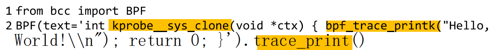
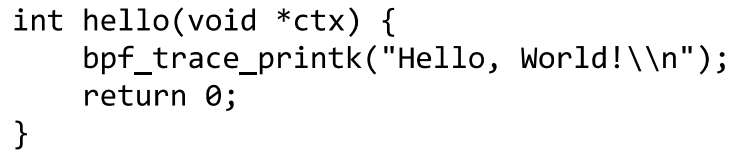
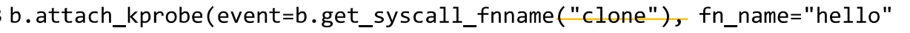
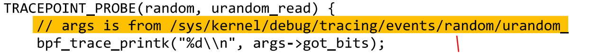
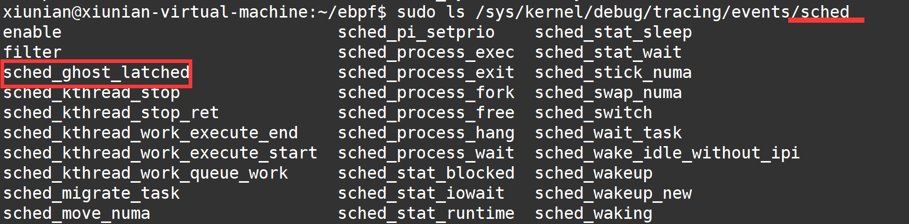
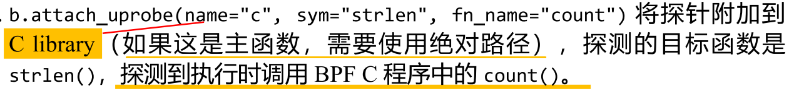
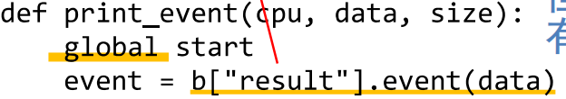

## 学习

> [好文，可见我PDF版本的笔记](https://developer.aliyun.com/article/779357#slide-6)
>
> [好文x2，是ebpf的实践入门版](https://blog.cyru1s.com/posts/ebpf-bcc.html)

还得是这张图：

总结下涉及到的ebpf的用法：

总的来说就是可以在内核里面定义好的探针注入代码，但不能自定义在内核的哪里可以注入探针，如果要自定义的话就得修改内核；采用perf或者map跟外界通信，perf是事件机制，map就是纯纯异步了。

1. 探针

   1. 重写提供的函数（在C程序中函数名如kprobes__开头，可能跟上图右边那堆helper差不多）

      

   2. 关联提供的函数（C程序中函数名自定义，关联内核提供的探针）（3）

      

      

   3. 分离python和C代码（11）

   4. 通过内核断点绑定（`TRACEPOINT_PROBE`）（12、13）

      这个`TRACEPOINT_PROBE`的两个参数应该就是`/sys/kernel/debug/tracing/events/`下的两级目录

      

      观察其路径。在`/sys/kernel/debug/tracing/events`下列出了所有可追踪的断点。每个断点的对应参数在对应名称文件中有。

      

   5. 探测C语言用户函数库中函数调用（uprobe，与kprobe对应）（14）

      

   6. 探测用户自定义的静态跟踪探针USDT

2. 信息交互

   1. map（6）

      使用`BPF_HASH(hash)`创建一个名为hash的哈希映射，相当于一个全局变量表。默认key和value都为u64类型。数据类型可以是自定义的struct，也可以是内核定义的（当然需要引入头文件）

      两个用于存储时间戳的常用key：指向结构体的指针、线程ID

      在BPF程序（也即c程序）中，通过`hash.lookup(&key)`、`hash.delete(&key)`、`hash.update(&key,&value)`进行修改。

      在python程序中，通过`b.get_table("hash")`可以获取该全局表。

   2. bpf_trace_printk（实际开发一般不用）（3）

      在BPF程序中使用，用于将字符串print到trace_pipe中。

      在python程序中需要通过`b=BPF(XXX); b.trace_print()`打印出来，或者通过`(task,pid,cpu,flags,ts,message) = b.trace_fields()`获取字段。

   3. perf（7）

      1. C程序：

         

         定义perf变量

         

         提交要通信的数据

      2. python：

         

         为perf变量绑定监听事件

         

         持续监听通信事件

         

         事件参数固定；在事件中需要按照此格式获取通信数据

   4. 直方图（9）

3. 一些有用的函数库

   1. `bpf_ktime_get_ns()`    获取当前时间

   2. `PT_REGS_PARM1(ctx)`  获取探针函数调用第一个参数

      这里的函数名值得注意。之前有说到过ebpf有很多个寄存器吧？所以这里实际上应该是获取寄存器的值。