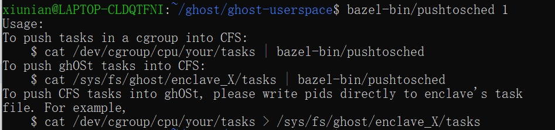

> 参考：
>
> 1. 很详细写得很好的一系列文章，可以用来系统入门cgroup
>
>    [**Cgroup概述**](https://segmentfault.com/a/1190000006917884)
>
> 2. 介绍了cpu subsystem【好像是hh】的三个重要参数，跟调度密切相关
>
>    https://blog.csdn.net/qq_34556414/article/details/120654931
>
> 3. 这个是别人的cgroup入门文档，还没仔细看
>
>    https://www.lijiaocn.com/%E6%96%B9%E6%B3%95/2019/12/21/how-to-study-cgroup.html

## Cgroup

cgroup和namespace类似，也是将进程进行分组，但它的目的和namespace不一样，namespace是为了隔离进程组之间的资源，而**cgroup是为了对一组进程进行统一的资源监控和限制。**

cgroup，用来统一将进程进行分组，并在分组的基础上对进程进行监控和资源控制管理等。


cgroup主要包括下面两部分：

1. subsystem

    一个subsystem就是一个**内核模块**，他被关联到一颗cgroup树之后，就会在树的每个节点（进程组）上做具体的操作。

   subsystem经常被称作"resource controller"，因为它主要被用来**调度或者限制或只是监控每个进程组的资源**。

   到目前为止，Linux支持12种subsystem，比如限制CPU的使用时间，限制使用的内存，统计CPU的使用情况，冻结和恢复一组进程等。

   **每个subsystem不能属于多个树，只能属于一个树**。因而，如果不考虑不与任何subsystem关联的情况（systemd就属于这种情况），Linux里面最多可以建12颗cgroup树，每棵树关联一个subsystem，当然也可以只建一棵树，然后让这棵树关联所有的subsystem。

2. hierarchy 

   **一个hierarchy可以理解为一棵cgroup树，树的每个节点就是一个进程组，每棵树都会与零到多个subsystem关联。**


所以就是说：

1. 一个subsystem只能对应一个hierarchy 
2. 一个hierarchy 可以与多个subsystem关联
3. hierarchy 的结点为进程组
4. 一个进程可以属于多个进程组，与多个subsystem关联。


**当一颗cgroup树不和任何subsystem关联的时候，意味着这棵树只是将进程进行分组，至于要在分组的基础上做些什么，将由应用程序自己决定，systemd就是一个这样的例子。**

## ghOSt中的cgroup

ghOSt使用的是cgroup v1。

下面说的cgroup应该大部分指的是hierarchy里的结点。

在跑程序（包括agent和client）之前的初始化工作，ghost会新建cgroup hierarchy：

```python
# in setup.py
def MountCgroups():
  """Mount the cgroup hierarchy."""
  # mkdir /sys/fs/cgroup/cpu,cpuacct 
  # mount -t cgroup -o cpu,cpuacct xxx /sys/fs/cgroup/cpu,cpuacct
  # 挂载一颗与cpu和cpuacct subsystem关联的cgroup树到/sys/fs/cgroup/cpu,cpuacct
  os.system("mkdir -p /dev/cgroup/cpu")
  os.system("mkdir -p /dev/cgroup/memory")
  # 所以说，这里就是挂载了一棵名为cgroup的与cpu和cpuacct subsystem关联的cgroup树到/dev/cgroup/cpu中
  # 挂载了一颗名为cgroup的与memory subsystem关联的croup树到/dev/cgroup/memory中
  os.system("mount -t cgroup -o cpu,cpuacct cgroup /dev/cgroup/cpu")
  os.system("mount -t cgroup -o memory cgroup /dev/cgroup/memory")
  # memory：统计和限制cgroup的内存的使用率，包括process memory, kernel memory, 和swap。
  # cpu：用来限制cgroup的CPU使用率。
  # cpuacct：统计cgroup的CPU的使用率。
```

做完初始化工作后，会调用StartApps

```python
def StartApps(experiment: Experiment, throughput: int):
  """Starts the applications for the experiment.

  Args:
    experiment: The experiment.
    throughput: The RocksDB throughput.

  Returns:
    The application handles.
  """
  # True if we set a nice value for RocksDB and (if it exists) the antagonist.
  set_nice: bool = not experiment.ghost and experiment.antagonist
  # Start ghOSt (if applicable).
  ghost = None
  if experiment.ghost:
    ghost = StartApp(GhostArgs(experiment), "ghost_shinjuku")
    # Wait for ghOSt to initialize.
    WaitForLine(ghost.stdout, "Initialization complete, ghOSt active.")

  # Start RocksDB.
  rocksdb = StartApp(RocksDBArgs(experiment, throughput, set_nice), "rocksdb")
  WaitForLine(rocksdb.stdout, "Initialization complete.")

  # Start the Antagonist (if applicable).
  antagonist = None
  if experiment.antagonist:
    antagonist = StartApp(AntagonistArgs(experiment, set_nice), "rocksdb")

  return AppHandles(rocksdb, antagonist, ghost)
```

然后是StartApp

```python
def StartApp(args: List[str], cgroup: str):
  """Forks and execs an application with the command line arguments `args`.

  Creates a CPU cgroup and a memory cgroup with names `cgroup`. Moves the
  process to the created cgroup(s).

  Args:
    args: The command line arguments to start the application.
    cgroup: Creates a CPU cgroup and a memory cgroup with this name.

  Returns:
    The subprocess handle for the application.
  """
  CreateCgroup(cgroup)
  app = subprocess.Popen(args, stdout=subprocess.PIPE)
  print(args)
  MoveProcessToCgroup(cgroup, app.pid)
  return app
```

调用CreateCgroup创建cgroup结点，调用MoveProcessToCgroup将当前程序迁移到CreateCgroup创建的cgroup中：

```python
# in option.py
# 在cgroup hierarchy中创建cgroup 结点
def CreateCgroup(name: str):
  """Creates a cgroup.

  Creates a cgroup with name `name` to control both CPU and memory resources.
  Uses cgroups v1.

  Args:
    name: The cgroup name.
  """

  # CPU Cgroup 中的三个最重要的参数
  #"cpu.cfs_quota_us"CFS 算法的一个调度周期
  #"cpu.cfs_period_us"表示 CFS 算法中，在一个调度周期里这个控制组被允许的运行时间
  # cpu.cfs_quota_us 和 cpu.cfs_period_us 这两个值决定了每个控制组中所有进程的可使用 CPU 资源的最大值。

  #"cpu.shares" CPU  Cgroup 对于控制组之间的 CPU 分配比例，它的缺省值是 1024
  # 假设我们前面创建的 group3 中的 cpu.shares 是 1024，
  # 而 group4 中的 cpu.shares 是 3072，那么 group3:group4=1:3。
  # cpu.shares 这个值决定了 CPU Cgroup 子系统下控制组可用 CPU 的相对比例，
  # 不过只有当系统上 CPU 完全被占满的时候，这个比例才会在各个控制组间起作用。 

  os.system(f"mkdir -p /dev/cgroup/cpu/{name}")
  os.system(f"echo 102400 > /dev/cgroup/cpu/{name}/cpu.shares")
  os.system(f"mkdir -p /dev/cgroup/memory/{name}")
  os.system(f"echo 60000M > /dev/cgroup/memory/{name}/memory.limit_in_bytes")
```

```python
def MoveProcessToCgroup(name: str, pid: int):
  """Moves a process to a cgroup.

  Moves process with PID `pid` to a CPU cgroup and a memory cgroup with name
  `name`. Uses cgroups v1.

  Args:
    name: The cgroup name.
    pid: The process PID.
  """
  os.system(f"echo {pid} > /dev/cgroup/cpu/{name}/tasks")
  os.system(f"echo {pid} > /dev/cgroup/memory/{name}/tasks")
```

## 有意思的程序

它可以在ghost和cfs调度类之间迁移任务



