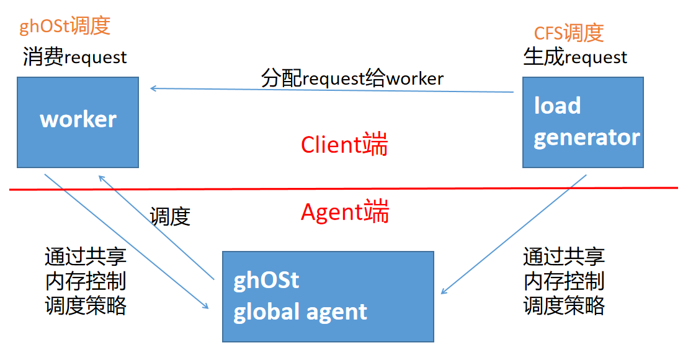
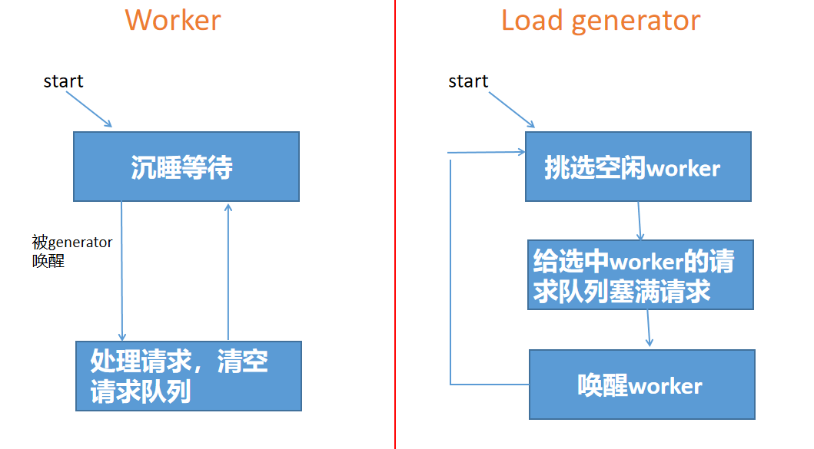
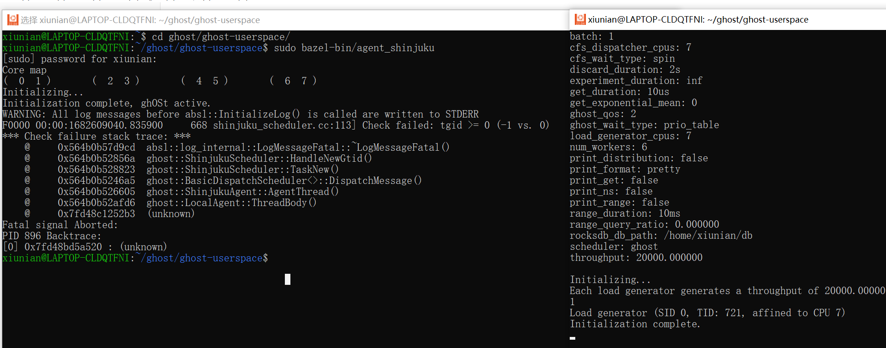
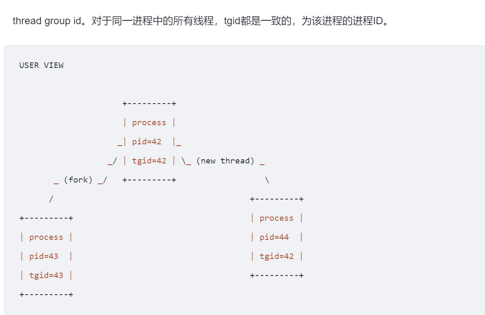

## 硬件环境

> The experiments run on a single socket from a 2-socket Intel Xeon CPU E5-2658 (12 cores per socket, 24 logical cores per socket, 2.2 GHz)

本次实验跑在一个2-socket CPU的其中一个socket上，这个socket共有12个物理core，24个logical core。

同一个socket（l3 slibing）共享l3cache，同一个core（slibing）共享l1 l2cache

thread、cpu（processer）、core、socket、node

socket=NUMA node

## 数量关系

application进程、prio table、sched item、work class、线程

1. 一个application拥有多个线程
2. 一个application对应一个prio table
3. 一个线程对应一个sched item
4. 因而，一个application有多少个线程，那么它拥有的prio table就有多少个sched item，sched item数组就有多少个元素
5. work class表示对task进行分类，所以一个work class包含多个task；一个task 只能属于一个work class
6. work class由用户自定义，所以用户想定义多少个就定义多少个


shinjuku scheduler、application进程、prio table、shinjuku orchastrator

1. 一个shinjuku agent端可以为多个application提供服务
2. 一个application拥有一张prio table。
3. shinjuku orchestrator类用来包装管理prio table。一个shinjuku orchestrator对应一个prio table      
4. shinjuku scheduler管理多个orchastrator。数据结构：`<application的pid, orchastrator>`map
5. 因而，**一个shinjuku scheduler——多个application——多个orchastrator——多个prio table**


worker、load generator、thread pool

1. 一个load generator线程、6（默认值）个worker线程
2. load generator被固定在一个cpu上运行
3. sizeof(线程池) = 7 = 1+6

## 两种线程





### 交互细节

##### 沉睡-唤醒机制的实现

使用PrioTable实现。

1. 如果worker线程需要沉睡，它只需在PrioTable中标记自己的状态为IDLE即可【调用`prio_table_helper_->MarkIdle(sid)`】

2. **Agent在进行调度决策时，会先检查PrioTable中的标志，然后跳过状态为IDLE的worker线程。**

3. load generator在PrioTable中标记worker的状态为Runnable【调用`prio_table_helper_->MarkRunnable(sid)`】，即可让worker线程再次能够被Agent调度。

### PrioTable

怎么串联通信

### load generator

network

增加增删

其生成的request流的特点：ingress、network

1. 平均吞吐量throughput保持定值，这个定值为用户规定；但瞬时吞吐量服从泊松分布

2. 生成的请求key是随机数，范围为1-kNumEntries（1000000）

### worker

1. 主要调用`HandleRequest`来处理sql请求

2. 每个worker具体工作：

   1. 根据传入的request参数执行sql请求

   2. 每个worker至少要执行options_.get_duration时间

      > 在论文中，这个所谓的`get_duration`参数的取值应该是这样：
      >
      > We assigned the following processing times: **99.5% of requests - 4 *𝜇*s, 0.5% of requests - 10 ms**. 
      >
      > 但我没具体看出来这个比例是哪来的，main里面`get_duration`参数的默认值是10ms。

3. 每个worker有preemption time slice  30μs

   > The allotted time slice per worker thread, before forcing a preemption and returning back to the FIFO, is 30 *𝜇*s.

## 指标计算

1. Request结构体

   ```c++
   // A synthetic request for RocksDB generated by 'Ingress'.
   struct Request {
     // When the request was generated.
     absl::Time request_generated;  // 记录request在ingress流的生成时间
     // When the request was picked up by the app.
     absl::Time request_received;  // 记录request被network接收到的时间
     // When the request was assigned to a worker.
     absl::Time request_assigned;  // 记录request被generator分配给worker的时间
     // When the request started to be handled by a worker.
     absl::Time request_start; // 记录request开始被worker处理的时间
     // When the worker finished handling the request.
     absl::Time request_finished;  // 记录request结束被worker处理的时间
   
     // The work to do. The request is either a Get request or a Range query.
     std::variant<Get, Range> work;
   };
   ```

2. stage划分

   回忆request的生命周期：ingress-network-generator-worker

   ```c++
   // Prints all results.
   void Print(const std::vector<Request>& requests, absl::Duration runtime,
              PrintOptions options) {
     if (!options.print_last) {
       // 从request在ingress流生成，到被generator调用Poll接收的时间
       /*
       1. generator寻找空闲worker，填入idle sids中
       2. generator更新worker状态
       3. 循环遍历worker，调用poll
       这个过程取决于空闲worker的数量
       空闲worker越多，更多的request就能尽快被assign
       每个worker都是一路干到底的，而这个空闲必须为空
       所以为了加速这个过程，我们需要让每次generator寻找空闲worker，得到的空闲worker数尽可能多
       我们的调度策略就需要考虑这一点，比如说优先调度那些最有希望空闲的worker
       */
       HANDLE_STAGE("Ingress Queue Time", requests, runtime, request_generated,
                    request_received, options);
       // 从generator调用Poll，到generator分配给worker的时间
       /*
       1. 构造request.work
       这个过程感觉没什么好控制的
       */
       HANDLE_STAGE("Repeatable Handle Time", requests, runtime, request_received,
                    request_assigned, options);
       // 从worker接收，到request到worker开始处理request的时间
       /*
       1. generator分配request给worker
       2. generator标记worker状态为runnable
       3. scheduler读取prio table，更新worker任务的状态，将worker纳入run queue
       4. worker从runqueue中被pick调度
       这一步跟调度算法关系最为密切。要求3尽快为好，沿用centralized model的做法：在
       AgentThread循环体中不断检查
       */
       HANDLE_STAGE("Worker Queue Time", requests, runtime, request_assigned,
                    request_start, options);
       // worker处理request的时间
       /*
       1. worker处理sql
       2. worker至少需要处理service time
       在这期间，调度算法可能会中断worker进行上下文切换，大抵采用的是time slice，论文中要求
       时间上界为30μs
       */
       HANDLE_STAGE("Worker Handle Time", requests, runtime, request_start,
                    request_finished, options);
     }
     // Total time in system
     HANDLE_STAGE("Total", requests, runtime, request_generated, request_finished,
                  options);
   }
   ```

3. Result结构体

   对每个stage，都要计算一次Result结构体内的所有字段

   ```c++
   template <class T>
   struct Results {
     // The total number of requests.
     T total;
     // The throughput;
     T throughput;// 
     // The min latency.
     T min;
     // The 50th percentile latency.
     T fifty;
     // The 99th percentile latency.
     T ninetynine;
     // The 99.5th percentile latency.
     T ninetyninefive;
     // The 99.9th percentile latency.
     T ninetyninenine;
     // The max latency.
     T max;
   };
   ```

### throughput

平均

```c++
  // throughput = （请求数/所有请求运行时间）
  results.throughput =
      (total / absl::ToDoubleMilliseconds(runtime)) * 1000;
```

### latency

tail latency：意思就是说那么少见的但又很大的延迟，基本可以理解为一批操作里面回馈最慢的那几个。举个例子，比如说你用知乎的搜索引擎搜了好几次东西，然后有几次的反馈慢的离谱，这个就是tail latency。

```c++
  // 注意，duration是从小到大排序的，所以front就是min
  results.min = durations.front() / divisor;
  // 这是用中位数算的？6
  // 其实也不算吧，毕竟latency的概念是拖后腿部分
  // 那么前50%请求的拖后腿部分自然就是第50%的那个请求了
  results.fifty = durations.at(size * 0.5) / divisor;
  results.ninetynine = durations.at(size * 0.99) / divisor;
  results.ninetyninefive = durations.at(size * 0.995) / divisor;
  results.ninetyninenine = durations.at(size * 0.999) / divisor;
  results.max = durations.back() / divisor;
```

## 启动分析

我曹，注意到：



也就是说，我们启动worker线程之前，会先执行TaskNew-HandleNewGtid！

worker线程开始执行-GhostThread构造，通过SchedTaskEnterGhost，内核就会把TaskNew信息放进消息队列，AgentThread执行DispatchMessage，在里面新建了一个task结构体，然后进入TaskNew，然后task的状态被设置为blocked。直到外界将其priotable修改为runnable状态，然后agenthread中在SchedParamsCallback中copy 了sched item的备份，对其状态进行更新，才能再次被agent调用！

而且还有一点要注意，这一步除了创建task之外，还创建了orch

1. orch管理prio table

2. 一个app对应一个orch

3. 而此处是app的线程第一次访问scheduler

4. 所以需要为其创建orch

5. 概念：tgid  thread group identifier，存储在/proc/进程pid/status文件中

   

## 总结：对Agent的要求

1. 必须为centralized model

2. 建议支持PrioTable通信

3. 似乎要支持抢占调度

   论文的实验场景要求30μs为preemption time slice。