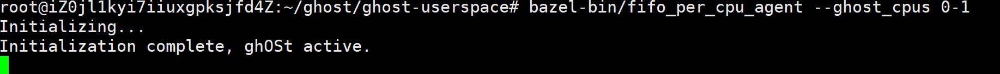
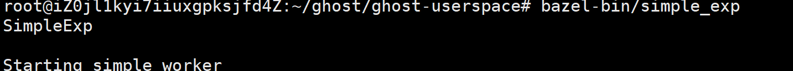
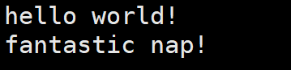
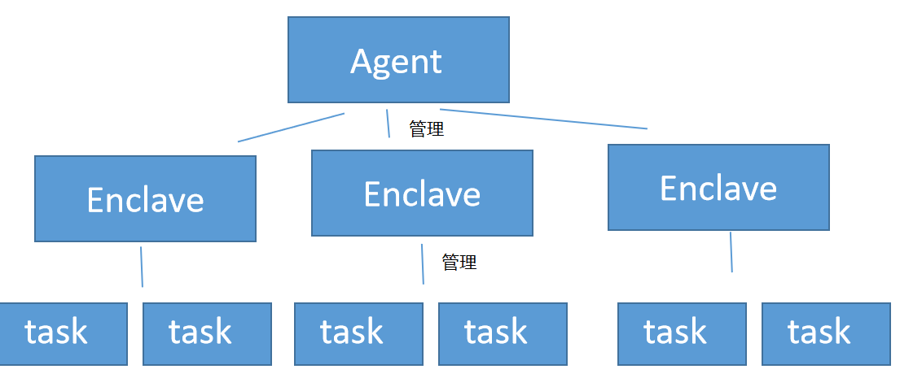

### 启动代理的命令追踪

我们新建两个会话，分别为Agent和Client。

在Agent会话中输入`bazel-bin/fifo_per_cpu_agent --ghost_cpus 0-1`命令开启ghOSt代理，在Client会话中执行**使用ghOSt编写的用户态多线程程序**（如测试用例`bazel-bin/simple_exp`）。结果如下图所示：





那么，这个过程究竟发生了什么？

#### Agent端

执行命令`bazel-bin/fifo_per`

`_cpu_agent`，然后就会执行`fifo_agent.cc`中的`main`函数中调用`AgentProcess`的构造函数。

```c++
// in fifo_agent.cc
// 启动ghost agent
int main(int argc, char* argv[]) {
  // ...
  printf("Initializing...\n");
  // AgentProcess
  auto uap = new ghost::AgentProcess<ghost::FullFifoAgent<ghost::LocalEnclave>,
                                     ghost::AgentConfig>(config);

  ghost::Notification exit;
  // 这个SIGINT是Linux自带的，表示^C信号。这里是在说收到^C就停止ghost代理
  ghost::GhostSignals::AddHandler(SIGINT, [&exit](int) { ... });
  exit.WaitForNotification();
    
  delete uap;
  printf("\nDone!\n");
  return 0;
}
```

`AgentProcess`在构造函数中，首先开启了一个子进程，接下来称为agent子进程（跟agent线程是不一样的）。原来的父进程会等待直到agent子进程准备完毕，再返回main函数：

```c++
    agent_proc_ = std::make_unique<ForkedProcess>(config.stderr_fd_);
    if (!agent_proc_->IsChild()) { // 父进程等待
      sb_->agent_ready_.WaitForNotification();
      return;
    }
```

agent子进程继续执行下面的代码。它首先进行了初始化，为每个CPU绑定一个agent线程：

```c++
full_agent_ = std::make_unique<FullAgentType>(config);
```

```c++
// in fifo_scheduler.h
  explicit FullFifoAgent(FifoConfig config) : FullAgent<EnclaveType>(config) {
    // ... 此处省略的部分会进行global cpuid的初始化
    this->StartAgentTasks();
    this->enclave_.Ready();
  }
```

```c++
// in agent.h
  void StartAgentTasks() {
    for (const Cpu& cpu : *enclave_.cpus()) {
      agents_.push_back(MakeAgent(cpu));
      // 在这里为每个CPU创立并绑定了一个agent线程
      agents_.back()->StartBegin();
    }
    for (auto& agent : agents_) {
      // 然后再让每个agent都睡过去，直到被notify
      // void Agent::StartComplete() { ready_.WaitForNotification(); }
      // void SignalReady() { ready_.Notify(); }
      agent->StartComplete();
    }
  }

// in agent.cc
void Agent::StartComplete() { ready_.WaitForNotification(); }
void SignalReady() { ready_.Notify(); }
// std::thread：Threads begin execution immediately upon construction of the associated thread object. std::thread一旦构造后就会立刻启动线程
void Agent::StartBegin() { thread_ = std::thread(&Agent::ThreadBody, this); }
void LocalAgent::ThreadBody() {
  int queue_fd;
  Scheduler* s = AgentScheduler();
  // ...
  enclave_->AttachAgent(cpu_, this);
  // ...
  // 进行调度程序循环
  AgentThread();
}
// in per_cpu/fifo_scheduler.cc
void FifoAgent::AgentThread() {
  // 每个agent线程都会在此处唤醒StartAgentTasks的第二个循环中的沉睡语句
  SignalReady();
  WaitForEnclaveReady();
```

`StartAgentTasks`的第一个循环中，每个agent执行`StartBegin`，从而其对应agent线程启动，开始执行`ThreadBody`，最终进入`AgentThread`，并且调用`SignalReady`，从而使得`StartAgentTasks`第二个循环成功结束。随后，各个agent都执行到`WaitForEnclaveReady();`，等待enclave的ready通知。

`StartAgentTasks`执行完后，回到`FullFifoAgent`构造函数中，执行`this->enclave_.Ready();`，通知agent可以继续执行。

每个agent被唤醒后的接下来，对于per-CPU model，直接自动开始执行调度策略；对于centralized model，只有被选中为global CPU的agent才会执行调度策略，其他agent都会调用`LocalYield`沉睡，成为incative agent：

```c++
    if (cpu().id() != global_scheduler_->GetGlobalCPUId()) {
      RunRequest* req = enclave()->GetRunRequest(cpu());
	  // ...
      req->LocalYield(agent_barrier, /*flags=*/0);
```

> 对于centralized model，这个global CPU是什么时候初始化的呢？
>
> 首先，明确一点，在代码实现中，每个agent都是共用同一个`global_scheduler_`的。那么问题就转化为这个共有的`global_scheduler_`是什么时候初始化global CPU的。
>
> 答案是在构造函数中初始化的。
>
> global CPU是在`FifoConfig`中确定的，因而`global_scheduler_`早在这一步：
>
> ```c++
> full_agent_ = std::make_unique<FullAgentType>(config);
> ```
>
> ```c++
> // in fifo_scheduler.h
> explicit FullFifoAgent(FifoConfig config) : FullAgent<EnclaveType>(config) {
>  global_scheduler_ = SingleThreadFifoScheduler(
>      &this->enclave_, *this->enclave_.cpus(), config.global_cpu_.id(),// 这里
>      config.preemption_time_slice_);
>  this->StartAgentTasks();
>  // ...
> }
> ```
>
> 就已经确定了global CPU。

这样一来，两个模型的agent线程都成功绑定到其对应的CPU上，并且跑了起来。


话题接着回到`AgentProcess`。

agent子进程执行完`full_agent_ = std::make_unique<FullAgentType>(config);`，完成了初始化后，就会接下来再分裂出另一个子线程，作为基于RPC机制实现的事件监听线程：

```c++
	// The rpc_handler thread never dies, at least not until we call _exit below.
    auto rpc_handler = std::thread([this]() {
      CHECK_EQ(prctl(PR_SET_NAME, "ap_rpc"), 0);
      for (;;) {
        sb_->rpc_pending_.WaitForNotification();
        sb_->rpc_pending_.Reset();
        if (full_agent_->enclave_.IsOnline()) {
          sb_->rpc_res_ = AgentRpcResponse();  // Reset the response.
          full_agent_->RpcHandler(sb_->rpc_req_, sb_->rpc_args_, sb_->rpc_res_);
        } else {
          sb_->rpc_res_.response_code = -ENODEV;
        }
        sb_->rpc_done_.Notify();
      }
    });
    // detach: permits the thread to execute independently from the thread handle
    // 允许线程独立于线程句柄执行
    rpc_handler.detach();
```

再然后，agent子进程就会通知main进程自己准备完毕，并且等待main进程给出死亡信号：

```c++
sb_->agent_ready_.Notify();
sb_->kill_agent_.WaitForNotification();
```

main线程就return到了`fifo_agent.cc`中的代码：

```c++
// in agent.cc
	if (!agent_proc_->IsChild()) {
      sb_->agent_ready_.WaitForNotification();
      return;
    }
// in fifo_agent.cc
int main(int argc, char* argv[]) {
  // ...
  // Using new so we can destruct the object before printing Done
  auto uap = new ghost::AgentProcess<ghost::FullFifoAgent<ghost::LocalEnclave>,
                                     ghost::FifoConfig>(config);
  
  // ... 
  return 0;
}
```

直到用户按下^C，main线程执行结束，调用`AgentProcess`的析构函数，通知agent子线程死亡：

```c++
  virtual ~AgentProcess() {
    sb_->kill_agent_.Notify();
    agent_proc_->WaitForChildExit();
  }
```

以上就是执行`bazel-bin/fifo_per_cpu_agent`命令一直到按下^C的全过程。

#### Client端

当我们运行完`bazel-bin/fifo_per_cpu_agent`，一个使用FIFO调度策略的调度环境就搭建成功了。这时候，我们就可以在client端执行多线程程序了。

##### 简单的程序示例

如果程序想要让自己创建的线程被FIFO策略调度，就需要在创建线程时使用`GhostThread`，而非`std::thread`。一个简单的例程如下：

```c++
namespace ghost {
namespace {
void SimpleExp() {
  // 创建ghost thread
  GhostThread t(GhostThread::KernelScheduler::kGhost, [] { // 参数必须传入kGhost
    printf("hello world!\n");
    absl::SleepFor(absl::Milliseconds(10));
    printf("fantastic nap!\n");
  });

  t.Join();
}
}  // namespace
}  // namespace ghost

int main() {
    ghost::SimpleExp();
  	return 0;
}
```

该例程会得到如下输出：



可见，`GhostThread`其实跟`std::thread`用法上没什么差。

##### 源码分析

上面那个小小的示例唯一跟ghost有关系的就是用到了个`GhostThread`。那么我们来看下其代码：

```c++
class GhostThread {
 public:
  // 构造函数的参数1，用来表示这个thread是要被ghost调度还是要被cfs调度
  enum class KernelScheduler { kCfs, kGhost };
  // 构造函数
  explicit GhostThread(KernelScheduler ksched, std::function<void()> work,
                       int dir_fd = -1);
  explicit GhostThread(const GhostThread&) = delete;
  GhostThread& operator=(const GhostThread&) = delete;
  ~GhostThread();

  // Joins the thread.
  void Join() { CHECK(Joinable()); thread_.join(); }
  bool Joinable() const { return thread_.joinable(); }

  // Returns this thread's TID (thread identifier).
  int tid() { return tid_; }
  // Returns this thread GTID (Google thread identifier).
  Gtid gtid() { return gtid_; }

  // Used by client processes who don't care which enclave they are in.
  static void SetGlobalEnclaveFdsOnce();

 private:
  // The thread's TID (thread identifier).
  int tid_;
  // The thread's GTID (Google thread identifier).
  Gtid gtid_;
  KernelScheduler ksched_;// ghOSt or CFS 
  // ！！！The thread.
  std::thread thread_;
};
```

可以看到，它其实大体上实现思路很简单，就是个`std::thread`的包装类。那么它是怎么做到“通过枚举类`ksched_`来决定自己的调度策略”的呢？继续看其构造函数实现：

```c++
GhostThread::GhostThread(KernelScheduler ksched, std::function<void()> work,
                         int dir_fd) : ksched_(ksched) {
  // 确保已经设置了enclave的fd
  GhostThread::SetGlobalEnclaveFdsOnce();
  // `dir_fd` must only be set when the scheduler is ghOSt.
  // 当为ghost调度类时才需要dir_fd这个参数
  CHECK(ksched == KernelScheduler::kGhost || dir_fd == -1);

  // 新建thread
  thread_ = std::thread([this, w = std::move(work), dir_fd] {
    // 进行一堆初始化
    tid_ = GetTID();
    gtid_ = Gtid::Current();
    started_.Notify();
    // 将该线程绑定到ghost调度类中
    if (ksched_ == KernelScheduler::kGhost) {
      // 注意！！pid=0代表当前进程
      const int ret = GhostHelper()->SchedTaskEnterGhost(/*pid=*/0, dir_fd);
      CHECK_EQ(ret, 0);
    }
    // 初始化完之后会调用传进来的函数指针，也即用户逻辑
    std::move(w)();
  });
  started_.WaitForNotification();// 等待直到线程准备完毕
}
```

可以看到将当前线程绑定到ghost调度类中最核心的是`SchedTaskEnterGhost`。其代码：

```c++
int Ghost::SchedTaskEnterGhost(int64_t pid, int dir_fd) {
  if (dir_fd == -1) {
    dir_fd = GhostHelper()->GetGlobalEnclaveDirFd();
  }
  // dir_fd指向dir，tasks_fd指向dir/tasks
  int tasks_fd = openat(dir_fd, "tasks", O_WRONLY);
  if (tasks_fd < 0) { return -1; }
    
  std::string pid_s = std::to_string(pid);
  int ret = 0;
  if (write(tasks_fd, pid_s.c_str(), pid_s.length()) != pid_s.length()) {
    ret = -1;
  }
  close(tasks_fd);
    
  return ret;
}
```

可以看到，其最主要是通过`open`和`write`这组系统调用实现的。

Agent管理global enclave，enclave下有许多task。



ghOSt将enclave视为目录`dir_fd`，将tasks视为文件`tasks_fd`。

这样一来，如果我们想将一个线程绑定到ghOSt调度类中，我们只需pick出一个enclave，然后将该线程登记到这个enclave的task中就行了。这也是这段代码的思想：dir_fd即为我们pick出的enclave，我们只需在tasks_fd对应的fd中登记当前进程的pid就行。

