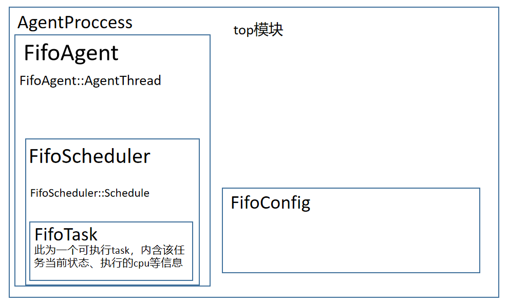

### 调度分析

接下来会对per-CPU和centralized两个模型的调度策略差异进行分析。

#### per-CPU

```c++
// in per_cpu/fifo_scheduler.cc
void FifoAgent::AgentThread() {
  SignalReady();
  WaitForEnclaveReady();

  // 当scheduler中没有未调度线程时，并且没有finish时退出循环。
  // 也就是说这个差不多就是个死循环啦。
  while (!Finished() || !scheduler_->Empty(cpu())) {
    scheduler_->Schedule(cpu(), status_word());
  }
}
```

```c++
// in per_cpu/fifo_scheduler.cc
void FifoScheduler::Schedule(const Cpu& cpu, const StatusWord& agent_sw) {
  // 获取Aseq
  BarrierToken agent_barrier = agent_sw.barrier();
  CpuState* cs = cpu_state(cpu);

  // 从消息队列中取消息
  Message msg;
  // 对于per-CPU model，一个CPU对应一个agent从而对应一个消息队列，
  // 因而，可以直接从cs中获取消息队列
  while (!(msg = Peek(cs->channel.get())).empty()) {
    DispatchMessage(msg);
    Consume(cs->channel.get(), msg);
  }

  // 执行真正的决策逻辑
  FifoSchedule(cpu, agent_barrier, agent_sw.boosted_priority());
  // 当target线程执行结束，就会返回到这里，然后之后再进行一轮Schedule的调用
}
```

```c++
void FifoScheduler::FifoSchedule(const Cpu& cpu, BarrierToken agent_barrier,
                                 bool prio_boost) {
  CpuState* cs = cpu_state(cpu);
  FifoTask* next = nullptr;
  if (!prio_boost) {
    next = cs->current;
    // 如果原task没有执行完，那就继续执行
    if (!next) next = cs->run_queue.Dequeue();
  }

  RunRequest* req = enclave()->GetRunRequest(cpu);
  if (next) {
    while (next->status_word.on_cpu()) {
      Pause();
    }

    req->Open({
        .target = next->gtid,
        .target_barrier = next->seqnum,
        .agent_barrier = agent_barrier,
        .commit_flags = COMMIT_AT_TXN_COMMIT,
    });

    // 事务提交
    if (req->Commit()) {
      // Txn commit succeeded and 'next' is oncpu.
      TaskOnCpu(next, cpu);
    } else { // 提交失败
      if (next == cs->current) {
        TaskOffCpu(next, /*blocked=*/false, /*from_switchto=*/false);
      }

      // Txn commit failed so push 'next' to the front of runqueue.
      next->prio_boost = true;
      cs->run_queue.Enqueue(next);
    }
  } else {
    // If LocalYield is due to 'prio_boost' then instruct the kernel to
    // return control back to the agent when CPU is idle.
    int flags = 0;
    if (prio_boost && (cs->current || !cs->run_queue.Empty())) {
      flags = RTLA_ON_IDLE;
    }
    // per-cpu model: agents call this API when they have no tasks to schedule
    // or when yielding to another sched_class (ref: RTLA_ON_IDLE).
    req->LocalYield(agent_barrier, flags);
  }
}
```


#### centralized

相比于per-CPU model，centralized情况下实现更加复杂。它跟per-CPU主要有以下几点不同：

1. global agent独占CPU

   这就引出了两个关键实现点：

   1. 当non-ghost进程抢占时，需要进行agent的迁移
   2. 需要引入时间片概念来控制ghost线程执行时间

   分别对应着`过程`后面的那两个小标题。

2. 管理多个CPU

   这部分具体代码实现跟论文的伪代码没什么差别，就不多说了 

##### 过程

可以看到，由于centralized模型需要对global agent进行必要时的迁移，因而代码相对于per-CPU多了一段。

```c++
void FifoAgent::AgentThread() {
  // 获取全局消息队列
  Channel& global_channel = global_scheduler_->GetDefaultChannel();
    
  SignalReady();
  WaitForEnclaveReady();

  // 跟上面那个一样，依然差不多相当于一个死循环
  while (!Finished() || !global_scheduler_->Empty()) {
    // 这个agent seq好像屁用没有，它作为参数传递的PickNextGlobalCPU和GlobalSchedule方法中
    // 都没有用到它。估计设置参数是为了统一接口？
    BarrierToken agent_barrier = status_word().barrier();

    // 下面相比于per-CPU新增的这段代码是用于global agent迁移的，针对其具体的解说详见下一个小标题`agent迁移`  
    
    // Check if we're assigned as the Global agent.
    if (cpu().id() != global_scheduler_->GetGlobalCPUId()) {
      RunRequest* req = enclave()->GetRunRequest(cpu());

      req->LocalYield(agent_barrier, /*flags=*/0);
    } else {
      
      // 仅当non-ghost进程进行抢占，此条件才会成立，才会进行第二个&&分句
      if (boosted_priority() &&
          // 迁移global CPU
          global_scheduler_->PickNextGlobalCPU(agent_barrier, cpu())) {
        continue;
      }

      Message msg;
      // 从消息队列中获取全部消息
      while (!(msg = global_channel.Peek()).empty()) {
        global_scheduler_->DispatchMessage(msg);
        global_channel.Consume(msg);
      }

      global_scheduler_->GlobalSchedule(status_word(), agent_barrier);
    }
  }
}
```

```c++
// 此函数中两个参数都没用到，乐
void FifoScheduler::GlobalSchedule(const StatusWord& agent_sw,
                                   BarrierToken agent_sw_last) {
  const int global_cpu_id = GetGlobalCPUId();
  // 由于centralized要管理众多CPU，因而需要从获取一个CPU变成获取一系列CPU
  // 这里的topology（拓扑）应该是用来管理什么CPU架构图的
  CpuList available = topology()->EmptyCpuList();
  CpuList assigned = topology()->EmptyCpuList();


  // 获取所有空闲可被调度从CPU
  for (const Cpu& cpu : cpus()) {
    CpuState* cs = cpu_state(cpu);

    if (cpu.id() == global_cpu_id) {
      // 如果当前CPU是global agent，那么它一定没有运行中任务
      CHECK_EQ(cs->current, nullptr);
      continue;
    }

    // This CPU is running a higher priority sched class, such as CFS.
    // 这里，为什么Available返回false就说明是run在别的调度类那边？
    // 追踪可得，Available本质上是查看status words的字段
    // 【我猜测】，是因为别的调度类由于是由内核管理，所以会由内核自动打上占用CPU的标志；
    // 但ghost只能通过软件形式（比如此处cpu status）来标记CPU是否用过。
    // 所以Available返回false，只能说明是别的调度类占有该CPU。
    if (!Available(cpu)) { 
      continue;
    }
      
    if (cs->current &&
        (MonotonicNow() - cs->last_commit) < preemption_time_slice_) {
      // This CPU is currently running a task, so do not schedule a different
      // task on it. 注意这里第二个条件说明时间片没用完，体现了这个“currently running”
      continue;
    }
    // No task is running on this CPU, so designate this CPU as available.
    available.Set(cpu);
  }

  // 调度所有空闲CPU
  while (!available.Empty()) {
    FifoTask* next = Dequeue();
    if (!next) { // 没有任务了就白白
      break;
    }

    // Assign `next` to run on the CPU at the front of `available`.
    const Cpu& next_cpu = available.Front();
    CpuState* cs = cpu_state(next_cpu);

    if (cs->current) { // 能来到这说明current的时间片已经用完，直接踢开就行
      cs->current->run_state = FifoTask::RunState::kRunnable;
      Enqueue(cs->current);
    }
    cs->current = next;

    available.Clear(next_cpu);
    assigned.Set(next_cpu);

    RunRequest* req = enclave()->GetRunRequest(next_cpu);
    req->Open({.target = next->gtid,
               .target_barrier = next->seqnum,
               // No need to set `agent_barrier` because the agent barrier is
               // not checked when a global agent is scheduling a CPU other than
               // the one that the global agent is currently running on.
               .commit_flags = COMMIT_AT_TXN_COMMIT});
  }

  // 进行事务组提交
  // Commit on all CPUs with open transactions.
  if (!assigned.Empty()) {
    // 一键发送处理器间中断
    enclave()->CommitRunRequests(assigned);
    absl::Time now = MonotonicNow();
    for (const Cpu& cpu : assigned) {
      cpu_state(cpu)->last_commit = now;
    }
  }
    
  // 提交后处理：查看事务提交是否成功
  for (const Cpu& next_cpu : assigned) {
    CpuState* cs = cpu_state(next_cpu);
    RunRequest* req = enclave()->GetRunRequest(next_cpu);
    if (req->succeeded()) {
      // The transaction succeeded and `next` is running on `next_cpu`.
      TaskOnCpu(cs->current, next_cpu);
    } else {

      // The transaction commit failed so push `next` to the front of runqueue.
      cs->current->prio_boost = true;
      Enqueue(cs->current);
      // The task failed to run on `next_cpu`, so clear out `cs->current`.
      cs->current = nullptr;
    }
  }

  // Yielding tasks are moved back to the runqueue having skipped one round
  // of scheduling decisions.
  if (!yielding_tasks_.empty()) {
    for (FifoTask* t : yielding_tasks_) {
      CHECK_EQ(t->run_state, FifoTask::RunState::kYielding);
      t->run_state = FifoTask::RunState::kRunnable;
      Enqueue(t);
    }
    yielding_tasks_.clear();
  }
}
```


以上就是基本过程。下面我想具体说说其中几个值得注意的点。


##### agent迁移

根据论文，为了维持kernel stability，当non-ghost抢占当前CPU，global agent需要迅速让出cpu，唤醒inactive agent来交接管理。

一开始，global agent安然无恙地运行：

```c++
void FifoAgent::AgentThread() {
  // 获取全局消息队列
  Channel& global_channel = global_scheduler_->GetDefaultChannel();
    
  SignalReady();
  WaitForEnclaveReady();

  // 跟上面那个一样，依然差不多相当于一个死循环
  while (!Finished() || !global_scheduler_->Empty()) {
    // ...
      Message msg;
      // 从消息队列中获取全部消息
      while (!(msg = global_channel.Peek()).empty()) {
        global_scheduler_->DispatchMessage(msg);
        global_channel.Consume(msg);
      }

      global_scheduler_->GlobalSchedule(status_word(), agent_barrier);
  }
}
```

这时候，进行完此句调度之后：

```c++
global_scheduler_->GlobalSchedule(status_word(), agent_barrier);
```

要开始下一轮循环时，global agent被non-ghost抢占了，其boosted_priority发生了变化：

```c++
// 从与内核的share memory中读出，当global agent被抢占时返回true
virtual bool boosted_priority() const { return sw_flags() & GHOST_SW_BOOST_PRIO; }
```

```c++
  while (!Finished() || !global_scheduler_->Empty()) {
    // Check if we're assigned as the Global agent.
    if (cpu().id() != global_scheduler_->GetGlobalCPUId()) {
      RunRequest* req = enclave()->GetRunRequest(cpu());
      req->LocalYield(agent_barrier, /*flags=*/0);
    } else {     
      // 仅当non-ghost进程进行抢占，此条件才会成立，才会进行第二个&&分句
      if (boosted_priority() &&
          // 迁移global CPU
          global_scheduler_->PickNextGlobalCPU(agent_barrier, cpu())) {
        // 迁移结束后，当前cpu为非agent进程，continue到下一轮循环后，就会执行第一个if分句的yield，为non-ghost进程礼让CPU
        continue;
      }
```

我们此时还是global agent，因而进入if的第二个分句。这时候，由于`boosted_priority`为true，我们就需要执行`PickNextGlobalCPU`函数。

`PickNextGlobalCPU`函数会按照L3 cache的顺序，一级级找**未被non-ghost进程占领的CPU**作为global agent迁移的target（也就是说，<u>那些现在忙着run ghost线程的CPU不空闲，但是也能被抓过来</u>）：

```c++
bool FifoScheduler::PickNextGlobalCPU(BarrierToken agent_barrier,
                                      const Cpu& this_cpu) {
  // 下一步要切换到的目标CPU
  Cpu target(Cpu::UninitializedType::kUninitialized);
  Cpu global_cpu = topology()->cpu(GetGlobalCPUId());
  int numa_node = global_cpu.numa_node();

  // 一级一级cache找下去

  for (const Cpu& cpu : global_cpu.siblings()) {
    // 跳过当前CPU
    if (cpu.id() == global_cpu.id()) continue;
    // 如果该CPU不被non-ghost占领那就随便抢，管它有没有正在运行ghost线程
    if (Available(cpu)) {
      target = cpu;
      goto found;
    }
  }
  for (const Cpu& cpu : global_cpu.l3_siblings()) {
    // ...
  }    
  // ...
```

寻找到target CPU之后，就会跳转到`found`标签。之后就会调用`Ping`来唤醒当前CPU上调用`LocalYield`沉睡着的inactive agent，使其暴力抢占当前CPU，不论当前CPU是否依然运行ghost进程：

```c++
found:
  if (!target.valid()) return false;

  CHECK(target != this_cpu);

  CpuState* cs = cpu_state(target);
  FifoTask* prev = cs->current;
  if (prev) {
    CHECK(prev->oncpu());
  }

  SetGlobalCPU(target);
  // 调用Ping唤醒
  enclave()->GetAgent(target)->Ping();

  return true;
}
```

当agent被唤醒，当前CPU运行任务被中止之后，全局消息队列就会被塞进`TASK_PREEMPT`/`TASK_BLOCKED`/`TASK_YIELD`消息，这样一来，这个被抢占的任务状态也能在之后被agent更新并且塞进runqueue，从而被再次像其他task一样被重新调度：

```c++
// 以TASK_PREEMPT消息为例
void FifoScheduler::TaskPreempted(FifoTask* task, const Message& msg) {
  task->preempted = true;

  if (task->oncpu()) {
    CpuState* cs = cpu_state_of(task);
    CHECK_EQ(cs->current, task);
    cs->current = nullptr;
    task->run_state = FifoTask::RunState::kRunnable;
    Enqueue(task); // 塞回runqueue，等待下次调度
  } else {
    CHECK(task->queued());
  }
}
```

global agent的迁移，其本质就是将原来的global agent沉睡，将新的global agent唤醒。

我们上面调用了`PickNextGlobalCpu`后的执行结果是唤醒了新的globa agent，那么原来的global agent是怎么沉睡的呢？

其实也很简单。当执行完`PickNextGlobalCpu`之后，由于唤醒了新的agent，故而返回true，进入continue语句：

```c++
if (boosted_priority() &&
    global_scheduler_->PickNextGlobalCPU(agent_barrier, cpu())) {
    continue;
}
```

随后就进入下一次循环的第一个if分支：

```c++
  while (!Finished() || !global_scheduler_->Empty()) {

    // Check if we're assigned as the Global agent.
    if (cpu().id() != global_scheduler_->GetGlobalCPUId()) {
      RunRequest* req = enclave()->GetRunRequest(cpu());

      req->LocalYield(agent_barrier, /*flags=*/0);
    }
```

从而调用`LocalYield`进行睡眠。之后，non-ghost进程就能在内核调度类的作用下，对原CPU进行抢占了。


还有一点细节需要注意，那就是agent进行迁移了，那么agent管理的runqueue又是怎么迁移的呢？

再次看看这张图：



代码实现中，其实是多个FifoAgent共享同一个FifoScheduler，从启动过程中为每个CPU绑定agent的`MakeAgent`方法就可以看出来：

```c++
  std::unique_ptr<Agent> MakeAgent(const Cpu& cpu) override {
    return std::make_unique<FifoAgent>(&this->enclave_, cpu,
                                       global_scheduler_.get());// 这里
  }
```

而实际上管理、存储runqueue的是`FifoScheduler`类。

因而，无需显式进行runqueue的迁移，因为每个agent都保存了对同一个`FifoScheduler`的引用，都通过对同一个`FifoScheduler`的引用来访问runqueue。


##### 时间片

centralized model除了使用FIFO策略之外，还引入了时间片调度。

```c++
// 这个应该是允许一个线程独占CPU的最长时间
FifoScheduler::FifoScheduler(/* ... */ absl::Duration preemption_time_slice)
    : /* ... */ preemption_time_slice_(preemption_time_slice) 
```

当线程运行时超过最大允许运行时，对应CPU就会被加入CPU freelist，从而能够被用来跑别的线程：

```c++
    if (cs->current &&
        (MonotonicNow() - cs->last_commit) < preemption_time_slice_) {
      // This CPU is currently running a task, so do not schedule a different
      // task on it. 注意这里第二个条件说明时间片没用完，体现了这个“currently running”
      continue;
    }
	available.Set(cpu);
```

从而原来那个task就这么被抢夺了：

````c++
	if (cs->current) { // cs->current存在，并且cs又是availavle的，只有一种情况，就是current的时间片用完了
      cs->current->run_state = FifoTask::RunState::kRunnable;
      Enqueue(cs->current);
    }
```
