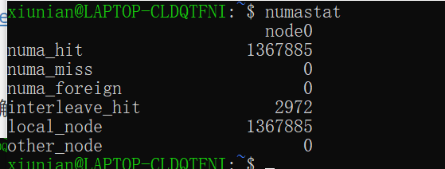
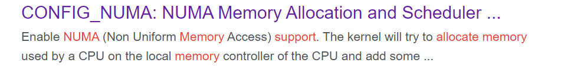
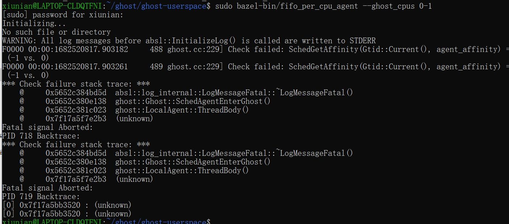
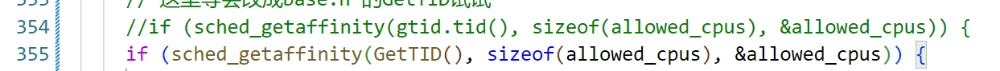
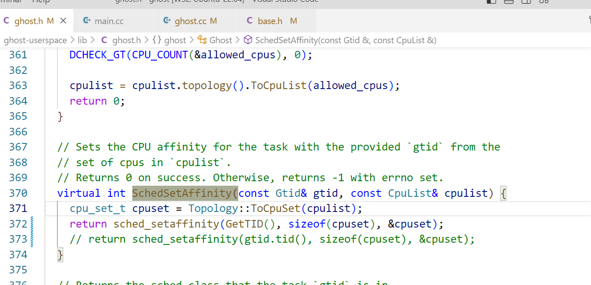
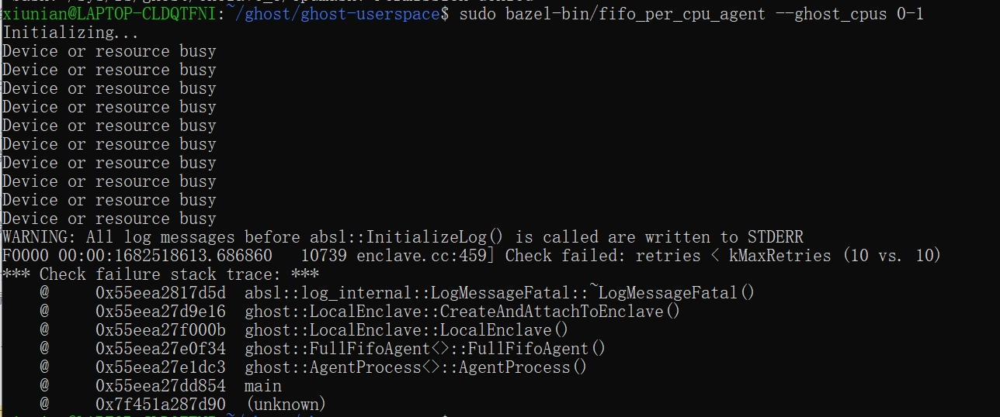

sudo bazel-bin/rocksdb --load_generator_cpus 7 --cfs_dispatcher_cpus 7 --worker_cpus "" --rocksdb_db_path "/home/xiunian/db"  --scheduler ghost

### WSL

#### WSL不支持NUMA

可以敲个numastat命令，没有这种结果就是不支持：



这就需要我们重新编译下内核。

在.config中增加对NUMA的支持，再编译一次内核。我把改好的.config放在飞书里了。

> 总之还有一个问题是wsl2不支持NUMA。我看了这个issue：https://github.com/microsoft/WSL/issues/5025 得知，需要编译一个 [custom kernel](https://microhobby.com.br/blog/2019/09/21/compiling-your-own-linux-kernel-for-windows-wsl2/) with "NUMA Memory Allocation and Scheduler Support" enabled。我去找了下这个"NUMA Memory Allocation and Scheduler Support" 是什么玩意，发现好像是.config的问题：
>
> 
>
> 我点进去一看，发现果然里面写着CONFIG_NUMA is unset。我就set了一下=y，之后编译就发现有个选项NUMA Memory Allocation and Scheduler Support enable[Y/N]并且默认y了。现在在编译不知道怎么样。
>
> https://cateee.net/lkddb/web-lkddb/NUMA.html
>
> 
>
> 应该就是这玩意的问题
>
> [内核编译支持ebpf](https://blog.csdn.net/chensong_2000/article/details/126927681?spm=1001.2014.3001.5506)

#### get affinity出错



定位了下发现是`sched_getaffinity(gtid.tid())`出错，说是因为找不到这个tid对应的process。

我最后在这两个地方改了下代码：

ghost.h：





最后就行了。

> 看看要不要把其他所有出现.tid()的地方弄下

#### retries < kMaxRetries



应该正如它对应代码里注释写的那样，是因为出错了后没调enclave的析构函数导致的。

解决方法是重启虚拟机，wsl --shutdown然后再开一次执行原命令就行了。

> ```shell
> for i in /sys/fs/ghost/enclave_*/ctl; do echo destroy > $i; done
> ```