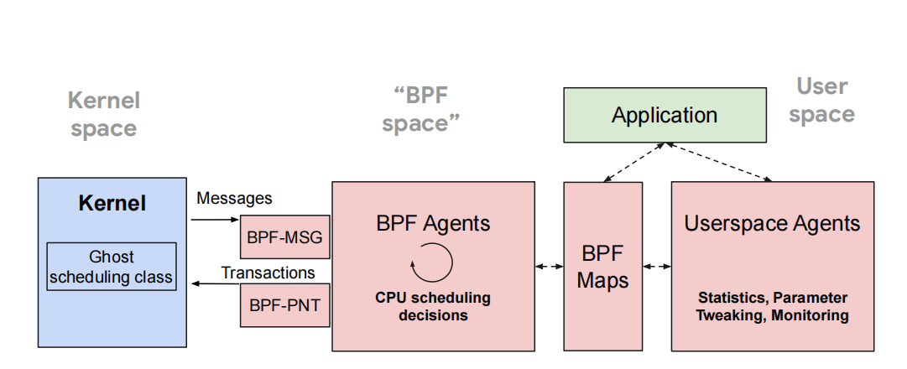
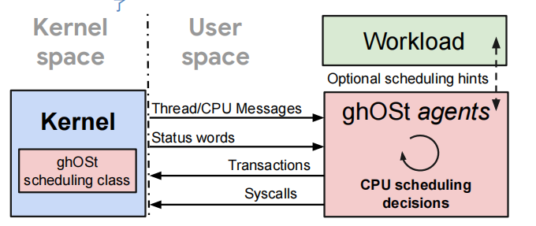

ghost除了下面那个经典之外，还提供了另一种bpf-only的实现方式，也即第一张图。

在bpf-only中，user agent部分一模一样。所以我猜ebpf应该只是实现了像消息队列、共享内存以及系统调用那样的通信功能。

ghost的ebpf实现其实也很简单，主要依然遵循我笔记里的那两个文件的概念。它本质上就是把那些机制从AgentThread中解耦了出来放进了ebpf程序中，最后注入到内核中自定义的钩子节点上。也就是说它tmd还是会修改内核。