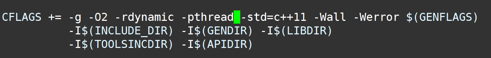

目前存在的问题：

1. 如何获取线程的tid

   在client进程中，需要获取创建的线程的tid：

   ```c
    int pid = workers.back().get_id();// 获取tid
   ```

   然而，`std::thread::get_id()`方法返回的是一个`std::thread::id`对象，chatgpt说它是一个无符号整数tid的包装类，不知道跟我们之后在agent获取到的`pid_t`类型（有符号32位整数）的pid一不一样。盘问了半天chatgpt还是没弄懂。

2. 编译报错（见最后一部分）

### yuyu.h

```c
// shm中具体记录信息的结构，每个线程都持有一个
struct entry{
    int ddl;
};

// 模仿ghost那样，记录用户传进来的参数
struct option{
    int worker_size;
};

//每块shm的大小
#define SHM_SIZE 4096

// shm的最大entry数
#define MAX_ENTRY_NUMS SHM_SIZE/sizeof(struct entry)

// agent进程的shm映射起始地址，此处为2G
#define GLOBAL_SHM 1<<31

// TODO: 线性探测
// 目前只随便取了个余
int hash(__s32 pid){
    return pid%MAX_ENTRY_NUMS;
}
```

### yuyu_client.c

```c
#include "../../include/uapi/linux/sched.h"
//#include <sched.h>
#include <unistd.h>
#include <vector>
#include <thread>
#include <stdio.h>
#include <sys/mman.h>
#include <fcntl.h> // for O_RDWR and open


#include "yuyu.h"

// TODO:获取用户输入参数，填入struct option
struct option* get_options_from_args(int argc, int* argv){
    return {20}; // 目前只创建一个worker线程
}

int main(int argc, int* argv){
    struct option* op = get_options_from_args(argc,argv);

    // TODO:修改路径；检查参数
    char buf[32];
    sprintf(buf,"shm_%d",getpid());
    int shm_fd = open(buf, O_RDWR | O_CREAT | O_TRUNC);
    struct entry* shm = (struct entry*)mmap(NULL, SHM_SIZE,PROT_READ|PROT_WRITE, MAP_SHARED,shm_fd,0);

    std::vector<std::thread> workers;

    for(int i=0;i<op->worker_size;i++){
        int flag = false; // 条件变量简单实现

        workers.push_back(std::thread ([] { 
            while(!flag){} // wait
            while(true){ // do some work
                printf("working...\n");
                sleep(10);
            }
        }));
		
    	// 此处存疑。详情见开头
        int pid = workers.back().get_id();// 获取tid
        shm[hash(pid)].ddl = ddl; // 填写信息

    	// 此处优先级设置存疑
        struct sched_param param = { .sched_priority = 0 }; // 设置调度类
        sched_setscheduler(pid,SCHED_EXT,&param); 

        flag = true;// notify
    }
    
    for(int i=0;i<op->worker_size;i++){
        workers[i].join();
    }

    return 0;
}
```

### scx_example_userland.c

```c
#include "yuyu.h"
#include <fcntl.h> // for O_RDWR and open


std::map<__s32,int> offsets; // key为client进程的pid，value为其对应的shm offset。maybevalue为size_t之类的会好些？
int global_offset = 0; // 始终指向第一块空闲shm

static void drain_enqueued_map(void)
{
	while (1) {
		struct scx_userland_enqueued_task task;
		int err;
		if (bpf_map_lookup_and_delete_elem(enqueued_fd, NULL, &task))
			return;

		/* 新增 */

        __s32 tgid = task.tgid; // 获取task所属进程的pid

        struct entry* arr = NULL;

        if (offsets.count(tgid) == 0) { // 第一次访问
            offsets[tgid] = global_offset; // 记录
			// TODO:修改路径；检查参数
			char buf[32];
    		sprintf(buf,"shm_%d",getpid());
            int shm_fd = open(buf,O_RDWR);
            arr = (struct entry*)(GLOBAL_SHM + global_offset);
			mmap((void*)arr, SHM_SIZE,PROT_READ|PROT_WRITE, MAP_SHARED,shm_fd,0);
            
            global_offset += SHM_SIZE;
        }
        else{
			arr = (struct entry*)(GLOBAL_SHM + offsets[tgid]);
        }
        task.ddl = (arr[hash(task.pid)]).ddl;

        /* 新增 */


		err = vruntime_enqueue(&task);
		if (err) {
			fprintf(stderr, "Failed to enqueue task %d: %s\n",
				task.pid, strerror(err));
			exit_req = 1;
			return;
		}
	}
}
```

### scx_example_userland_commen.h

```c
struct scx_userland_enqueued_task {
	__s32 pid;
	u64 sum_exec_runtime;
	u64 weight;

	/* 新增 */
	__s32 tgid; // 代表该线程所属的进程的pid，在bpf程序的enqueue_task_in_user_space中被填写
	int ddl;
};
```

### scx_example_userland.bpf.c

```c
static void enqueue_task_in_user_space(struct task_struct *p, u64 enq_flags)
{
	struct scx_userland_enqueued_task task;

	memset(&task, 0, sizeof(task));
	task.pid = p->pid;
	task.sum_exec_runtime = p->se.sum_exec_runtime;
	task.weight = p->scx.weight;
    /* 新增 */
	task.tgid = p->tgid;
```


### 编译

我做了如下修改：

1. 将gcc改为g++

2. 

   添加了个这玩意

最后报了这些错

```c
xiunian@xiunian-virtual-machine:~/oscamp/sched_ext/tools/sched_ext$ make scx_example_userland
g++ -g -O2 -rdynamic -pthread -std=c++11 -Wall -Werror -DHAVE_GENHDR -I/home/xiunian/oscamp/sched_ext/tools/sched_ext/tools/include -I/home/xiunian/oscamp/sched_ext/include/generated -I/home/xiunian/oscamp/sched_ext/tools/lib -I/home/xiunian/oscamp/sched_ext/tools/include -I/home/xiunian/oscamp/sched_ext/tools/include/uapi -c scx_example_userland.c -o scx_example_userland.o
scx_example_userland.c: In function ‘void drain_enqueued_map()’:
scx_example_userland.c:213:46: error: suggest parentheses around ‘+’ inside ‘<<’ [-Werror=parentheses]
  213 |             arr = (struct entry*)(GLOBAL_SHM + global_offset);
scx_example_userland.c:213:19: error: cast to pointer from integer of different size [-Werror=int-to-pointer-cast]
  213 |             arr = (struct entry*)(GLOBAL_SHM + global_offset);
      |                   ^~~~~~~~~~~~~~~~~~~~~~~~~~~~~~~~~~~~~~~~~~~
scx_example_userland.c:219:58: error: suggest parentheses around ‘+’ inside ‘<<’ [-Werror=parentheses]
  219 |                         arr = (struct entry*)(GLOBAL_SHM + offsets[tgid]);
scx_example_userland.c:219:31: error: cast to pointer from integer of different size [-Werror=int-to-pointer-cast]
  219 |                         arr = (struct entry*)(GLOBAL_SHM + offsets[tgid]);
      |                               ^~~~~~~~~~~~~~~~~~~~~~~~~~~~~~~~~~~~~~~~~~~
scx_example_userland.c: In function ‘int bootstrap(int, char**)’:
scx_example_userland.c:335:51: error: comparison of integer expressions of different signedness: ‘__u32’ {aka ‘unsigned int’} and ‘int’ [-Werror=sign-compare]
  335 |         while ((opt = getopt(argc, argv, "b:ph")) != -1) {
      |                ~~~~~~~~~~~~~~~~~~~~~~~~~~~~~~~~~~~^~~~~
cc1plus: all warnings being treated as errors
make: *** [Makefile:194: scx_example_userland] Error 1
```


### 5-19

#### 初版：在线程体中set scheduler、写入共享内存

```c++
#include "../../include/uapi/linux/sched.h"
//#include <sched.h>
#include <unistd.h>
#include <vector>
#include <thread>
#include <stdio.h>
#include <sys/mman.h>
#include <fcntl.h> // for O_RDWR and open
#include <sstream>   
#include <cstring>
#include <string.h>
#include <functional>// for std::function


//#include "yuyu.h"
// shm中具体记录信息的结构，每个线程都持有一个
struct entry{
    int ddl;
};

// 模仿ghost那样，记录用户传进来的参数
struct option{
    int worker_size;
    int ddl;
};

//每块shm的大小
#define SHM_SIZE 4096

// shm的最大entry数
#define MAX_ENTRY_NUMS SHM_SIZE/sizeof(struct entry)

// agent进程的shm映射起始地址，此处为2G
#define GLOBAL_SHM 1<<31

// TODO: 线性探测
// 目前只随便取了个余
int hash(__s32 pid){
    return pid%MAX_ENTRY_NUMS;
}


class CosThread {
 public:
  // The kernel scheduling class to run the thread in.
  enum class KernelScheduler {
    // Linux Completely Fair Scheduler.
    kCfs,
    // ext.
    kExt,
  };

  explicit CosThread(KernelScheduler ksched, std::function<void()> work, struct entry* shm, struct entry data) {
    ksched_ = ksched;
    thread_ = std::thread([this, w = std::move(work), shm, data] {
        tid_ = gettid();
        
        if (ksched_ == KernelScheduler::kExt) {
            // 写共享内存
            memcpy((void*)(&(shm[gettid()%MAX_ENTRY_NUMS])), &data, sizeof(struct entry));
            // 设置调度类
            struct sched_param param = { .sched_priority = 0 }; 
            sched_setscheduler(gettid(), SCHED_EXT, &param); 
            perror(NULL);
            printf("调度类为：%d\n",sched_getscheduler(gettid()));
        }
        std::move(w)();
    });
  }
  explicit CosThread(const CosThread&) = delete;
  CosThread& operator=(const CosThread&) = delete;
  ~CosThread() = default;

  // Joins the thread.
  void Join() {
    thread_.join();
  }

  bool Joinable() const { return thread_.joinable(); }

  int tid() { return tid_; }

 private:
  // The thread's TID (thread identifier).
  int tid_;

  // The kernel scheduling class the thread is running in.
  KernelScheduler ksched_;

  // The thread.
  std::thread thread_;
};


// TODO:获取用户输入参数，填入struct option
struct option get_options_from_args(int argc, char** argv){
    return {5,10}; // 目前只创建一个worker线程
}

void work(){
  printf("%d:工作线程活了！pid为%d\n",gettid(),getpid());
  while(true){ // do some work
      printf("%d:working...,scheduler = %d\n",gettid(),sched_getscheduler(gettid()));
      sleep(2);
      // sched_yield();
  }
}

int main(int argc, char** argv){
    struct option op = get_options_from_args(argc,argv);
    printf("%d:你好，我是信息线程（\n",getpid());

    // TODO:修改路径；检查参数
    char buf[32];
    sprintf(buf,"shm_%d",getpid());
    int shm_fd = open(buf, O_RDWR | O_CREAT | O_TRUNC,0644);
    struct entry* shm = (struct entry*)mmap(NULL, SHM_SIZE,PROT_READ|PROT_WRITE, MAP_SHARED,shm_fd,0);
    ftruncate(shm_fd, SHM_SIZE); 
    // int* shm = (int*)mmap(NULL, SHM_SIZE,PROT_READ|PROT_WRITE, MAP_SHARED,shm_fd,0);
    perror(NULL);
    printf("%lld\n",SHM_SIZE);
    memset(shm,0,SHM_SIZE);

    std::vector<std::unique_ptr<CosThread>> workers;

    for(int i=0;i<op.worker_size;i++){
        struct entry data;
        data.ddl = 20 + i;

        workers.emplace_back(new CosThread(CosThread::KernelScheduler::kExt, work, shm, data));
    }
    
    for (auto& t : workers) t->Join();

    return 0;
}
```

#### complete：在主线程写入信息，条件变量通知

```c++
#include "../../include/uapi/linux/sched.h"
//#include <sched.h>
#include <unistd.h>
#include <vector>
#include <thread>
#include <stdio.h>
#include <sys/mman.h>
#include <fcntl.h> // for O_RDWR and open
#include <sstream>   
#include <cstring>
#include <string.h>
#include <functional>// for std::function


//#include "yuyu.h"
// shm中具体记录信息的结构，每个线程都持有一个
struct entry{
    int ddl;
};

// 模仿ghost那样，记录用户传进来的参数
struct option{
    int worker_size;
    int ddl;
};

//每块shm的大小
#define SHM_SIZE 4096

// shm的最大entry数
#define MAX_ENTRY_NUMS SHM_SIZE/sizeof(struct entry)

// agent进程的shm映射起始地址，此处为2G
#define GLOBAL_SHM 1<<31

// TODO: 线性探测
// 目前只随便取了个余
int hash(__s32 pid){
    return pid%MAX_ENTRY_NUMS;
}


class CosThread {
 public:
  // The kernel scheduling class to run the thread in.
  enum class KernelScheduler {
    // Linux Completely Fair Scheduler.
    kCfs,
    // ext.
    kExt,
  };

  explicit CosThread(KernelScheduler ksched, std::function<void()> work) {
    work_start_ = false;
    ksched_ = ksched;
    thread_ = std::thread([this, w = std::move(work)] {
        tid_ = gettid();
        NotifyInitComplete();

        if (ksched_ == KernelScheduler::kExt) {
          WaitUntilWork();
        }

        std::move(w)();
    });
  }
  explicit CosThread(const CosThread&) = delete;
  CosThread& operator=(const CosThread&) = delete;
  ~CosThread() = default;

  // Joins the thread.
  void Join() {
    thread_.join();
  }

  void WaitUntilWork(){
    while(!work_start_){
      sched_yield();
    }
  }

  void NotifyWork(){
    work_start_ = true;
  }

  void WaitUntilInitComplete(){
    while(!init_complete_){
      sched_yield();
    }
  }

  void NotifyInitComplete(){
    init_complete_ = true;
  }

  bool Joinable() const { return thread_.joinable(); }

  // 供外界调用。注意！会阻塞直到tid被初始化
  int tid() { 
    return tid_; 
  }

 private:
  // 条件变量，表示是否可以开始work。由主线程标记为true。
  volatile bool work_start_;

  volatile bool init_complete_; 

  // The thread's TID (thread identifier).
  int tid_;

  // The kernel scheduling class the thread is running in.
  KernelScheduler ksched_;

  // The thread.
  std::thread thread_;
};


// TODO:获取用户输入参数，填入struct option
struct option get_options_from_args(int argc, char** argv){
    return {5,10}; // 目前只创建一个worker线程
}

int main(int argc, char** argv){
    struct option op = get_options_from_args(argc,argv);
    printf("%d:你好，我是信息线程（\n",getpid());

    // TODO:修改路径；检查参数
    char buf[32];
    sprintf(buf,"shm_%d",getpid());
    int shm_fd = open(buf, O_RDWR | O_CREAT | O_TRUNC,0644);
    struct entry* shm = (struct entry*)mmap(NULL, SHM_SIZE,PROT_READ|PROT_WRITE, MAP_SHARED,shm_fd,0);
    ftruncate(shm_fd, SHM_SIZE); 
    // int* shm = (int*)mmap(NULL, SHM_SIZE,PROT_READ|PROT_WRITE, MAP_SHARED,shm_fd,0);
    perror(NULL);
    printf("%lld\n",SHM_SIZE);
    memset(shm,0,SHM_SIZE);

    std::vector<std::unique_ptr<CosThread>> workers;
    for(int i=0;i<op.worker_size;i++){
        workers.emplace_back(new CosThread(CosThread::KernelScheduler::kExt, []{
            while(true){ // do some work
                printf("%d:working...,scheduler = %d\n",gettid(),sched_getscheduler(gettid()));
                sleep(2);
            }
        }));
    }
    // 填信息、设置调度类、唤醒
    for (auto& t : workers) {
        t->WaitUntilInitComplete();
        int tid = t->tid();// 不过好像存在miss的情况……也即tid没get到。所以难道应该双条件变量？

        struct entry data;
        data.ddl = 20; // 随便填一个数字
        // 写共享内存
        memcpy((void*)(&(shm[hash(tid)])), &data, sizeof(struct entry));
        // 设置调度类
        struct sched_param param = { .sched_priority = 0 }; 
        sched_setscheduler(tid, SCHED_EXT, &param); 
        
        printf("%d:唤醒了%d\n",getpid(),tid);
        // 唤醒
        t->NotifyWork();
    }

    for (auto& t : workers) t->Join();

    return 0;
}
```


#### client线程的规范

```c++
#include "../../include/uapi/linux/sched.h"
//#include <sched.h>
#include <unistd.h>
#include <vector>
#include <stdio.h>
#include <sys/mman.h>
#include <fcntl.h> // for O_RDWR and open
#include <sstream>   
#include <cstring>
#include <string.h>
#include <functional>// for std::function


// shm中具体记录信息的结构，每个线程都持有一个
struct entry{
    ...
};
#include "lib/cos.h"


int main(int argc, char** argv){
    struct entry* shm = ...;

    std::vector<std::unique_ptr<CosThread>> workers;
    for(int i=0;i<op.worker_size;i++){
        workers.emplace_back(new CosThread(CosThread::KernelScheduler::kExt, []{
            while(true){
                ... // do some work
            }
        }));
    }
    // 填信息、设置调度类、唤醒
    for (auto& t : workers) {
        t->WaitUntilInitComplete();
        int tid = t->tid();

        struct entry data;
        ... // 填写data字段
            
        /* 写共享内存 */
        memcpy((void*)(&(shm[hash(tid)])), &data, sizeof(struct entry));
        /* 设置调度类 */
        struct sched_param param = { .sched_priority = 0 }; 
        sched_setscheduler(tid, SCHED_EXT, &param); 
        
        printf("%d:唤醒了%d\n",getpid(),tid);
        // 唤醒
        t->NotifyWork();
    }

    for (auto& t : workers) t->Join();

    return 0;
}
```

