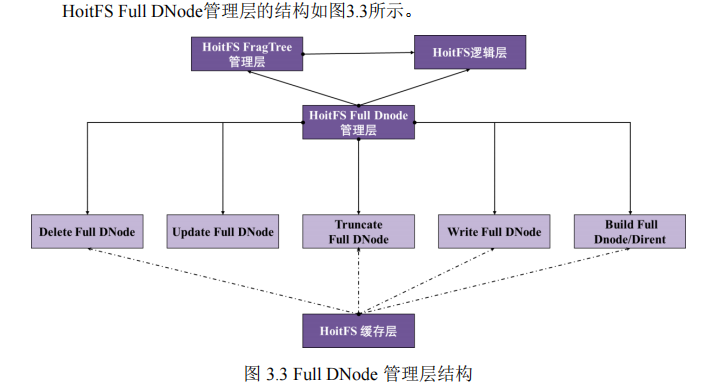

# 3. ghOSt

ghOSt是由Google开发并维护的一个基于Linux5.11.0内核实现的一个高性能通用用户态调度框架。它提供了丰富的API，用来从用户空间接收用户进程决定的调度策略，并将其作为事务提交给内核执行。程序员可以使用任何语言或工具来开发调度策略，并且无需重启机器即可使负载使用特定调度策略被调度。

ghOSt项目分为ghOSt-kernel和ghOSt-userspace两个部分。ghOSt-kernel部分是添加了ghOSt框架所需内核补丁的Linux5.11.0内核，userspace部分为ghOSt用户态调度框架的主体。

由于ghOSt框架维护较为成熟和完善，并且其为一个支持策略优化、无中断升级和故障隔离的高性能框架，与我们的赛题较为贴切，故而我们详细调研了ghOSt-userspace，并决定将其作为我们的实现参考之一。

接下来，我们将分成四个部分对我们调研的ghOSt进行详细的分析与介绍。


## 3.1 整体架构

ghOSt将“做出一个调度决策”这个过程分成了三个主体来实现，如下图所示。


三个主体分别为Kernel（下称Kernel端）、ghOSt agents（下称Agent端）和WorkLoad（下称Client端）。

* Kernel端

  即为添加了ghOSt运行所需补丁的Linux内核。ghOSt在内核中新增了调度类Ghost，用于：

  1. 接收并执行来自userspace的调度决策，将进程调度到指定CPU上
  2. 将进程相关信息传递到userspace，以帮助其做出调度决策

* Agent端

  Agent由程序员负责编写代码。

  它是调度算法（如FIFO、EDF等等）的具体实现，负责管理调度Client端创建的线程，做出调度决策，并将调度决策传入内核。它还可以接收来自内核的信息，并将其中Client关心的部分告知Client。

* Client端

  Client为具体的多线程应用场景。它产生的线程交给Agent进行调度。它可能会从Agent处接收来自内核的信息，从而动态调整负载的工作逻辑；它也可能会更新线程的某些信息（例如状态、优先级等），从而动态地影响Agent做出调度策略。

接下来，我们将围绕这三个主体及其之间的相互作用关系，从Lib介绍、调度分析以及通信分析这三个方面详细介绍ghOSt。

## 3.4 通信分析

三个主体之间的通信方式各有不同。

* Kernel ↔ Agent
  * Kernel → Agent	消息队列+共享内存
  * Agent → Kernel    系统调用
* Agent ↔ Client    共享内存

### 3.4.1 Kernel ↔ Agent

这部分的内容已在Lib介绍部分进行了详细分析，因而在此仅做一个启发性的流程简介。

#### Kernel → Agent

在具体的调度请求处理过程中，Kernel通过消息队列和共享内存的形式来将来自内核的消息传递给Agent，其中**消息队列**为主要方式。

ghOSt在用户态框架中预定义了一些关于线程生命周期的事件接口，例如`TaskNew`（一个线程被设置为Ghost调度类）、`TaskRunnable`（Ghost调度类的一个线程变为Runnable状态）等，以支持调度策略的动态注入。当这些相关事件发生之后，Kernel端会将对应事件的相关信息封装为一个`Message`结构体，通过消息队列将其传递给Agent。之后，Agent再从消息队列中获取`Message`，并根据`Message`对应的事件类型调用对应的事件接口，更新自身调度器的状态。这样一来，ghOSt就成功地将内核的重要消息传递到了用户态。

#### Agent → Kernel

Agent通过系统调用参数传递的方式将调度决策传递给内核进行最终执行。


### 3.4.2 Agent ↔ Client

“通信分析”这一部分将着重介绍此过程。

#### 概述

Agent与Client之间的通信，是采用**共享内存**实现的。

当多线程程序运行时，许多时候都需要动态地获取线程状态以及从Agent处获取的各种信息，并且根据线程状态进行调度决策，如// TODO此处可补充点实际例子。

传统的CFS调度类也对此提供了一定的支持，例如线程可以通过系统调用`getpriority()`和`setpriority()`来获取和修改nice值，从而改变线程的调度优先级。然而，这样的系统调用仅适用于CFS调度算法，专用性较强、作用范围较为有限，并且反复在内核态和用户态之间切换造成的开销也比较大，同时传递的参数类别如果过多就会造成系统调用数量膨胀。而用户态调度框架需要支持除去CFS调度算法以外的更多种调度算法，同时也需要更加灵活、更加高效、更加具有可扩展性的信息共享。

因而，在这样的背景下，ghOSt-userspace摒弃了借助系统调用实现的通信方法，而选择采用共享内存的方式进行调度器（也即Agent）与用户程序（也即Client）之间的信息交互。


#### PrioTable

具体来说，ghOSt采用`PrioTable`类来封装一片连续的物理内存，对外提供共享内存的通用接口。

##### 具体结构

其具体结构如下图所示：

// TODO：这边替换为一张又大又优美的图片：Priotable的物理内存组织结构。可以参考下这个


可以看到，`PrioTable`类将共享内存分为了四个区域：Hedaer、由sched\_item构成的数组、由work\_class构成的数组以及stream，并且持有一个指向共享内存区域开头地址的指针hdr。

* Header

  * 概述

    Header区域存放了一个类型为`ghost_shmem_hdr`的结构体，其字段记录了当前`PrioTable`的关键信息。
    
  * 主要成员字段

    ```c
    struct ghost_shmem_hdr {
      uint16_t hdrlen; /* size of struct ghost_shmem_hdr */
      uint32_t maplen; /* size of based shared memory */
      uint32_t si_num; /* number of elements in 'sched_item[]' array */
      uint32_t si_off; /* offset of 'sched_item[0]' from start of hdr */
      uint32_t wc_num; /* number of elements in 'work_class[]' array */
      uint32_t wc_off; /* offset of 'work_class[0]' from start of hdr */
      uint32_t st_cap; /* capacity of the stream */
      uint32_t st_off; /* offset of stream from start of hdr */
    } 
    ```

* sched_item array

  * 概述

    该区域存放了元素类型为`sched_item`的数组，其具体元素数量在Header中的字段指定。`sched_item`是一个可执行task的抽象，它记录了task的相关信息。

  * 主要成员字段

    ```c
    struct sched_item {
      uint32_t sid;   /* unique identifier for a sched item */
      uint32_t wcid;  /* the work class that the task belongs to */
      uint64_t gpid;  /* ghOSt specifies. something like the tid (thread id) */
      uint32_t flags; /* schedulable attributes, like Runnable, Idle, .etc */
      seqcount_t seqcount; /* a semaphore to ensure concurrency safety */
      uint64_t deadline; /* used by EDF(earlist deadline first) scheduler */
    } 
    ```

* work_class array

  * 概述

    该区域存放了元素类型为`work_class`的数组，其具体大小在Header中的字段指定。`work_class`代表了task的运行类别，如仅运行一次（`ONE_SHOT`）、需要以固定某个时间间隔运行多次（`REPEATABLE`）等等，具体可以由用户指定。

  * 主要成员字段

    ```c
    struct work_class {
      uint32_t id;       /* unique identifier for a work class */
      uint32_t flags;    /* attributes of the work_class, like ONE_SHOOT, REPEATABLE, .etc */
      uint32_t qos;      /* quality of service for this work class */
      uint64_t exectime; /* execution time in nsecs */
      uint64_t period;   /* used by work class "REPEATABLE" */
    }
    ```

* stream

  * 概述

    该区域为一段ghOSt未占用的共享内存区域。用户可以根据需要自由地通过它传递其他信息。


##### 对外接口

// TODO：这里看看能不能画出一张对外提供接口运行图，类似这个



// TODO：这里的数量关系可以用图片呈现，别搁这打字了

application进程、prio table、sched item、work class、线程

1. 一个application拥有多个线程
2. 一个application对应一个prio table
3. 一个线程对应一个sched item
4. 因而，一个application有多少个线程，那么它拥有的prio table就有多少个sched item，sched item数组就有多少个元素
5. work class表示对task进行分类，所以一个work class包含多个task；一个task 只能属于一个work class
6. work class由用户自定义，所以用户想定义多少个就定义多少个

shinjuku scheduler、application进程、prio table、shinjuku orchastrator

1. 一个shinjuku agent端可以为多个application提供服务
2. 一个application拥有一张prio table。
3. shinjuku orchestrator类用来包装管理prio table。一个shinjuku orchestrator对应一个prio table
4. shinjuku scheduler管理多个orchastrator。数据结构：`<application的pid, orchastrator>`map
5. 因而，**一个shinjuku scheduler——多个application——多个orchastrator——多个prio table**


#### 使用示例

总而言之，`PrioTable`事实上就是对一块用于在Agent与Client之间共享各种信息的物理内存的封装。在这片共享内存中，存放了需要被Agent调度的Client进程中的所有线程的信息，以及其他诸如work class、stream这样的这些辅助调度的信息。Agent和Client可以通过其提供的接口来读写这片共享内存，从而实现更加灵活的调度决策。

下面以ghOSt提供的Shinjuku测试场景（下称RocksDB实验）为例，对`PrioTable`的具体使用做一个简单的演示说明。


##### 场景介绍

* 硬件环境

  本次实验运行在一个2-socket CPU的其中一个socket上，这个socket共有12个物理core，24个logical core。

* workload

  Client进程中有两种线程，分别为Load generator线程和Worker线程。前者用于源源不断生成具有稳定的平均吞吐量的SQL请求，并且将这些请求均匀派发给各个Worker线程；后者用于在读取到内存中的RocksDB数据库上处理来自Load generator的SQL请求。

##### 具体实现

// TODO：这里重新画两个更好看点的图

在RocksDB实验中，将Load generator线程数量限定为1，并且分配给CFS调度类进行管理；将Worker线程通过容量为200的线程池进行管理，并且分配给基于Ghost调度类实现的Shinjuku调度算法进行管理。

两种线程的执行流程状态图如下图所示：


Worker被调度时清空请求队列，随后沉睡等待下一次被唤醒；Load generator每次挑选空闲worker，并且为worker分配请求，最后再唤醒Worker进行请求处理。其中的沉睡唤醒机制是通过共享内存（也即使用`PrioTable`）实现的。

故而，Worker线程、Load generator线程以及Agent进程三者之间的交互关系可以总结为下图：


##### 通信分析

由上述分析可知，`PrioTable`具体用于实现沉睡唤醒机制。因而下面，我们就着重介绍一下它的实现流程以及对应的代码体现。方便起见，以下将以RocksDB实验从初始化开始，到初始化完成开始正常运行这一代码流程为线索，来分析`PrioTable`在其中具体起到的通信作用。

1. 初始化`PrioTable`

   在`InitPrioTable`中，最主要进行了work class的初始化和sched item的初始化。

   由于ghOSt只负责调度Worker线程，并且Worker线程对应的任务都不是需要定时重复执行的任务，因而只设置一个类型为`ONE_SHOT`的work class即可。

   每个Worker线程对应于一个sched item，需要将其初始化为非Runnable（也即Idle）状态。

   ```c++
   void InitPrioTable() {
     const int wcid = 0;
     /* step1: set and init only one work class, for that ghOSt only schedule worker threads which execute only once. */
     struct work_class* wc = prio_table_.GetWorkClass(wcid, wc);
     wc->id = 0;
     wc->flags = WORK_CLASS_ONESHOT;
     /* step2: init all sched items in the prio table */
     int sid = 0;
     for (struct sched_item& si : prio_table_.GetSchedItemArray()) {
       si.sid = (sid++);
       si.wcid = wcid;
       si.flags = 0;// not Runnable
     }
   }
   ```
   
2. 唤醒Worker线程

   Load generator首先均匀地将请求按照FIFS顺序派发给线程池中空闲的工作线程。随后，它通过将`PrioTable`中的Worker线程对应的sched item的对应flag字段标记为Runnable的形式来唤醒Worker线程。

   ```c++
   /* step1: pick out the idle workers */
   uint32_t worker_sid = GetIdleWorkerSIDs();
   /* step2: dispatch requests to workers */
   Request request;
   for (size_t i = 0; i < options().batch; ++i) {
     if (network(sid).Poll(request)) {
       worker_work()[worker_sid]->requests.push_back(request);
     } else {
       // No more requests waiting in the ingress queue
       break;
     }
   }
   /* step3: kick the sleeping worker to push it to work */
   if (!worker_work()[worker_sid]->requests.empty()) {
     struct sched_item* si = prio_table_.GetSchedItem(worker_sid);
     si->flags |= SCHED_ITEM_RUNNABLE; // Mark as Runnable
   }
   ```
   
3. 调度Worker线程

   为了使得Load generator的策略生效，Agent需要在做出调度决策之前读取共享内存，更新其内部管理的线程状态，从而更好地做出下一次调度决策。

   ```c++
   while(true) {
       /* read the shared memory to update the realtime thread state set by the client */
   	UpdateSchedParams();
       /* do a shinjuku-policy based schedule */
       GlobalSchedule(status_word(), agent_barrier);
   }
   ```

4. Worker线程进入沉睡

   就如同Load generator一样，Worker线程也只需改变自己的sched item的flag字段，将其置为Idle，即可进入沉睡。

   ```c++
   prio_table_helper_->MarkIdle(sid);
   prio_table_helper_->WaitUntilRunnable(sid);
   ```

综上所述，ghOSt通过`PrioTable`实现了沉睡唤醒机制。Agent和Client进程可以修改`PrioTable`，从而修改自身/其他线程的状态（以及别的数值），从而影响调度决策。
