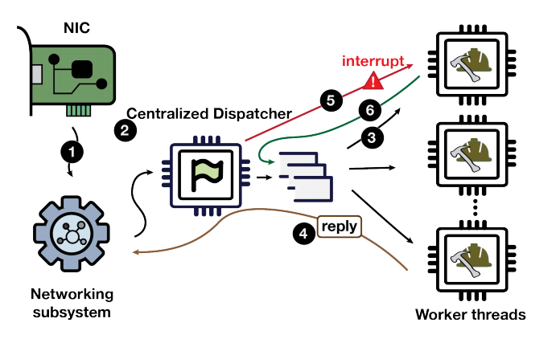
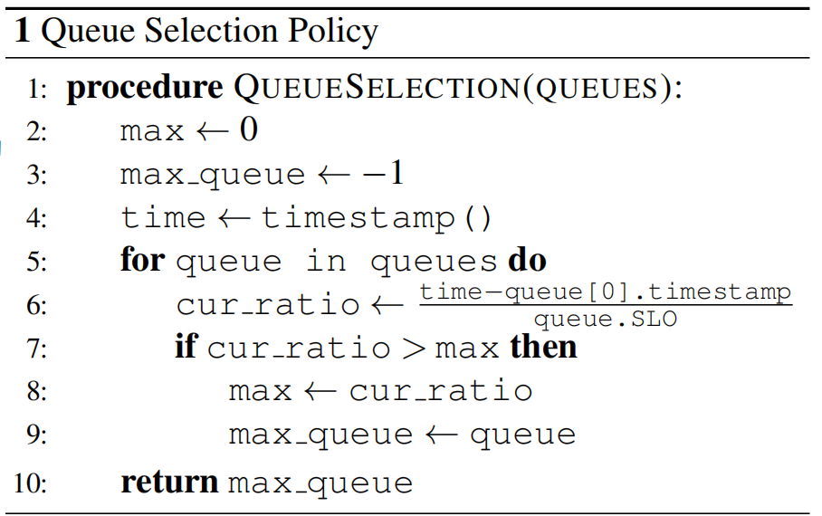
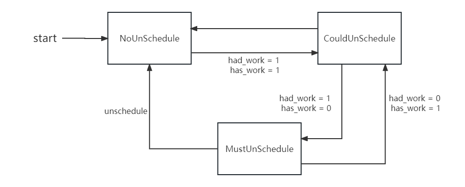

# 4.EXT

## 4.2 SJF

### 4.2.1 介绍

SJF（*Shortest Job First*）算法是一种调度算法，用于在作业调度或进程调度中选择最短执行时间的任务或进程来获得更好的性能。

在SJF算法中，每个任务或进程都有一个估计的执行时间。调度器根据任务的估计执行时间来选择下一个要执行的任务。当一个任务到达时，调度器会比较该任务的估计执行时间与当前正在运行的任务的执行时间，选择具有最短执行时间的任务来执行。如果有多个任务的估计执行时间相同，通常选择最先到达的任务。

SJF算法的优点是能够最小化平均等待时间，从而提高系统的吞吐量和响应时间。通过优先执行执行时间最短的任务，可以减少任务的等待时间，并尽快完成任务。

在我们的EXT-SJF实现中，我们从用户态传入每个线程的估计的执行时间，最终在userland端依照其进行排序。


### 4.2.2 实现

#### 数据结构

* 任务结构体

  ```c++
  struct enqueued_task {
    // 最小堆排序函数
    bool operator<(const struct enqueued_task &s) const {
      if (exp_runtime_ == s.exp_runtime_) {
        return pid_ > s.pid_;  // FIFS
      }
      return exp_runtime_ > s.exp_runtime_;
    }
  
    __u64 sum_exec_runtime_;  // 上次task入队的时间戳
    __u64 exp_runtime_;       // 来自用户态的估计执行时间
    __s32 pid_;               // task的线程id
    bool first_run_;          // 标识该task是否为第一次运行
  };
  
  struct Compare {
    bool operator()(struct enqueued_task *t1, struct enqueued_task *t2) {
      return *t1 < *t2;
    }
  };
  ```

* 运行队列

  ```c++
  class SjfRq {
   public:
    struct enqueued_task *pick_next_sjf_task(); // 选择下一个要被调度的任务并且将其从队列删除
  
    void enqueue_sjf_task(struct enqueued_task *task); // 将task放入运行队列
  
    int size() { return sjf_rq_.size(); } // 返回当前运行队列中的任务数
  
   private:
    std::priority_queue<struct enqueued_task *, // 实际的运行队列，最小堆
      	std::vector<enqueued_task *>, Compare> sjf_rq_;
  };
  
  SjfRq sjf_rq = SjfRq();
  ```


## 4.1 Shinjuku

// TODO 承上启下

我们还在ghOSt的基础上，将ghOSt的Shinjuku算法移植到EXT框架中，并且最终展现出了良好的可行性。

### 4.1.1 Shinjuku

#### 概述

Shinjuku是一个高度专门用于某些场景调度的操作系统。它通过硬件支持以及对Linux内核模块的修改，使得基于其上运行的Shinjuku调度算法在**微秒粒度**上实现了抢占机制，一改过去调度系统对于短执行时间请求（下称“短请求”和“长请求”）的饥饿，使得它能够在微秒级应用程序（如网络搜索、社交网络、机器翻译等云应用程序）的请求处理上表现出高吞吐量、低尾延迟的优良特性。

Shinjuku调度算法基于Shinjuku操作系统。它在用户态实现了多优先级抢占式调度，同时涉及了许多与应用程序的通信，能够体现出用户态调度框架的优点，故而本文选取其作为一个主要案例来对EXT框架进行展示。

由于本文研究重点在于调度框架以及调度算法，因而，除非特别说明，下文中所提及的“Shinjuku”皆为Shinjuku调度算法的简称，而非Shinjuku系统。

#### 实现思路

Shinjuku调度算法是基于centrallized model实现的**抢占式调度**策略。

也就是说，Shinjuku中应该会有一个调度线程，专门用于向各个工作线程派发需要处理的请求。依据用户策略的不同，每一个请求都会被分配一定的运行时间片。当一个请求的执行时间超过其运行时间片，其执行就会被终止。

下面，我将详细介绍Shinjuku策略的总体实现及部分要点。

##### 三种线程

Shinjuku将一个请求处理系统分为了三个部分。



* Networking subsystem（下称“generator”）

  用于对传来的请求（如网络请求、数据库操作请求等）进行预处理，然后将请求传递给Centralized dispatcher线程。

* Centralized dispatcher（下称“dispatcher”）

  用于将从generator处获取的请求依据FCFS（*First Come First Serve*）原则派送给多个Worker threads进行处理。

* Worker threads（下称“worker”）

  用于处理dispatcher派发而来的请求，并将请求处理结果反馈给generator。

三种线程以流水线工作的方式对请求进行处理，并且通过相同的地址空间（Shinjuku系统为单地址空间操作系统）来直接进行通信。三种线程都**独占**一个CPU核心（或者超线程），并且禁止了操作系统的任何抢占以及时钟中断，从而保证请求被及时处理。

##### 抢占机制

为了保证短请求不因长请求执行时间过长而导致饥饿，Shinjuku引入了对抢占机制的实现。为了实现微秒级别的抢占，Shinjuku摒弃过于笨重导致抢占耗时达到毫秒粒度的Linux内核原生抢占机制，而通过软硬件结合的方式（本文仅介绍软件方式）实现了快速抢占机制。

// TODO 插入一个Linux内核的垃圾抢占性能图片/数据

不论是短请求还是长请求，所有请求都有一个每次运行的**运行时间片**（最大时间限制）。每个请求都被抽象表示为一个包含有上下文信息的结构体，并且在结构体中记录了一些时间戳信息，例如该请求本次被调度时的时间戳等，用于在用户态计算该请求当前的已运行时间。

当请求的已运行时间超过其持有的时间片长度，dispatcher线程就会控制worker线程终止该请求的执行，转而去执行请求队列头中的另一个请求，原来的请求会因抢占从而再次回归请求队列，以待下一次被dispatcher派发。

值得注意的一点细节是，请求队列采用**双端队列**（deque）实现。一个被抢占的请求再次入队具体是被加入到请求队列首还是请求队列尾则由具体的调度策略实现决定。

##### 多优先级

Shinjuku提供对不同类型请求拥有不同调度优先级的支持。

具体来说，Shinjuku可以以**多级双端队列**为数据结构。它可以为每种类型的请求都创建一个请求队列，每个请求队列的优先级依其所对应的请求类型的不同而不同。dispatcher每次从请求队列中取出请求时，会选择当前所属请求队列优先级最高的请求。

而请求队列的优先级可以通过两种方式获取，一种是由用户程序决定，另一种是根据BVT算法在运行时自适应计算。



在之后的Shinjuku实现中，由于重点为EXT用户态调度框架的运用，因而为了方便起见，我们将会选择第一种优先级决定方法，也即单纯由用户态决定优先级。

#### Shinjuku系统的缺陷

相比于过去其他非抢占式的调度系统，Shinjuku在吞吐量和尾延迟上都有巨大优势。但它高度专业于某一个workload，导致其劣势也较为明显。具体来说，Shinjuku仍有以下几点不足：

* 空窗期造成的资源浪费较大

  在生产场景中，当负载较低时，往往会想要使用空闲的计算资源来服务于低优先级的批处理应用程序或运行无服务器函数。然而，原生的Shinjuku为每个worker线程各自分配并且绑定了一个CPU核心，这也就造成了在低负载情况下的资源浪费。

* 实现复杂

  Shinjuku一共使用2535行代码实现。并且Shinjuku系统涉及对内核模块代码的修改，较为复杂，不兼容最新的内核版本。

### 4.1.2 EXT-Shinjuku

#### 实现思路

Shinjuku算法策略在上文已经详细介绍过，因而，下文对其算法流程不做赘述，而将重点放在EXT-Shinjuku与原生Shinjuku的不同点上。

* 三种线程

  Shinjuku策略中共有三种线程，分别为dispatcher、generator以及worker。<u>下文实现的EXT-Shinjuku调度算法仅负责对worker线程的调度。</u>

  * worker

    worker是EXT-Shinjuku策略的**核心调度对象**。

    我们对原生Shinjuku理论中的worker概念做了一些变动，故而，在介绍我们的EXT-Shinjuku实现之前，有必要对worker线程再进行一次详细清晰的说明。

    在原生Shinjuku中，由于独占CPU，worker这一角色更像是CPU资源的抽象；而请求具有独立的保存上下文信息的结构体，拥有自己的时间片和时间戳，并且实质上受dispatcher的抢占式调度管理，故而，请求这一概念更像是任务（task）的抽象。也就是说，原生Shinjuku的“抢占式调度”是**以一次请求为粒度**的。

    而在EXT-Shinjuku中，worker线程不再独占CPU，转而变为更类似于任务（task）的概念。每个worker线程都可以被抽象为一个一次性处理多个请求（请求数量由用户指定）的任务。每个worker线程都拥有一个独立的请求队列，线程的生命周期为被创建→处理清空请求队列→被销毁。

    // TODO: 画一张图，表示worker线程的生命周期

    因而，EXT-Shinjuku的“抢占式调度”是**以一次处理多个请求的task为粒度**的。相比于原生Shinjuku，这一点为短请求处理均匀分散了执行调度开销，提高了性能。

    值得注意的是，为了避免线程频繁创建和销毁导致的性能开销，在具体的用户程序中，推荐使用**线程池**来管理worker线程。

  * dispatcher

    我们将实现了Shinjuku算法的centrallized scheduler作为dispatcher这一角色，它不断更新当前worker线程的最新信息，并据此做出调度决策。

  * generator

    由于下文重点在于Shinjuku调度策略的实现，因而对generator的实现着墨不多，仅需知道其作用为预处理/生成请求，并将请求送入worker的请求队列即可。

* 线程通信

  原生的Shinjuku调度策略运行在单地址空间操作系统之上，因而线程间通信较为简便，并且避免了使用条件变量带来的巨大开销，但这同时也降低了Shinjuku调度算法的跨平台性。

  在我们的EXT-Shinjuku实现中，我们通过在三种线程之间使用**共享内存**来模拟原生Shinjuku系统的单地址空间特性，提高了Shinjuku算法的通用性的同时，也不失其性能开销小、通信简便的优点。

* 抢占机制

  抢占机制与原生Shinjuku相同，都是在调度对象的结构体中记录时间戳、在当前运行时超过时间片时被抢占的用户态机制。

* 多优先级

  EXT-Shinjuku提供对多优先级的支持，并且优先级完全由用户决定。用户可自定义策略，选择固定优先级或者运行时动态调整worker线程的优先级，较为灵活。

#### 总体架构

EXT-Shnjuku的实现也遵循如图【// TODO 加上EXT总体架构图的图片编号+超链接】所示的架构，可分为userland端、bpf端以及client端。bpf端用于辅助Shinjuku算法的实现，负责将从内核传递而来的信息告知userland，以及通过系统调用执行来自userland的调度决策；userland实现了Shinjuku算法的逻辑，负责根据bpf端和client端传递来的信息进行调度决策。

下面，我们将主要介绍userland端和bpf端的Shinjuku代码实现。

#### 数据结构

##### userland

userland实现了Shinjuku算法的逻辑，因而，下面介绍的两个数据结构分别为Shinjuku算法的调度对象和运行队列。

* `struct enqueued_task`

  代表了Shinjuku算法的调度对象。

  ```c++
  // 代表着的调度对象的运行状态
  enum class RunState {
    kBlocked, // 任务处于不活跃状态（执行完成、还没开始执行）
    kQueued, // 任务正在运行队列中，等待被调度
    kOnCpu, // 任务正在运行中
    kYielding, // 任务被yield
    kPaused, // 任务暂停运行
  };
  
  // 存储调度对象的一些信息
  struct enqueued_task {
    /* 基本信息 */
    RunState run_state = RunState::kBlocked; // 当前调度对象的运行状态
    int pid = 0; // 当前调度对象对应线程的pid
  
    /* 抢占机制实现相关 */
    u64 sum_exec_runtime = 0; // 来自内核。
      						// 当前调度对象上一次入队时内核记录的累积运行时，用于计算累积运行时
    u64 last_ran = 0; // 来自内核。
      				// 当前调度对象上次被调度时的时间戳，用于计算累积运行时
    bool preempted = false; // 当前调度对象上一次运行是否是因为被抢占
      
    /* 优先级、与client端通信相关 */
    uint32_t qos = 20; // 当前调度对象的优先级。qos越大，优先级越高。
    bool prio_boost = false; // 当前调度对象是否需要提升优先级。
      					   // 影响该调度对象重新进入运行队列时是插入队头还是队尾
    bool has_work = false; // 当前调度对象是否在client端被标记为运行状态
    UnscheduleLevel unschedule_level 
        = UnscheduleLevel::kNoUnschedule; // 将在下文详细介绍，此处可忽略
      
    /* 一些获取状态信息的方法 */
    bool paused() const { return run_state == RunState::kPaused; }
    bool blocked() const { return run_state == RunState::kBlocked; }
    bool queued() const { return run_state == RunState::kQueued; }
    bool oncpu() const { return run_state == RunState::kOnCpu; }
    bool yielding() const { return run_state == RunState::kYielding; }
  };
  ```

* `ShinjukuRq`

  代表Shinjuku调度策略的运行队列，一个多级双端队列的包装类。

  ```c++
  class ShinjukuRq {
   public:
    // 选取当前优先级最高的调度对象并调度它。类似于ghOSt中的`GlobalSchedule`
    void PickNextShinjukuTask(); 
  
    // 将task加入到运行队列中
    // 当back为true的时候，调度对象会被加进对应优先级的双端队列尾；
    // 当back为false或者task->prio_boost为true的时候，调度对象会被加入对应优先级的双端队列头
    void EnqueueShinjukuTask(struct enqueued_task *task, bool back = true);
  
    // 将task从运行队列中移除
    void DequeueShinjukuTask(struct enqueued_task *task);
  
    // 标记task为yield状态
    void Yield(struct enqueued_task *task);
    // 取消task的yield状态
    void Unyield(struct enqueued_task *task);
  
    // 返回当前优先级最高的双端队列
    // 按照优先级从高到低轮询查找的queue selection policy
    int FirstFilledRunqueue() const {
      for (auto it = run_queue_.rbegin(); it != run_queue_.rend(); it++) {
        if (!it->second.empty()) {
          return it->first;
        }
      }
      return -1;
    }
  
   private:
    // 多级双端队列。key为qos（也即优先级），value为运行队列
    // 每个优先级对应一个运行队列，优先级越高，其对应运行队列中的调度对象优先级也就越高
    // 每个调度对象入队时会进入自己优先级值对应的那个运行队列
    std::map<uint32_t, std::deque<struct enqueued_task *>> run_queue_;
  
    // 放置被yield的task的队列。在做出调度决策时，如果`run_queue_`为空，那么则会将
    // `yielding_tasks_`中的所有任务填充进`run_queue_`
    std::vector<struct enqueued_task *> yielding_tasks_;
  };
  ```

##### bpf

bpf端主要负责串联内核与userland的通信，因而，下面将以通信方式的不同作为划分依据，分类别介绍bpf端的主要数据结构。

* bpf共享内存

  * 结构体定义

    * `scx_userland_enqueued_task`

      将来自内核的线程信息传递给userland的载体。

      ```c++
      struct scx_userland_enqueued_task {
        __s32 pid;             // 线程id
        u64 sum_exec_runtime;  // 累积净运行时
        __s32 tgid;            // 线程组id，一般可认为为线程所属进程的pid
        bool first_run;  // 该线程是否第一次被userland接收
        bool runnable;   // 只在`first_run`为true时才有意义。
          			   // 表示该线程第一次被userland接收时是否为runnable状态
      };
      ```

    * `cpu_stat`

      代表CPU的状态信息。

      ```c++
      struct cpu_stat {
        bool idle;       // cpu是否空闲
        bool availible;  // 如果idle为true，
          			   // 或者idle为false但cpu运行着由userland调度的线程时为true
        __s32 pid;       // 当前正在该cpu上运行的线程的id
        bool assigned;   // 当前cpu是否在userland做出调度决策时被分配
         				   // 此为仅在userland端使用的临时变量，
          			   // userland需要在做出调度决策后将此标记位清零
      };
      ```

  * bpf map定义

    * `enqueued`、`dispatched`、`preempted`

      都为装载着线程的bpf队列。其中，`enqueued`、`dispatched`在前文已经介绍过【// TODO check】，`preempted`将在【// TODO 超链接  调度策略】中详细介绍。

      * `enqueued`  成员为`scx_userland_enqueued_task`，用于在bpf端和userland端之间传递线程信息。
      * `dispatched`  成员为线程id，用于将userland端做出的调度决策通过bpf端传递给内核执行。
      * `preempted`  成员为线程id，userland端将需要被抢占的线程入队，由bpf端进行实际抢占。

    * `cpulist`

      存储着当前系统所有可用CPU（默认最大上限为64）的状态信息，key为CPU ID，value为`cpu_stat`。
    
    * `is_first_run`
    
      key为线程id，标识对应线程是否为第一次被userland调度。

* 消息队列

  当线程被抢占、线程停止运行以及线程被yield这几个事件发生时，bpf端就会向userland端发送消息。userland端会在每次进行调度决策之前清空消息队列，以更新自身保存的线程信息。
  
  * 结构体定义
    * `message`
    
      ```c++
      struct message {
        int type; // 标识该消息的类型，具体取值见下面的宏定义
          
        /* payload */
        int pid; // 线程id
        u64 timestamp; // 时间戳
      };
      /* message type */
      #define TASK_QUIESCENT 1
      #define TASK_PREEMPTED 2
      #define TASK_YIELD 3
      #define TASK_RUNNING 4
      ```
    
  * bpf map定义
    * `message_queue`
    
      装载着`message`的消息队列。

#### userland

##### 总述

下文将结合代码详细说明我们的Shinjuku实现的userland部分的算法流程。

主要逻辑在`sched_main_loop`中：

```c++
static void sched_main_loop(void) {
  while (!exit_req) {
    /* 更新线程状态 */
    update_shm(); // 从共享内存获取来自client端的最新信息，将在下文进行详细的介绍
    consume_message(); // 从消息队列获取来自内核的最新信息，将在下文详细介绍
    drain_enqueued_map(); // 获取需要被调度的任务
    /* 进行调度决策 */
    shinjuku_rq.PickNextShinjukuTask();
  }
}
```

相比于前面介绍的三种【// TODO: CHECK!】调度算法，Shinjuku算法新增了与Client通信的共享内存和与内核通信的消息队列，因而在`sched_main_loop`中真正进行调度决策之前，首先需要针对这两种通信手段进行更新。

下面，在第一部分“调度流程“中，我们会重点介绍调度决策这一部分，也即函数` drain_enqueued_map()`及函数`shinjuku_rq.PickNextShinjukuTask()`的流程；在第二部分”消息队列“中，我们会重点介绍函数`consume_message()`的流程；在第三部分”用户通信“中，我们会重点介绍函数` update_shm()`的流程。


##### 调度流程

Shinjuku算法的核心是抢占机制的实现，详细介绍了抢占机制也就相当于展示了Shinjuku调度流程的全貌。

因而，下文将以一个任务从新建到结束运行的生命周期为线索，首先对调度流程的总体思路进行一个详细的介绍；然后，再具体到分别代表了任务入队（包含新任务和旧任务）以及调度出队的程的函数` drain_enqueued_map()`及函数`shinjuku_rq.PickNextShinjukuTask()`，分析我们的最终代码实现，从而实现全方位全覆盖的详细说明。

* 生命周期

  * Task New

    当前任务第一次被Shinjuku调度，如果它为Runnable状态，Shinjuku会将其加入到其对应qos的双端队列的**尾部**；如果它为非Runnable状态，Shinjuku则会将其置为`RunState::kBlocked`状态，等待它变为Runnable状态。

    ```c++
    if (first_run) {  // TaskNew
        if (runnable)
          shinjuku_rq.EnqueueShinjukuTask(curr);
        else
          curr->run_state = RunState::kBlocked;  
    ```

    Shinjuku算法在调度时，以FIFO的顺序从最高优先级的双端队列取出任务。如果当前任务被选中，则它会被调度。Shinjuku Scheduler需要更新其状态为Running（也即`kOnCpu`）、清空其抢占标识位，以及更新其表示上一次被调度时间的时间戳。

    ```c++
    task->run_state = RunState::kOnCpu;
    task->preempted = false;
    task->prio_boost = false;
    task->last_ran = current_timestamp;
    ```

  * Task Runnable

    在当前任务转化为Runnable状态时，Shinjuku会将其加入到其对应qos的双端队列的**头部**。

    ```c++
    shinjuku_rq.EnqueueShinjukuTask(curr, /* back =  */false);
    ```

  * Task Preempted

    可以分为两种情况，一个是当前任务被EXT调度类的任务抢占，另一个是当前任务被其他调度类的线程抢占。

    * 被EXT调度类任务抢占

      Shinjuku Scheduler会轮询所有其管理的正在运行的线程，计算它们的当前运行时间。如果当前线程的当前运行时间超过Scheduler设定的抢占时间片，则Scheduler会强制终止其执行，将其设置为`kPaused`状态，并且提升其在队列中的优先级。

      ```c++
      // 令正在运行的task强行终止
      void unschedule_task(struct enqueued_task *task) {
        // task必须合法，且正在运行中
        assert(task != nullptr);
        assert(task->oncpu());
      
        // 对task进行抢占
        preempt_task(task);
        
        // 提升被抢占任务的调度优先级
        task->preempted = true;
        task->prio_boost = true;
        // 更新被抢占任务的状态
        task->run_state = RunState::kPaused;
        task->unschedule_level = UnscheduleLevel::kNoUnschedule;
      }
      ```

    * 被其他调度类任务抢占

      为了保证EXT调度类的兼容性，也即当EXT调度类掌管调度时，其他原生Linux线程不会被干扰，EXT Scheduler需要在其他Linux调度类的线程需要运行时进行礼让。

    当EXT线程被抢占时（不论是哪种情况），Shinjuku Scheduler就会收到来自bpf端的`TASK_PREEMPTED`信息，并且根据被抢占EXT线程的状态进行对应的处理。由于被抢占后任务会提升调度优先级，因而需要将当前任务插入到Shinjuku runqueue的**头部**（`prio_boost`为true即会插入到头部）。

    ```c++
    // 提升被抢占任务的调度优先级
    task->preempted = true;
    task->prio_boost = true;
    if (task->oncpu()) {  // 被抢占线程原本正在运行中，对应被抢占的第一二种情况
      shinjuku_rq.EnqueueShinjukuTask(task); // 将其入队，状态转换为kQueued
    } else if (task->queued()) { // 被抢占线程原本在运行队列中，对应被抢占的第二种情况
      // 将其重新入队
      shinjuku_rq.DequeueShinjukuTask(task);
      shinjuku_rq.EnqueueShinjukuTask(task);
    }
    ```

  * Task Stop

    在当前任务结束执行（可能为主动结束或者被动结束）时，userland端就会收到来自bpf端的`TASK_QUIESCENT`信息，并且根据其状态进行对应的处理。

    ```c++
    if (task->yielding()) {
      shinjuku_rq.Unyield(task);
    }
    if (task->oncpu()) {  // 线程原本正在运行中
      task->run_state = RunState::kBlocked;
    } else if (task->queued()) { // 线程原本正在运行队列中，移出队列，设置其为kPaused状态
      shinjuku_rq.DequeueShinjukuTask(task);
    }
    ```


* 具体实现

  * ` drain_enqueued_map()` 

    ` drain_enqueued_map()` 的核心函数为`shinjuku_enqueue`，也即进行一些预处理，然后将task放入到Shinjuku的运行队列中。

    ```c++
    static void drain_enqueued_map(void) {
      while (1) {
        // ...省略上文已经介绍过的建立共享内存的流程
    	shinjuku_enqueue(&task);
      }
    }
    ```

    在EXT框架中，当任务变为Runnable状态就会触发该`shinjuku_enqueue`函数；而在Shinjuku调度算法中，需要将“任务刚被新建就为可运行状态”和“任务从其他状态变为可运行状态”这两个状态加以区分。因而，为了综合这二者的特点，我们引入来自内核的变量`first_run`用以标记线程是否为第一次被调度。

    ```c++
    static int shinjuku_enqueue(const struct scx_userland_enqueued_task *bpf_task) {
      // 获取存储在storage的enqueued_task结构体
      struct enqueued_task *curr = get_enqueued_task(bpf_task->pid);
        
      // 填入从内核中传递而来的参数pid以及sum_exec_runtime
      update_enqueued(curr, bpf_task);
    
      if (bpf_task->first_run) {  // TaskNew
        if (bpf_task->runnable)
          shinjuku_rq.EnqueueShinjukuTask(curr);
        else
          curr->run_state = RunState::kBlocked;  // may not happen
      } else {  // TaskRunnable
        if (curr->queued()) return 0;
        shinjuku_rq.EnqueueShinjukuTask(curr, false);
      }
    
      return 0;
    }
    ```

  * `shinjuku_rq.PickNextShinjukuTask()`

    `shinjuku_rq.PickNextShinjukuTask()`有两个任务：

    1. 遍历所有正在运行中的调度类为EXT的任务，轮询它们的当前运行时，并且据此判断是否需要进行抢占
    2. 找出并从runqueue中取出任务并派发给所有空闲CPU（包括其上当前正在运行的任务即将被Shinjuku抢占的CPU）

    我们可以通过两次遍历所有CPU的循环来解决这两个任务。

    1. 第一次循环

       遍历所有CPU。如果当前CPU不空闲，则continue到下一个CPU；否则，从Shinjuku runqueue中取出目前优先级最高的任务，将任务派发到dispatch队列中。大致流程如下：

       ```c++
       void ShinjukuRq::PickNextShinjukuTask() {
           int key = 0;
           struct cpu_stat value;
           
           // 遍历所有CPU
           for (key = 0;; key++) {
             	if (bpf_map_lookup_elem(cpulist_fd, &key, &value) != 0)
                   break; // 已遍历完所有CPU
               struct cpu_stat cs = value; // cpu_state信息从bpf端读取
               if (!cs.idle ) { // CPU空闲才会分配任务
                 continue;
               }
               if (rq.empty()) break; // runqueue为空则停止分配
       
               struct enqueued_task *next = rq.Peek(); // 调度当前优先级最高的任务
               rq.pop_front();
       
               dispatch_task(next->pid); // dispatch
       
               // 修改被dispatch的任务的状态
               next->run_state = RunState::kOnCpu; // 设置运行状态为Running
               next->preempted = false; // 重置抢占标志
               next->prio_boost = false;
               cs.assigned = true; // 标记该CPU已经被分配任务
           }
       }
       ```

    2. 第二次循环

       遍历所有CPU。如果当前CPU不能被抢占（因为运行着其他调度类的线程，或者已经在第一轮循环中被分配任务），则continue到下一个CPU；否则，对其上运行的任务依据以下策略进行抢占：

       * 如果当前任务curr和调度队列中优先级最高的任务peek的优先级：
         * curr < peek	直接抢占
         * curr == peek  如果curr使用完了其运行时间片才会抢占
         * curr > peek    不抢占

       最后从Shinjuku runqueue中取出目前优先级最高的任务，将任务派发到dispatch队列中。

       大致流程如下：

       ```c++
       void ShinjukuRq::PickNextShinjukuTask() {
           int key = 0;
           struct cpu_stat value;
           
           // 遍历所有CPU
           for (key = 0;; key++) {
             	if (bpf_map_lookup_elem(cpulist_fd, &key, &value) != 0)
                   break; // 已遍历完所有CPU
               struct cpu_stat cs = value; // cpu_state信息从bpf端读取
               if (!cs.availible || cs.assigned) { // CPU可以被抢占才会分配任务
                 	continue;
               }
               if (rq.empty()) break; // runqueue为空则停止分配
       
               // 进行抢占
               struct enqueued_task *peek = rq.front();
               struct enqueued_task *curr = get_enqueued_task(cs.pid);
               if (!curr || !peek)	return;
               
               // 决策是否进行抢占
               bool should_preempt = false; 
               if (curr->run_state == RunState::kOnCpu) {
                   // 计算curr的当前运行时
                   u64 elapsed_runtime = current_time - curr->last_ran;
       
                   uint32_t current_qos = curr->qos;
                   uint32_t peek_qos = peek->qos;
       
                   if (current_qos < peek_qos) {
                   	should_preempt = true;
                   } else if (current_qos == peek_qos) {
                       if (elapsed_runtime >= preemption_time_slice_) {
                         should_preempt = true;
                       }
                   }
                   
                   // CPU不能抢占，跳到下一个CPU
                   if (!should_preempt)	continue;
       
                   unschedule_task(curr);
               }
       
               // 下面的入队逻辑同第一轮循环，在此不再赘述
               ...
       ```

综上所述，便完成了`PickNextShinjukuTask`的Shinjuku调度算法的抢占逻辑。


##### 消息队列

在前面的调度流程分析中，Shinjuku Scheduler需要监测线程状态的转变，并据此做出相应的事件处理。

我们将来自内核的线程状态转变这一事件所包含的信息封装为`message`结构体。每当线程状态转换这一类事件发生，bpf端就会向消息队列`message_queue`发送一个指定类型的`message`。userland会定期查看`message_queue`，根据消息的类型来做出不同的反应。

具体来说，我们将“定期查看消息队列”这一逻辑封装在函数`consume_message()`中，在`sched_main_loop()`中调用`shinjuku_rq.PickNextShinjukuTask()`之前清空消息队列，更新任务状态，从而做出最新最及时的调度决策。

函数`consume_message()`的逻辑较为简单，即为根据结构体`message`的`type`字段的不同做对应不同的处理，故而在此不做赘述。


##### 用户通信

* 概述

  原生的Shinjuku操作系统为单地址空间操作系统，因而三种线程之间的通信可以直接通过读写系统内存即可实现。在EXT-Shinjuku中，我们使用共享内存来达到同样的效果。

  EXT-Shinjuku这部分以及上文对EXT框架的介绍部分对bpf端和userland端之间的共享内存通信方式已经介绍得很详细了，在此不做赘述，本部分将详细介绍userland端与client端的通信。

  在EXT-Shinjuku中，client端可以通过【// TODO 超链接到哈希表那部分】来影响调度决策。适用于Shinjuku的`struct entry`相关定义如下所示：

  ```c++
  struct entry {
  #ifdef SHINJUKU_SCHEDULER
    bool should_update;  // 如果为真，则表明该entry被client修改，
      				   // Scheduler需要根据该entry的信息更新线程状态。
      				   // 在我们当前的EXT-Shinjuku实现中，该字段需要client手动设置
    int pid;             // 该entry对应的线程id
    uint32_t flags;      // 标志对应线程是否runnable
    uint32_t qos;		   // 对应线程的优先级
  #endif
  };
  
  #ifdef SHINJUKU_SCHEDULER
  #define SCHED_ITEM_RUNNABLE (1U << 0) /* flags字段取值 */
  #endif
  ```

  client端可以通过比方说如下代码，来修改线程的qos和flags，影响调度决策，详情可见`tests/test_shinjuku/shinjuku_client_test.cpp`。

  ```c++
  hashtable.Add(t.tid(), {true, t.tid(), SCHED_ITEM_RUNNABLE, 200});
  ```

  client端的代码以及对qos的修改实现都较为简单，故而在此不做赘述，本部分将重点介绍在Shinjuku的具体实现中如何兼容本身的抢占式调度特性及用户指定的线程运行状态。

  线程运行时，用户可能在任意时刻在共享内存中将其状态标记为非Runnable以使其终止运行。为了方便管理，以及与自身的调度逻辑兼容，Shinjuku并没有选择即时更新和响应来自用户的终止请求，而是选择类似“**集中刷新**”的方式，也即在每次`sched_main_loop`时进行统一的处理。

  下面，我们将从定义开始，分析Shinjuku实现用户通信的具体流程。

* 定义

  为了实现这样的延迟终止（*deferred unschedule*），Shinjuku引入了如下定义：

  ```c++
  // 代表延迟终止的级别
  enum class UnscheduleLevel {
    kNoUnschedule, 	// 无需延迟终止
    kCouldUnschedule, // 该task被用户态分配了新的工作内容，
      				// 所以需要把它设置为可以被延迟终止状态，从而使得其能够被抢占
    kMustUnschedule,  // 该task被用户标记为运行终止，所以需要马上停止运行
  };
  ```

  ```c++
  struct enqueued_task {
    ...
    bool has_work = false; // 当前调度对象是否在client端被标记为运行状态
    UnscheduleLevel unschedule_level = UnscheduleLevel::kNoUnschedule;
  };
  ```

  可以简单理解为，`kNoUnschedule`即为not running状态（如queued），`kCouldUnschedule`即为running状态，`kMustUnschedule`即为stop状态。

* 状态转移

  这几种延迟终止级别的状态转移可以用下图表示：

  

  其主要转移逻辑在``sched_main_loop()`中的`update_shm()`以及`shinjuku_rq.PickNextShinjukuTask()`中。

  * `update_shm()`

    其大致逻辑如下。

    ```c++
    // 遍历所有的entry，如果需要则更新
    for(auto hashtable : all_client_shm){
    	for(auto entry : hashtable){
            if(entry.should_update) {
                update_entry(entry);
                entry.should_update = false;
            }
    	}
    }
    ```

    可以看到，其关键函数为用以更新线程状态的`update_entry()`。

    在`update_entry()`中，我们首先将`entry`中的信息更新到`struct enqueued_task`的成员字段中。然后，我们需要根据两个参数：`had_work`（更新**之前**task的`has_work`字段值）和`has_work`（更新**之后**task的`has_work`字段值）的值，进行上述延迟终止级别状态的转移。同时，也需要进行对应的run state的转移，其状态转移表如下所示：

    ```c
    Case#  had_work  has_work   run_state change
    (a)      0         0        无，因为此时不会触发shm更新
    // had_work为0表示线程原来应该已经停止执行，因而处于kPaused状态；然后has_work为1，表示
    // 线程变为可运行状态，因而需要将其加入到运行队列中
    (b)      0         1        kPaused -> kQueued
    // had_work为1表示线程原来正在运行或者可运行，因而处于kOnCpu或kQueued状态；
    // 然后has_work为0，表示线程需要马上停止运行，因而需要将其立刻变为停止状态
    (c)      1         0        kQueued/kOnCpu -> kPaused
    (d)      1         1        无，因为此时不会触发shm更新
    ```

    对应代码实现为：

    ```c++
    // case a
    if (!had_work) {
        if (!task->has_work) {
            return;  
        }
    }
    ```

    ```c
    // case b
    if (!had_work) {
        if (task->has_work) {
          if (task->paused()) { // kPaused -> kQueued
            shinjuku_rq.EnqueueShinjukuTask(task);
          } else if (task->oncpu()) { // Must--(oncpu+case b)->Could
            assert(task->unschedule_level == UnscheduleLevel::kMustUnschedule);
            task->unschedule_level = UnscheduleLevel::kCouldUnschedule;
          }
        }
    }
    ```

    ```c++
    // case c
    if (had_work) {
        if (!task->has_work) {
          if (task->oncpu()) { // 延迟终止，并不立即被抢占
            task->unschedule_level = UnscheduleLevel::kMustUnschedule;
          } else if (task->queued()) {
            shinjuku_rq.DequeueShinjukuTask(task);
          }
        }
    }
    ```

    ```c++
    // case d
    if (had_work) {
        if (task->has_work) {  // case (d).
          if (task->oncpu()) {
            task->unschedule_level = UnscheduleLevel::kCouldUnschedule;
          }
        }
    }
    ```

  * `shinjuku_rq.PickNextShinjukuTask()`

    在其流程中，会对`kMustUnschedule`进行统一的终止运行，对`kCouldUnschedule`进行部分终止运行。

    * `kCouldUnschedule`

      ```c++
      if (current_qos == peek_qos) {
          if (curr->unschedule_level >=
                     UnscheduleLevel::kCouldUnschedule) {
            should_preempt = true;
          }
      }
      ```

      仅在当前任务和需要抢占任务的优先级相等时当前任务才会被抢占。

    * `kMustUnschedule`

      ```c++
      for (key = 0;; key++) {
        if (bpf_map_lookup_elem(cpulist_fd, &key, &value) == 0) {
          struct cpu_stat cs = value;
          struct enqueued_task *task = get_enqueued_task(cs.pid);
          if (task->unschedule_level ==
                         UnscheduleLevel::kMustUnschedule) {
                unschedule_task(task);
          }
        }
      }
      ```

      会直接进行统一的抢占。


#### bpf

bpf端负责串联userland端与内核的通信。由上文可知，除去上文已经介绍过的bpf端的基本框架，在Shinjuku实现中，bpf端还有如下两个任务：

1. 状态更新

   bpf端需要更新`cpu_stat`，以及为`message_queue`填入消息。这些都是通过EXT框架的bpf事件来实现的。

2. 实现抢占

   bpf端需要对`preempted`中的线程执行实质上的抢占操作。

下面将分别介绍这两个任务的具体实现。

##### 内核事件

* 更新`cpu_stat`

  `cpu_stat`的结构体定义为：

  ```c++
  struct cpu_stat {
    bool idle;       // cpu是否空闲
    bool availible;  // 如果idle为true，
      			   // 或者idle为false但cpu运行着由userland调度的线程时为true
    __s32 pid;       // 当前正在该cpu上运行的线程的id
    bool assigned;   // 当前cpu是否在userland做出调度决策时被分配
     				   // 此为仅在userland端使用的临时变量，
      			   // userland需要在做出调度决策后将此标记位清零
  };
  ```

  故而，需要：

  * 在`init`中对`cpulist`进行初始化

    ```c
    // init the cpulist map
    int i = 0;
    bpf_repeat(64) {
        struct cpu_stat tmp_cs;
        tmp_cs.idle = false;
        tmp_cs.pid = 0;
        tmp_cs.availible = false;
        tmp_cs.assigned = false;
    
        bpf_map_update_elem(&cpulist, &i, &tmp_cs, BPF_ANY);
        i ++;
    }
    ```

  * 在`stopping`事件发生时将task的对应cpu的`idle`字段置为false

  * 在`update_idle`事件发生时更新其字段

    ```c
    void BPF_STRUCT_OPS(userland_update_idle, s32 cpu, bool idle)
    {
    	struct cpu_stat *cs = bpf_map_lookup_elem(&cpulist, &cpu);
    	if (cs) {
    		cs->idle = idle;
    		cs->pid = idle ? 0 : cs->pid;
    		cs->availible = idle ? true : cs->availible;
    	}
    }
    ```

  * 在`running`事件发生时更新task对应cpu的字段

    ```c
    int task_cpu = p->on_cpu;
    struct cpu_stat *cs = bpf_map_lookup_elem(&cpulist, &task_cpu);
    if (cs) {
        cs->pid = p->pid;
        if (!first_run) { // cpu is not occupied by EXT tasks
            cs->availible = false;
        } else { // cpu is occupied by EXT tasks
            cs->availible = true;
        }
        cs->idle = false;
    }
    ```

  

* `message_queue`

  当四种消息类型对应的事件发生时，bpf端就需要将消息放入消息队列，并唤醒userland端进行调度。

  * `TASK_QUIESCENT`
  * `TASK_PREEMPTED`
  * `TASK_YIELD`
  * `TASK_RUNNING`


##### 抢占实现

当userland端需要抢占某个线程，终止其运行的时候，只需要将对应线程id放入preempted队列即可，真正的抢占由bpf端实现。

* userland

  ```c++
  bpf_map_update_elem(preempted_fd, NULL, &pid, 0);
  ```

* bpf

  `do_preemption()`会在`userland_dispatch()`中被调度，最主要通过`scx_bpf_kick_cpu()`促使对应cpu进行reschedule来实现抢占。

  ```c
  // drain the preepmted map
  static void do_preemption()
  {
  	bpf_repeat(4096) {
          // 从preempted中获取需要被抢占的任务p
  		s32 pid;
  		struct task_struct *p;
  		if (bpf_map_pop_elem(&preempted, &pid))
  			break;
  		p = bpf_task_from_pid(pid);
  		if (!p)
  			continue;
  
  		if (p->__state == UTASK_RUNNING) {
  			// force rescheduling on the CPU to do a preemption
  			scx_bpf_kick_cpu(p->on_cpu, SCX_KICK_PREEMPT);
  		}
  		bpf_task_release(p);
  	}
  }
  ```


#### EXT-Shinjuku的优势

相比于原生Shinjuku，由ghOSt-Shinjuku移植而来的EXT-Shinjuku有如下优点：

* 多workload共存

  在EXT-Shinjuku中，worker线程以线程池的方式存在，无需独占CPU，并且dispatcher角色由可同时调度多个应用程序的Shinjuku scheduler承担。故而，EXT-Shinjuku可以做到在低负载的情况下，充分利用计算资源服务于较低优先级的其他应用程序，从而避免了空窗期造成的资源浪费

* 实现简单

  EXT-Shinjuku一共使用1389行代码实现，降低了**50%**的代码量；多数代码为用户态编程，少数为eBPF程序修改，实现较为简单，兼容性也更强。

* 部署迅速

  得益于EXT用户态调度框架的特性，EXT-Shinjuku算法部署迅速，不到30s即可编译完成并投入使用。
  
* 代码轻便

  相比于ghOSt，EXT使用eBPF将代码动态注入内核，因而更为简单轻便。
