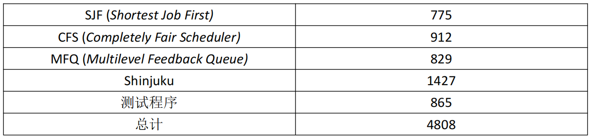
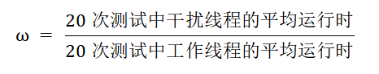
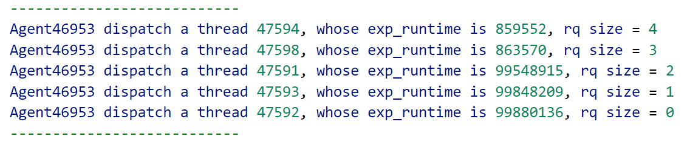
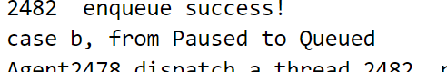
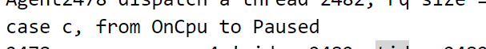
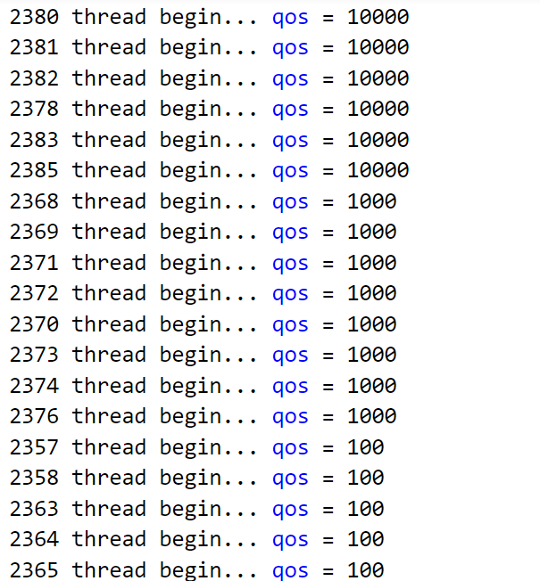

# 5. 系统测试

本部分将从部署速度、代码量和有效性验证三个部分，来展现我们基于EXT框架开发的系统功能的完整性。

## 5.1 部署速度

如果需要为Linux原生内核新增并切换更适用于各种workload的调度策略，则需要大量修改内核代码，并且需要重启系统、停止业务，开销巨大；而用户态调度框架支持用户态各种调度策略的动态注入，经过短暂的编译即可使用，无需重启系统，更为轻量级。

在实际的个人开发流程中，我们进行了多次内核的编译与系统的重启，每次平均都需要花费1~2个小时的部署时间；而使用用户态调度框架进行调度算法的动态注入，则从编译到运行只需花费不到五分钟的时间。可以看到，部署速度带来的提升是十分巨大的。


## 5.2 代码量

我们在EXT框架的基础上，开发出的几种调度算法的代码量如下表所示：



同时，我们也发挥了用户态调度框架代码量较少的特性。

我们将ghOSt-Shinjuku移植到EXT框架上实现了EXT-Shinjuku。ghOSt-Shinjuku、EXT-Shinjuku与原生Shinjuku系统的代码量对比如下表所示：


可以看到，相比于原生Shinjuku系统，我们减少了约**50%**的代码量；相比于ghOSt-Shinjuku，我们减少了**近400行**代码量。


## 5.3 有效性验证

### 5.3.1 SJF

#### 实验场景

我们通过编写测试用例，验证了EXT-SJF的有效性。

我们创建了30个工作线程和30个干扰线程，两者都会自旋同样的一定时间以模拟大量计算工作。我们还为前者分配了1ms的预期运行时，为后者分配了100ms的预期运行时。故而，依据SJF算法的原理，工作线程应该比干扰线程被优先调度执行。

在`tests/test_sjf/sjf_test.cpp`中，我们使用Linux原生CFS和EXT-SJF分别实现了上述场景，从而对SJF进行有效性测试。

我们在一次实验中一共运行20次测试，每一次都会统计工作线程和干扰线程**从线程被创建到线程运行结束**分别的平均运行时，并且剔除其中数据过于夸张的无效数据（以大于30个线程中非零最小值的10倍为无效指标），最后再针对20次测试求平均值，最后求出一个指标，以代表我们的有效性测试结果：



从原理可知，越大，则干扰线程等待被调度的等待时间越长，SJF算法的特性越明显。

#### 实验结果

我们运行三次实验，最终得到如下结果：

```c
~/oscamp/sched_ext/tools/sched_ext/tests/test_sjf$ sudo ./sjf_test 
==========CFS TEST=============
rate: 0.910165
==========CFS TEST=============
==========SJF TEST=============
rate: 1.287523
==========SJF TEST=============
~/oscamp/sched_ext/tools/sched_ext/tests/test_sjf$ sudo ./sjf_test 
==========CFS TEST=============
rate: 0.850584
==========CFS TEST=============
==========SJF TEST=============
rate: 2.007684
==========SJF TEST=============
~/oscamp/sched_ext/tools/sched_ext/tests/test_sjf$ sudo ./sjf_test 
==========CFS TEST=============
rate: 1.102870
==========CFS TEST=============
==========SJF TEST=============
rate: 1.515137
==========SJF TEST=============
```

我们还在控制台打印了EXT-SJF调度算法中的调度队列，得到如下输出：



#### 结果分析

由于CFS完全公平的特性，因而干扰线程和工作线程的平均等待调度时间比较一致，故而最终的取值应该较为接近1，符合预期。而EXT-SJF的值明显大于CFS的值，充分体现了SJF调度算法的特性。

从打印出的调度队列可以看出，EXT-SJF实现中依据预期运行时从小到大的顺序进行任务的调度派发。

综上所述，EXT-SJF实现是有效的。


### 5.3.2 Shinjuku

我们通过编写测试用例，验证了EXT-Shinjuku的有效性。

在`tests/test_shinjuku/shinjuku_simple_test.cpp`中，我们对EXT-Shinjuku的基本功能做了测试，如调度一个线程、调度多个线程、在线程逻辑中将调度类从EXT切换到CFS等。测试结果如下所示：


在`tests/test_shinjuku/shinjuku_client_test.cpp`中，我们对EXT-Shinjuku对于用户通信的特性功能做了测试，如在用户态改变线程运行状态、在用户态设定线程优先级等。前者的测试结果如下图所示，我们在Shinjuku Scheduler的输出中成功捕捉到了状态转移的信息：





后者的具体现象如下图所示，可以看到，qos高的线程优先被调度：



综上所述，EXT-Shinjuku实现是有效的。